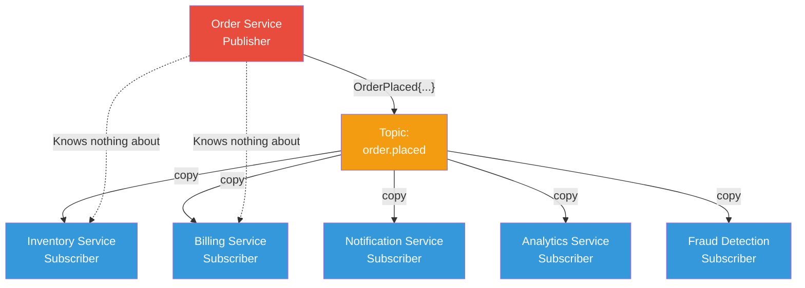
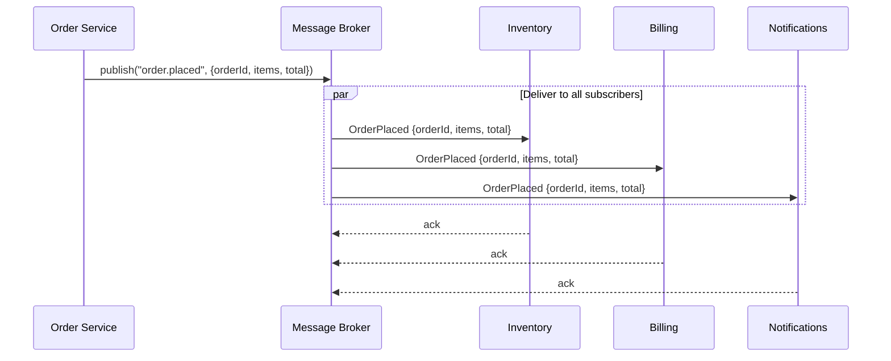

# Publish-Subscribe

## 1. The Problem

You're building an e-commerce platform. When an order is placed, several things need to happen:

- The inventory service needs to reserve stock
- The billing service needs to charge the customer
- The notification service needs to send a confirmation email
- The analytics service needs to record the event

Your order service currently calls each of these services directly:

```typescript
async function placeOrder(order: Order) {
  await inventoryService.reserve(order.items);
  await billingService.charge(order.customerId, order.total);
  await notificationService.sendConfirmation(order);
  await analyticsService.record("order_placed", order);
}
```

Every time a new team wants to react to an order — fraud detection, loyalty points, warehouse routing — they come to your team and ask you to add another line. Your order service now has 12 downstream calls. It knows about every service in the company. One new dependency means redeploying your service.

The order service has become a God service that knows about everything.

---

## 2. Naïve Solutions (and Why They Fail)

### Attempt 1: Direct HTTP Calls

```typescript
// The order service calls everything
await fetch("http://inventory:3000/reserve", { body: order });
await fetch("http://billing:3000/charge", { body: order });
await fetch("http://notifications:3000/email", { body: order });
// ... 9 more
```

**Why it breaks:**
- **Tight coupling** — The order service imports knowledge of every downstream service's API.
- **Cascading failure** — If notifications is slow, orders slow down. If analytics is down, orders fail.
- **Deployment coupling** — Adding a new consumer requires redeploying the order service.
- **No parallelism** — Sequential calls. 12 services × 100ms = 1.2 seconds minimum.

### Attempt 2: Fire-and-Forget with goroutines/threads

```typescript
function placeOrder(order: Order) {
  saveOrder(order);
  // Fire everything in background
  Promise.allSettled([
    inventoryService.reserve(order.items),
    billingService.charge(order.customerId, order.total),
    notificationService.sendConfirmation(order),
  ]);
}
```

**Why it breaks:**
- If the process crashes mid-flight, you have no idea which calls completed.
- No retry mechanism. Failed calls are silently lost.
- You've hidden failures — the order shows as "placed" but inventory was never reserved.
- **Still tightly coupled** — order service still knows about every consumer.

### Attempt 3: Shared Database Table as Event Queue

```sql
INSERT INTO events (type, payload) VALUES ('order_placed', '{...}');
-- Each service polls this table
```

**Why it breaks:**
- Polling is wasteful — most polls find nothing.
- No ordering guarantees across consumers.
- Table grows unbounded. Who deletes old events?
- You just reinvented a bad message queue.

---

## 3. The Insight

The order service doesn't need to know WHO cares about orders. It only needs to announce: **"An order was placed. Here are the details."**

Whoever wants to react can subscribe. The order service publishes once. Zero, one, or a hundred consumers can listen — the publisher doesn't know, doesn't care.

The key shift: **invert the dependency**. Instead of the publisher depending on every consumer, each consumer depends on the event itself.

---

## 4. The Pattern

### Publish-Subscribe (Pub/Sub)

**Definition:** A messaging pattern where **publishers** emit events to a **topic** without knowledge of subscribers. **Subscribers** register interest in topics and receive a copy of every message published to that topic.

**Core guarantees:**
- Publishers and subscribers are **decoupled** — neither knows the other exists
- A message published to a topic is delivered to **all** active subscribers
- New subscribers can be added without modifying publishers

**What it does NOT guarantee:**
- Message ordering across subscribers
- Exactly-once delivery (usually at-least-once)
- That any subscriber exists at all (messages can be published to nobody)
- Delivery speed — subscribers may receive messages with varying latency

---

## 5. Mental Model

Think of a **radio broadcast**. The radio station (publisher) transmits a signal on a specific frequency (topic). Anyone with a radio tuned to that frequency (subscriber) receives the broadcast. The station doesn't know how many listeners there are. New listeners can tune in at any time. The station's job is to broadcast — it never calls listeners directly.

What stays stable: the topic contract (what data the event contains).
What moves: the number and identity of subscribers.

---

## 6. Structure





---

## 7. Code Example

### TypeScript (using an in-process event emitter as illustration)

```typescript
import { EventEmitter } from "events";

// --- Infrastructure ---
class PubSubBroker {
  private emitter = new EventEmitter();

  publish<T>(topic: string, message: T): void {
    console.log(`[Broker] Publishing to "${topic}"`);
    this.emitter.emit(topic, message);
  }

  subscribe<T>(topic: string, handler: (message: T) => void): void {
    this.emitter.on(topic, handler);
  }
}

// --- Domain types ---
interface OrderPlacedEvent {
  orderId: string;
  customerId: string;
  items: { sku: string; quantity: number }[];
  total: number;
  timestamp: Date;
}

// --- Publisher (knows NOTHING about subscribers) ---
class OrderService {
  constructor(private broker: PubSubBroker) {}

  async placeOrder(customerId: string, items: { sku: string; quantity: number }[]) {
    const order: OrderPlacedEvent = {
      orderId: crypto.randomUUID(),
      customerId,
      items,
      total: items.reduce((sum, i) => sum + i.quantity * 10, 0), // simplified pricing
      timestamp: new Date(),
    };

    // Save order to DB (not shown)
    // Then publish — the order service's job is DONE
    this.broker.publish("order.placed", order);
    return order.orderId;
  }
}

// --- Subscribers (each independent, each in a different service in production) ---
class InventorySubscriber {
  constructor(broker: PubSubBroker) {
    broker.subscribe<OrderPlacedEvent>("order.placed", (event) => {
      console.log(`[Inventory] Reserving stock for order ${event.orderId}`);
      // reserveStock(event.items)
    });
  }
}

class NotificationSubscriber {
  constructor(broker: PubSubBroker) {
    broker.subscribe<OrderPlacedEvent>("order.placed", (event) => {
      console.log(`[Notifications] Sending email to customer ${event.customerId}`);
      // sendEmail(event.customerId, "Order confirmed", ...)
    });
  }
}

// --- Wiring ---
const broker = new PubSubBroker();
new InventorySubscriber(broker);
new NotificationSubscriber(broker);

const orderService = new OrderService(broker);
orderService.placeOrder("cust-42", [{ sku: "WIDGET-A", quantity: 2 }]);
```

### Go (using channels)

```go
package main

import (
	"fmt"
	"sync"
)

// --- Domain ---
type OrderPlacedEvent struct {
	OrderID    string
	CustomerID string
	Items      []Item
	Total      float64
}

type Item struct {
	SKU      string
	Quantity int
}

// --- Broker ---
type PubSub struct {
	mu          sync.RWMutex
	subscribers map[string][]chan OrderPlacedEvent
}

func NewPubSub() *PubSub {
	return &PubSub{subscribers: make(map[string][]chan OrderPlacedEvent)}
}

func (ps *PubSub) Subscribe(topic string) <-chan OrderPlacedEvent {
	ps.mu.Lock()
	defer ps.mu.Unlock()
	ch := make(chan OrderPlacedEvent, 16)
	ps.subscribers[topic] = append(ps.subscribers[topic], ch)
	return ch
}

func (ps *PubSub) Publish(topic string, event OrderPlacedEvent) {
	ps.mu.RLock()
	defer ps.mu.RUnlock()
	for _, ch := range ps.subscribers[topic] {
		ch <- event // fan-out: every subscriber gets a copy
	}
}

func main() {
	broker := NewPubSub()

	// Subscriber 1: Inventory
	invCh := broker.Subscribe("order.placed")
	go func() {
		for evt := range invCh {
			fmt.Printf("[Inventory] Reserving stock for order %s\n", evt.OrderID)
		}
	}()

	// Subscriber 2: Notifications
	notifCh := broker.Subscribe("order.placed")
	go func() {
		for evt := range notifCh {
			fmt.Printf("[Notifications] Emailing customer %s\n", evt.CustomerID)
		}
	}()

	// Publisher: Order Service
	broker.Publish("order.placed", OrderPlacedEvent{
		OrderID:    "ORD-001",
		CustomerID: "CUST-42",
		Items:      []Item{{SKU: "WIDGET-A", Quantity: 2}},
		Total:      20.00,
	})

	// Wait for output (simplified)
	var wg sync.WaitGroup
	wg.Add(1)
	go func() { defer wg.Done() }()
}
```

---

## 8. Gotchas & Beginner Mistakes

| Mistake | Why It Hurts |
|---|---|
| **No subscriber exists** | Messages vanish. Nobody processes them. No error raised. |
| **Assuming ordered delivery** | Messages to different subscribers arrive in different orders. |
| **Not handling duplicates** | At-least-once delivery means your subscriber WILL see the same message twice. Make handlers idempotent. |
| **Fat topics** | One topic for everything: `events`. Now every subscriber processes messages it doesn't care about. Use specific topics. |
| **Publisher waits for subscribers** | Defeats the purpose. Publish-and-forget. If you need a response, this isn't the right pattern. |
| **No DLQ** | A poison message crashes a subscriber repeatedly. Without a dead-letter queue, it blocks the entire topic. |
| **Schema evolution ignored** | Adding fields to events breaks subscribers that don't expect them. Version your event schemas. |

---

## 9. Related & Confusable Patterns

| Pattern | How It Differs |
|---|---|
| **Point-to-Point** | One producer → one consumer (not broadcast). Pub/Sub delivers to ALL subscribers. |
| **Message Queue** | Queue = work distribution (one consumer processes each message). Topic = broadcast (every subscriber gets every message). |
| **Event Streaming** | Streaming (Kafka) retains messages for replay. Pub/Sub (RabbitMQ topics) discards after delivery. |
| **Observer** | In-process pub/sub. Same concept, but within a single application, not across services. |
| **Webhooks** | Push-based notification over HTTP. Similar to pub/sub but uses HTTP callbacks instead of a message broker. |

**When to prefer pub/sub over point-to-point:** When multiple independent consumers need the same event.
**When to prefer event streaming over pub/sub:** When consumers need to replay historical events or you need ordering guarantees.

---

## 10. When This Pattern Is the WRONG Choice

- **You need a response** — Pub/sub is fire-and-forget. If the publisher needs a result, use request-reply.
- **Exactly-once semantics are required** — Pub/sub delivers at-least-once. If duplicates are unacceptable and you can't make subscribers idempotent, use a different approach.
- **Two services, one event** — Don't introduce a message broker for a single point-to-point call. A direct HTTP call is simpler.
- **Low message volume** — Setting up Kafka for 10 messages/day is massive overkill.
- **Strong ordering required** — Pub/sub doesn't guarantee message order across subscribers. Use a single-partition event stream.

**Symptoms you chose it too early:**
- Your broker has 3 topics and 3 subscribers.
- You spend more time debugging the broker than building features.
- Nobody ever adds new subscribers — the "extensibility" was imaginary.

**How to back out:** Replace the broker with direct HTTP calls. Move consumer logic into the publisher service or dedicated workers.
