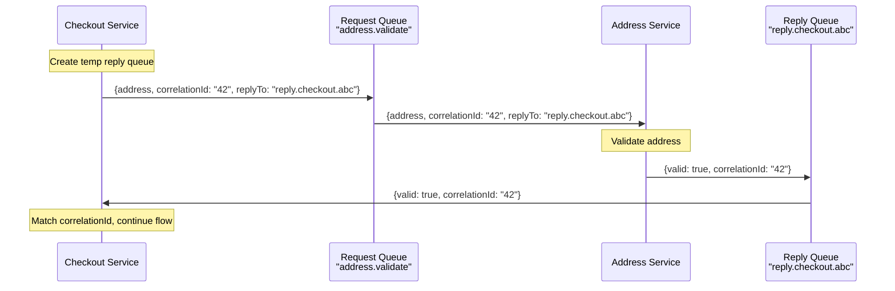
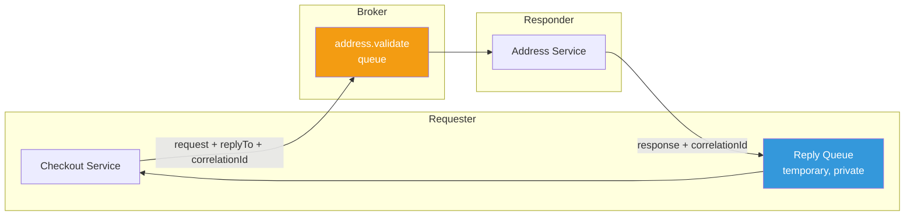

# Request-Reply

## 1. The Problem

You're modernizing a monolith into microservices. Your checkout flow needs to validate the user's address by calling the address validation service. The result determines whether to proceed or show an error.

Your current code calls an HTTP endpoint synchronously. That works. But now the team wants to route ALL inter-service communication through the message broker (RabbitMQ) for consistency and resilience.

The problem: message queues are asynchronous. You send a message, but how do you get the result back?

```typescript
// This is what you want semantically:
const isValid = await addressService.validate(address); // ← need a response!

// But with a message queue, you only have:
broker.publish("address.validate", { address }); // fire and forget — no response
```

You need a response, but your infrastructure is fire-and-forget.

---

## 2. Naïve Solutions (and Why They Fail)

### Attempt 1: Poll for the Result

```typescript
broker.publish("address.validate", { requestId: "req-42", address });

// Poll a database or cache for the response
let result = null;
while (!result) {
  result = await cache.get("response:req-42");
  await sleep(100); // spin...
}
```

**Why it breaks:**
- Polling is wasteful — most polls return null.
- Latency is at least one polling interval (50-500ms wasted).
- If the response never comes, this loops forever.
- Every request creates a cache entry that needs cleanup.

### Attempt 2: HTTP Callback

```typescript
broker.publish("address.validate", {
  address,
  callbackUrl: "http://checkout-service:3000/callback/req-42",
});
```

**Why it breaks:**
- The checkout service must expose an HTTP endpoint just to receive responses.
- Correlating the callback with the original request requires shared state.
- If the checkout service restarts between request and callback, the state is lost.
- Now you have two channels (broker + HTTP) in one flow — more failure modes.

### Attempt 3: Shared Database

```typescript
// Requester writes:
await db.insert("requests", { id: "req-42", address, status: "pending" });
broker.publish("address.validate", { requestId: "req-42" });

// Responder writes:
await db.update("requests", { id: "req-42", result: valid, status: "done" });

// Requester polls DB...
```

**Why it breaks:**
- Both services coupled to the same database. You've re-created the monolith.
- Polling the database under load is expensive.
- No clear ownership of the shared table.

---

## 3. The Insight

You need a **temporary, private reply queue**. The requester creates a short-lived queue, puts its address in the request message ("reply to this queue"), and waits for a response on that queue. The responder processes the request and sends the result to the reply queue. The queue is destroyed when the reply arrives.

It's like leaving your phone number on a voicemail: "Call me back at this number."

---

## 4. The Pattern

### Request-Reply

**Definition:** A messaging pattern where the requester sends a message to a service queue with a **correlation ID** and a **reply-to address** (reply queue). The responder processes the request and sends the result to the reply queue. The requester listens on its reply queue for a response matching the correlation ID.

**Core guarantees:**
- Synchronous semantics over asynchronous infrastructure
- Request and response are correlated via a unique ID
- Responder doesn't need to know the requester's identity — just the reply address

**What it does NOT guarantee:**
- Latency bounds (the responder might be slow or down)
- Exactly-once (duplicate requests may cause duplicate replies)
- That a response will ever arrive (timeout required)

---

## 5. Mental Model

Think of **drive-through fast food**. You place your order at the speaker (send request to queue). They give you a receipt number (correlation ID). You pull to the window (reply queue) and wait. The kitchen works async. When your order is ready, they call your receipt number and hand you the bag.

What stays stable: the request/response message format.
What moves: the reply queue (created per request or per requester session).

---

## 6. Structure





---

## 7. Code Example

### TypeScript (using amqplib / RabbitMQ)

```typescript
import amqp from "amqplib";
import { randomUUID } from "crypto";

// --- Requester ---
async function requestReply(address: string): Promise<{ valid: boolean }> {
  const conn = await amqp.connect("amqp://localhost");
  const channel = await conn.createChannel();

  // Create exclusive, auto-delete reply queue
  const { queue: replyQueue } = await channel.assertQueue("", {
    exclusive: true,
    autoDelete: true,
  });

  const correlationId = randomUUID();

  return new Promise((resolve, reject) => {
    const timeout = setTimeout(() => {
      reject(new Error("Request timed out after 5000ms"));
      channel.close();
    }, 5000);

    // Listen on reply queue
    channel.consume(replyQueue, (msg) => {
      if (msg && msg.properties.correlationId === correlationId) {
        clearTimeout(timeout);
        const response = JSON.parse(msg.content.toString());
        resolve(response);
        channel.close();
      }
    }, { noAck: true });

    // Send request
    channel.sendToQueue("address.validate", Buffer.from(JSON.stringify({ address })), {
      correlationId,
      replyTo: replyQueue,
    });
  });
}

// --- Responder ---
async function startResponder() {
  const conn = await amqp.connect("amqp://localhost");
  const channel = await conn.createChannel();
  await channel.assertQueue("address.validate", { durable: true });

  channel.consume("address.validate", (msg) => {
    if (!msg) return;
    const { address } = JSON.parse(msg.content.toString());
    
    // Business logic
    const valid = address.length > 5 && address.includes(",");

    // Send reply to the requester's reply queue
    channel.sendToQueue(msg.properties.replyTo, 
      Buffer.from(JSON.stringify({ valid })), {
        correlationId: msg.properties.correlationId,
      }
    );
    channel.ack(msg);
  });
}
```

### Go

```go
package main

import (
	"encoding/json"
	"fmt"
	"time"
)

type Request struct {
	CorrelationID string
	ReplyTo       chan Response
	Address       string
}

type Response struct {
	CorrelationID string
	Valid         bool
}

// Responder: listens on request queue, sends to reply channel
func addressValidator(requests <-chan Request) {
	for req := range requests {
		// Business logic
		valid := len(req.Address) > 5

		// Send response to the requester's reply channel
		req.ReplyTo <- Response{
			CorrelationID: req.CorrelationID,
			Valid:         valid,
		}
	}
}

// Requester: sends request, waits for reply
func validateAddress(requestQ chan<- Request, address string) (bool, error) {
	replyQ := make(chan Response, 1) // private reply channel
	correlationID := fmt.Sprintf("req-%d", time.Now().UnixNano())

	requestQ <- Request{
		CorrelationID: correlationID,
		ReplyTo:       replyQ,
		Address:       address,
	}

	select {
	case resp := <-replyQ:
		if resp.CorrelationID != correlationID {
			return false, fmt.Errorf("correlation mismatch")
		}
		return resp.Valid, nil
	case <-time.After(5 * time.Second):
		return false, fmt.Errorf("timeout waiting for reply")
	}
}

func main() {
	requestQ := make(chan Request, 100)
	go addressValidator(requestQ)

	valid, err := validateAddress(requestQ, "123 Main St, Springfield")
	if err != nil {
		fmt.Printf("Error: %v\n", err)
		return
	}
	fmt.Printf("Address valid: %v\n", valid)
}
```

---

## 8. Gotchas & Beginner Mistakes

| Mistake | Why It Hurts |
|---|---|
| **No timeout** | If the responder is down, the requester waits forever. Always set a timeout. |
| **Correlation ID mismatch** | Responses routed to the wrong requester. Always verify correlationId on the reply. |
| **Reply queue not cleaned up** | Temporary queues pile up. Use auto-delete or exclusive queues. |
| **Using request-reply for everything** | You've turned an async broker into a slow synchronous system. Only use when you genuinely need a response. |
| **No fallback on timeout** | Timeout fires but the caller has no default behavior. Decide: fail hard or degrade gracefully. |
| **Multiple replies** | Responder sends two replies (bug). Requester processes both. Use correlation ID checks and consume-once logic. |

---

## 9. Related & Confusable Patterns

| Pattern | How It Differs |
|---|---|
| **Point-to-Point** | Fire-and-forget to a queue. No reply mechanism. |
| **Pub/Sub** | Broadcast to many. No reply expected. |
| **RPC / gRPC** | Synchronous request-reply over a dedicated protocol. More efficient but no broker resilience. |
| **HTTP Request/Response** | Same semantics but tied to HTTP. Request-reply over a broker survives restarter down. |
| **Callback** | Asynchronous notification to a webhook URL. Not a queue-based pattern. |

**When to prefer request-reply over HTTP:** When you already have a broker and need its durability or routing features.
**When to prefer HTTP:** When you need simplicity and the round-trip latency of a broker is unacceptable.

---

## 10. When This Pattern Is the WRONG Choice

- **You don't need the response** — Use fire-and-forget (point-to-point or pub/sub).
- **Latency is critical** — Request-reply over a broker adds broker hops. Direct HTTP or gRPC is faster.
- **High-throughput request-response** — 100k req/s through a broker is expensive. Use direct connections.
- **The responder is always available** — If you don't need broker resilience, direct calls are simpler.
- **You're using it for event-driven flows** — Events should be published, not requested. If you're "requesting" an event, rethink the design.

**Symptoms you chose it too early:**
- Response time is dominated by broker overhead, not business logic.
- You're debugging "reply queue not found" errors frequently.
- The reply queue mechanism is more complex than the business logic.

**How to back out:** Replace with direct HTTP/gRPC calls. If you need resilience, add a retry library to the direct calls.
