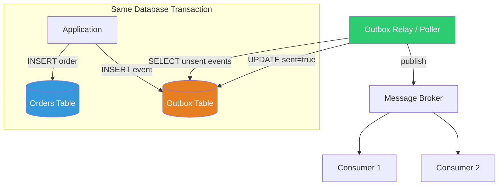
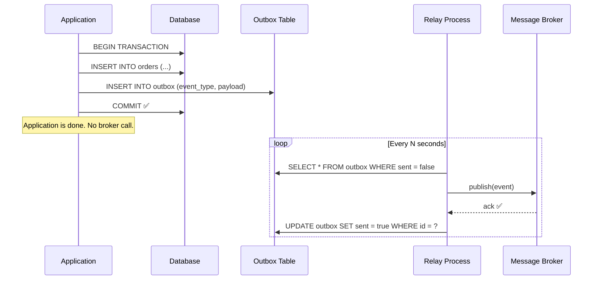

# Transactional Outbox

## 1. The Problem

Your e-commerce service processes an order. It must do two things atomically:
1. **Save the order** to the database
2. **Publish an "OrderCreated" event** to the message broker

```typescript
async function createOrder(order: Order) {
  await db.insert("orders", order);           // Step 1: save to DB
  await messageBroker.publish("OrderCreated", order);  // Step 2: publish event
}
```

This looks clean. But what happens when it fails between steps?

**Scenario A: DB succeeds, broker fails**
```
✅ db.insert("orders", order)     — order is saved
❌ broker.publish("OrderCreated")  — network timeout, broker crashed
```
Result: The order exists in the database, but no downstream service knows about it. No payment processed. No inventory reserved. No confirmation email sent. The order is a ghost.

**Scenario B: Broker succeeds, DB fails**
```
✅ broker.publish("OrderCreated")  — event published
❌ db.insert("orders", order)      — unique constraint violation, DB crash
```
Result: Downstream services react to an order that doesn't exist. Payment is charged for a phantom order. The customer is confused.

You have a **dual-write problem**: writing to two different systems (DB + broker) cannot be made atomic using a single transaction.

---

## 2. Naïve Solutions (and Why They Fail)

### Attempt 1: Wrap in a Database Transaction

```typescript
const tx = await db.beginTransaction();
try {
  await tx.insert("orders", order);
  await messageBroker.publish("OrderCreated", order);
  await tx.commit();
} catch {
  await tx.rollback();
}
```

**Why it breaks:**
- The broker `publish()` is NOT part of the DB transaction. If publish succeeds but commit fails, the event is already out there — you can't un-publish it.
- If publish fails, rollback works — but you've already talked to two systems.
- This gives FALSE confidence of atomicity. The transaction only covers the DB.

### Attempt 2: Publish First, Then Write

```typescript
await messageBroker.publish("OrderCreated", order);
await db.insert("orders", order);
```

**Why it breaks:**
- If the DB insert fails, the event was already published. Downstream services act on an order that doesn't exist.
- Consumers can't distinguish "event for a real order" from "event for a failed order."

### Attempt 3: Two-Phase Commit (2PC)

```typescript
// Distributed transaction across DB and broker
await coordinator.prepare(db, broker);
await coordinator.commit(db, broker);
```

**Why it breaks:**
- 2PC requires both systems to support a transaction coordinator (XA protocol).
- Most message brokers (RabbitMQ, Kafka, SQS) don't support 2PC.
- 2PC is slow, complex, and prone to blocking if the coordinator crashes.
- It's a theoretical solution that's impractical for real systems.

---

## 3. The Insight

Don't write to two systems. Write to **one system** — the database. Store the event alongside the business data in the same transaction. A separate process reads events from the database and publishes them to the broker. If the publish fails, the event stays in the database and is retried. The database is the single source of truth.

---

## 4. The Pattern

### Transactional Outbox

**Definition:** Store domain events in an **outbox table** within the same database transaction as the business data. A separate relay process (poller or CDC) reads from the outbox table and publishes events to the message broker, marking them as published.

**Core guarantee:**
- Business data and events are committed atomically (same DB transaction)
- Events are published at least once (relay retries on failure)
- No event is lost even if the broker is temporarily down

**What it does NOT guarantee:**
- Exactly-once publishing (at-least-once is typical — consumers must be idempotent)
- Event ordering across transactions (usually correlated by timestamp or sequence)
- Low latency (relay polling adds a delay; CDC reduces this)

---

## 5. Mental Model

Think of a **restaurant kitchen**. The waiter takes the order (business logic) and writes it on the kitchen ticket (database). At the same time, the waiter puts a **copy of the ticket in the outbox tray** (outbox table). A runner periodically checks the outbox tray, carries tickets to the cashier, the expeditor, and the bar (message broker). If the runner can't find the bar (broker down), the ticket stays in the tray until the runner tries again.

The critical point: writing the order and putting the ticket in the outbox happens as one action. The runner (relay) is a separate, independently reliable process.

---

## 6. Structure





---

## 7. Code Example

### TypeScript

```typescript
import { Pool } from "pg";

const pool = new Pool({ connectionString: "postgres://localhost/shop" });

// --- Schema ---
// CREATE TABLE orders (
//   id UUID PRIMARY KEY,
//   customer_id TEXT NOT NULL,
//   total NUMERIC NOT NULL,
//   created_at TIMESTAMPTZ DEFAULT NOW()
// );
//
// CREATE TABLE outbox (
//   id BIGSERIAL PRIMARY KEY,
//   event_type TEXT NOT NULL,
//   payload JSONB NOT NULL,
//   created_at TIMESTAMPTZ DEFAULT NOW(),
//   sent BOOLEAN DEFAULT FALSE
// );

// --- Business Operation (atomic) ---
async function createOrder(order: { id: string; customerId: string; total: number }) {
  const client = await pool.connect();
  try {
    await client.query("BEGIN");

    // Insert the order
    await client.query(
      "INSERT INTO orders (id, customer_id, total) VALUES ($1, $2, $3)",
      [order.id, order.customerId, order.total]
    );

    // Insert the event into the outbox (same transaction!)
    await client.query(
      "INSERT INTO outbox (event_type, payload) VALUES ($1, $2)",
      [
        "OrderCreated",
        JSON.stringify({
          orderId: order.id,
          customerId: order.customerId,
          total: order.total,
        }),
      ]
    );

    await client.query("COMMIT");
    console.log(`Order ${order.id} created with outbox event`);
  } catch (err) {
    await client.query("ROLLBACK");
    throw err;
  } finally {
    client.release();
  }
}

// --- Outbox Relay (runs on a timer) ---
async function relayOutboxEvents(publishTobroker: (event: string, payload: unknown) => Promise<void>) {
  const client = await pool.connect();
  try {
    // Fetch unsent events (with advisory lock to prevent double-relay)
    const { rows } = await client.query(
      `SELECT id, event_type, payload 
       FROM outbox 
       WHERE sent = false 
       ORDER BY id ASC 
       LIMIT 100
       FOR UPDATE SKIP LOCKED`
    );

    for (const row of rows) {
      try {
        await publishTobroker(row.event_type, row.payload);
        await client.query("UPDATE outbox SET sent = true WHERE id = $1", [row.id]);
        console.log(`Published outbox event ${row.id}: ${row.event_type}`);
      } catch (err) {
        console.error(`Failed to publish event ${row.id}, will retry`, err);
        // Don't mark as sent — next relay cycle will pick it up
      }
    }
  } finally {
    client.release();
  }
}

// --- Start relay loop ---
setInterval(() => relayOutboxEvents(mockPublish), 5000);

async function mockPublish(eventType: string, payload: unknown) {
  console.log(`[Broker] Received: ${eventType}`, payload);
}
```

### Go

```go
package main

import (
	"context"
	"database/sql"
	"encoding/json"
	"fmt"
	"log"
	"time"

	_ "github.com/lib/pq"
)

type Order struct {
	ID         string  `json:"id"`
	CustomerID string  `json:"customer_id"`
	Total      float64 `json:"total"`
}

type OutboxEvent struct {
	ID        int64
	EventType string
	Payload   json.RawMessage
}

func createOrder(ctx context.Context, db *sql.DB, order Order) error {
	tx, err := db.BeginTx(ctx, nil)
	if err != nil {
		return fmt.Errorf("begin tx: %w", err)
	}
	defer tx.Rollback()

	// Insert order
	_, err = tx.ExecContext(ctx,
		"INSERT INTO orders (id, customer_id, total) VALUES ($1, $2, $3)",
		order.ID, order.CustomerID, order.Total,
	)
	if err != nil {
		return fmt.Errorf("insert order: %w", err)
	}

	// Insert outbox event (same transaction!)
	payload, _ := json.Marshal(order)
	_, err = tx.ExecContext(ctx,
		"INSERT INTO outbox (event_type, payload) VALUES ($1, $2)",
		"OrderCreated", payload,
	)
	if err != nil {
		return fmt.Errorf("insert outbox: %w", err)
	}

	return tx.Commit()
}

func relayOutboxEvents(ctx context.Context, db *sql.DB, publish func(string, json.RawMessage) error) error {
	rows, err := db.QueryContext(ctx,
		`SELECT id, event_type, payload 
		 FROM outbox 
		 WHERE sent = false 
		 ORDER BY id ASC 
		 LIMIT 100 
		 FOR UPDATE SKIP LOCKED`,
	)
	if err != nil {
		return fmt.Errorf("query outbox: %w", err)
	}
	defer rows.Close()

	for rows.Next() {
		var evt OutboxEvent
		if err := rows.Scan(&evt.ID, &evt.EventType, &evt.Payload); err != nil {
			log.Printf("scan error: %v", err)
			continue
		}

		if err := publish(evt.EventType, evt.Payload); err != nil {
			log.Printf("publish failed for event %d, will retry: %v", evt.ID, err)
			continue
		}

		_, err = db.ExecContext(ctx, "UPDATE outbox SET sent = true WHERE id = $1", evt.ID)
		if err != nil {
			log.Printf("mark sent failed for event %d: %v", evt.ID, err)
		} else {
			log.Printf("Published event %d: %s", evt.ID, evt.EventType)
		}
	}
	return rows.Err()
}

func startRelayLoop(ctx context.Context, db *sql.DB) {
	ticker := time.NewTicker(5 * time.Second)
	defer ticker.Stop()

	publish := func(eventType string, payload json.RawMessage) error {
		fmt.Printf("[Broker] %s: %s\n", eventType, string(payload))
		return nil
	}

	for {
		select {
		case <-ctx.Done():
			return
		case <-ticker.C:
			if err := relayOutboxEvents(ctx, db, publish); err != nil {
				log.Printf("relay error: %v", err)
			}
		}
	}
}

func main() {
	db, err := sql.Open("postgres", "postgres://localhost/shop?sslmode=disable")
	if err != nil {
		log.Fatal(err)
	}
	defer db.Close()

	ctx := context.Background()

	// Create an order
	order := Order{ID: "ord-001", CustomerID: "cust-42", Total: 59.99}
	if err := createOrder(ctx, db, order); err != nil {
		log.Fatalf("create order: %v", err)
	}

	// Start relay
	startRelayLoop(ctx, db)
}
```

---

## 8. Gotchas & Beginner Mistakes

| Mistake | Why It Hurts |
|---|---|
| **Publishing in the same code path as DB write** | The whole point is to NOT call the broker during the business transaction. Write to outbox only. |
| **Outbox table without `FOR UPDATE SKIP LOCKED`** | Multiple relay instances will pick up the same event, causing duplicate publishes. |
| **No idempotency in consumers** | Outbox guarantees at-least-once. If the relay crashes after publish but before marking `sent=true`, the event is re-published. Consumers must handle duplicates. |
| **Giant payload in outbox** | Storing 10MB payloads in the outbox table bloats the DB. Store a reference (event ID + type) and let consumers fetch the full data. |
| **Never cleaning up the outbox** | Outbox table grows forever. Archive or delete `sent=true` rows periodically. |
| **Relay polling too infrequently** | Polling every 60 seconds adds 0-60 seconds of latency to event delivery. Consider CDC (Change Data Capture) for near-real-time. |
| **Mixing outbox with business queries** | The outbox table gets write-heavy. Keep it in the same database but consider a separate tablespace or partition. |

---

## 9. Related & Confusable Patterns

| Pattern | How It Differs |
|---|---|
| **Event Sourcing** | Event sourcing stores events AS the source of truth (no separate state table). Outbox stores events ALONGSIDE state. |
| **Change Data Capture (CDC)** | CDC reads the database transaction log (WAL) to detect changes. Can replace the outbox relay. Debezium is a popular CDC tool. |
| **Saga** | Saga coordinates multi-service transactions. Outbox is a building block — each saga step uses outbox to reliably publish events. |
| **Two-Phase Commit (2PC)** | 2PC tries to make two systems transactional together. Outbox avoids this by using only one system (DB) for the atomic operation. |
| **Inbox Pattern** | The consumer-side equivalent. Consumers store incoming events in an inbox table to deduplicate and process idempotently. |

**When to prefer outbox over 2PC:** Always, in modern distributed systems. 2PC is fragile and slow.
**When to prefer CDC over outbox:** When you want near-real-time and can operate Debezium/CDC infrastructure.

---

## 10. When This Pattern Is the WRONG Choice

- **Single system** — If your app and message broker are the same system (e.g., everything in one PostgreSQL with LISTEN/NOTIFY), you don't need an outbox table.
- **Events are not critical** — If losing an analytics event is acceptable, just publish directly with a retry. Outbox adds complexity.
- **No database** — If your system is stateless or uses only an in-memory cache, there's no transaction to wrap the outbox in.
- **Real-time latency requirements** — Outbox polling adds latency (seconds). If you need sub-millisecond event delivery, outbox polling won't cut it. Consider CDC or synchronous publish with compensating transactions.
- **Simple CRUD without downstream effects** — If no other service cares about your writes, there's no event to publish.

**Symptoms you chose it too early:**
- The outbox table has exactly the same data as your entity table. You're over-engineering.
- The relay process has nothing to do. Events are published instantly because the broker never fails.
- You have one service. No downstream consumers exist.

**How to back out:** Delete the outbox table. Publish directly from the application code (accepting the dual-write risk). For non-critical events, this is often acceptable.
