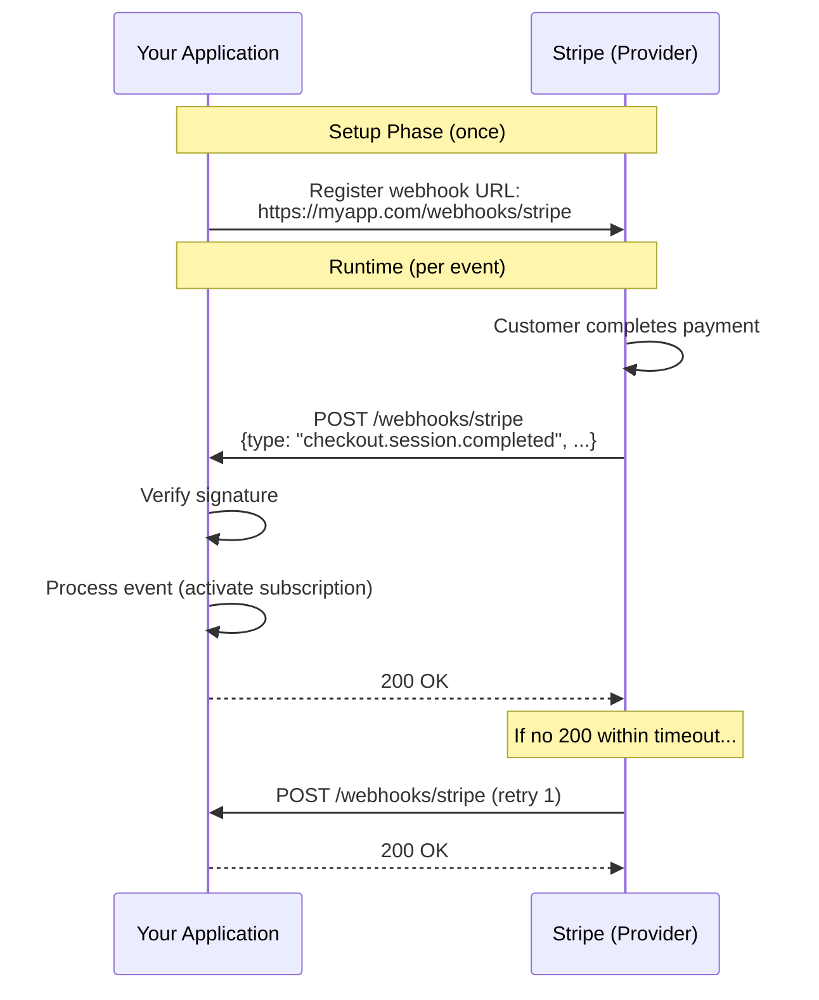
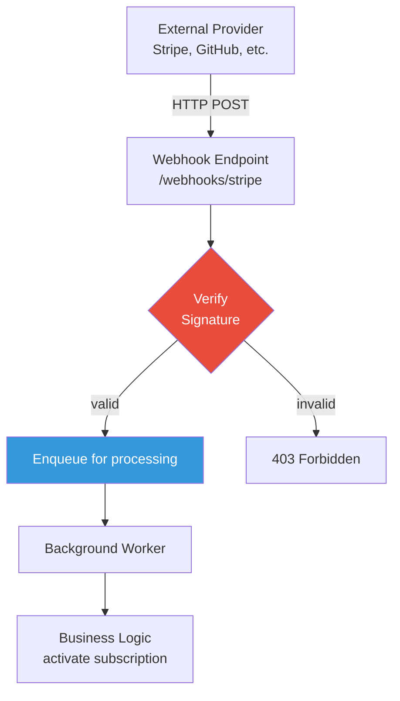

# Webhooks

## 1. The Problem

Your SaaS platform integrates with Stripe for payments. After a customer pays, Stripe needs to tell your server that payment succeeded so you can unlock the user's subscription.

**How do you know when Stripe is done?**

```typescript
// Your checkout handler
async function handleCheckout(req, res) {
  const session = await stripe.checkout.sessions.create({ ... });
  res.redirect(session.url); // user goes to Stripe

  // Now what? Stripe is processing payment on their servers.
  // When is it done? 1 second? 30 seconds? 5 minutes?
  // How do we know?
}
```

You can't keep the HTTP connection open for minutes. The user closed the browser. Your server needs to know when payment completes, but it has no way to ask Stripe "are you done yet?" efficiently.

---

## 2. Naïve Solutions (and Why They Fail)

### Attempt 1: Polling

```typescript
// After redirecting the user, poll Stripe every 5 seconds
async function waitForPayment(sessionId: string) {
  while (true) {
    const session = await stripe.checkout.sessions.retrieve(sessionId);
    if (session.payment_status === "paid") {
      await activateSubscription(session.customer);
      return;
    }
    await sleep(5000); // poll every 5 seconds
  }
}
```

**Why it breaks:**
- You're making API calls every 5 seconds per pending payment. With 1,000 concurrent checkouts, that's 200 requests/second to Stripe's API.
- Stripe will rate-limit you.
- If the payment takes 10 minutes (3D Secure, bank verification), that's 120 wasted API calls per checkout.
- You need a persistent process to keep polling. If the server restarts, all polls are lost.
- Scaling: this doesn't work for thousands of concurrent events.

### Attempt 2: Long Polling / SSE from Client

```typescript
// Frontend polls your backend
const result = await fetch("/api/payment-status?session=xyz");
// Your backend polls Stripe...
```

**Why it breaks:**
- Shifts the polling problem from server→Stripe to client→your server→Stripe. Same fundamental issue.
- Client may close the tab. Now nobody is polling.
- You're using 3 HTTP connections per payment (client↔server, server↔Stripe).

### Attempt 3: "Just Check on Next Login"

**Why it breaks:**
- User expects immediate access after paying.
- "I paid 10 minutes ago and still can't access the course" → support ticket.
- If the user doesn't log in for days, subscription isn't activated for days.

---

## 3. The Insight

Instead of asking "are you done yet?", tell the external service: **call me when you're done**. Give them a URL. When the event happens on their side, they make an HTTP POST to your URL with the event data. Push, not pull. No wasted requests. No polling. Real-time notification.

---

## 4. The Pattern

### Webhooks (HTTP Callbacks)

**Definition:** An HTTP callback mechanism where a **provider** (external service) sends an HTTP POST request to a **consumer's** pre-registered URL when a specific event occurs. The consumer processes the payload and responds with a status code.

**Core properties:**
- **Push-based**: Provider initiates the call, not the consumer
- **HTTP POST**: Standard HTTP request with JSON/XML body
- **Event-driven**: Triggered by specific events (payment completed, user created, PR merged)
- **Registration**: Consumer registers a URL with the provider ahead of time

**What it guarantees:**
- Near-real-time notification (seconds, not minutes)
- No polling overhead
- Provider controls the retry policy

**What it does NOT guarantee:**
- Exactly-once delivery (retries may duplicate)
- Ordered delivery (events may arrive out of order)
- Guaranteed delivery (if your server is down, events may be lost without retry)

---

## 5. Mental Model

Think of **restaurant table buzzers**. You order food at the counter and they give you a buzzer (register your webhook URL). When your food is ready (event occurs), the buzzer vibrates (HTTP POST). You don't need to keep going back to the counter asking "is my food ready?" (polling). The kitchen tells YOU when it's ready.

What stays stable: the URL, the event format, the authentication method.
What moves: when events fire, what data they contain, how many arrive.

---

## 6. Structure





---

## 7. Code Example

### TypeScript (Express + Stripe)

```typescript
import express from "express";
import Stripe from "stripe";
import crypto from "crypto";

const app = express();
const stripe = new Stripe(process.env.STRIPE_SECRET_KEY!);
const WEBHOOK_SECRET = process.env.STRIPE_WEBHOOK_SECRET!;

// CRITICAL: raw body needed for signature verification
app.post(
  "/webhooks/stripe",
  express.raw({ type: "application/json" }),
  async (req, res) => {
    // Step 1: Verify the webhook signature
    const signature = req.headers["stripe-signature"] as string;
    let event: Stripe.Event;

    try {
      event = stripe.webhooks.constructEvent(req.body, signature, WEBHOOK_SECRET);
    } catch (err: any) {
      console.error(`Signature verification failed: ${err.message}`);
      return res.status(403).send("Invalid signature");
    }

    // Step 2: Idempotency check — have we processed this event before?
    const alreadyProcessed = await checkEventProcessed(event.id);
    if (alreadyProcessed) {
      console.log(`Event ${event.id} already processed — acknowledging`);
      return res.status(200).json({ received: true });
    }

    // Step 3: Respond immediately, process asynchronously
    // Stripe expects a response within 20 seconds.
    // Enqueue the event for background processing.
    res.status(200).json({ received: true });

    // Step 4: Process the event
    try {
      switch (event.type) {
        case "checkout.session.completed": {
          const session = event.data.object as Stripe.Checkout.Session;
          await activateSubscription(session.customer as string);
          console.log(`Subscription activated for ${session.customer}`);
          break;
        }
        case "invoice.payment_failed": {
          const invoice = event.data.object as Stripe.Invoice;
          await suspendSubscription(invoice.customer as string);
          console.log(`Subscription suspended for ${invoice.customer}`);
          break;
        }
        default:
          console.log(`Unhandled event type: ${event.type}`);
      }
      await markEventProcessed(event.id);
    } catch (err) {
      console.error(`Error processing event ${event.id}:`, err);
      // Event will be retried by Stripe since we already sent 200
      // Alternatively, enqueue to a retry queue
    }
  }
);

// Simulated idempotency store
const processedEvents = new Set<string>();
async function checkEventProcessed(eventId: string): Promise<boolean> {
  return processedEvents.has(eventId);
}
async function markEventProcessed(eventId: string): Promise<void> {
  processedEvents.add(eventId);
}
async function activateSubscription(customerId: string) {
  console.log(`[DB] Activating subscription for ${customerId}`);
}
async function suspendSubscription(customerId: string) {
  console.log(`[DB] Suspending subscription for ${customerId}`);
}

app.listen(3000, () => console.log("Webhook server on :3000"));
```

### Go

```go
package main

import (
	"crypto/hmac"
	"crypto/sha256"
	"encoding/hex"
	"encoding/json"
	"fmt"
	"io"
	"log"
	"net/http"
	"sync"
)

type WebhookEvent struct {
	ID   string          `json:"id"`
	Type string          `json:"type"`
	Data json.RawMessage `json:"data"`
}

type CheckoutSession struct {
	CustomerID string `json:"customer_id"`
	AmountPaid int    `json:"amount_paid"`
}

var (
	webhookSecret   = "whsec_your_secret_here"
	processedEvents = struct {
		sync.RWMutex
		ids map[string]bool
	}{ids: make(map[string]bool)}
)

func main() {
	http.HandleFunc("/webhooks/stripe", handleStripeWebhook)
	log.Println("Webhook server listening on :3000")
	log.Fatal(http.ListenAndServe(":3000", nil))
}

func handleStripeWebhook(w http.ResponseWriter, r *http.Request) {
	if r.Method != http.MethodPost {
		http.Error(w, "Method not allowed", http.StatusMethodNotAllowed)
		return
	}

	// Step 1: Read raw body
	body, err := io.ReadAll(r.Body)
	if err != nil {
		http.Error(w, "Failed to read body", http.StatusBadRequest)
		return
	}
	defer r.Body.Close()

	// Step 2: Verify signature
	signature := r.Header.Get("X-Webhook-Signature")
	if !verifySignature(body, signature, webhookSecret) {
		http.Error(w, "Invalid signature", http.StatusForbidden)
		return
	}

	// Step 3: Parse event
	var event WebhookEvent
	if err := json.Unmarshal(body, &event); err != nil {
		http.Error(w, "Invalid JSON", http.StatusBadRequest)
		return
	}

	// Step 4: Idempotency check
	processedEvents.RLock()
	alreadyProcessed := processedEvents.ids[event.ID]
	processedEvents.RUnlock()

	if alreadyProcessed {
		log.Printf("Event %s already processed — ack", event.ID)
		w.WriteHeader(http.StatusOK)
		return
	}

	// Step 5: Respond immediately (provider expects fast response)
	w.WriteHeader(http.StatusOK)

	// Step 6: Process asynchronously
	go func() {
		if err := processEvent(event); err != nil {
			log.Printf("Error processing event %s: %v", event.ID, err)
			return
		}
		processedEvents.Lock()
		processedEvents.ids[event.ID] = true
		processedEvents.Unlock()
		log.Printf("Event %s processed successfully", event.ID)
	}()
}

func processEvent(event WebhookEvent) error {
	switch event.Type {
	case "checkout.session.completed":
		var session CheckoutSession
		if err := json.Unmarshal(event.Data, &session); err != nil {
			return fmt.Errorf("unmarshal session: %w", err)
		}
		log.Printf("Activating subscription for customer %s (paid %d)",
			session.CustomerID, session.AmountPaid)
		return nil

	case "invoice.payment_failed":
		log.Printf("Payment failed — suspending subscription")
		return nil

	default:
		log.Printf("Unhandled event type: %s", event.Type)
		return nil
	}
}

func verifySignature(body []byte, signature, secret string) bool {
	mac := hmac.New(sha256.New, []byte(secret))
	mac.Write(body)
	expected := hex.EncodeToString(mac.Sum(nil))
	return hmac.Equal([]byte(expected), []byte(signature))
}
```

---

## 8. Gotchas & Beginner Mistakes

| Mistake | Why It Hurts |
|---|---|
| **Not verifying signatures** | Anyone can POST to your webhook URL. Without signature verification, attackers can forge events ("payment completed" for a fake order). |
| **Processing synchronously before responding** | The provider has a timeout (Stripe: 20 seconds). If your processing takes 30 seconds, the provider times out, thinks delivery failed, and retries — causing duplicate processing. |
| **No idempotency** | Providers retry on timeout/failure. Without idempotency checks, a retried `checkout.completed` event activates the subscription twice or creates duplicate records. |
| **Using `express.json()` middleware** | Stripe signature verification needs the RAW body. `express.json()` parses it, destroying the raw bytes. Use `express.raw()` for webhook routes. |
| **Webhook URL is HTTP, not HTTPS** | Most providers require HTTPS. Even if they allow HTTP, the payload (including customer data) travels in plaintext. |
| **Not handling out-of-order events** | `invoice.paid` might arrive before `invoice.created`. Your handler must be resilient to any event order. |
| **Webhook endpoint is public without auth** | The endpoint must be accessible by the provider, but it SHOULD verify the provider's identity (via signature/secret). Don't rely on obscurity. |

---

## 9. Related & Confusable Patterns

| Pattern | How It Differs |
|---|---|
| **Polling** | Consumer repeatedly asks "anything new?" Webhooks: provider pushes when there IS something new. |
| **Server-Sent Events (SSE)** | Provider pushes to a persistent HTTP connection. Webhooks: provider makes a NEW HTTP request per event. |
| **WebSockets** | Bidirectional persistent connection. Overkill for "notify me when X happens." Webhooks are simpler. |
| **Pub/Sub** | Message broker mediates. Webhooks: direct HTTP POST, no broker. |
| **Callbacks (in code)** | Same concept at the function level. Webhooks are callbacks at the HTTP/network level. |

**When to use webhooks:** Cross-organization communication (Stripe → your app, GitHub → CI).
**When to use pub/sub:** Intra-organization microservice communication.
**When to use SSE/WebSockets:** Real-time client (browser) updates.

---

## 10. When This Pattern Is the WRONG Choice

- **Both systems are yours** — If you own both services, use a message broker (pub/sub, queues). Webhooks add HTTP overhead and lack delivery guarantees that brokers provide.
- **High-frequency events** — If the provider fires 10,000 events/second, your webhook server must handle 10,000 requests/second. A message queue with competing consumers scales better.
- **Strict ordering required** — Webhooks arrive in unpredictable order. Use a message broker with ordered delivery.
- **Your server can't be publicly accessible** — Webhooks require a publicly reachable URL. Behind a firewall, you need polling or a relay.
- **Two-way communication** — Webhooks are one-way (provider → consumer). For bidirectional, use WebSockets or request-reply.

**Symptoms you chose it too early:**
- You built an internal webhook system between your own microservices. A message broker is simpler and more reliable.
- Your webhook handler just polls a database for more data after receiving the event. The webhook isn't providing the data you need.
- You have a single provider and a single consumer. Direct API call with retry is simpler.

**How to back out:** Replace the webhook endpoint with polling. Set up a cron job that calls the provider's API every N seconds to check for new events.
