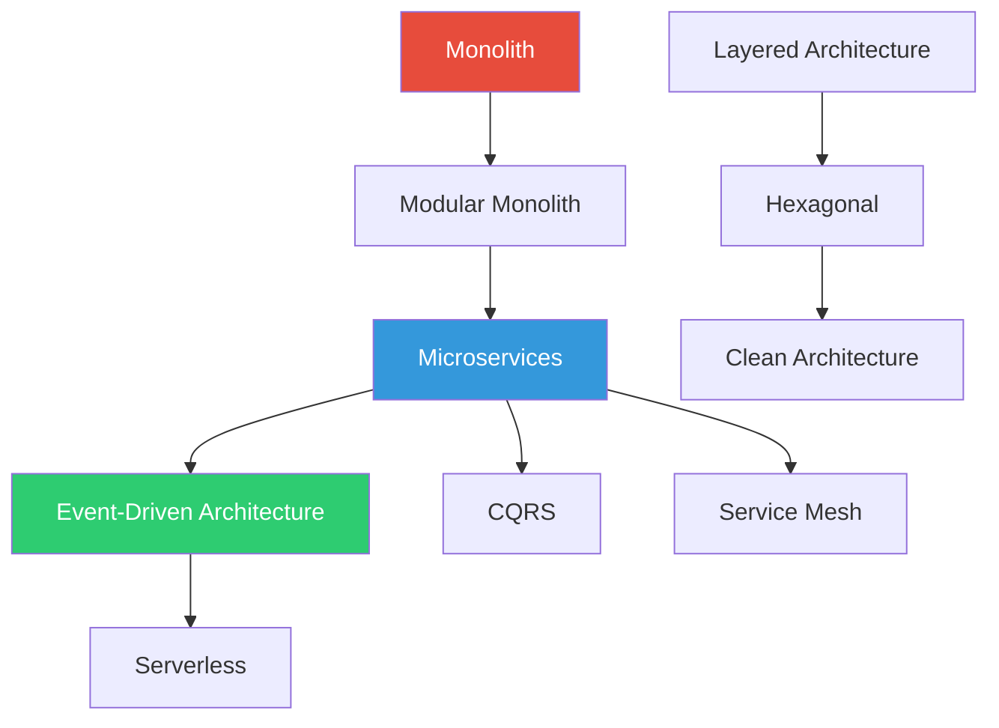

# Module 02 — Architectural Patterns

## Overview

Architectural patterns define the **macro-level structure** of a software system. They answer: "How do we organize the big pieces? Where do boundaries go? What talks to what?"

Wrong architecture = every feature is a fight against the system.
Right architecture = the system guides you toward correct solutions.

## Patterns in This Module

| # | Pattern | Core Question |
|---|---------|---------------|
| 1 | [Monolith](monolith.md) | What does a single-deployment architecture look like, and when is it enough? |
| 2 | [Modular Monolith](modular-monolith.md) | How do we get monolith simplicity with bounded-context isolation? |
| 3 | [Layered Architecture](layered-architecture.md) | How do we organize code into horizontal layers with dependency rules? |
| 4 | [Hexagonal / Ports & Adapters](hexagonal.md) | How do we isolate business logic from infrastructure? |
| 5 | [Clean Architecture](clean-architecture.md) | How do we enforce the dependency rule concentrically? |
| 6 | [Microservices](microservices.md) | When do we split into independently deployable services? |
| 7 | [Event-Driven Architecture](event-driven-architecture.md) | How do we build systems that react to events instead of direct calls? |
| 8 | [Serverless](serverless.md) | When does function-as-a-service replace long-running services? |
| 9 | [CQRS](cqrs.md) | When should reads and writes use different models? |
| 10 | [Service Mesh](service-mesh.md) | How do we handle cross-cutting concerns in a distributed system? |

## Dependency Map

## Prerequisites

- Module 00: Orientation (what patterns are, how to evaluate them)
- Module 01: Communication patterns (you'll need pub/sub, event streaming, request-reply concepts)
