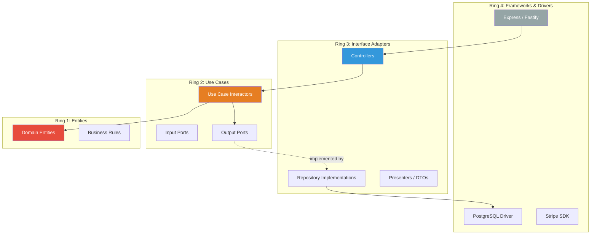

# Clean Architecture

## 1. The Problem

Your hexagonal architecture works well. You have ports and adapters, your core business logic is isolated from infrastructure. But the team has grown, and new developers keep making the same mistakes:

- Someone adds an Express `Request` type parameter to a domain entity method.
- Another developer imports the ORM directly into a use case file.
- A third person creates a "utility" function that depends on both the database AND the HTTP framework.

The problem isn't the concept — it's that "dependencies point inward" is hard to enforce when developers don't know which ring is which. Where exactly does a Use Case live? Is a DTO part of the domain or the interface layer? Can an entity call a repository?

You need clearer, more prescriptive rules about what goes where and what can depend on what.

---

## 2. Naïve Solutions (and Why They Fail)

### Attempt 1: Documentation

"Read the architecture guide before writing code."

**Why it breaks:**
- Nobody reads it. New developers cargo-copy existing patterns — including the violations.
- Documentation gets stale. The guide says one thing; the code says another.

### Attempt 2: Code Reviews

"We'll catch violations in PR reviews."

**Why it breaks:**
- Inconsistent enforcement. Reviewer A catches import violations; Reviewer B doesn't.
- Reviewers get fatigued. After 50 PRs, they stop checking architecture rules.
- It's too late — the code is already written. Rewriting is expensive.

### Attempt 3: Strict Eslint Rules on Imports

**Why it breaks partially:**
- Import rules can prevent some violations, but they can't enforce the structural rules (e.g., "use cases must return DTOs, not entities").
- Rules don't teach WHY. Developers work around them without understanding the architecture.

---

## 3. The Insight

Define **concentric rings** with explicit, numbered layers. Dependencies can ONLY point inward. Each ring has a specific name, specific permitted contents, and specific rules about what it can import. The innermost ring is the most stable (changes rarely). The outermost ring is the most volatile (changes often). This makes hexagonal architecture concrete and enforceable.

---

## 4. The Pattern

### Clean Architecture

**Definition:** A concentric-ring architecture with 4 layers, where each ring can only depend on the rings inside it. Business rules sit at the center (most stable). Infrastructure and frameworks sit at the outside (most volatile). The **Dependency Rule** is absolute: source code dependencies can only point inward.

**The four rings (inside → outside):**

| Ring | Name | Contains |
|------|------|----------|
| 1 (innermost) | **Entities** | Enterprise business rules, domain objects |
| 2 | **Use Cases** | Application-specific business rules |
| 3 | **Interface Adapters** | Controllers, presenters, gateways, DTOs |
| 4 (outermost) | **Frameworks & Drivers** | Web framework, database, external APIs |

**The Dependency Rule:** Nothing in an inner ring can know about an outer ring. An Entity cannot import a Use Case or a Controller. A Use Case cannot import Express or PostgreSQL.

---

## 5. Mental Model

Think of **concentric security zones** in a military base. The core (war room) is the most protected and most stable. The outer perimeter (guard stations) interacts with the outside world. Information flows inward (reports from the perimeter), but the war room never needs to know WHICH specific guard station sent the report — only the intelligence it contains.

**Ring 1 (Entities):** The war room. Pure strategy and rules. Never changes based on what's happening at the perimeter.
**Ring 2 (Use Cases):** Command chain. Orchestrates actions using strategy from the war room.
**Ring 3 (Adapters):** Translators. Convert external signals into a format the command chain understands.
**Ring 4 (Frameworks):** Guard stations. Interface with the specific reality of the outside world.

---

## 6. Structure



```
src/
├── entities/                     ← Ring 1: Domain entities & rules
│   ├── user.entity.ts
│   └── order.entity.ts
├── use-cases/                    ← Ring 2: Application logic
│   ├── create-order.ts
│   ├── cancel-order.ts
│   └── ports/                    ← Interfaces for Ring 3 to implement
│       ├── order.repository.ts
│       └── payment.gateway.ts
├── adapters/                     ← Ring 3: Interface adapters
│   ├── controllers/
│   │   └── order.controller.ts
│   ├── repositories/
│   │   └── pg-order.repository.ts
│   └── presenters/
│       └── order.presenter.ts
└── frameworks/                   ← Ring 4: External frameworks
    ├── express/
    │   └── server.ts
    ├── database/
    │   └── connection.ts
    └── config/
        └── env.ts
```

---

## 7. Code Example

### TypeScript

```typescript
// ========================================================================
// RING 1: ENTITIES — Pure business rules, zero dependencies
// ========================================================================

// entities/order.entity.ts
export type OrderStatus = "draft" | "confirmed" | "paid" | "canceled";

export class OrderEntity {
  private items: Array<{ productId: string; price: number; quantity: number }> = [];
  private status: OrderStatus = "draft";
  private total = 0;

  constructor(
    public readonly id: string,
    public readonly userId: string
  ) {}

  addItem(productId: string, price: number, quantity: number): void {
    if (quantity <= 0) throw new Error("Quantity must be positive");
    if (price < 0) throw new Error("Price cannot be negative");
    this.items.push({ productId, price, quantity });
    this.recalculateTotal();
  }

  confirm(): void {
    if (this.items.length === 0) throw new Error("Cannot confirm empty order");
    if (this.status !== "draft") throw new Error(`Cannot confirm from ${this.status}`);
    this.status = "confirmed";
  }

  markPaid(): void {
    if (this.status !== "confirmed") throw new Error("Must confirm before paying");
    this.status = "paid";
  }

  cancel(): void {
    if (this.status === "paid") throw new Error("Cannot cancel a paid order");
    this.status = "canceled";
  }

  getTotal(): number { return this.total; }
  getStatus(): OrderStatus { return this.status; }
  getItems() { return [...this.items]; }

  private recalculateTotal(): void {
    this.total = this.items.reduce((s, i) => s + i.price * i.quantity, 0);
  }
}

// ========================================================================
// RING 2: USE CASES — Application-specific business rules
// ========================================================================

// use-cases/ports/order.repository.ts
import { OrderEntity } from "../../entities/order.entity";

export interface OrderRepository {
  save(order: OrderEntity): Promise<void>;
  findById(id: string): Promise<OrderEntity | null>;
  nextId(): Promise<string>;
}

// use-cases/ports/payment.gateway.ts
export interface PaymentGateway {
  charge(userId: string, amountCents: number): Promise<{ success: boolean; transactionId: string }>;
}

// use-cases/ports/product.catalog.ts
export interface ProductCatalog {
  getProduct(id: string): Promise<{ id: string; price: number; inStock: boolean } | null>;
}

// use-cases/create-order.ts
import { OrderEntity } from "../entities/order.entity";
import { OrderRepository } from "./ports/order.repository";
import { ProductCatalog } from "./ports/product.catalog";
import { PaymentGateway } from "./ports/payment.gateway";

// Input DTO — what the use case receives (defined by Ring 2, not Ring 3)
export interface CreateOrderInput {
  userId: string;
  items: Array<{ productId: string; quantity: number }>;
}

// Output DTO — what the use case returns
export interface CreateOrderOutput {
  orderId: string;
  total: number;
  status: string;
  transactionId?: string;
}

export class CreateOrderUseCase {
  constructor(
    private orderRepo: OrderRepository,       // Port (interface)
    private productCatalog: ProductCatalog,    // Port (interface)
    private paymentGateway: PaymentGateway     // Port (interface)
  ) {}

  async execute(input: CreateOrderInput): Promise<CreateOrderOutput> {
    const orderId = await this.orderRepo.nextId();
    const order = new OrderEntity(orderId, input.userId);

    // Fetch products and add to order (business rule: only in-stock items)
    for (const item of input.items) {
      const product = await this.productCatalog.getProduct(item.productId);
      if (!product) throw new Error(`Product ${item.productId} not found`);
      if (!product.inStock) throw new Error(`Product ${item.productId} out of stock`);
      order.addItem(item.productId, product.price, item.quantity);
    }

    order.confirm(); // Business rule: validate before payment

    // Charge
    const payment = await this.paymentGateway.charge(input.userId, order.getTotal());
    if (!payment.success) {
      order.cancel();
      throw new Error("Payment failed");
    }
    order.markPaid();

    await this.orderRepo.save(order);

    return {
      orderId: order.id,
      total: order.getTotal(),
      status: order.getStatus(),
      transactionId: payment.transactionId,
    };
  }
}

// ========================================================================
// RING 3: INTERFACE ADAPTERS — Controllers, Repository implementations
// ========================================================================

// adapters/controllers/order.controller.ts
import { CreateOrderUseCase, CreateOrderInput, CreateOrderOutput } from "../../use-cases/create-order";

// Controller translates HTTP → Use Case Input
export class OrderController {
  constructor(private createOrder: CreateOrderUseCase) {}

  async handleCreateOrder(httpBody: any): Promise<{ status: number; body: any }> {
    try {
      const input: CreateOrderInput = {
        userId: httpBody.userId,
        items: httpBody.items,
      };

      const output: CreateOrderOutput = await this.createOrder.execute(input);

      return {
        status: 201,
        body: {
          orderId: output.orderId,
          total: `$${(output.total / 100).toFixed(2)}`, // Presenter logic
          status: output.status,
        },
      };
    } catch (err: any) {
      return { status: 400, body: { error: err.message } };
    }
  }
}

// adapters/repositories/pg-order.repository.ts
import { Pool } from "pg";
import { OrderRepository } from "../../use-cases/ports/order.repository";
import { OrderEntity } from "../../entities/order.entity";
import { randomUUID } from "crypto";

export class PgOrderRepository implements OrderRepository {
  constructor(private db: Pool) {}

  async save(order: OrderEntity): Promise<void> {
    await this.db.query(
      "INSERT INTO orders (id, user_id, total, status) VALUES ($1, $2, $3, $4)",
      [order.id, order.userId, order.getTotal(), order.getStatus()]
    );
  }

  async findById(id: string): Promise<OrderEntity | null> {
    const { rows } = await this.db.query("SELECT * FROM orders WHERE id = $1", [id]);
    if (!rows[0]) return null;
    // Reconstruct entity from DB row
    const order = new OrderEntity(rows[0].id, rows[0].user_id);
    return order;
  }

  async nextId(): Promise<string> {
    return randomUUID();
  }
}

// ========================================================================
// RING 4: FRAMEWORKS & DRIVERS — Express wiring
// ========================================================================

// frameworks/express/server.ts
import express from "express";
import { Pool } from "pg";
import { CreateOrderUseCase } from "../../use-cases/create-order";
import { OrderController } from "../../adapters/controllers/order.controller";
import { PgOrderRepository } from "../../adapters/repositories/pg-order.repository";

const app = express();
app.use(express.json());

const db = new Pool({ connectionString: process.env.DATABASE_URL });
const orderRepo = new PgOrderRepository(db);
// Wire product catalog and payment gateway similarly...
const createOrderUseCase = new CreateOrderUseCase(orderRepo, productCatalog, paymentGateway);
const orderController = new OrderController(createOrderUseCase);

app.post("/orders", async (req, res) => {
  const result = await orderController.handleCreateOrder(req.body);
  res.status(result.status).json(result.body);
});
```

### Go

```go
// ========== entities/order.go (Ring 1) ==========
package entities

import "errors"

type OrderItem struct {
	ProductID string
	Price     int // cents
	Quantity  int
}

type Order struct {
	ID     string
	UserID string
	Items  []OrderItem
	Status string
	Total  int
}

func NewOrder(id, userID string) *Order {
	return &Order{ID: id, UserID: userID, Status: "draft"}
}

func (o *Order) AddItem(productID string, price, quantity int) error {
	if quantity <= 0 {
		return errors.New("quantity must be positive")
	}
	o.Items = append(o.Items, OrderItem{productID, price, quantity})
	o.recalcTotal()
	return nil
}

func (o *Order) Confirm() error {
	if len(o.Items) == 0 {
		return errors.New("cannot confirm empty order")
	}
	o.Status = "confirmed"
	return nil
}

func (o *Order) MarkPaid() { o.Status = "paid" }

func (o *Order) recalcTotal() {
	o.Total = 0
	for _, item := range o.Items {
		o.Total += item.Price * item.Quantity
	}
}

// ========== usecases/ports.go (Ring 2 — interfaces) ==========
package usecases

import "myapp/entities"

type OrderRepository interface {
	Save(order *entities.Order) error
	NextID() (string, error)
}

type PaymentGateway interface {
	Charge(userID string, amount int) (string, error)
}

type ProductCatalog interface {
	GetProduct(id string) (*Product, error)
}

type Product struct {
	ID      string
	Price   int
	InStock bool
}

// ========== usecases/create_order.go (Ring 2 — use case) ==========
package usecases

import (
	"fmt"
	"myapp/entities"
)

type CreateOrderInput struct {
	UserID string
	Items  []struct {
		ProductID string
		Quantity  int
	}
}

type CreateOrderOutput struct {
	OrderID       string
	Total         int
	Status        string
	TransactionID string
}

type CreateOrderUseCase struct {
	repo    OrderRepository
	catalog ProductCatalog
	gateway PaymentGateway
}

func NewCreateOrder(r OrderRepository, c ProductCatalog, g PaymentGateway) *CreateOrderUseCase {
	return &CreateOrderUseCase{repo: r, catalog: c, gateway: g}
}

func (uc *CreateOrderUseCase) Execute(input CreateOrderInput) (*CreateOrderOutput, error) {
	id, _ := uc.repo.NextID()
	order := entities.NewOrder(id, input.UserID)

	for _, item := range input.Items {
		product, err := uc.catalog.GetProduct(item.ProductID)
		if err != nil {
			return nil, fmt.Errorf("product %s: %w", item.ProductID, err)
		}
		if !product.InStock {
			return nil, fmt.Errorf("product %s out of stock", item.ProductID)
		}
		if err := order.AddItem(item.ProductID, product.Price, item.Quantity); err != nil {
			return nil, err
		}
	}

	if err := order.Confirm(); err != nil {
		return nil, err
	}

	txnID, err := uc.gateway.Charge(input.UserID, order.Total)
	if err != nil {
		return nil, fmt.Errorf("payment failed: %w", err)
	}
	order.MarkPaid()

	if err := uc.repo.Save(order); err != nil {
		return nil, err
	}

	return &CreateOrderOutput{
		OrderID: order.ID, Total: order.Total,
		Status: order.Status, TransactionID: txnID,
	}, nil
}
```

---

## 8. Gotchas & Beginner Mistakes

| Mistake | Why It Hurts |
|---|---|
| **Entity imports Use Case** | Ring 1 importing Ring 2. The most fundamental violation. Entities must have ZERO dependencies. |
| **Use Case returns Entity** | Leaking domain objects to Ring 3. Use Cases should return plain DTOs (Output). |
| **Controller has business logic** | The controller validates business rules instead of delegating to the Use Case. Ring 3 should only translate formats. |
| **One Use Case class per CRUD method** | `CreateOrderUseCase`, `GetOrderByIdUseCase`, `GetAllOrdersUseCase`. For simple reads, a lighter abstraction is fine. |
| **Framework in Ring 2** | `import { Request, Response } from "express"` in a Use Case file. Express is Ring 4 — it shouldn't leak into Ring 2. |
| **Over-engineering simple apps** | Clean Architecture for a TODO app creates 15 files for 5 lines of logic. It's designed for complex domains. |

---

## 9. Related & Confusable Patterns

| Pattern | How It Differs |
|---|---|
| **Hexagonal Architecture** | Essentially the same idea. Clean Architecture adds explicit ring numbering and naming. |
| **Onion Architecture** | Again, the same core idea. Onion uses "Core → Domain Services → Application Services → Infrastructure." |
| **Layered Architecture** | Simpler. Dependencies flow downward but don't necessarily invert. Clean Architecture inverts infrastructure dependencies. |
| **Domain-Driven Design** | Provides the modeling methodology for Ring 1 (Entities). Clean Architecture provides the structural rules. |

**Clean Architecture ≈ Hexagonal ≈ Onion.** They share the same Dependency Rule. Clean Architecture is more prescriptive about the number and naming of rings.

---

## 10. When This Pattern Is the WRONG Choice

- **CRUD applications** — If the "business logic" is "save this to the database," you don't need 4 rings. Use a layered or framework-default architecture.
- **Prototypes** — When learning if the product idea works, architecture is premature. Ship fast, architect later.
- **Small teams / small codebases** — If one person maintains 5K lines of code, they can hold it all in their head. Structure adds file count, not clarity.
- **Performance-sensitive code** — Each ring boundary adds indirection (function calls, interface dispatch). In tight loops, this matters.
- **Scripts and utilities** — A data migration script doesn't need 4 layers.

**Symptoms you chose it too early:**
- Every Use Case is 5 lines that call a repository method. The orchestration is trivial.
- You have 100 files and 500 lines of actual logic. The architecture overhead exceeds the logic.
- Nobody on the team understands the ring rules. The architecture is aspirational, not practiced.

**How to back out:** Collapse rings. Merge Entities + Use Cases into a "domain" layer. Merge Adapters + Frameworks into an "infrastructure" layer. You're now in layered architecture — simpler and sufficient.
