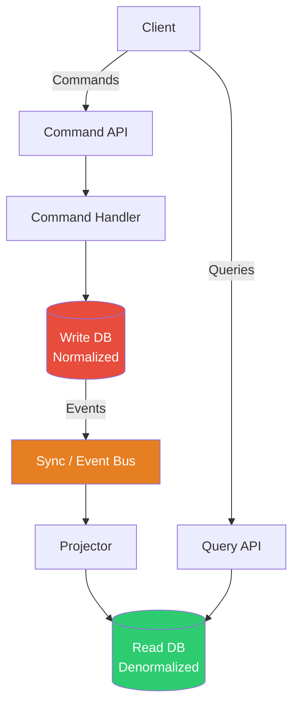
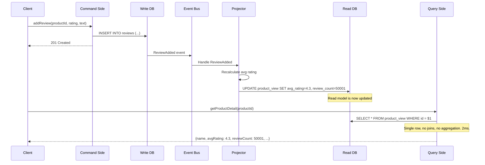

# CQRS (Command Query Responsibility Segregation)

## 1. The Problem

Your e-commerce product listing page is slow. The product detail page shows: product info, average rating (computed from 50K reviews), seller reputation score, "customers who bought this also bought..." recommendations, real-time stock status, and pricing history.

Each page load runs this query:

```sql
SELECT p.*, 
  (SELECT AVG(rating) FROM reviews WHERE product_id = p.id) as avg_rating,
  (SELECT COUNT(*) FROM reviews WHERE product_id = p.id) as review_count,
  (SELECT reputation FROM sellers WHERE id = p.seller_id) as seller_reputation,
  (SELECT json_agg(related_id) FROM recommendations WHERE product_id = p.id) as related,
  (SELECT json_agg(price) FROM price_history WHERE product_id = p.id ORDER BY date DESC LIMIT 30) as price_history
FROM products p WHERE p.id = $1;
```

This query takes 800ms. It hits 5 tables, computes aggregates, and joins across everything. You have 10,000 concurrent users. The database is melting.

Meanwhile, writes are simple: "Add a review," "Update price," "Change stock." These are fast, 5ms each. But the read query's complexity is degrading write performance because they share the same data model, same indexes, same database connection pool.

**Reads and writes have fundamentally different characteristics:**

| | Reads | Writes |
|---|---|---|
| Frequency | 100x more common | Less common |
| Complexity | Complex (joins, aggregations) | Simple (insert/update one row) |
| Latency tolerance | Low (users wait) | Higher (background OK) |
| Data shape | Denormalized, pre-computed | Normalized, consistent |
| Scaling need | Horizontal (read replicas) | Vertical (single writer) |

---

## 2. Naïve Solutions (and Why They Fail)

### Attempt 1: More Indexes

```sql
CREATE INDEX idx_reviews_product ON reviews(product_id);
CREATE INDEX idx_recommendations_product ON recommendations(product_id);
```

**Why it breaks:**
- Helps initially, but the fundamental query complexity remains.
- More indexes slow down writes (every INSERT updates every index).
- The data model is normalized for writes, not optimized for reads.

### Attempt 2: Caching

```typescript
const product = cache.get(`product:${id}`) || await fetchFromDb(id);
cache.set(`product:${id}`, product, { ttl: 300 });
```

**Why it breaks:**
- Cache invalidation is hard. When a review is added, which cached products are stale?
- TTL-based caching means users see stale data for up to N seconds.
- Cold cache thundering herd: 1,000 users hit an expired product simultaneously. All 1,000 query the DB.

### Attempt 3: Read Replicas

**Why it breaks partially:**
- Read replicas solve LOAD but not COMPLEXITY. The same 800ms query runs on the replica.
- Replication lag means reads are eventually consistent anyway.
- Still using the same normalized write-optimized schema for reads.

---

## 3. The Insight

**Separate the read model from the write model.** Use one model optimized for writes (normalized, consistent, simple). Use a different model optimized for reads (denormalized, pre-computed, fast). When a write happens, update the read model asynchronously. The read model is a **projection** — a pre-computed view of the data shaped for specific queries.

---

## 4. The Pattern

### CQRS (Command Query Responsibility Segregation)

**Definition:** An architectural pattern where the system uses **separate models** for reading data (Queries) and writing data (Commands). The write model handles business logic and stores normalized data. The read model is a denormalized, pre-computed projection optimized for specific query patterns.

**Core components:**
- **Command side:** Receives writes (CreateOrder, AddReview). Validates business rules. Writes to the write store.
- **Query side:** Receives reads (GetProductDetail, ListOrders). Reads from a separate, optimized read store.
- **Synchronization:** When the write store changes, the read store is updated (sync or async via events).

---

## 5. Mental Model

Think of a **library with two systems**: (1) The cataloging system (write model) where librarians organize books by Library of Congress classification — precise, normalized, authoritative. (2) The search kiosk (read model) that has a denormalized index: search by title, author, ISBN, genre, availability — fast lookups, optimized for patron queries.

When a new book is cataloged (write), someone updates the search kiosk (read model update). The two systems serve different purposes with different data shapes.

---

## 6. Structure





---

## 7. Code Example

### TypeScript

```typescript
import { Pool } from "pg";
import { EventEmitter } from "events";

const writeDb = new Pool({ connectionString: "postgres://localhost/write_db" });
const readDb = new Pool({ connectionString: "postgres://localhost/read_db" });
const eventBus = new EventEmitter();

// ========== COMMAND SIDE (Writes) ==========

interface AddReviewCommand {
  productId: string;
  userId: string;
  rating: number;
  text: string;
}

async function handleAddReview(cmd: AddReviewCommand) {
  // Validate business rules
  if (cmd.rating < 1 || cmd.rating > 5) throw new Error("Rating must be 1-5");
  if (cmd.text.length < 10) throw new Error("Review too short");

  // Write to normalized write store
  await writeDb.query(
    "INSERT INTO reviews (product_id, user_id, rating, text) VALUES ($1, $2, $3, $4)",
    [cmd.productId, cmd.userId, cmd.rating, cmd.text]
  );

  // Emit event for read model update
  eventBus.emit("ReviewAdded", {
    productId: cmd.productId,
    rating: cmd.rating,
    timestamp: new Date(),
  });
}

// ========== PROJECTOR (Sync read model) ==========

eventBus.on("ReviewAdded", async (event: { productId: string; rating: number }) => {
  // Recalculate and update the denormalized read model
  const { rows } = await writeDb.query(
    "SELECT AVG(rating)::numeric(3,2) as avg_rating, COUNT(*) as count FROM reviews WHERE product_id = $1",
    [event.productId]
  );

  await readDb.query(
    `INSERT INTO product_read_model (product_id, avg_rating, review_count, updated_at)
     VALUES ($1, $2, $3, NOW())
     ON CONFLICT (product_id) 
     DO UPDATE SET avg_rating = $2, review_count = $3, updated_at = NOW()`,
    [event.productId, rows[0].avg_rating, rows[0].count]
  );
  console.log(`Read model updated: product ${event.productId}, avg=${rows[0].avg_rating}`);
});

// ========== QUERY SIDE (Reads) ==========

interface ProductView {
  productId: string;
  name: string;
  price: number;
  avgRating: number;
  reviewCount: number;
  sellerReputation: number;
  relatedProducts: string[];
}

async function getProductDetail(productId: string): Promise<ProductView> {
  // Single table, no joins, no aggregation. Milliseconds.
  const { rows } = await readDb.query(
    "SELECT * FROM product_read_model WHERE product_id = $1",
    [productId]
  );

  if (!rows[0]) throw new Error("Product not found");

  return {
    productId: rows[0].product_id,
    name: rows[0].name,
    price: rows[0].price,
    avgRating: parseFloat(rows[0].avg_rating),
    reviewCount: parseInt(rows[0].review_count),
    sellerReputation: parseFloat(rows[0].seller_reputation),
    relatedProducts: rows[0].related_products || [],
  };
}

// ========== API ROUTES ==========
import express from "express";
const app = express();
app.use(express.json());

// Command endpoint
app.post("/reviews", async (req, res) => {
  await handleAddReview(req.body);
  res.status(201).json({ created: true });
});

// Query endpoint  
app.get("/products/:id", async (req, res) => {
  const product = await getProductDetail(req.params.id);
  res.json(product);
});
```

### Go

```go
package main

import (
	"database/sql"
	"encoding/json"
	"fmt"
	"log"
	"net/http"
	"sync"
)

// ========== COMMAND SIDE ==========
type AddReviewCommand struct {
	ProductID string `json:"product_id"`
	UserID    string `json:"user_id"`
	Rating    int    `json:"rating"`
	Text      string `json:"text"`
}

type EventBus struct {
	mu       sync.RWMutex
	handlers map[string][]func(interface{})
}

func (b *EventBus) Emit(eventType string, data interface{}) {
	b.mu.RLock()
	defer b.mu.RUnlock()
	for _, h := range b.handlers[eventType] {
		go h(data)
	}
}

func (b *EventBus) On(eventType string, handler func(interface{})) {
	b.mu.Lock()
	defer b.mu.Unlock()
	b.handlers[eventType] = append(b.handlers[eventType], handler)
}

var (
	writeDB  *sql.DB
	readDB   *sql.DB
	eventBus = &EventBus{handlers: make(map[string][]func(interface{}))}
)

func handleAddReview(cmd AddReviewCommand) error {
	if cmd.Rating < 1 || cmd.Rating > 5 {
		return fmt.Errorf("rating must be 1-5")
	}

	_, err := writeDB.Exec(
		"INSERT INTO reviews (product_id, user_id, rating, text) VALUES ($1, $2, $3, $4)",
		cmd.ProductID, cmd.UserID, cmd.Rating, cmd.Text,
	)
	if err != nil {
		return err
	}

	eventBus.Emit("ReviewAdded", cmd)
	return nil
}

// ========== PROJECTOR ==========
func setupProjector() {
	eventBus.On("ReviewAdded", func(data interface{}) {
		cmd := data.(AddReviewCommand)

		var avgRating float64
		var count int
		writeDB.QueryRow(
			"SELECT AVG(rating), COUNT(*) FROM reviews WHERE product_id = $1",
			cmd.ProductID,
		).Scan(&avgRating, &count)

		readDB.Exec(
			`INSERT INTO product_read_model (product_id, avg_rating, review_count)
			 VALUES ($1, $2, $3)
			 ON CONFLICT (product_id) DO UPDATE SET avg_rating=$2, review_count=$3`,
			cmd.ProductID, avgRating, count,
		)
		log.Printf("Projected: product %s, avg=%.2f, count=%d", cmd.ProductID, avgRating, count)
	})
}

// ========== QUERY SIDE ==========
type ProductView struct {
	ProductID   string  `json:"product_id"`
	Name        string  `json:"name"`
	AvgRating   float64 `json:"avg_rating"`
	ReviewCount int     `json:"review_count"`
}

func getProductDetail(productID string) (*ProductView, error) {
	var v ProductView
	err := readDB.QueryRow(
		"SELECT product_id, name, avg_rating, review_count FROM product_read_model WHERE product_id=$1",
		productID,
	).Scan(&v.ProductID, &v.Name, &v.AvgRating, &v.ReviewCount)
	if err != nil {
		return nil, err
	}
	return &v, nil
}

func main() {
	setupProjector()

	http.HandleFunc("/reviews", func(w http.ResponseWriter, r *http.Request) {
		var cmd AddReviewCommand
		json.NewDecoder(r.Body).Decode(&cmd)
		if err := handleAddReview(cmd); err != nil {
			http.Error(w, err.Error(), 400)
			return
		}
		w.WriteHeader(201)
	})

	http.HandleFunc("/products/", func(w http.ResponseWriter, r *http.Request) {
		id := r.URL.Path[len("/products/"):]
		product, err := getProductDetail(id)
		if err != nil {
			http.Error(w, "not found", 404)
			return
		}
		json.NewEncoder(w).Encode(product)
	})

	log.Fatal(http.ListenAndServe(":3000", nil))
}
```

---

## 8. Gotchas & Beginner Mistakes

| Mistake | Why It Hurts |
|---|---|
| **Stale read model** | User adds a review, reloads page, review isn't there yet (read model lag). Show "review submitted" confirmation, or use read-your-own-writes consistency. |
| **No eventual consistency handling** | UI assumes instant consistency. "Where's my review?!" Design the UI for eventual consistency. |
| **Same database for read/write** | Using views instead of materialized separate storage. You get schema separation but not load separation. |
| **Over-engineering simple apps** | CQRS for a blog with 100 readers. A single normalized database handles both reads and writes fine. |
| **Write model exposes query endpoints** | Queries hitting the write database. You still have the original performance problem. |
| **Rebuilding projections is impossible** | No event log. If the read model corrupts, you can't rebuild it. Store events or keep the write-side data in a replayable format. |

---

## 9. Related & Confusable Patterns

| Pattern | How It Differs |
|---|---|
| **Event Sourcing** | Stores events as the source of truth. Often paired with CQRS but independent. CQRS doesn't require event sourcing. |
| **Materialized View** | A database feature that pre-computes query results. CQRS read model IS a materialized view, sometimes in a different database. |
| **Read Replica** | Same schema, separate database for reads. CQRS uses a DIFFERENT schema optimized for reads. |
| **Cache** | Caches avoid the database entirely but have invalidation problems. CQRS read model is actively maintained (projected). |

---

## 10. When This Pattern Is the WRONG Choice

- **Simple CRUD** — If reads and writes use the same data shape (normalized), CQRS doubles your code for zero benefit.
- **Strong consistency required** — "Show the updated balance instantly." CQRS read models are eventually consistent.
- **Small data, low traffic** — If your query runs in 5ms, you don't need a separate read model.
- **Small team** — Maintaining two models, a projector, and an event bus requires engineering bandwidth.

**Symptoms you chose it too early:**
- The read model is identical to the write model. No denormalization. No pre-computation.
- The projector is a straight copy (`INSERT INTO read_model SELECT * FROM write_model`).
- Users complain about stale data more than they complained about slow queries.

**How to back out:** Delete the read model and projector. Query the write database directly. Add indexes or materialized views if performance is a concern.
