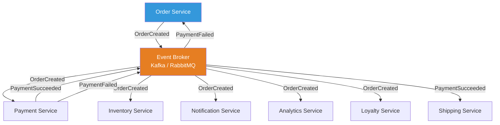
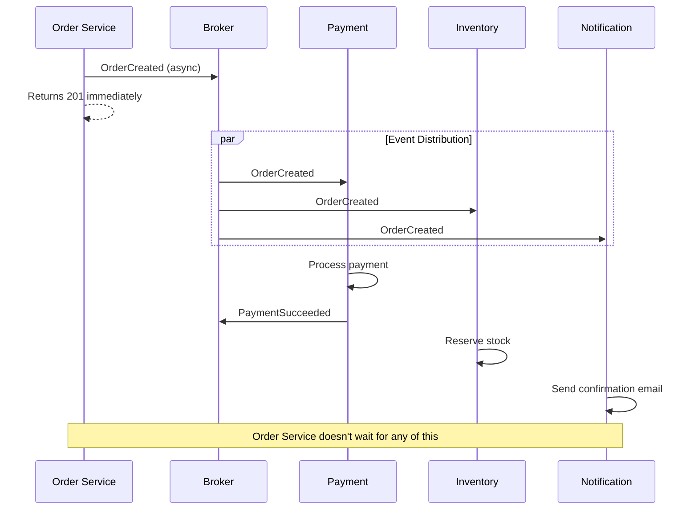

# Event-Driven Architecture

## 1. The Problem

Your e-commerce platform has grown to 8 microservices. The order flow looks like this:

```
Order Service → (HTTP) → Payment Service → (HTTP) → Inventory Service → (HTTP) → 
Shipping Service → (HTTP) → Notification Service → (HTTP) → Analytics Service
```

Every service calls the next one synchronously. The problems:

1. **Latency stack:** Each call adds 50-100ms. Total: 300-600ms for a single order. Users see a spinner.

2. **Availability chain:** If Notification Service is down, the entire order fails. The customer can't buy because the email service is broken.

3. **Coupling:** Order Service must know about every downstream service. Adding "Loyalty Points Service" means modifying Order Service to call it. Order Service has become a god-orchestrator.

4. **Scaling bottleneck:** Order Service makes 5 outbound calls per order. At 1,000 orders/minute, it makes 5,000 outbound HTTP requests/minute. It becomes the bottleneck.

```typescript
// Order Service — knows about EVERYTHING
async function createOrder(order: Order) {
  await paymentService.charge(order);           // coupling
  await inventoryService.reserve(order);         // coupling
  await shippingService.createLabel(order);      // coupling
  await notificationService.sendEmail(order);    // coupling
  await analyticsService.trackOrder(order);      // coupling
  await loyaltyService.addPoints(order);         // coupling (just added)
  // ... next quarter: referralService, taxService, fraudService
}
```

---

## 2. Naïve Solutions (and Why They Fail)

### Attempt 1: Async HTTP (Fire and Forget)

```typescript
async function createOrder(order: Order) {
  await paymentService.charge(order);  // must be sync — need confirmation
  // Fire-and-forget the rest
  fetch("http://inventory/reserve", { method: "POST", body: JSON.stringify(order) });
  fetch("http://shipping/label", { method: "POST", body: JSON.stringify(order) });
  fetch("http://notification/email", { method: "POST", body: JSON.stringify(order) });
}
```

**Why it breaks:**
- If any service is down, the message is lost forever. No retry.
- No guarantee of delivery. Network failure = silent data loss.
- Still coupled — Order Service must know every URL.
- No backpressure. Services get overwhelmed.

### Attempt 2: Shared Database Events Table

```typescript
await db.query("INSERT INTO events (type, data) VALUES ('OrderCreated', ?)", [order]);
// Other services poll this table
```

**Why it breaks:**
- All services polling one table. Lock contention. Query bottleneck.
- Polling adds latency (interval-dependent).
- The shared database becomes a single point of failure and coupling.

---

## 3. The Insight

**Invert the communication.** Instead of the Order Service calling downstream services, it publishes an event: "An order was created." Any service that cares subscribes to that event independently. The Order Service doesn't know (or care) who's listening. Adding a new service means subscribing — zero changes to Order Service.

---

## 4. The Pattern

### Event-Driven Architecture (EDA)

**Definition:** An architectural style where services communicate by **producing and consuming events** through a message broker. Producers publish events when something happens. Consumers subscribe to events they care about. The producer and consumer are **decoupled** — neither knows the other exists.

**Core properties:**
- **Event** = an immutable fact: "something happened" (past tense: `OrderCreated`, `PaymentFailed`)
- **Producers** emit events without knowing who consumes them
- **Consumers** subscribe to events without knowing who produced them
- **Broker** mediates (Kafka, RabbitMQ, SNS+SQS, NATS)

**Two styles:**
- **Event Notification:** Minimal event (just ID + type). Consumer fetches details separately.
- **Event-Carried State Transfer:** Event contains all the data consumers need.

---

## 5. Mental Model

Think of a **newspaper**. The reporter (producer) writes a story and publishes it. They don't know who reads it. Subscribers (consumers) choose which sections to read. Adding a new reader doesn't require the reporter to do anything. The newspaper distribution system (broker) handles delivery.

Compare this to the old model: the reporter **calling each reader individually** with the news. That's synchronous point-to-point communication.

---

## 6. Structure





---

## 7. Code Example

### TypeScript

```typescript
import { EventEmitter } from "events";

// Simulated event broker (in real life: Kafka, RabbitMQ)
class EventBroker {
  private emitter = new EventEmitter();
  private subscriptions = new Map<string, Function[]>();

  publish(eventType: string, data: unknown): void {
    console.log(`[Broker] Publishing: ${eventType}`);
    this.emitter.emit(eventType, data);
  }

  subscribe(eventType: string, handler: (data: any) => void): void {
    this.emitter.on(eventType, handler);
    console.log(`[Broker] Subscription added for: ${eventType}`);
  }
}

const broker = new EventBroker();

// ============ ORDER SERVICE (Producer) ============
interface OrderEvent {
  orderId: string;
  userId: string;
  items: Array<{ productId: string; quantity: number; price: number }>;
  total: number;
  timestamp: string;
}

async function createOrder(userId: string, items: OrderEvent["items"]) {
  const orderId = `order-${Date.now()}`;
  const total = items.reduce((s, i) => s + i.price * i.quantity, 0);

  // Save to own database
  console.log(`[OrderService] Saved order ${orderId}`);

  // Publish event — don't know or care who listens
  broker.publish("OrderCreated", {
    orderId,
    userId,
    items,
    total,
    timestamp: new Date().toISOString(),
  } as OrderEvent);

  return { orderId, total }; // Return immediately
}

// ============ PAYMENT SERVICE (Consumer) ============
broker.subscribe("OrderCreated", async (event: OrderEvent) => {
  console.log(`[PaymentService] Charging ${event.userId} $${event.total / 100}`);
  // Process payment...
  const success = Math.random() > 0.1; // 90% success rate
  if (success) {
    broker.publish("PaymentSucceeded", {
      orderId: event.orderId,
      transactionId: `txn-${Date.now()}`,
    });
  } else {
    broker.publish("PaymentFailed", {
      orderId: event.orderId,
      reason: "Card declined",
    });
  }
});

// ============ INVENTORY SERVICE (Consumer) ============
broker.subscribe("OrderCreated", async (event: OrderEvent) => {
  for (const item of event.items) {
    console.log(`[InventoryService] Reserving ${item.quantity}x ${item.productId}`);
  }
});

// ============ NOTIFICATION SERVICE (Consumer) ============
broker.subscribe("OrderCreated", async (event: OrderEvent) => {
  console.log(`[NotificationService] Sending confirmation to ${event.userId}`);
});

// ============ ANALYTICS SERVICE (Consumer — added LATER, zero changes above) ============
broker.subscribe("OrderCreated", async (event: OrderEvent) => {
  console.log(`[AnalyticsService] Tracking order value: $${event.total / 100}`);
});

// ============ React to downstream events ============
broker.subscribe("PaymentFailed", async (event: any) => {
  console.log(`[OrderService] Canceling order ${event.orderId}: ${event.reason}`);
});

broker.subscribe("PaymentSucceeded", async (event: any) => {
  console.log(`[ShippingService] Creating label for ${event.orderId}`);
});

// ============ RUN ============
createOrder("user-1", [
  { productId: "prod-1", quantity: 2, price: 1999 },
  { productId: "prod-2", quantity: 1, price: 4999 },
]);
```

### Go

```go
package main

import (
	"encoding/json"
	"fmt"
	"sync"
	"time"
)

type Event struct {
	Type      string          `json:"type"`
	Data      json.RawMessage `json:"data"`
	Timestamp time.Time       `json:"timestamp"`
}

type OrderCreated struct {
	OrderID string `json:"order_id"`
	UserID  string `json:"user_id"`
	Total   int    `json:"total"`
}

// Simple in-memory broker
type Broker struct {
	mu          sync.RWMutex
	subscribers map[string][]func(json.RawMessage)
}

func NewBroker() *Broker {
	return &Broker{subscribers: make(map[string][]func(json.RawMessage))}
}

func (b *Broker) Publish(eventType string, data interface{}) {
	b.mu.RLock()
	handlers := b.subscribers[eventType]
	b.mu.RUnlock()

	payload, _ := json.Marshal(data)
	fmt.Printf("[Broker] Publishing %s\n", eventType)

	for _, handler := range handlers {
		go handler(payload) // async delivery
	}
}

func (b *Broker) Subscribe(eventType string, handler func(json.RawMessage)) {
	b.mu.Lock()
	b.subscribers[eventType] = append(b.subscribers[eventType], handler)
	b.mu.Unlock()
	fmt.Printf("[Broker] Subscription: %s\n", eventType)
}

func main() {
	broker := NewBroker()
	var wg sync.WaitGroup

	// Payment Service
	wg.Add(1)
	broker.Subscribe("OrderCreated", func(data json.RawMessage) {
		defer wg.Done()
		var order OrderCreated
		json.Unmarshal(data, &order)
		fmt.Printf("[Payment] Charging user %s: $%d\n", order.UserID, order.Total)
		broker.Publish("PaymentSucceeded", map[string]string{"order_id": order.OrderID})
	})

	// Inventory Service
	wg.Add(1)
	broker.Subscribe("OrderCreated", func(data json.RawMessage) {
		defer wg.Done()
		var order OrderCreated
		json.Unmarshal(data, &order)
		fmt.Printf("[Inventory] Reserving stock for order %s\n", order.OrderID)
	})

	// Notification Service
	wg.Add(1)
	broker.Subscribe("OrderCreated", func(data json.RawMessage) {
		defer wg.Done()
		var order OrderCreated
		json.Unmarshal(data, &order)
		fmt.Printf("[Notification] Emailing user %s\n", order.UserID)
	})

	// Order Service publishes
	broker.Publish("OrderCreated", OrderCreated{
		OrderID: "order-001",
		UserID:  "user-42",
		Total:   8997,
	})

	wg.Wait()
	time.Sleep(100 * time.Millisecond) // let async subscribers finish
}
```

---

## 8. Gotchas & Beginner Mistakes

| Mistake | Why It Hurts |
|---|---|
| **Treating events as commands** | Events = past tense facts ("OrderCreated"). Commands = imperatives ("CreateShipment"). Events describe WHAT happened, not what to do. |
| **Giant event payloads** | 10MB event with full product catalog. Bloats the broker. Send minimal data; let consumers fetch what they need. |
| **Event ordering assumptions** | "PaymentSucceeded always arrives after OrderCreated." Not guaranteed across partitions. Design consumers to handle any order. |
| **No dead letter queue** | A consumer can't process an event. It retries forever. Other events pile up. DLQ catches poison pills. |
| **Synchronous disguised as async** | Publishing an event and then polling for a response event. You've rebuilt request-reply, poorly. |
| **Event schema evolution** | Adding a field to an event breaks all existing consumers. Use schema versioning (Avro, Protobuf) or additive-only changes. |

---

## 9. Related & Confusable Patterns

| Pattern | How It Differs |
|---|---|
| **Pub/Sub** | The messaging primitive. EDA is the architecture built ON TOP of pub/sub. |
| **Event Sourcing** | Stores events as the source of truth. EDA uses events for communication, not storage. |
| **CQRS** | Separates reads from writes. Often paired with EDA but independent. |
| **Choreography** | EDA style where services react to events without a central coordinator. |
| **Orchestration** | Central coordinator tells services what to do. Opposite of event-driven choreography. |
| **Microservices** | Microservices can use EDA or request-response. EDA is one communication style. |

---

## 10. When This Pattern Is the WRONG Choice

- **Strong consistency required** — "Show the updated balance immediately after transfer." Events are eventually consistent. Use synchronous APIs.
- **Simple request-response** — "Get user by ID." Don't publish a "UserRequested" event and wait for a "UserRetrieved" event. Just call the API.
- **Small system, few services** — 2 services don't need a message broker between them. Direct HTTP is simpler.
- **Debugging requirements** — Event-driven flows are harder to trace. "Why didn't the email send?" requires tracing through broker + consumer logs.
- **Team inexperience** — Event-driven architecture requires understanding of eventual consistency, idempotency, and distributed systems. Start simpler.

**Symptoms you chose it too early:**
- You have one producer and one consumer. That's a function call with extra steps.
- Every event has exactly one subscriber. That's point-to-point messaging, not event-driven architecture.
- You publish an event and immediately query for the result. You need synchronous communication.

**How to back out:** Replace events with direct HTTP calls between services. Trade decoupling for simplicity.
