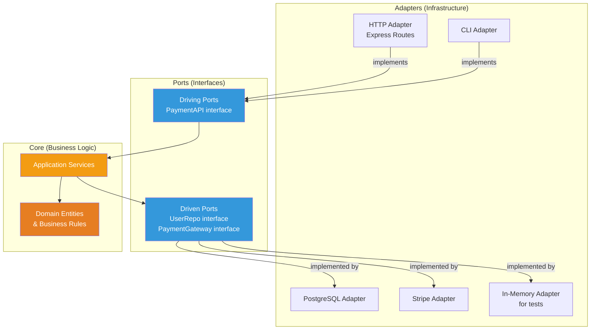

# Hexagonal Architecture (Ports & Adapters)

## 1. The Problem

You built a payment processing service using the layered architecture pattern. It works great — clean layers, separate concerns. Then:

1. **The CTO says:** "We're switching from PostgreSQL to DynamoDB for cost savings."
2. **Product says:** "We also need a CLI tool for bulk payment processing."
3. **QA says:** "Integration tests take 12 minutes because they hit the real database and real Stripe API."

You look at your code:

```typescript
// application/payment.service.ts — depends directly on Stripe SDK
import Stripe from "stripe";
import { Pool } from "pg"; // depends directly on PostgreSQL

export class PaymentService {
  private stripe = new Stripe(process.env.STRIPE_KEY!);
  constructor(private db: Pool) {}

  async chargeCustomer(userId: string, amount: number) {
    const user = await this.db.query("SELECT * FROM users WHERE id = $1", [userId]);
    await this.stripe.charges.create({ amount, currency: "usd", customer: user.rows[0].stripe_id });
    await this.db.query("INSERT INTO payments (user_id, amount) VALUES ($1, $2)", [userId, amount]);
  }
}
```

Problems:
- **Switching databases:** PostgreSQL-specific SQL is embedded in the service layer. Rewrite every service.
- **Adding CLI interface:** Business logic is coupled to Express. Need to import the whole HTTP stack for a CLI tool.
- **Slow tests:** Tests need a running PostgreSQL and mock Stripe API. Can't test business logic in isolation.

Your business logic is trapped inside infrastructure.

---

## 2. Naïve Solutions (and Why They Fail)

### Attempt 1: Abstract the Database

```typescript
class PaymentService {
  constructor(private db: PostgresDB | DynamoDB | MongoDB) {}
  // Now the service knows about 3 database types
}
```

**Why it breaks:**
- The service still knows about specific databases. Adding a new one means modifying PaymentService.
- The interface is an afterthought — it leaks database-specific concepts (SQL, DocumentClient).
- This is an abstraction, but the dependency still points inward → outward.

### Attempt 2: Conditional Logic

```typescript
async function chargeCustomer(userId, amount) {
  let user;
  if (process.env.DB === "postgres") {
    user = await postgres.query("SELECT ...");
  } else if (process.env.DB === "dynamodb") {
    user = await dynamo.get({ TableName: "users", Key: { id: userId } });
  }
  // ...
}
```

**Why it breaks:**
- Every function has if/else branches for infrastructure. Business logic drowns in infrastructure noise.
- Adding a third option means touching every function.
- Untestable — you need live database connections for every code path.

---

## 3. The Insight

**Invert the dependency.** Define interfaces (ports) from the APPLICATION's perspective — what does the business logic NEED? Then implement those interfaces with adapters for specific technologies. The business logic doesn't know or care whether it's talking to PostgreSQL, DynamoDB, a mock, or a file system.

The key shift: infrastructure depends on the business logic (via interfaces), not the other way around.

---

## 4. The Pattern

### Hexagonal Architecture (Ports & Adapters)

**Definition:** An architectural pattern where the **core business logic** sits at the center, isolated from all external concerns. The core defines **ports** (interfaces describing what it needs from the outside world and what it offers). **Adapters** implement these ports for specific technologies (databases, APIs, UIs, tests).

**Two kinds of ports:**
- **Driving ports (primary):** How the outside world triggers the application (HTTP, CLI, gRPC, tests)
- **Driven ports (secondary):** What the application needs from the outside world (database, email, payment gateway)

**The dependency rule:** All dependencies point INWARD. Adapters depend on ports. Ports are defined by the core. The core depends on nothing external.

---

## 5. Mental Model

Think of a **USB device**. The USB port (interface) is defined by a standard. Any adapter — mouse, keyboard, webcam, thumb drive — can plug into it. The computer (core) doesn't know or care what specific device is connected. It only knows the USB protocol.

Similarly:
- **Port** = "I need something that can store user data" (interface)
- **Adapter** = "Here's a PostgreSQL implementation" or "Here's an in-memory implementation for tests"
- **Core** = Business logic that uses the port without knowing the adapter

---

## 6. Structure



```
src/
├── core/                          ← The hexagon (no external deps)
│   ├── domain/
│   │   ├── payment.entity.ts      ← Business rules
│   │   └── user.entity.ts
│   ├── ports/
│   │   ├── user.repository.ts     ← Driven port (interface)
│   │   ├── payment.gateway.ts     ← Driven port (interface)
│   │   └── payment.api.ts         ← Driving port (interface)
│   └── services/
│       └── payment.service.ts     ← Orchestration (uses ports only)
├── adapters/
│   ├── driving/                   ← How the world enters
│   │   ├── http/
│   │   │   └── payment.routes.ts
│   │   └── cli/
│   │       └── bulk-charge.ts
│   └── driven/                    ← What the core needs
│       ├── postgres/
│       │   └── user.repository.ts
│       ├── dynamodb/
│       │   └── user.repository.ts
│       ├── stripe/
│       │   └── payment.gateway.ts
│       └── in-memory/
│           ├── user.repository.ts  ← For tests
│           └── payment.gateway.ts  ← For tests
└── main.ts                        ← Wiring (composition root)
```

---

## 7. Code Example

### TypeScript

```typescript
// ========== core/ports/user.repository.ts (Driven Port — interface) ==========

export interface UserDTO {
  id: string;
  name: string;
  email: string;
  stripeCustomerId: string;
}

// The core DEFINES what it needs. It doesn't know PostgreSQL exists.
export interface UserRepository {
  findById(id: string): Promise<UserDTO | null>;
  save(user: UserDTO): Promise<void>;
}

// ========== core/ports/payment.gateway.ts (Driven Port — interface) ==========

export interface ChargeResult {
  chargeId: string;
  status: "succeeded" | "failed";
}

// The core doesn't know about Stripe. It knows it needs a payment gateway.
export interface PaymentGateway {
  charge(customerId: string, amountCents: number): Promise<ChargeResult>;
}

// ========== core/domain/payment.entity.ts (Business Rules — NO dependencies) ==========

export class Payment {
  constructor(
    public readonly userId: string,
    public readonly amountCents: number,
    public status: "pending" | "succeeded" | "failed" = "pending"
  ) {}

  validate(): void {
    if (this.amountCents <= 0) throw new Error("Amount must be positive");
    if (this.amountCents > 100_000_00) throw new Error("Amount exceeds maximum ($100,000)");
  }

  markSucceeded(): void { this.status = "succeeded"; }
  markFailed(): void { this.status = "failed"; }
}

// ========== core/services/payment.service.ts (Orchestration — uses PORTS only) ==========

import { UserRepository } from "../ports/user.repository";
import { PaymentGateway } from "../ports/payment.gateway";
import { Payment } from "../domain/payment.entity";

export class PaymentService {
  // Constructor takes INTERFACES, not implementations
  constructor(
    private userRepo: UserRepository,
    private paymentGateway: PaymentGateway
  ) {}

  async chargeCustomer(userId: string, amountCents: number): Promise<Payment> {
    const payment = new Payment(userId, amountCents);
    payment.validate(); // Pure business rule — no I/O

    const user = await this.userRepo.findById(userId);
    if (!user) throw new Error("User not found");

    const result = await this.paymentGateway.charge(user.stripeCustomerId, amountCents);

    if (result.status === "succeeded") {
      payment.markSucceeded();
    } else {
      payment.markFailed();
    }

    return payment;
  }
}

// ========== adapters/driven/postgres/user.repository.ts (Adapter) ==========

import { Pool } from "pg";
import { UserRepository, UserDTO } from "../../../core/ports/user.repository";

export class PostgresUserRepository implements UserRepository {
  constructor(private db: Pool) {}

  async findById(id: string): Promise<UserDTO | null> {
    const { rows } = await this.db.query(
      "SELECT id, name, email, stripe_customer_id FROM users WHERE id = $1",
      [id]
    );
    if (rows.length === 0) return null;
    return {
      id: rows[0].id,
      name: rows[0].name,
      email: rows[0].email,
      stripeCustomerId: rows[0].stripe_customer_id,
    };
  }

  async save(user: UserDTO): Promise<void> {
    await this.db.query(
      "INSERT INTO users (id, name, email, stripe_customer_id) VALUES ($1, $2, $3, $4) ON CONFLICT (id) DO UPDATE SET name=$2, email=$3",
      [user.id, user.name, user.email, user.stripeCustomerId]
    );
  }
}

// ========== adapters/driven/in-memory/user.repository.ts (Test Adapter) ==========

import { UserRepository, UserDTO } from "../../../core/ports/user.repository";

export class InMemoryUserRepository implements UserRepository {
  private users = new Map<string, UserDTO>();

  async findById(id: string): Promise<UserDTO | null> {
    return this.users.get(id) || null;
  }

  async save(user: UserDTO): Promise<void> {
    this.users.set(user.id, user);
  }

  // Test helper
  seed(users: UserDTO[]): void {
    users.forEach((u) => this.users.set(u.id, u));
  }
}

// ========== adapters/driven/stripe/payment.gateway.ts (Adapter) ==========

import StripeSDK from "stripe";
import { PaymentGateway, ChargeResult } from "../../../core/ports/payment.gateway";

export class StripePaymentGateway implements PaymentGateway {
  private client: StripeSDK;

  constructor(apiKey: string) {
    this.client = new StripeSDK(apiKey);
  }

  async charge(customerId: string, amountCents: number): Promise<ChargeResult> {
    const intent = await this.client.paymentIntents.create({
      amount: amountCents,
      currency: "usd",
      customer: customerId,
      confirm: true,
    });
    return {
      chargeId: intent.id,
      status: intent.status === "succeeded" ? "succeeded" : "failed",
    };
  }
}

// ========== Test (uses in-memory adapters — no DB, no Stripe) ==========

import { PaymentService } from "../core/services/payment.service";
import { InMemoryUserRepository } from "../adapters/driven/in-memory/user.repository";

const userRepo = new InMemoryUserRepository();
userRepo.seed([
  { id: "user-1", name: "Alice", email: "alice@test.com", stripeCustomerId: "cus_123" },
]);

const fakeGateway = {
  async charge(customerId: string, amount: number) {
    return { chargeId: "ch_fake", status: "succeeded" as const };
  },
};

const service = new PaymentService(userRepo, fakeGateway);
const payment = await service.chargeCustomer("user-1", 5000);
console.assert(payment.status === "succeeded");
// Runs in milliseconds — no network, no database
```

### Go

```go
// ========== core/ports/user_repository.go ==========
package ports

type User struct {
	ID               string
	Name             string
	Email            string
	StripeCustomerID string
}

// Interface defined by the core
type UserRepository interface {
	FindByID(id string) (*User, error)
	Save(user *User) error
}

// ========== core/ports/payment_gateway.go ==========
package ports

type ChargeResult struct {
	ChargeID string
	Status   string // "succeeded" or "failed"
}

type PaymentGateway interface {
	Charge(customerID string, amountCents int) (*ChargeResult, error)
}

// ========== core/services/payment_service.go ==========
package services

import (
	"errors"
	"myapp/core/ports"
)

type PaymentService struct {
	userRepo ports.UserRepository   // Interface, not concrete type
	gateway  ports.PaymentGateway   // Interface, not concrete type
}

func NewPaymentService(repo ports.UserRepository, gw ports.PaymentGateway) *PaymentService {
	return &PaymentService{userRepo: repo, gateway: gw}
}

func (s *PaymentService) ChargeCustomer(userID string, amountCents int) (string, error) {
	if amountCents <= 0 {
		return "", errors.New("amount must be positive")
	}

	user, err := s.userRepo.FindByID(userID)
	if err != nil {
		return "", err
	}

	result, err := s.gateway.Charge(user.StripeCustomerID, amountCents)
	if err != nil {
		return "", err
	}

	return result.Status, nil
}

// ========== adapters/inmemory/user_repository.go (Test adapter) ==========
package inmemory

import (
	"errors"
	"myapp/core/ports"
)

type UserRepository struct {
	users map[string]*ports.User
}

func NewUserRepository() *UserRepository {
	return &UserRepository{users: make(map[string]*ports.User)}
}

func (r *UserRepository) FindByID(id string) (*ports.User, error) {
	u, ok := r.users[id]
	if !ok {
		return nil, errors.New("user not found")
	}
	return u, nil
}

func (r *UserRepository) Save(user *ports.User) error {
	r.users[user.ID] = user
	return nil
}

func (r *UserRepository) Seed(users []*ports.User) {
	for _, u := range users {
		r.users[u.ID] = u
	}
}
```

---

## 8. Gotchas & Beginner Mistakes

| Mistake | Why It Hurts |
|---|---|
| **Leaking infrastructure into port interfaces** | Port: `findBySQLQuery(query: string)`. This exposes SQL — the port should describe WHAT, not HOW. |
| **Too many ports** | Every function gets its own interface. 50 interfaces for 50 functions. Group related operations into cohesive port interfaces. |
| **Port shapes match the infrastructure, not the domain** | Port mirrors DynamoDB API: `getItem(tableName, key)`. Should be: `findById(id)`. |
| **Core imports adapter** | `payment.service.ts` imports `pg` or `stripe`. The whole pattern is violated. |
| **Over-engineering for small projects** | A CRUD API with 5 endpoints doesn't need hexagonal architecture. Use it when testability and swappability matter. |
| **Skipping the composition root** | Without a central wiring point, adapters are created inside the core, breaking the dependency rule. |

---

## 9. Related & Confusable Patterns

| Pattern | How It Differs |
|---|---|
| **Layered Architecture** | Dependencies point downward (service → repo). Hexagonal: dependencies point INWARD (repo implements interface defined by core). |
| **Clean Architecture** | More specific concentric circles with stricter rules. Hexagonal is essentially the same concept with different naming. |
| **Dependency Injection** | The mechanism for wiring adapters to ports. DI is the HOW; hexagonal is the WHY. |
| **Repository Pattern** | A specific driven port. Repository is one PORT in hexagonal architecture. |
| **Strategy Pattern** | The adapter IS a strategy. Hexagonal applies strategy at the architectural level. |

**Hexagonal ≈ Clean Architecture ≈ Onion Architecture.** Different names for the same core idea: business logic at the center, infrastructure at the edges, dependencies pointing inward.

---

## 10. When This Pattern Is the WRONG Choice

- **Prototype / MVP** — Adding ports and adapters doubles the number of files. Speed matters more than testability at this stage.
- **Simple CRUD** — If the business logic is "save this data and return it," there's nothing to protect at the center.
- **Single infrastructure, no tests** — If you'll never swap PostgreSQL and never write unit tests, the indirection is pure overhead.
- **Performance-critical code** — Interface dispatch and dependency injection add (tiny) overhead. In hot paths (game loops, HFT), direct calls matter.

**Symptoms you chose it too early:**
- Every port interface has exactly one implementation. No tests use the in-memory adapter.
- The core has no business logic — it's a pass-through from driving adapter to driven adapter.
- You spend more time on wiring and interfaces than on features.

**How to back out:** Remove port interfaces. Have services depend on concrete implementations directly. This is layered architecture — simpler and sufficient for many applications.
