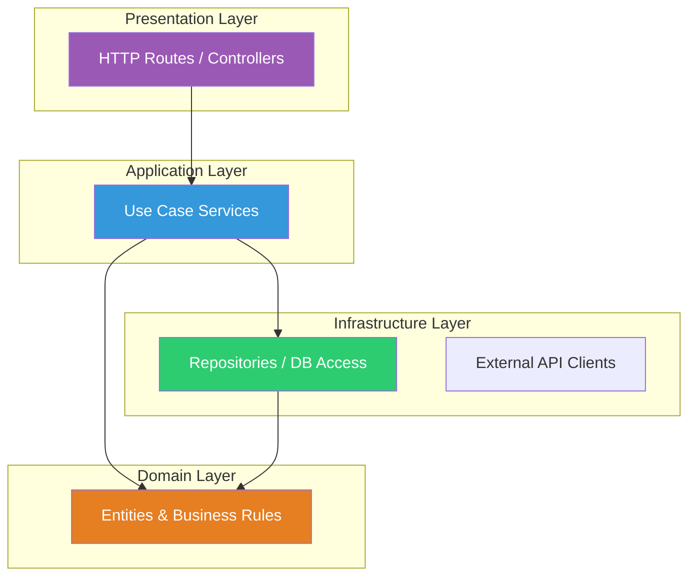

# Layered Architecture

## 1. The Problem

You're working on a REST API. The route handler does everything: parse the request, validate data, query the database, apply business rules, format the response, and handle errors. It's a 300-line function:

```typescript
app.post("/orders", async (req, res) => {
  // Parse request
  const { userId, productIds, couponCode } = req.body;
  
  // Validate
  if (!userId) return res.status(400).json({ error: "userId required" });
  if (!productIds?.length) return res.status(400).json({ error: "need products" });
  
  // Database queries
  const user = await db.query("SELECT * FROM users WHERE id = $1", [userId]);
  if (!user.rows[0]) return res.status(404).json({ error: "user not found" });
  
  // Business logic mixed with SQL
  let total = 0;
  for (const pid of productIds) {
    const product = await db.query("SELECT * FROM products WHERE id = $1", [pid]);
    if (product.rows[0].stock <= 0) return res.status(400).json({ error: "out of stock" });
    total += parseFloat(product.rows[0].price);
  }
  
  // More business logic
  if (couponCode) {
    const coupon = await db.query("SELECT * FROM coupons WHERE code = $1", [couponCode]);
    if (coupon.rows[0]?.valid) {
      total *= (1 - coupon.rows[0].discount / 100);
    }
  }
  
  // More database
  await db.query("INSERT INTO orders (user_id, total) VALUES ($1, $2)", [userId, total]);
  for (const pid of productIds) {
    await db.query("UPDATE products SET stock = stock - 1 WHERE id = $1", [pid]);
  }
  
  // Response formatting
  res.json({ success: true, total, message: `Order placed for ${user.rows[0].name}` });
});
```

Problems:
- Testing business logic requires spinning up HTTP server AND database.
- Changing the database (PostgreSQL → MongoDB) requires rewriting every route handler.
- Business rules are invisible — buried between SQL queries and HTTP response formatting.
- You can't reuse the order creation logic from a CLI tool, WebSocket handler, or scheduled job.

---

## 2. Naïve Solutions (and Why They Fail)

### Attempt 1: Extract "Helper" Functions

```typescript
app.post("/orders", async (req, res) => {
  const result = await createOrderHelper(req.body);
  res.json(result);
});

async function createOrderHelper(data: any) {
  // Still has SQL + business logic mixed together
  const user = await db.query("SELECT ...");
  // ...
}
```

**Why it breaks:**
- You've moved the mess to a different function. The same coupling exists.
- `createOrderHelper` still depends on both the database AND the request format.
- No clear separation of concerns — just indirection.

### Attempt 2: Everything in One "Service"

```typescript
class OrderService {
  async createOrder(data: any) {
    // Validate, query DB, apply business rules, format response
    // 500 lines of mixed concerns
  }
}
```

**Why it breaks:**
- The service class becomes a god object.
- Still can't test business logic without a database.
- Still can't swap the database without rewriting business logic.

---

## 3. The Insight

Separate code into **layers** based on what changes together and for what reason. The HTTP framework changes for different reasons than business rules. Business rules change for different reasons than database schema. Each layer depends only on the layer below it, never upward. Each layer has one job.

---

## 4. The Pattern

### Layered Architecture (N-Tier)

**Definition:** An architectural pattern that organizes code into **horizontal layers**, each with a distinct responsibility. Each layer can only depend on the layer directly below it. Higher layers delegate work to lower layers and never know about each other.

**Standard layers (top to bottom):**

| Layer | Responsibility |
|---|---|
| **Presentation** | HTTP handlers, request parsing, response formatting |
| **Application / Service** | Use case orchestration, transaction coordination |
| **Domain / Business** | Business rules, validation, entities |
| **Infrastructure / Data** | Database access, external APIs, file I/O |

**Core rule:** Dependencies flow **downward only**. The presentation layer calls the application layer. The application layer calls the domain layer. Never upward. Never skip layers.

---

## 5. Mental Model

Think of a **building** with floors. The penthouse (presentation) sees the outside world. The offices (application) coordinate work. The factory floor (domain) does the actual work. The basement (infrastructure) handles plumbing, wiring, storage.

Each floor only talks to the floor right below it. The penthouse doesn't run wires itself. The factory floor doesn't answer phone calls from customers. Information flows down (commands) and up (results).

What stays stable: the layer responsibilities and dependency direction.
What moves: where exactly you draw the line between layers.

---

## 6. Structure



```
src/
├── presentation/          ← Layer 1: HTTP
│   ├── order.routes.ts
│   └── order.dto.ts       
├── application/           ← Layer 2: Use cases
│   └── order.service.ts
├── domain/                ← Layer 3: Business rules
│   ├── order.entity.ts
│   └── pricing.rules.ts
└── infrastructure/        ← Layer 4: Database
    ├── order.repository.ts
    └── payment.gateway.ts
```

---

## 7. Code Example

### TypeScript

```typescript
// ========== domain/order.entity.ts (Layer 3: Business rules — NO dependencies) ==========

export interface OrderItem {
  productId: string;
  price: number;
  quantity: number;
}

export class Order {
  public readonly items: OrderItem[];
  public total: number;
  public status: "pending" | "confirmed" | "canceled";

  constructor(
    public readonly userId: string,
    items: OrderItem[]
  ) {
    this.items = items;
    this.total = this.calculateTotal();
    this.status = "pending";
  }

  private calculateTotal(): number {
    return this.items.reduce((sum, item) => sum + item.price * item.quantity, 0);
  }

  applyCoupon(discountPercent: number): void {
    if (discountPercent < 0 || discountPercent > 50) {
      throw new Error("Discount must be between 0% and 50%");
    }
    this.total *= 1 - discountPercent / 100;
  }

  confirm(): void {
    if (this.items.length === 0) {
      throw new Error("Cannot confirm an empty order");
    }
    this.status = "confirmed";
  }
}

// ========== infrastructure/order.repository.ts (Layer 4: Database access) ==========

import { Pool } from "pg";
import { Order, OrderItem } from "../domain/order.entity";

export class OrderRepository {
  constructor(private db: Pool) {}

  async save(order: Order): Promise<string> {
    const { rows } = await this.db.query(
      "INSERT INTO orders (user_id, total, status) VALUES ($1, $2, $3) RETURNING id",
      [order.userId, order.total, order.status]
    );
    return rows[0].id;
  }

  async getProductsWithStock(productIds: string[]): Promise<OrderItem[]> {
    const { rows } = await this.db.query(
      "SELECT id, price, stock FROM products WHERE id = ANY($1) AND stock > 0",
      [productIds]
    );
    return rows.map((r) => ({
      productId: r.id,
      price: parseFloat(r.price),
      quantity: 1,
    }));
  }

  async decrementStock(productIds: string[]): Promise<void> {
    await this.db.query(
      "UPDATE products SET stock = stock - 1 WHERE id = ANY($1)",
      [productIds]
    );
  }
}

// ========== application/order.service.ts (Layer 2: Use case orchestration) ==========

import { Order } from "../domain/order.entity";
import { OrderRepository } from "../infrastructure/order.repository";

export class OrderService {
  constructor(private orderRepo: OrderRepository) {}

  async createOrder(userId: string, productIds: string[], couponDiscount?: number) {
    // 1. Load data through infrastructure
    const items = await this.orderRepo.getProductsWithStock(productIds);
    if (items.length === 0) {
      throw new Error("No products available");
    }

    // 2. Apply business logic through domain
    const order = new Order(userId, items);
    if (couponDiscount) {
      order.applyCoupon(couponDiscount);
    }
    order.confirm();

    // 3. Persist through infrastructure
    await this.orderRepo.decrementStock(productIds);
    const orderId = await this.orderRepo.save(order);

    return { orderId, total: order.total, status: order.status };
  }
}

// ========== presentation/order.routes.ts (Layer 1: HTTP — the outermost layer) ==========

import express from "express";
import { OrderService } from "../application/order.service";

export function orderRoutes(orderService: OrderService) {
  const router = express.Router();

  router.post("/orders", async (req, res) => {
    try {
      const { userId, productIds, couponDiscount } = req.body;

      // Only job: parse request, call service, format response
      const result = await orderService.createOrder(userId, productIds, couponDiscount);

      res.status(201).json(result);
    } catch (err: any) {
      res.status(400).json({ error: err.message });
    }
  });

  return router;
}
```

### Go

```go
// ========== domain/order.go (Layer 3: Pure business logic) ==========
package domain

import (
	"errors"
	"math"
)

type OrderItem struct {
	ProductID string
	Price     float64
	Quantity  int
}

type Order struct {
	UserID string
	Items  []OrderItem
	Total  float64
	Status string
}

func NewOrder(userID string, items []OrderItem) *Order {
	o := &Order{UserID: userID, Items: items, Status: "pending"}
	o.Total = o.calculateTotal()
	return o
}

func (o *Order) calculateTotal() float64 {
	var total float64
	for _, item := range o.Items {
		total += item.Price * float64(item.Quantity)
	}
	return math.Round(total*100) / 100
}

func (o *Order) ApplyCoupon(discountPercent float64) error {
	if discountPercent < 0 || discountPercent > 50 {
		return errors.New("discount must be between 0% and 50%")
	}
	o.Total *= (1 - discountPercent/100)
	o.Total = math.Round(o.Total*100) / 100
	return nil
}

func (o *Order) Confirm() error {
	if len(o.Items) == 0 {
		return errors.New("cannot confirm an empty order")
	}
	o.Status = "confirmed"
	return nil
}

// ========== infrastructure/order_repo.go (Layer 4: Database) ==========
package infrastructure

import (
	"database/sql"
	"marketplace/domain"
)

type OrderRepository struct {
	db *sql.DB
}

func NewOrderRepository(db *sql.DB) *OrderRepository {
	return &OrderRepository{db: db}
}

func (r *OrderRepository) Save(order *domain.Order) (string, error) {
	var id string
	err := r.db.QueryRow(
		"INSERT INTO orders (user_id, total, status) VALUES ($1, $2, $3) RETURNING id",
		order.UserID, order.Total, order.Status,
	).Scan(&id)
	return id, err
}

func (r *OrderRepository) GetProductsWithStock(productIDs []string) ([]domain.OrderItem, error) {
	// simplified for brevity
	var items []domain.OrderItem
	for _, pid := range productIDs {
		var item domain.OrderItem
		err := r.db.QueryRow(
			"SELECT id, price FROM products WHERE id = $1 AND stock > 0", pid,
		).Scan(&item.ProductID, &item.Price)
		if err == nil {
			item.Quantity = 1
			items = append(items, item)
		}
	}
	return items, nil
}

// ========== application/order_service.go (Layer 2: Use case) ==========
package application

import (
	"errors"
	"marketplace/domain"
	"marketplace/infrastructure"
)

type OrderService struct {
	repo *infrastructure.OrderRepository
}

func NewOrderService(repo *infrastructure.OrderRepository) *OrderService {
	return &OrderService{repo: repo}
}

type CreateOrderResult struct {
	OrderID string  `json:"orderId"`
	Total   float64 `json:"total"`
	Status  string  `json:"status"`
}

func (s *OrderService) CreateOrder(userID string, productIDs []string, couponDiscount *float64) (*CreateOrderResult, error) {
	items, err := s.repo.GetProductsWithStock(productIDs)
	if err != nil {
		return nil, err
	}
	if len(items) == 0 {
		return nil, errors.New("no products available")
	}

	order := domain.NewOrder(userID, items)
	if couponDiscount != nil {
		if err := order.ApplyCoupon(*couponDiscount); err != nil {
			return nil, err
		}
	}
	if err := order.Confirm(); err != nil {
		return nil, err
	}

	orderID, err := s.repo.Save(order)
	if err != nil {
		return nil, err
	}

	return &CreateOrderResult{
		OrderID: orderID,
		Total:   order.Total,
		Status:  order.Status,
	}, nil
}
```

---

## 8. Gotchas & Beginner Mistakes

| Mistake | Why It Hurts |
|---|---|
| **Domain layer depends on infrastructure** | Business logic imports the database library. Now you can't test business rules without a DB. |
| **"Layers" but everything is public** | All classes/functions are exported. Any layer can call any other. Dependency direction is advisory, not enforced. |
| **Anemic domain model** | Domain entities are just data holders. All logic lives in the service layer. You've created layers but missed the purpose. |
| **God service** | `OrderService` has 40 methods handling every use case. Split into focused services: `CreateOrderService`, `CancelOrderService`. |
| **Skipping layers** | The route handler calls the repository directly, bypassing the service and domain layers. |
| **Over-layering** | Six layers for a CRUD app. Each layer just passes data to the next with zero logic. Layers should have distinct responsibilities. |

---

## 9. Related & Confusable Patterns

| Pattern | How It Differs |
|---|---|
| **Hexagonal Architecture** | Inverts the dependency direction. Infrastructure depends on domain (via interfaces). Layered: domain depends on nothing, but services still depend on infrastructure concretely. |
| **Clean Architecture** | Concentric circles with stricter rules. All dependencies point inward. Layered is a simpler, less strict version. |
| **MVC** | MVC is a specific layering: Model-View-Controller. Layered architecture is the general concept. |
| **Modular Monolith** | Vertical slices by business domain. Layered is horizontal. They compose: each module can be internally layered. |

**The evolution:** Layered → Hexagonal (when you need infrastructure swappability and testability) → Clean Architecture (when you need maximum isolation).

---

## 10. When This Pattern Is the WRONG Choice

- **Trivial scripts/tools** — A 200-line CLI tool doesn't need 4 layers. It needs 1 file.
- **Rapid prototyping** — When exploring product-market fit, layers slow you down. Write messy code, validate the idea, then structure.
- **Event-driven systems** — Layered architecture assumes request→process→respond. Event-driven systems have different flow. Use event handlers, not layers.
- **Performance-critical paths** — Layer abstraction adds indirection. In hot loops (game engines, HFT), direct access to data structures matters.

**Symptoms you chose it too early:**
- Every layer is a pass-through. `Controller` calls `Service` calls `Repository`, each with zero added logic.
- You have 4 files for a single CRUD endpoint. The total logic across all 4 files is 20 lines.

**How to back out:** Collapse layers. Merge service + domain if business rules are trivial. Merge presentation + service if the API is a thin wrapper.
