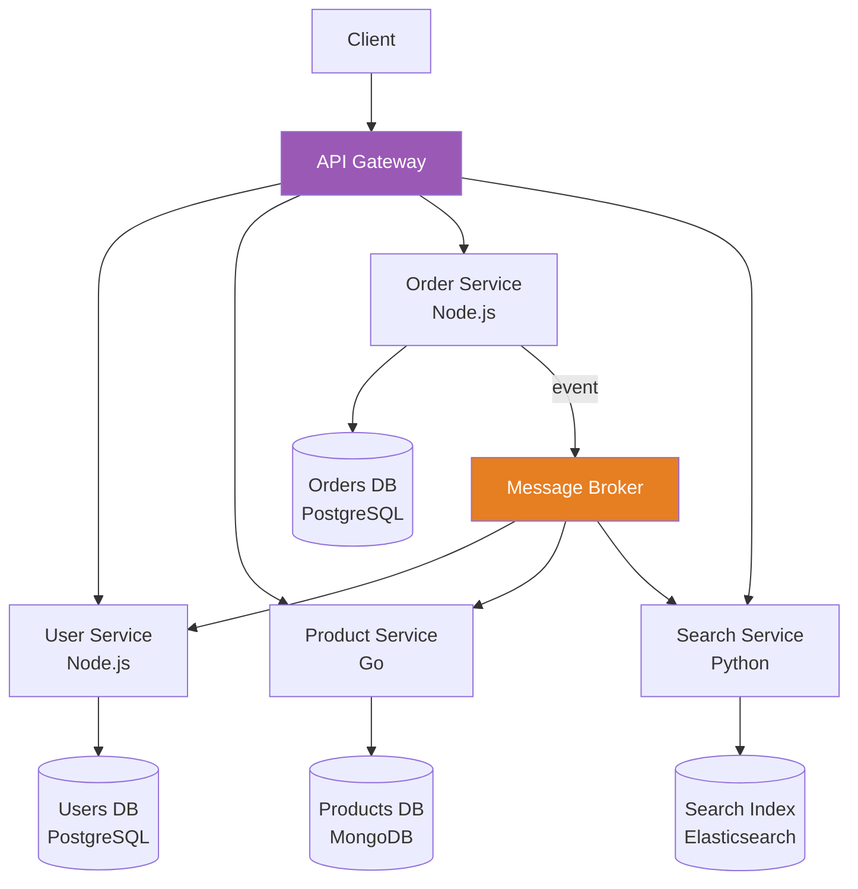
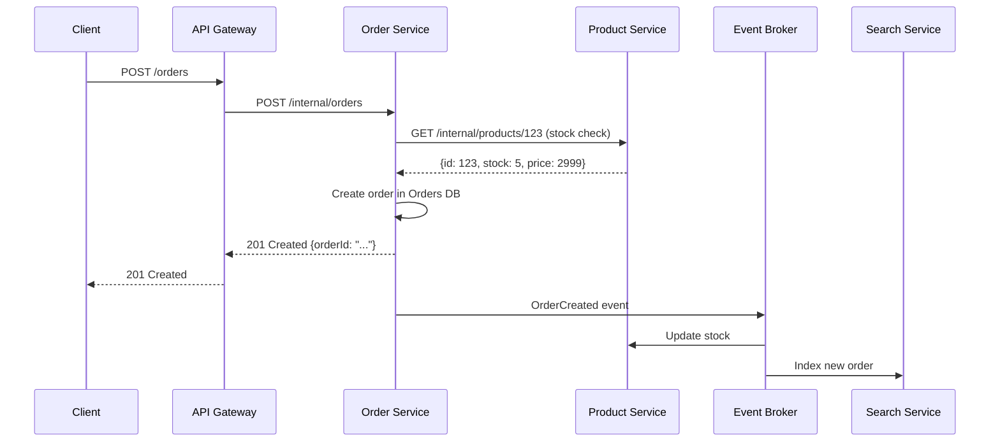

# Microservices

## 1. The Problem

Your modular monolith has served you well. 3 years in, you have 500K lines, 40 developers across 6 teams. The problems:

1. **Deploy coupling:** Team A finishes a payment feature. They can't deploy it until Team B finishes a user profile bug fix that's in the same release. Deploy cadence: once per week, coordinated across all teams.

2. **Scaling waste:** The search feature needs 32 GB RAM (Elasticsearch). The user profile page needs 512 MB. Scaling the monolith means giving 32 GB to every instance — including the ones that only serve profile pages.

3. **Technology lock-in:** The ML team wants to build a recommendation engine in Python. The real-time bidding team needs sub-millisecond latency in Go. The monolith is Node.js.

4. **Blast radius:** A memory leak in the notification module crashes the entire application. Payments go down because notifications had a bug.

5. **CI bottleneck:** Full test suite takes 45 minutes. Every PR runs the entire suite. Developers wait.

---

## 2. Naïve Solutions (and Why They Fail)

### Attempt 1: More Branches

"Each team works on their own branch and we merge before release."

**Why it breaks:**
- Integration hell. 6 branches diverge for 2 weeks, then you try to merge.
- Merge conflicts in shared code. Business logic conflicts that can't be auto-resolved.
- The merge itself takes days and introduces bugs.

### Attempt 2: Feature Flags Everything

"Ship everything behind flags. Turn on when ready."

**Why it breaks:**
- Solves SOME deployment coupling but adds complexity. Flag management becomes its own problem.
- Dead code accumulates. Which flags are stale? 200 flags in production.
- Doesn't solve scaling, technology, or blast radius problems.

### Attempt 3: "Micro" services (Too Small)

"Decompose into 100 services, one per entity."

**Why it breaks:**
- `UserService`, `UserPreferenceService`, `UserAvatarService`, `UserSessionService`...
- Network calls for operations that should be function calls. Getting a user profile requires 4 HTTP roundtrips.
- Distributed transaction nightmares. "Creating a user" now involves coordinating 4 services.
- Operational overhead: 100 deployments, 100 monitoring dashboards, 100 log streams.

---

## 3. The Insight

Split the system at **business capability boundaries** into independently deployable services. Each service owns its data, has its own deployment pipeline, and can be developed by one team. Services communicate through well-defined APIs (HTTP/gRPC) or events (message broker). The key is NOT to split small — it's to split at boundaries where teams need independence.

---

## 4. The Pattern

### Microservices Architecture

**Definition:** An architectural style where the application is composed of **small, independently deployable services**, each running in its own process, owning its own data, and communicating through lightweight mechanisms (HTTP APIs, messaging, gRPC).

**Core properties:**
- Each service is independently deployable
- Each service owns its data (no shared database)
- Services communicate through network (APIs or events)
- Each service can use different technologies
- Teams own services end-to-end (you build it, you run it)

**What it gives you:**
- Independent deployment per team
- Independent scaling per service
- Technology freedom per service
- Fault isolation (one service down ≠ everything down)

**What it costs you:**
- Network latency (function calls → HTTP calls)
- Distributed data management (no ACID transactions across services)
- Operational complexity (monitoring, tracing, deployment orchestration)
- Service discovery, load balancing, circuit breaking
- Testing complexity (integration tests require all services running)

---

## 5. Mental Model

Think of a **city with specialized businesses** vs. a single department store. The department store (monolith) has everything under one roof. The city has a bakery, a butcher, a florist — each independent. The bakery can renovate without closing the butcher. The florist can hire more staff without affecting the bakery's budget. But now you need roads (network), addresses (service discovery), and delivery services (API contracts).

**The trade-off:** Independence comes with coordination cost. Don't build a city until you need one.

---

## 6. Structure





---

## 7. Code Example

### TypeScript (Two Microservices)

```typescript
// ====================================================
// ORDER SERVICE (port 3001)
// ====================================================
import express from "express";
import { Pool } from "pg";

const app = express();
app.use(express.json());

const db = new Pool({ connectionString: "postgres://localhost/orders_db" });

// Cross-service call to Product Service
async function getProductFromCatalog(productId: string) {
  const response = await fetch(`http://product-service:3002/products/${productId}`);
  if (!response.ok) throw new Error(`Product ${productId} not found`);
  return response.json();
}

// Cross-service event publishing
async function publishEvent(eventType: string, data: unknown) {
  // In real life: publish to Kafka, RabbitMQ, SNS, etc.
  await fetch("http://event-broker:9092/publish", {
    method: "POST",
    headers: { "Content-Type": "application/json" },
    body: JSON.stringify({ type: eventType, data, timestamp: Date.now() }),
  });
}

app.post("/orders", async (req, res) => {
  const { userId, productId, quantity } = req.body;

  try {
    // 1. Call Product Service (network call, not function call)
    const product = await getProductFromCatalog(productId);
    if (product.stock < quantity) {
      return res.status(400).json({ error: "Insufficient stock" });
    }

    // 2. Write to OUR database (we own this data)
    const { rows } = await db.query(
      `INSERT INTO orders (user_id, product_id, quantity, total, status)
       VALUES ($1, $2, $3, $4, 'confirmed')
       RETURNING id, total, status`,
      [userId, productId, quantity, product.price * quantity]
    );

    // 3. Publish event (async, fire-and-forget)
    await publishEvent("OrderCreated", {
      orderId: rows[0].id,
      productId,
      quantity,
      userId,
    });

    res.status(201).json(rows[0]);
  } catch (err: any) {
    res.status(500).json({ error: err.message });
  }
});

app.listen(3001, () => console.log("Order Service on :3001"));


// ====================================================
// PRODUCT SERVICE (port 3002)
// ====================================================
import express from "express";
import { Pool } from "pg";

const app2 = express();
app2.use(express.json());

const productDb = new Pool({ connectionString: "postgres://localhost/products_db" });

app2.get("/products/:id", async (req, res) => {
  const { rows } = await productDb.query(
    "SELECT id, name, price, stock FROM products WHERE id = $1",
    [req.params.id]
  );
  if (rows.length === 0) return res.status(404).json({ error: "Not found" });
  res.json(rows[0]);
});

// Event handler: react to OrderCreated events
app2.post("/events", async (req, res) => {
  const event = req.body;
  if (event.type === "OrderCreated") {
    await productDb.query(
      "UPDATE products SET stock = stock - $1 WHERE id = $2",
      [event.data.quantity, event.data.productId]
    );
    console.log(`Stock updated for product ${event.data.productId}`);
  }
  res.status(200).send("ok");
});

app2.listen(3002, () => console.log("Product Service on :3002"));
```

### Go (Product Service)

```go
package main

import (
	"database/sql"
	"encoding/json"
	"fmt"
	"log"
	"net/http"

	_ "github.com/lib/pq"
)

type Product struct {
	ID    string  `json:"id"`
	Name  string  `json:"name"`
	Price int     `json:"price"` // cents
	Stock int     `json:"stock"`
}

type Event struct {
	Type string          `json:"type"`
	Data json.RawMessage `json:"data"`
}

type OrderCreatedData struct {
	OrderID   string `json:"orderId"`
	ProductID string `json:"productId"`
	Quantity  int    `json:"quantity"`
}

var db *sql.DB

func main() {
	var err error
	db, err = sql.Open("postgres", "postgres://localhost/products_db?sslmode=disable")
	if err != nil {
		log.Fatal(err)
	}

	http.HandleFunc("/products/", handleGetProduct)
	http.HandleFunc("/events", handleEvent)

	log.Println("Product Service on :3002")
	log.Fatal(http.ListenAndServe(":3002", nil))
}

func handleGetProduct(w http.ResponseWriter, r *http.Request) {
	id := r.URL.Path[len("/products/"):]
	var p Product
	err := db.QueryRow(
		"SELECT id, name, price, stock FROM products WHERE id = $1", id,
	).Scan(&p.ID, &p.Name, &p.Price, &p.Stock)
	if err != nil {
		http.Error(w, "not found", http.StatusNotFound)
		return
	}
	w.Header().Set("Content-Type", "application/json")
	json.NewEncoder(w).Encode(p)
}

func handleEvent(w http.ResponseWriter, r *http.Request) {
	var event Event
	if err := json.NewDecoder(r.Body).Decode(&event); err != nil {
		http.Error(w, err.Error(), http.StatusBadRequest)
		return
	}

	switch event.Type {
	case "OrderCreated":
		var data OrderCreatedData
		json.Unmarshal(event.Data, &data)
		_, err := db.Exec(
			"UPDATE products SET stock = stock - $1 WHERE id = $2",
			data.Quantity, data.ProductID,
		)
		if err != nil {
			log.Printf("Failed to update stock: %v", err)
		} else {
			log.Printf("Stock updated for %s (-%d)", data.ProductID, data.Quantity)
		}
	}

	w.WriteHeader(http.StatusOK)
	fmt.Fprint(w, "ok")
}
```

---

## 8. Gotchas & Beginner Mistakes

| Mistake | Why It Hurts |
|---|---|
| **Shared database** | Two services reading/writing the same tables. You've created a distributed monolith. Each service owns its data. |
| **Synchronous chains** | Service A calls B calls C calls D. Latency adds up. One slow service cascades. Use async events where possible. |
| **Too many services** | 50 services for a 10-person team. More services = more operational burden. Rule of thumb: 1 team per 1-3 services. |
| **No service mesh / circuit breaking** | When a downstream service is slow, all upstream services back up. Circuit breakers prevent cascading failure. |
| **Distributed monolith** | Services that must be deployed together, share data, and can't function independently. You got all the costs with none of the benefits. |
| **Ignoring data consistency** | Expecting ACID transactions across services. Use eventual consistency, sagas, or accept trade-offs. |
| **Starting with microservices** | "We'll build microservices from day one." → 6 months of infrastructure, 0 features. Start with a monolith. |

---

## 9. Related & Confusable Patterns

| Pattern | How It Differs |
|---|---|
| **Modular Monolith** | Same logical boundaries, single deployment. Microservices: same boundaries, independent deployments. |
| **SOA (Service-Oriented Architecture)** | Predecessor. SOA used SOAP, ESB, shared schemas. Microservices use REST/gRPC, independent schemas, light communication. |
| **Serverless** | Functions as a service. Even smaller than microservices. Each function is independently deployed. |
| **Distributed Monolith** | The anti-pattern. Looks like microservices but all services are coupled. Worst of both worlds. |

**The path:** Monolith → Modular Monolith → Microservices. Skip steps at your peril.

---

## 10. When This Pattern Is the WRONG Choice

- **Small team (< 10 developers)** — One team doesn't need independent deployment. The communication overhead exceeds the benefit.
- **Early-stage product** — You don't know the domain boundaries yet. Splitting prematurely creates the wrong boundaries. Build a monolith first.
- **Simple CRUD app** — Admin panel, content management, basic e-commerce. Microservices add latency and complexity for no gain.
- **Strong data consistency requirements** — Banking, real-time inventory. Distributed transactions are painful. Keep data in one database.
- **Limited operational maturity** — No CI/CD, no container orchestration, no monitoring. You need DevOps maturity BEFORE microservices.

**Symptoms you should migrate toward microservices:**
- Deploy frequency is limited by coordination (weekly releases when teams want daily).
- One team's bug takes down another team's service.
- Scaling the monolith wastes 90% of resources.
- Different modules need different technologies.

**How to back out:** Merge services back into a monolith. It's painful but possible. Extract the service's code into a module, migrate data back to the shared database, remove the network call.
