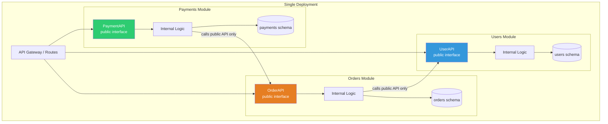

# Modular Monolith

## 1. The Problem

Your e-commerce monolith has grown. The codebase is 200K lines. Deployment is still one artifact, which is fine. But the internal code has become tangled:

```typescript
// OrderService directly queries the Users table
const user = await db.query("SELECT * FROM users WHERE id = $1", [userId]);

// ProductService writes to the orders table
await db.query("INSERT INTO order_items ...");

// NotificationService reads from payments table
const payment = await db.query("SELECT * FROM payments WHERE order_id = $1", [orderId]);
```

Every module reaches into every other module's database tables. Every file imports from every other directory. There are no boundaries — just one interconnected web of dependencies.

You want to extract `PaymentService` into a separate microservice someday. But you can't. Payments depends on 14 other modules, and 8 modules depend on payments. Extracting it would require rewriting half the codebase.

You're stuck in the worst of both worlds: monolith deployment complexity (one deploy) without monolith simplicity (everything's entangled). And you can't migrate to microservices because there are no seams.

---

## 2. Naïve Solutions (and Why They Fail)

### Attempt 1: Jump Straight to Microservices

"Let's just split everything into services."

**Why it breaks:**
- You don't know where the real boundaries are. You'll draw lines in the wrong places.
- The current code has hidden coupling. Splitting it creates distributed spaghetti.
- You need service discovery, API gateways, distributed tracing, saga orchestration — before shipping a single feature.
- "Distributed monolith" — microservices that must be deployed together because they share too much.

### Attempt 2: Organize by Technical Layer

```
src/controllers/
src/services/
src/repositories/
src/models/
```

**Why it breaks:**
- Business feature "checkout" is spread across 4 folders: `controllers/checkout.ts`, `services/checkout.ts`, `repositories/checkout.ts`, `models/checkout.ts`.
- No isolation. `services/order.ts` directly imports `services/user.ts` and `repositories/product.ts`.
- Adding a feature touches every folder. Team coordination hell.

### Attempt 3: "Just Use Folders"

```
src/users/
src/products/
src/orders/
```

**Why it breaks:**
- Folders are ignored at compile time. Nothing prevents `orders/service.ts` from importing `users/repository.ts`.
- Boundaries exist on paper but not in code. New developers violate them immediately.
- No enforcement = boundaries erode within months.

---

## 3. The Insight

Keep the single deployment of a monolith, but **enforce hard boundaries between modules**. Each module owns its data, exposes only a public API, and cannot directly access another module's internals. The modules communicate through **explicit interfaces** — function calls, but through defined contracts. This gives you monolith simplicity with microservice-like isolation. And when you eventually NEED to extract a module into a service, the seam already exists.

---

## 4. The Pattern

### Modular Monolith

**Definition:** A single-deployment application where code is organized into **strongly isolated modules** aligned with business domains. Each module has a public API, private internals, and owns its own data. Cross-module communication happens through defined interfaces, never through shared tables or direct imports of internals.

**Core properties:**
- Single deployable artifact
- Modules aligned with business domains (not technical layers)
- Each module has a clear public interface
- Each module owns its data (separate schema/tables, or at minimum separate access)
- Cross-module imports restricted to public APIs only
- Enforced through linting, build tooling, or language features

**What it gives you:**
- Monolith simplicity (one deploy, one process, function calls)
- Module isolation (change one module without breaking others)
- Extractability (each module has the seam for microservice extraction)
- Team ownership (each team owns their module)

---

## 5. Mental Model

Think of an **apartment building**. One building (single deployment), but each apartment (module) has its own walls, its own locks. Residents can't walk into each other's apartments. They interact through defined channels: the front door (public API), shared common areas (shared infrastructure like the database connection pool), or the building intercom (events).

The building manager can renovate one apartment without affecting others. And if an apartment grows big enough, they can move it to its own building (microservice extraction) — the walls and doors (interfaces) are already in place.

---

## 6. Structure



```
src/
├── modules/
│   ├── users/
│   │   ├── index.ts          ← PUBLIC API (the only export)
│   │   ├── user.service.ts   ← INTERNAL (not importable outside)
│   │   ├── user.repo.ts      ← INTERNAL
│   │   ├── user.types.ts     ← PUBLIC types (exported via index)
│   │   └── user.routes.ts    ← INTERNAL
│   ├── orders/
│   │   ├── index.ts          ← PUBLIC API
│   │   ├── order.service.ts
│   │   ├── order.repo.ts
│   │   └── order.types.ts
│   └── payments/
│       ├── index.ts          ← PUBLIC API
│       ├── payment.service.ts
│       └── payment.repo.ts
├── shared/                   ← Shared infrastructure (DB pool, logger)
├── app.ts                    ← Composition root
└── eslint-module-boundaries.js  ← Enforcement
```

---

## 7. Code Example

### TypeScript

```typescript
// ========== modules/users/user.types.ts ==========
export interface UserDTO {
  id: string;
  name: string;
  email: string;
}

// ========== modules/users/user.repo.ts (INTERNAL — not exported) ==========
import { Pool } from "pg";

export class UserRepository {
  constructor(private db: Pool) {}

  async findById(id: string) {
    const { rows } = await this.db.query(
      "SELECT id, name, email FROM users.accounts WHERE id = $1",
      [id]
    );
    return rows[0] || null;
  }

  async create(name: string, email: string) {
    const { rows } = await this.db.query(
      "INSERT INTO users.accounts (name, email) VALUES ($1, $2) RETURNING id, name, email",
      [name, email]
    );
    return rows[0];
  }
}

// ========== modules/users/user.service.ts (INTERNAL) ==========
import { UserRepository } from "./user.repo";
import { UserDTO } from "./user.types";

export class UserService {
  constructor(private repo: UserRepository) {}

  async getUser(id: string): Promise<UserDTO | null> {
    return this.repo.findById(id);
  }

  async registerUser(name: string, email: string): Promise<UserDTO> {
    return this.repo.create(name, email);
  }
}

// ========== modules/users/index.ts (PUBLIC API — the only export) ==========
export { UserDTO } from "./user.types";
export { UserService } from "./user.service";
// NOTE: UserRepository is NOT exported. It's internal to this module.

// ========== modules/orders/order.service.ts (INTERNAL) ==========
import { UserService, UserDTO } from "../users"; // ✅ Imports from public API only
// import { UserRepository } from "../users/user.repo"; // ❌ FORBIDDEN — internal!

export class OrderService {
  constructor(
    private userService: UserService, // Injected dependency on public interface
    private db: any
  ) {}

  async createOrder(userId: string, productIds: string[]): Promise<{ orderId: string }> {
    // Cross-module call through public API
    const user = await this.userService.getUser(userId);
    if (!user) throw new Error("User not found");

    // Internal logic — only orders module touches orders tables
    const { rows } = await this.db.query(
      "INSERT INTO orders.orders (user_id, status) VALUES ($1, 'pending') RETURNING id",
      [userId]
    );
    return { orderId: rows[0].id };
  }
}

// ========== app.ts (Composition Root) ==========
import { Pool } from "pg";
import { UserService } from "./modules/users";
import { UserRepository } from "./modules/users/user.repo"; // Only the composition root wires internals
import { OrderService } from "./modules/orders";

const db = new Pool({ connectionString: "postgres://localhost/marketplace" });

// Wire modules together
const userRepo = new UserRepository(db);
const userService = new UserService(userRepo);
const orderService = new OrderService(userService, db);
```

### Boundary Enforcement (ESLint)

```javascript
// .eslintrc.js — enforce module boundaries
module.exports = {
  rules: {
    "no-restricted-imports": [
      "error",
      {
        patterns: [
          {
            group: ["**/modules/users/*", "!**/modules/users/index"],
            message: "Import from modules/users (index.ts) only. Internal files are private.",
          },
          {
            group: ["**/modules/orders/*", "!**/modules/orders/index"],
            message: "Import from modules/orders (index.ts) only.",
          },
          {
            group: ["**/modules/payments/*", "!**/modules/payments/index"],
            message: "Import from modules/payments (index.ts) only.",
          },
        ],
      },
    ],
  },
};
```

### Go

```go
// In Go, package boundaries ARE module boundaries. This is natural.

// ========== modules/users/users.go (PUBLIC API) ==========
package users

import "database/sql"

// UserDTO is exported (uppercase) — part of the public API
type UserDTO struct {
	ID    string
	Name  string
	Email string
}

// Service is exported — other modules can use it
type Service struct {
	repo *repository // unexported field — internal
}

func NewService(db *sql.DB) *Service {
	return &Service{repo: &repository{db: db}}
}

func (s *Service) GetUser(id string) (*UserDTO, error) {
	return s.repo.findByID(id)
}

// ========== modules/users/repository.go (INTERNAL — unexported) ==========
package users

import "database/sql"

// repository is unexported — internal to the users package
type repository struct {
	db *sql.DB
}

// findByID is unexported — internal
func (r *repository) findByID(id string) (*UserDTO, error) {
	var u UserDTO
	err := r.db.QueryRow(
		"SELECT id, name, email FROM users.accounts WHERE id = $1", id,
	).Scan(&u.ID, &u.Name, &u.Email)
	if err != nil {
		return nil, err
	}
	return &u, nil
}

// ========== modules/orders/orders.go (PUBLIC API) ==========
package orders

import (
	"marketplace/modules/users" // ✅ Depends on users' PUBLIC API
)

type Service struct {
	userService *users.Service // Depends on public interface
	// Cannot access users.repository — it's unexported
}

func NewService(userSvc *users.Service) *Service {
	return &Service{userService: userSvc}
}

func (s *Service) CreateOrder(userID string) (string, error) {
	user, err := s.userService.GetUser(userID) // Cross-module call
	if err != nil {
		return "", err
	}
	_ = user
	// ... create order in orders schema
	return "order-123", nil
}
```

---

## 8. Gotchas & Beginner Mistakes

| Mistake | Why It Hurts |
|---|---|
| **No enforcement** | Module boundaries exist in documentation but not in code. Developers bypass them. Use lint rules, build constraints, or language features. |
| **Shared database access** | Module A directly queries Module B's tables. This creates hidden coupling. Each module should own its tables. |
| **Circular dependencies** | Module A depends on Module B, and B depends on A. Break cycles with events or extract a shared interface. |
| **Too many modules** | 30 modules for 50K lines of code. Each module has 2 files. Start with 3-5 modules aligned with core domains. |
| **Module = technical layer** | A "database module" and a "controller module" is layered architecture, not modular monolith. Modules are BUSINESS domains. |
| **Skipping the composition root** | Without a single place that wires modules together, dependency injection becomes ad-hoc and coupling creeps in. |

---

## 9. Related & Confusable Patterns

| Pattern | How It Differs |
|---|---|
| **Monolith** | A monolith without internal boundaries. Modular monolith IS a monolith, just well-structured. |
| **Microservices** | Independently deployed services. Modular monolith has the same logical isolation but single deployment. |
| **Hexagonal Architecture** | Internal structure of ONE module. Modular monolith organizes MULTIPLE modules. They compose well. |
| **Domain-Driven Design (DDD)** | Modular monolith modules typically align with DDD bounded contexts. DDD provides the method; modular monolith provides the architecture. |

**The migration path:**
1. Unstructured Monolith → **Modular Monolith** (establish boundaries)
2. Modular Monolith → **Microservices** (extract modules that need independent deployment)
3. You can stop at step 1. Most teams should.

---

## 10. When This Pattern Is the WRONG Choice

- **Tiny application** — 5K lines of code. Module boundaries add overhead without benefit. A simple layered monolith is fine.
- **Already distributed** — If you already have microservices working well, retrofitting them into a modular monolith is moving backwards.
- **Need independent deployment NOW** — If two teams need to deploy independently today, modular monolith won't solve their problem. Extract a microservice.
- **Need technology diversity** — If one module must be Python (ML) and another Go (real-time), you can't share a process.
- **100+ person organization** — At extreme scale, even modular monolith breaks down. Teams step on each other even with module boundaries.

**Symptoms it's working well:**
- Teams can work on separate modules without merge conflicts.
- Changing one module doesn't break tests in other modules.
- You can reason about "what does the orders module do?" without reading 50 files in other directories.

**How to evolve:** When a module needs independent scaling or deployment, extract it into a microservice. The module boundary IS the microservice boundary. This is the whole point.
