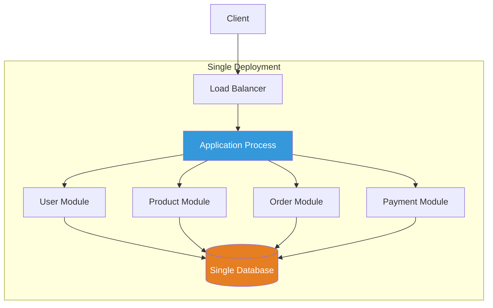
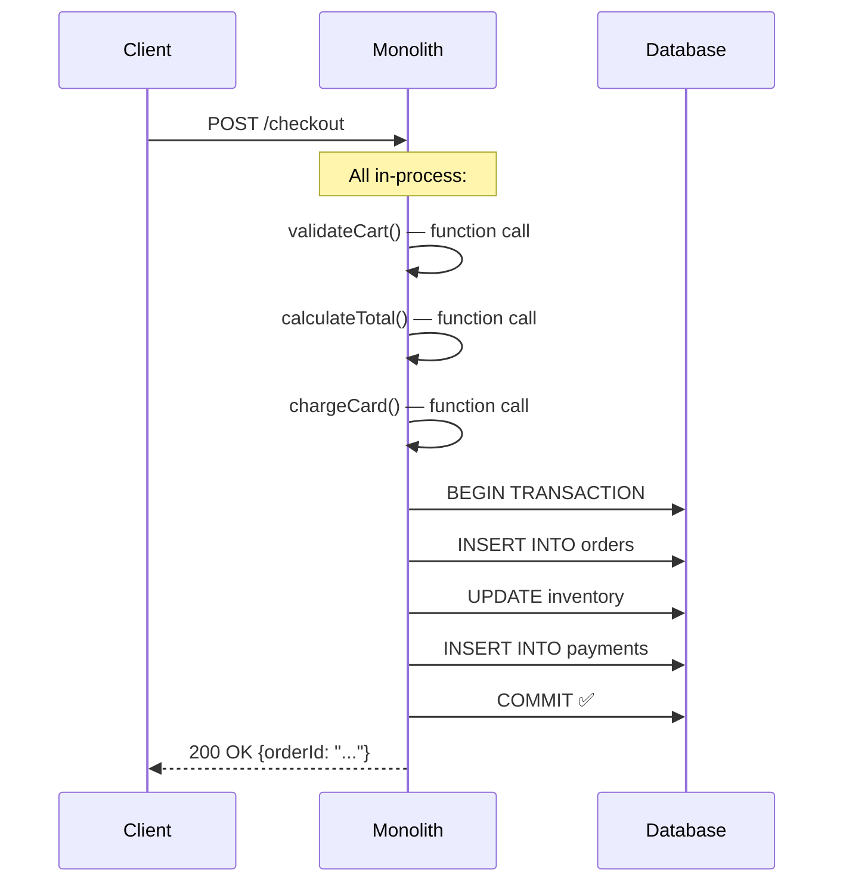

# Monolith

## 1. The Problem

You're building a new product: an online marketplace for handmade goods. You need user registration, product listings, search, shopping cart, checkout, payment processing, order tracking, messaging between buyers and sellers, reviews, and an admin dashboard.

You've read blog posts from Netflix, Uber, and Airbnb about their microservice architectures. You hear "monolith" used as an insult. So you plan 12 microservices from day one:

```
user-service
product-service
search-service
cart-service
checkout-service
payment-service
order-service
messaging-service
review-service
admin-service
notification-service
image-service
```

You're a team of 3 developers building an MVP. Six months later, you've:
- Set up 12 repositories, 12 CI/CD pipelines, 12 Docker images
- Spent 60% of your time on service-to-service communication, service discovery, and distributed debugging
- Built distributed tracing because you can't figure out why checkout takes 8 seconds (it calls 5 other services synchronously)
- Created an API gateway to route requests
- Dealt with data consistency issues because `user-service` and `order-service` disagree on customer data
- Shipped exactly 0 features that users see

Your architecture is technically impressive and functionally useless.

---

## 2. Naïve Solutions (and Why They Fail)

### Attempt 1: Start with Microservices (Premature Distribution)

As described above. The overhead of distribution dominates the actual product work. You're solving infrastructure problems instead of customer problems.

**Why it breaks:**
- 3 people cannot efficiently maintain 12 services.
- Network calls replace function calls. Latency, retries, timeouts everywhere.
- Debugging crosses service boundaries. Stack traces end at HTTP calls.
- Data consistency requires sagas, eventual consistency, or distributed transactions.
- Deployment requires orchestration (Kubernetes) which requires its own expertise.

### Attempt 2: Big Ball of Mud (No Structure)

```
src/
  app.ts
  routes.ts        // 3,000 lines
  database.ts      // 500 lines
  helpers.ts       // 2,000 lines of random functions
  types.ts         // 800 lines
```

**Why it breaks:**
- Every file depends on every other file. Change one function, break unrelated features.
- No developer can hold the whole system in their head.
- Tests require the entire application context to run.
- Two developers can't work on different areas without merge conflicts.

### Attempt 3: Framework-Driven Structure

```
src/
  controllers/     // 40 files
  services/        // 40 files
  models/          // 40 files
  middleware/      // 15 files
  utils/           // 30 files
```

**Why it breaks (eventually):**
- This LOOKS organized but the boundaries are technical, not business. `UserController` depends on `ProductService` which depends on `OrderModel`.
- No isolation: changing the product listing feature requires touching controllers/, services/, AND models/.
- The "services" folder becomes a dumping ground. `UserService` grows to 2,000 lines.
- Better than a ball of mud, but doesn't scale with team size or feature complexity.

---

## 3. The Insight

Start with a single deployment. Put everything in one codebase, one process, one database. Make function calls, not network calls. Deploy one thing. Debug one thing. BUT — organize the code internally by business domain, not by technical layer. This isn't laziness; it's strategy. You get speed, simplicity, and the ability to understand the whole system. Refactor to a distributed architecture LATER, when you have a concrete reason (scaling, team independence, different deployment cadences).

---

## 4. The Pattern

### Monolith

**Definition:** A **monolith** is an application where all functionality is deployed as a single unit — one process, one build, one deployment. All modules share the same runtime, memory space, and database.

**Core properties:**
- Single deployable artifact (JAR, binary, Docker image)
- All modules share the same process and memory
- Communication between modules is function calls (in-process)
- Single database (usually)

**What it gives you:**
- Simplest possible deployment
- Zero network overhead between modules
- ACID transactions across all data
- One codebase to search, debug, and test
- One CI/CD pipeline

**What it does NOT give you:**
- Independent scaling (you scale everything or nothing)
- Independent deployment (changing one module redeploys everything)
- Technology diversity (one language, one framework)
- Failure isolation (a bug in reviews can crash the payment flow)

---

## 5. Mental Model

Think of a **standalone restaurant**. One kitchen, one dining room, one menu, one team. The chef can talk to the sous chef by speaking (function call). No phone calls needed (network call). When the restaurant gets busy, you add staff — but they all work in the same kitchen.

The restaurant only becomes a problem when:
- The kitchen is physically too small (scaling limits)
- You want to serve sushi AND pizza but the pizza oven interferes with the sushi prep (conflicting requirements)
- You have 200 cooks and they step on each other (team size)

Until then, one restaurant is simpler, faster, and cheaper than running 12 food trucks.

---

## 6. Structure





---

## 7. Code Example

### TypeScript (Express Monolith)

```typescript
import express from "express";
import { Pool } from "pg";

const app = express();
app.use(express.json());

const db = new Pool({ connectionString: "postgres://localhost/marketplace" });

// --- User Module ---
async function createUser(name: string, email: string) {
  const { rows } = await db.query(
    "INSERT INTO users (name, email) VALUES ($1, $2) RETURNING id",
    [name, email]
  );
  return rows[0];
}

async function getUser(userId: string) {
  const { rows } = await db.query("SELECT * FROM users WHERE id = $1", [userId]);
  return rows[0];
}

// --- Product Module ---
async function listProducts(category?: string) {
  const query = category
    ? { text: "SELECT * FROM products WHERE category = $1", values: [category] }
    : { text: "SELECT * FROM products" };
  const { rows } = await db.query(query);
  return rows;
}

// --- Order Module ---
async function createOrder(userId: string, productIds: string[]) {
  const client = await db.connect();
  try {
    await client.query("BEGIN");

    // All in-process. No HTTP calls. No retries. No timeouts.
    const user = await getUser(userId);
    if (!user) throw new Error("User not found");

    const products = await Promise.all(
      productIds.map((id) =>
        client.query("SELECT * FROM products WHERE id = $1 FOR UPDATE", [id])
      )
    );

    const total = products.reduce(
      (sum, p) => sum + parseFloat(p.rows[0]?.price ?? 0),
      0
    );

    // Single transaction across all tables
    const order = await client.query(
      "INSERT INTO orders (user_id, total, status) VALUES ($1, $2, 'confirmed') RETURNING id",
      [userId, total]
    );

    for (const productId of productIds) {
      await client.query(
        "UPDATE products SET stock = stock - 1 WHERE id = $1 AND stock > 0",
        [productId]
      );
    }

    await client.query("COMMIT");
    return { orderId: order.rows[0].id, total };
  } catch (err) {
    await client.query("ROLLBACK");
    throw err;
  } finally {
    client.release();
  }
}

// --- Routes (single process) ---
app.post("/users", async (req, res) => {
  const user = await createUser(req.body.name, req.body.email);
  res.json(user);
});

app.get("/products", async (req, res) => {
  const products = await listProducts(req.query.category as string);
  res.json(products);
});

app.post("/orders", async (req, res) => {
  try {
    const order = await createOrder(req.body.userId, req.body.productIds);
    res.json(order);
  } catch (err: any) {
    res.status(400).json({ error: err.message });
  }
});

app.listen(3000, () => console.log("Monolith running on :3000"));
```

### Go

```go
package main

import (
	"database/sql"
	"encoding/json"
	"fmt"
	"log"
	"net/http"

	_ "github.com/lib/pq"
)

type User struct {
	ID    string `json:"id"`
	Name  string `json:"name"`
	Email string `json:"email"`
}

type Order struct {
	ID     string  `json:"id"`
	UserID string  `json:"user_id"`
	Total  float64 `json:"total"`
}

var db *sql.DB

func main() {
	var err error
	db, err = sql.Open("postgres", "postgres://localhost/marketplace?sslmode=disable")
	if err != nil {
		log.Fatal(err)
	}
	defer db.Close()

	http.HandleFunc("/users", handleCreateUser)
	http.HandleFunc("/orders", handleCreateOrder)

	log.Println("Monolith running on :3000")
	log.Fatal(http.ListenAndServe(":3000", nil))
}

// --- User Module (in-process) ---
func getUser(userID string) (*User, error) {
	var u User
	err := db.QueryRow("SELECT id, name, email FROM users WHERE id = $1", userID).
		Scan(&u.ID, &u.Name, &u.Email)
	if err != nil {
		return nil, fmt.Errorf("user not found: %w", err)
	}
	return &u, nil
}

// --- Order Module (in-process) ---
func createOrder(userID string, productIDs []string) (*Order, error) {
	tx, err := db.Begin()
	if err != nil {
		return nil, err
	}
	defer tx.Rollback()

	// In-process function call — not an HTTP request
	user, err := getUser(userID)
	if err != nil {
		return nil, err
	}
	_ = user

	var total float64
	for _, pid := range productIDs {
		var price float64
		err := tx.QueryRow(
			"SELECT price FROM products WHERE id = $1 FOR UPDATE", pid,
		).Scan(&price)
		if err != nil {
			return nil, fmt.Errorf("product %s not found: %w", pid, err)
		}
		total += price

		_, err = tx.Exec(
			"UPDATE products SET stock = stock - 1 WHERE id = $1 AND stock > 0", pid,
		)
		if err != nil {
			return nil, fmt.Errorf("update stock: %w", err)
		}
	}

	var orderID string
	err = tx.QueryRow(
		"INSERT INTO orders (user_id, total, status) VALUES ($1, $2, 'confirmed') RETURNING id",
		userID, total,
	).Scan(&orderID)
	if err != nil {
		return nil, err
	}

	if err := tx.Commit(); err != nil {
		return nil, err
	}

	return &Order{ID: orderID, UserID: userID, Total: total}, nil
}

func handleCreateUser(w http.ResponseWriter, r *http.Request) {
	// handler implementation
	w.WriteHeader(http.StatusOK)
}

func handleCreateOrder(w http.ResponseWriter, r *http.Request) {
	var req struct {
		UserID     string   `json:"userId"`
		ProductIDs []string `json:"productIds"`
	}
	if err := json.NewDecoder(r.Body).Decode(&req); err != nil {
		http.Error(w, err.Error(), http.StatusBadRequest)
		return
	}

	order, err := createOrder(req.UserID, req.ProductIDs)
	if err != nil {
		http.Error(w, err.Error(), http.StatusBadRequest)
		return
	}

	w.Header().Set("Content-Type", "application/json")
	json.NewEncoder(w).Encode(order)
}
```

---

## 8. Gotchas & Beginner Mistakes

| Mistake | Why It Hurts |
|---|---|
| **"Monolith = bad"** | This is cargo-culting from FAANG blog posts. Most successful products started as monoliths. |
| **No internal boundaries** | A monolith without module boundaries becomes a big ball of mud. Organize by business domain. |
| **Deploying too big** | A monolith grows to 500K lines. Deploys take 45 minutes. CI runs for 2 hours. Break up the build, not the service. |
| **Shared mutable state** | Multiple modules modifying the same database table with no ownership. Each table should belong to one module. |
| **Starting with microservices "because we'll need to scale"** | You won't know where to split until you've built the system. Premature distribution is the #1 architectural mistake. |
| **Giant God classes** | `ApplicationService` with 200 methods. Monolith doesn't mean "one class." |

---

## 9. Related & Confusable Patterns

| Pattern | How It Differs |
|---|---|
| **Modular Monolith** | A monolith with strict module boundaries. The evolution of a well-structured monolith. |
| **Microservices** | Each module becomes an independently deployable service. The evolution when monolith boundaries fail. |
| **Big Ball of Mud** | A monolith WITHOUT structure. A monolith should still have clear modules. |
| **Layered Architecture** | A structural pattern WITHIN a monolith. Layers organize code horizontally; monolith is about deployment. |

**The progression:** Big Ball of Mud → Monolith (structured) → Modular Monolith → Microservices.
**Each step should be motivated by a specific pain.** Don't jump to microservices from an unstructured monolith.

---

## 10. When This Pattern Is the WRONG Choice

- **20+ developers on the same codebase** — Merge conflicts, slow CI, deployment coordination. Teams need independent deployability.
- **Radically different scaling needs** — If your search index needs 100x the resources of your user profile page, scaling the whole monolith wastes resources. Split search out.
- **Different technology requirements** — ML model serving (Python) + real-time bidding (Go) + admin dashboard (Node.js). You can't do this in one process.
- **Regulatory isolation** — PCI compliance for payment data requires isolated infrastructure. You can't mix it with the blog service.
- **Multiple teams with different release cadences** — Team A deploys daily, Team B deploys weekly. One deployable means everyone deploys at the same pace.

**Symptoms the monolith is working fine:**
- Deploy takes < 10 minutes. Keep going.
- Team is < 10 people. Keep going.
- You can debug any issue with a single stack trace. Keep going.

**How to evolve:** Start extracting modules that have clear boundaries, different scaling needs, or team ownership conflicts. See: Modular Monolith → Microservices.
