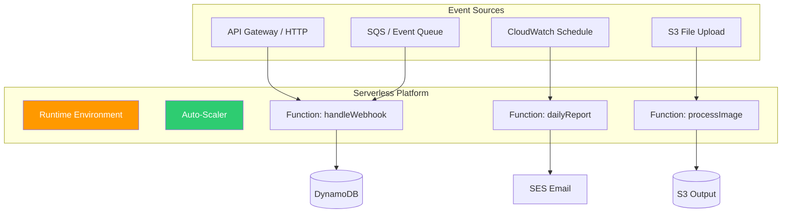
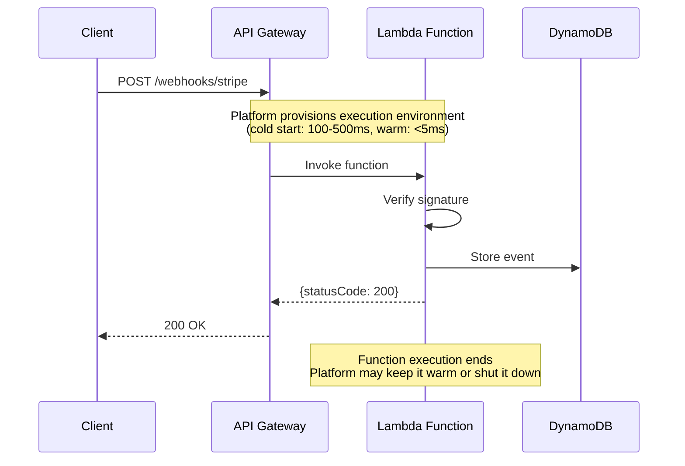

# Serverless

## 1. The Problem

You built a webhook handler for Stripe payments. It receives 50 requests/hour most of the time. During Black Friday, it receives 10,000 requests/hour for 6 hours. The rest of the year, it's nearly idle.

You deploy it on a $50/month VM that runs 24/7. That's $600/year for a service that does meaningful work for ~100 hours total. The VM sits idle 99% of the time, burning money. You also maintain the OS, keep Node.js updated, configure SSL, manage health checks, set up auto-scaling groups.

```
Monthly cost breakdown:
- VM: $50/month
- Load balancer: $18/month
- Monitoring: $5/month
- SSL cert management: ~time
- OS patching: ~time
- Auto-scaling configuration: ~time
Total: ~$73/month + engineering time

Actual compute usage: ~$2/month worth of CPU seconds
```

You're paying for a server to exist, not for work to be done.

---

## 2. Naïve Solutions (and Why They Fail)

### Attempt 1: Smaller VM

"Use a t2.micro for $8/month."

**Why it breaks:**
- Black Friday hits. 10,000 requests/hour. The t2.micro CPU credits exhaust. Requests queue up. Stripe retries. More queuing. Cascade failure.
- You still manage the server, OS, SSL, monitoring.

### Attempt 2: Auto-scaling Group

"Scale from 1 to 10 instances based on CPU."

**Why it breaks (for THIS use case):**
- Auto-scaling takes 3-5 minutes to provision new instances. Spikes hit faster.
- Minimum 1 instance running 24/7 = paying for idle time.
- Complex configuration: scaling policies, health checks, AMI management, deployment strategy.
- For a simple webhook handler, this is massive over-engineering.

### Attempt 3: Container on Kubernetes

**Why it breaks (for THIS use case):**
- Kubernetes cluster minimum: 3 nodes ($150+/month for managed K8s).
- You need: Deployment, Service, Ingress, HPA, ConfigMap, Secret, monitoring.
- For 50 requests/hour, you've built a city for a hot dog stand.

---

## 3. The Insight

Don't rent a server. **Rent compute time.** Upload your function code. The platform runs it when a request arrives, scales it to thousands of concurrent executions automatically, and charges you per execution (millisecond-level billing). No server to manage. No idle cost. Zero to infinity scaling.

---

## 4. The Pattern

### Serverless (Function as a Service / FaaS)

**Definition:** A cloud execution model where the cloud provider **manages the server infrastructure** entirely. You deploy individual functions that are triggered by events (HTTP requests, queue messages, schedules). The platform handles provisioning, scaling, and availability. You pay only for actual execution time.

**Core properties:**
- No server management (no OS, no patching, no capacity planning)
- Event-triggered execution (HTTP, queue, schedule, file upload)
- Automatic scaling (0 to thousands of concurrent executions)
- Pay-per-use billing (per request + per millisecond of compute)
- Stateless (each invocation is independent)

**Providers & naming:**
| Provider | Service |
|---|---|
| AWS | Lambda |
| Google Cloud | Cloud Functions |
| Azure | Azure Functions |
| Cloudflare | Workers |
| Vercel | Edge Functions |

---

## 5. Mental Model

Think of **electricity**. You don't own a power plant. You plug in an appliance, it works, you pay for the kilowatt-hours you used. You don't pay when nothing is plugged in. The power company handles generation, transmission, scaling.

Serverless is the same for compute. Your "appliance" (function) plugs into the platform. It runs when triggered. You pay for the milliseconds of power consumed. The platform handles everything else.

What stays stable: the function signature and trigger type.
What moves: scale, concurrency, infrastructure.

---

## 6. Structure





---

## 7. Code Example

### TypeScript (AWS Lambda)

```typescript
// handler.ts — deployed to AWS Lambda
import { APIGatewayProxyEvent, APIGatewayProxyResult } from "aws-lambda";
import crypto from "crypto";

const WEBHOOK_SECRET = process.env.STRIPE_WEBHOOK_SECRET!;

// This function is invoked per-request. No server setup.
export async function handleStripeWebhook(
  event: APIGatewayProxyEvent
): Promise<APIGatewayProxyResult> {
  // 1. Verify signature
  const signature = event.headers["stripe-signature"] || "";
  const body = event.body || "";

  if (!verifySignature(body, signature)) {
    return { statusCode: 403, body: JSON.stringify({ error: "Invalid signature" }) };
  }

  // 2. Parse event
  const stripeEvent = JSON.parse(body);

  // 3. Process
  switch (stripeEvent.type) {
    case "checkout.session.completed":
      await activateSubscription(stripeEvent.data.object.customer);
      break;
    case "invoice.payment_failed":
      await suspendSubscription(stripeEvent.data.object.customer);
      break;
    default:
      console.log(`Unhandled: ${stripeEvent.type}`);
  }

  return { statusCode: 200, body: JSON.stringify({ received: true }) };
}

// Scheduled function — runs daily at 9 AM UTC
export async function dailyReport(): Promise<void> {
  const yesterday = new Date(Date.now() - 86400000).toISOString().split("T")[0];
  console.log(`Generating report for ${yesterday}`);
  // Query DynamoDB, generate stats, send email
}

// Queue-triggered function — processes SQS messages
export async function processImageUpload(event: { Records: Array<{ body: string }> }) {
  for (const record of event.Records) {
    const { imageId, userId } = JSON.parse(record.body);
    console.log(`Resizing image ${imageId} for user ${userId}`);
    // Download from S3, resize, upload thumbnail
  }
}

function verifySignature(body: string, signature: string): boolean {
  const hmac = crypto.createHmac("sha256", WEBHOOK_SECRET);
  hmac.update(body);
  const expected = hmac.digest("hex");
  return crypto.timingSafeEqual(Buffer.from(expected), Buffer.from(signature));
}

async function activateSubscription(customerId: string) {
  console.log(`Activating subscription for ${customerId}`);
}

async function suspendSubscription(customerId: string) {
  console.log(`Suspending subscription for ${customerId}`);
}
```

### Go (AWS Lambda)

```go
package main

import (
	"context"
	"crypto/hmac"
	"crypto/sha256"
	"encoding/hex"
	"encoding/json"
	"fmt"
	"os"

	"github.com/aws/aws-lambda-go/events"
	"github.com/aws/aws-lambda-go/lambda"
)

type StripeEvent struct {
	Type string          `json:"type"`
	Data json.RawMessage `json:"data"`
}

func handleWebhook(ctx context.Context, request events.APIGatewayProxyRequest) (events.APIGatewayProxyResponse, error) {
	// Verify signature
	signature := request.Headers["stripe-signature"]
	if !verifySignature(request.Body, signature) {
		return events.APIGatewayProxyResponse{
			StatusCode: 403,
			Body:       `{"error": "invalid signature"}`,
		}, nil
	}

	// Parse event
	var event StripeEvent
	if err := json.Unmarshal([]byte(request.Body), &event); err != nil {
		return events.APIGatewayProxyResponse{StatusCode: 400, Body: err.Error()}, nil
	}

	// Process
	switch event.Type {
	case "checkout.session.completed":
		fmt.Println("Activating subscription")
	case "invoice.payment_failed":
		fmt.Println("Suspending subscription")
	default:
		fmt.Printf("Unhandled event: %s\n", event.Type)
	}

	return events.APIGatewayProxyResponse{
		StatusCode: 200,
		Body:       `{"received": true}`,
	}, nil
}

func verifySignature(body, signature string) bool {
	secret := os.Getenv("STRIPE_WEBHOOK_SECRET")
	mac := hmac.New(sha256.New, []byte(secret))
	mac.Write([]byte(body))
	expected := hex.EncodeToString(mac.Sum(nil))
	return hmac.Equal([]byte(expected), []byte(signature))
}

func main() {
	lambda.Start(handleWebhook)
}
```

---

## 8. Gotchas & Beginner Mistakes

| Mistake | Why It Hurts |
|---|---|
| **Cold start latency** | First invocation after idle: 100ms-3s (language-dependent). Java/C# worst. Node.js/Python/Go best. Use provisioned concurrency for latency-sensitive functions. |
| **Stateful assumptions** | Storing data in global variables between invocations. Works sometimes (warm container reuse), fails unpredictably. Use external storage. |
| **Long-running tasks** | Lambda max: 15 minutes. Functions for long processes (video encoding, ML training) hit the timeout. Use Step Functions or containers. |
| **Tight vendor coupling** | Using AWS-specific SDKs deep in business logic. Hard to move to another provider or test locally. Keep business logic portable. |
| **No local testing** | "It works on Lambda" debugging. Use SAM, Serverless Framework, or LocalStack for local testing. |
| **Unbounded scaling** | Lambda scales to 1,000 concurrent executions by default. 1,000 concurrent functions hammering your database = connection exhaustion. Set concurrency limits. |
| **Death by a thousand functions** | 200 Lambda functions, each tiny. Impossible to trace, debug, or manage. Group related logic. |

---

## 9. Related & Confusable Patterns

| Pattern | How It Differs |
|---|---|
| **Microservices** | Long-running services you manage. Serverless: ephemeral functions the platform manages. |
| **Containers** | You package the runtime. Serverless: the platform provides the runtime. |
| **PaaS (Heroku, Railway)** | You deploy an app. PaaS runs it. But you still pay for idle time. Serverless: pay per invocation. |
| **Edge Computing** | Serverless at the CDN edge (Cloudflare Workers). Lower latency, more restrictions. |
| **Backend as a Service (BaaS)** | Firebase, Supabase. Managed backend without writing server code. Serverless functions complement BaaS. |

---

## 10. When This Pattern Is the WRONG Choice

- **Long-running processes** — Video transcoding, ML training, WebSocket connections. Lambda times out at 15 min. Use containers.
- **Predictable high traffic** — 10,000 requests/second consistently, 24/7. A reserved instance is 80% cheaper than Lambda at this scale.
- **Low-latency requirements** — Sub-10ms response time. Cold starts kill this. Use a persistent process.
- **Complex stateful workflows** — Multi-step transactions that need in-memory state. Serverless is stateless.
- **Local development importance** — If your team can't tolerate "deploy to test," serverless slows development (though tools like SAM help).

**Symptoms it's working well:**
- Spiky, unpredictable traffic.
- Event-driven workloads (webhooks, queue processing, schedules).
- Small team that can't afford DevOps.
- Low/no traffic during off-hours (no idle cost).

**How to back out:** Package the Lambda function as an Express/Gin HTTP handler. Deploy it on a VM or container. The function logic stays the same; only the entry point changes.
