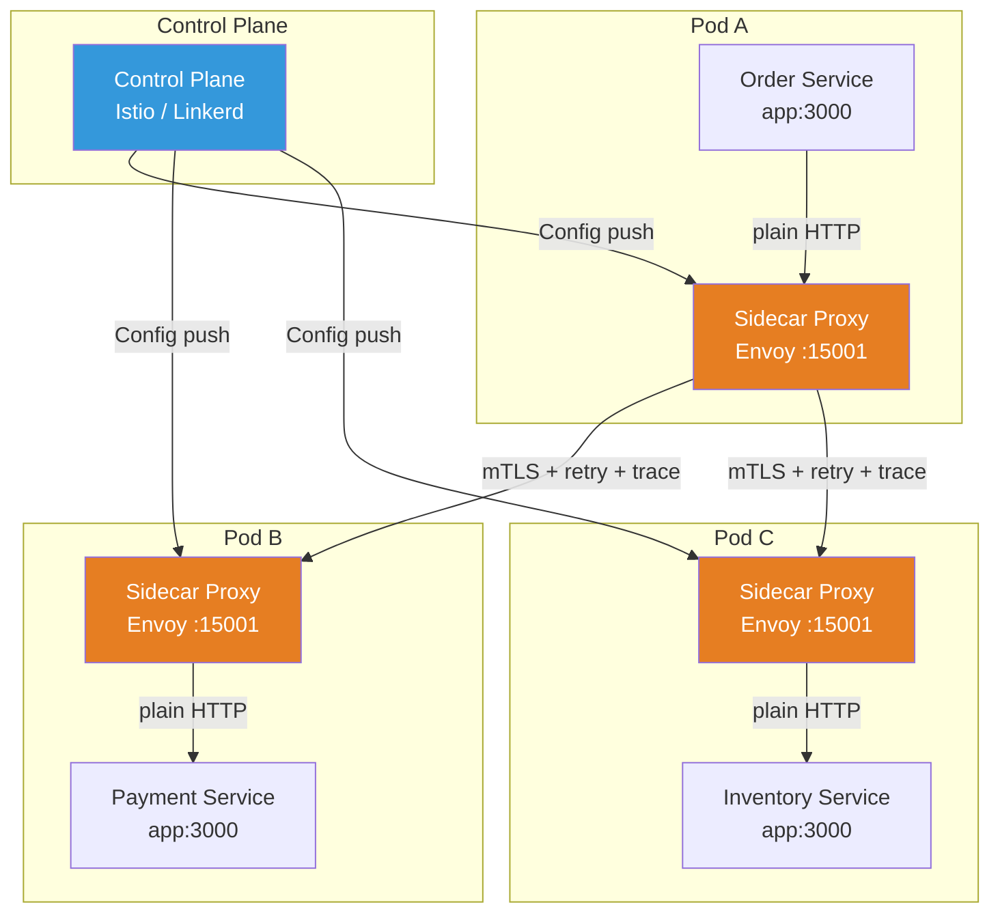
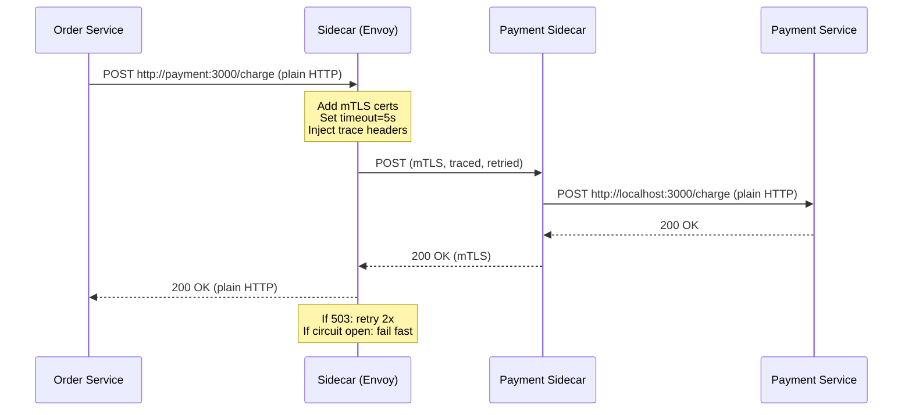

# Service Mesh

## 1. The Problem

You have 40 microservices in production. Each service needs:

- **Mutual TLS** between every service-to-service call.
- **Retry logic** with exponential backoff.
- **Circuit breakers** to stop cascading failures.
- **Request timeouts** tailored per endpoint.
- **Load balancing** across service instances.
- **Distributed tracing** (inject/propagate trace headers).
- **Rate limiting** per client, per service.
- **Canary deployments** — send 5% of traffic to v2.

Your `OrderService` (TypeScript) calls `PaymentService` (Go) which calls `FraudService` (Python). Each team implements these concerns independently:

```typescript
// OrderService: calling PaymentService
import axios from "axios";

async function chargeCustomer(orderId: string, amount: number) {
  const cert = fs.readFileSync("/certs/order-service.pem");
  const key = fs.readFileSync("/certs/order-service-key.pem");
  const ca = fs.readFileSync("/certs/ca.pem");

  let retries = 3;
  while (retries > 0) {
    try {
      const res = await axios.post("https://payment-service:8443/charge", {
        orderId, amount,
      }, {
        httpsAgent: new https.Agent({ cert, key, ca }),
        timeout: 5000,
        headers: { "x-trace-id": generateTraceId() },
      });
      return res.data;
    } catch (err) {
      retries--;
      if (retries === 0) throw err;
      await sleep(Math.pow(2, 3 - retries) * 1000);
    }
  }
}
```

**Now multiply this across 40 services, 4 languages.** Every team re-implements TLS, retries, circuit breakers, tracing. Bugs are everywhere:

- Go team's circuit breaker doesn't match TypeScript team's.
- Python team forgot exponential backoff.
- Nobody propagates trace headers consistently.
- Cert rotation requires redeploying every service.
- "Send 5% to canary" requires modifying every caller.

**Networking concerns are embedded in business logic.** Every single service is a snowflake.

---

## 2. Naïve Solutions (and Why They Fail)

### Attempt 1: Shared Library

```typescript
// shared-networking-lib
export function callService(url: string, opts: CallOptions) {
  // handles TLS, retries, circuit breaking, tracing...
}
```

**Why it breaks:**
- You have 4 languages. Now you maintain 4 versions of the library.
- Library updates require recompiling and redeploying every service.
- Library version drift: OrderService uses v2.3, PaymentService uses v1.8. Bug in v1.8's circuit breaker affects only some services.
- Network configuration is still embedded in the application process.

### Attempt 2: API Gateway for Everything

Route all traffic through a central gateway that handles TLS, retries, etc.

**Why it breaks:**
- Single point of failure. Gateway goes down, everything goes down.
- East-west traffic (service-to-service) shouldn't route through a north-south gateway.
- Latency: every call makes 2 extra network hops (service → gateway → service).
- Gateway becomes a bottleneck at scale.

### Attempt 3: Let Each Team Handle It

Trust that 8 teams across 4 languages will implement retries, circuit breakers, mTLS, tracing, and rate limiting consistently and correctly.

**Why it breaks:**
- They won't. One team ships a 10-second timeout, another uses 100ms. One forgets retries entirely.
- Inconsistent behavior makes debugging impossible.
- Security gaps: one service skips mTLS verification in staging, that code leaks to production.

---

## 3. The Insight

**Move networking concerns out of the application entirely.** Instead of each service implementing TLS, retries, and tracing in its code, deploy a **transparent proxy** alongside every service instance. The proxy intercepts all inbound and outbound network traffic. The application makes plain HTTP calls to `localhost`; the proxy adds TLS, retries, circuit breaking, tracing, and traffic routing. The application knows nothing about it.

---

## 4. The Pattern

### Service Mesh

**Definition:** A dedicated infrastructure layer for handling service-to-service communication. It consists of a **data plane** (a network proxy deployed alongside every service instance — the "sidecar") and a **control plane** (a centralized component that configures all proxies). Applications are unaware of the mesh; they make plain network calls that the sidecar intercepts and enriches.

**Guarantees:**
- Uniform networking behavior across all services, regardless of language.
- Centralized configuration of retries, timeouts, circuit breakers, traffic routing.
- Automatic mutual TLS between all services.
- Observability (metrics, traces, access logs) with zero application code changes.

**Non-guarantees:**
- Does not fix application-level bugs. If your business logic is wrong, the mesh won't save you.
- Does not eliminate latency — sidecars add ~1-2ms per hop.
- Does not replace API gateways for north-south (external) traffic.

---

## 5. Mental Model

Think of a **corporate mail room**. Every department (service) has a personal mailroom clerk (sidecar proxy) sitting right outside their door. When you want to send a letter, you hand it to your clerk in plain text. Your clerk: encrypts it, adds tracking numbers (traces), knows which mail route to use, retries if the post office is busy, and returns the response to you. You never think about routing, encryption, or retries. The **head postmaster** (control plane) tells all clerks the current routing rules.

---

## 6. Structure





---

## 7. Code Example

The beauty of a service mesh is that your **application code becomes trivial**. No TLS, no retries, no tracing — the sidecar handles it.

### TypeScript (Application Code — With Mesh)

```typescript
import express from "express";
import axios from "axios";

const app = express();
app.use(express.json());

// Order Service — no TLS, no retries, no tracing, no circuit breaking
// The sidecar handles ALL of that transparently

app.post("/orders", async (req, res) => {
  const { customerId, items, amount } = req.body;

  // Plain HTTP to service name. Sidecar intercepts, adds mTLS, retries, etc.
  const paymentResult = await axios.post("http://payment-service:3000/charge", {
    customerId,
    amount,
  });

  const inventoryResult = await axios.post("http://inventory-service:3000/reserve", {
    items,
  });

  // Business logic only. Zero networking concerns.
  if (paymentResult.data.success && inventoryResult.data.reserved) {
    res.status(201).json({ orderId: generateOrderId(), status: "confirmed" });
  } else {
    res.status(400).json({ error: "Payment or inventory failed" });
  }
});

app.listen(3000, () => console.log("Order service on :3000"));
```

### Go (Application Code — With Mesh)

```go
package main

import (
	"encoding/json"
	"fmt"
	"log"
	"net/http"
	"bytes"
)

type ChargeRequest struct {
	CustomerID string  `json:"customer_id"`
	Amount     float64 `json:"amount"`
}

type ChargeResponse struct {
	Success bool   `json:"success"`
	TxID    string `json:"tx_id"`
}

// Payment Service handler — zero networking concerns
func handleCharge(w http.ResponseWriter, r *http.Request) {
	var req ChargeRequest
	json.NewDecoder(r.Body).Decode(&req)

	// Pure business logic: validate, charge, respond
	if req.Amount <= 0 {
		http.Error(w, "invalid amount", 400)
		return
	}

	// Process payment (business logic only)
	txID := fmt.Sprintf("tx_%s_%f", req.CustomerID, req.Amount)

	json.NewEncoder(w).Encode(ChargeResponse{
		Success: true,
		TxID:    txID,
	})
}

// Call another service — plain HTTP, sidecar handles mesh concerns
func callFraudCheck(customerID string, amount float64) (bool, error) {
	body, _ := json.Marshal(map[string]interface{}{
		"customer_id": customerID,
		"amount":      amount,
	})

	// Plain HTTP. No TLS config. No retry logic. No circuit breaker.
	// The Envoy sidecar intercepts this and adds all of that.
	resp, err := http.Post(
		"http://fraud-service:3000/check",
		"application/json",
		bytes.NewReader(body),
	)
	if err != nil {
		return false, err
	}
	defer resp.Body.Close()

	var result struct{ Safe bool `json:"safe"` }
	json.NewDecoder(resp.Body).Decode(&result)
	return result.Safe, nil
}

func main() {
	http.HandleFunc("/charge", handleCharge)
	log.Fatal(http.ListenAndServe(":3000", nil))
}
```

### Mesh Configuration (Istio)

The networking behavior is configured **outside** the application, in Kubernetes YAML:

```yaml
# VirtualService: traffic routing + retries
apiVersion: networking.istio.io/v1beta1
kind: VirtualService
metadata:
  name: payment-service
spec:
  hosts:
    - payment-service
  http:
    - route:
        - destination:
            host: payment-service
            subset: v1
          weight: 95
        - destination:
            host: payment-service
            subset: v2
          weight: 5  # Canary: 5% to v2
      retries:
        attempts: 3
        perTryTimeout: 2s
        retryOn: 5xx,reset,connect-failure
      timeout: 10s

---
# DestinationRule: circuit breaking + load balancing
apiVersion: networking.istio.io/v1beta1
kind: DestinationRule
metadata:
  name: payment-service
spec:
  host: payment-service
  trafficPolicy:
    connectionPool:
      http:
        h2UpgradePolicy: DEFAULT
        maxRequestsPerConnection: 100
    outlierDetection:
      consecutive5xxErrors: 5     # Circuit breaker: 5 consecutive 5xx
      interval: 30s
      baseEjectionTime: 60s       # Eject unhealthy instance for 60s
      maxEjectionPercent: 50
    loadBalancer:
      simple: ROUND_ROBIN
  subsets:
    - name: v1
      labels:
        version: v1
    - name: v2
      labels:
        version: v2

---
# PeerAuthentication: enforce mTLS
apiVersion: security.istio.io/v1beta1
kind: PeerAuthentication
metadata:
  name: default
  namespace: production
spec:
  mtls:
    mode: STRICT  # All traffic must use mTLS
```

---

## 8. Gotchas & Beginner Mistakes

| Mistake | Why It Hurts |
|---|---|
| **Starting with a mesh on Day 1** | A mesh adds operational complexity. If you have 3 services, you don't need it. Start with a shared library. |
| **Ignoring sidecar resource costs** | Every pod now has an extra container. 40 services × 128MB per sidecar = 5GB RAM just for proxies. Budget for it. |
| **Not understanding eventual consistency of config** | Control plane pushes config asynchronously. In-flight requests may use old rules for a few seconds during config changes. |
| **Debugging through the mesh** | When calls fail, is it the sidecar, the app, or the network? Learn to read Envoy access logs and mesh dashboards. |
| **Mixing application retries with mesh retries** | App retries 3 times, mesh retries 3 times = 9 total attempts. Remove retries from application code. |
| **Assuming the mesh handles application-level errors** | Mesh retries on 503, not on `{ "error": "insufficient funds" }`. Business errors need application handling. |

---

## 9. Related & Confusable Patterns

| Pattern | How It Differs |
|---|---|
| **API Gateway** | Handles north-south traffic (external → cluster). Mesh handles east-west (service → service). Often used together. |
| **Sidecar Pattern** | A general pattern of deploying a helper process alongside your app. Service mesh uses sidecars but adds a control plane. |
| **Ambassador Pattern** | A specific sidecar that handles outbound connections. Service mesh is a full mesh of ambassadors with centralized control. |
| **Circuit Breaker** | A specific resilience pattern. Service mesh implements circuit breakers as one of many features. |
| **mTLS** | A security protocol. Service mesh automates mTLS certificate provisioning, rotation, and enforcement. |

---

## 10. When This Pattern Is the WRONG Choice

- **Few services (< 10)** — Operational overhead of running Istio/Linkerd exceeds benefit. Use a shared HTTP client library.
- **Single language ecosystem** — If everything is Go, a well-maintained shared library handles retries, tracing, and circuit breaking with less operational cost.
- **Team lacks Kubernetes expertise** — Service meshes are complex. If your team struggles with basic Kubernetes, adding a mesh makes things worse.
- **Latency-critical hot path** — Each sidecar hop adds ~1-2ms. For microsecond-sensitive paths (high-frequency trading), the overhead matters.

**Symptoms you chose it too early:**
- You spend more time debugging mesh configuration than application bugs.
- "Works without mesh, breaks with mesh" is a common investigation.
- Only 2 of 6 mesh features are actually used (usually just mTLS and retries).

**How to back out:** Disable sidecar injection per namespace (`istio-injection=disabled`). Services go back to direct communication. Add retries and TLS back into application code or a shared library.
