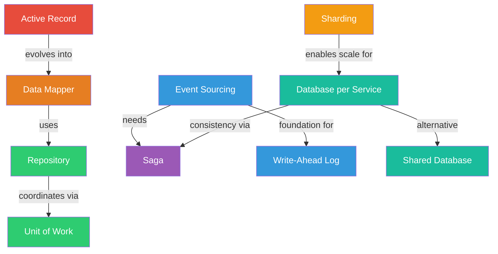

# Module 03 — Data Management Patterns

> "Data is the hardest part of any system. Get the data model wrong and no amount of clever code will save you."

## What You'll Learn

How to store, retrieve, cache, and keep data consistent across services. These patterns solve the fundamental tension: **normalized data is easy to write, denormalized data is easy to read, and distributed data is hard to keep consistent.**

## Prerequisites

- Module 01 (Communication & Messaging) — events, queues, and async patterns
- Module 02 (Architectural Patterns) — system structure context (especially CQRS, microservices)
- Basic SQL knowledge (joins, transactions, indexes)

## Patterns in This Module

| # | Pattern | Core Problem It Solves |
|---|---|---|
| 1 | [Repository](repository.md) | Data access logic scattered through business code |
| 2 | [Unit of Work](unit-of-work.md) | Multiple database changes need to succeed or fail atomically |
| 3 | [Active Record](active-record.md) | Simple CRUD with objects that know how to persist themselves |
| 4 | [Data Mapper](data-mapper.md) | Domain objects contaminated with persistence concerns |
| 5 | [Event Sourcing](event-sourcing.md) | Lost history — why did the data change? |
| 6 | [Saga](saga.md) | Distributed transactions across multiple services |
| 7 | [Database per Service](database-per-service.md) | Shared database coupling microservices together |
| 8 | [Shared Database](shared-database.md) | Need strong consistency across modules without distributed transactions |
| 9 | [Sharding](sharding.md) | Single database can't handle the data volume or throughput |
| 10 | [Write-Ahead Log](write-ahead-log.md) | Data lost on crash before it reaches disk |

## Pattern Relationships

## Suggested Reading Order

1. **Active Record** → **Data Mapper** → **Repository** → **Unit of Work** (data access evolution)
2. **Event Sourcing** → **Write-Ahead Log** (append-only foundations)
3. **Database per Service** ↔ **Shared Database** (the tradeoff)
4. **Saga** (cross-service consistency)
5. **Sharding** (scaling data horizontally)
