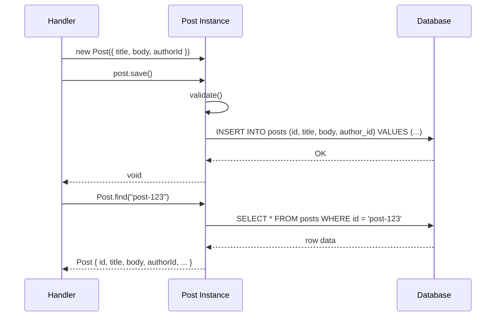

# Active Record

## 1. The Problem

You're building a blog platform. You have a `Post` model. To create, read, update, and delete posts, you write code like this:

```typescript
// Create
const id = generateId();
await db.query(
  "INSERT INTO posts (id, title, body, author_id, published_at) VALUES ($1,$2,$3,$4,$5)",
  [id, title, body, authorId, new Date()]
);

// Read
const { rows } = await db.query("SELECT * FROM posts WHERE id = $1", [postId]);
const post = rows[0];

// Update
await db.query("UPDATE posts SET title = $1, body = $2 WHERE id = $3", [newTitle, newBody, postId]);

// Delete
await db.query("DELETE FROM posts WHERE id = $1", [postId]);
```

This is fine for one entity. But your application has 20 entities: Post, User, Comment, Tag, Category, Subscription... Every entity repeats the same four operations (INSERT, SELECT, UPDATE, DELETE) with slightly different column names. You write the same boilerplate 20 times.

**And the logic doesn't live anywhere coherent.** Want to validate a post title? The validation is in the route handler. Want to computed `readingTime`? That's in a helper function. Want to find published posts? That query lives in the controller. A `Post` isn't a Post — it's a bag of columns with logic scattered across files.

---

## 2. Naïve Solutions (and Why They Fail)

### Attempt 1: Helper Functions per Entity

```typescript
// post-helpers.ts
export function createPost(db, data) { /* INSERT */ }
export function findPost(db, id) { /* SELECT */ }
export function updatePost(db, id, data) { /* UPDATE */ }
export function deletePost(db, id) { /* DELETE */ }
export function calculateReadingTime(post) { return Math.ceil(post.body.split(' ').length / 200); }
```

**Why it breaks:**
- Stateless functions operating on plain objects. No encapsulation.
- `post` is just `{ id, title, body }` — raw data with no behavior.
- Validation, computed properties, and persistence are in separate files.
- No inheritance or composition — can't share CRUD logic between Post, Comment, and User.

### Attempt 2: Class Wrapper with External Persistence

```typescript
class Post {
  constructor(public id: string, public title: string, public body: string) {}
  get readingTime() { return Math.ceil(this.body.split(' ').length / 200); }
}

// But saving is still external:
async function savePost(db: Pool, post: Post) {
  await db.query("INSERT INTO posts ...", [post.id, post.title, post.body]);
}
```

**Why it breaks:**
- Dual responsibility split: `Post` knows its behavior, `savePost` knows persistence.
- For simple CRUD, this separation is overhead. The persistence IS the main concern.
- You end up with a class that can't save itself and a function that knows too much about the class internals.

---

## 3. The Insight

**Let the object itself know how to save, find, update, and delete itself from the database.** The domain object wraps a database row. It carries both the data AND the persistence operations. `post.save()` writes to the database. `Post.find(id)` reads from the database. The object IS the record.

---

## 4. The Pattern

### Active Record

**Definition:** An object that wraps a row in a database table, encapsulates the database access, and adds domain logic on that data. Each Active Record instance corresponds to a row. Static methods on the class handle finders (`find`, `findAll`, `where`). Instance methods handle persistence (`save`, `destroy`). The class directly maps to a database table.

**Guarantees:**
- One class = one table. One instance = one row.
- CRUD operations are built into the object.
- Domain logic (validations, computed properties) lives on the same object as persistence.

**Non-guarantees:**
- Does NOT decouple domain logic from persistence. They are intentionally coupled.
- Does NOT handle complex multi-table operations (use Unit of Work or manual transactions).

---

## 5. Mental Model

Think of a **self-filing document**. You write a memo, and the memo knows which filing cabinet it belongs in, which drawer, and which folder. When you say "file yourself," it walks to the cabinet and files itself. When you say "Memo #42, come here," Memo #42 retrieves itself. The document IS the record AND the filing mechanism.

---

## 6. Structure

```mermaid
classDiagram
    class Post {
        +id: string
        +title: string
        +body: string
        +authorId: string
        +publishedAt: Date
        +get readingTime(): number
        +validate(): boolean
        +save(): Promise~void~
        +destroy(): Promise~void~
        +static find(id: string): Promise~Post~
        +static findAll(): Promise~Post[]~
        +static where(conditions): Promise~Post[]~
    }

    class Database {
        +query(sql, params): Rows
    }

    Post --> Database : reads/writes directly
    Note for Post "One class = one table\nOne instance = one row"
```



---

## 7. Code Example

### TypeScript

```typescript
import { Pool } from "pg";

// Shared database connection
const pool = new Pool({ connectionString: "postgres://localhost/blog" });

class Post {
  id: string;
  title: string;
  body: string;
  authorId: string;
  publishedAt: Date | null;
  private _persisted: boolean;

  constructor(attrs: Partial<Post> & { title: string; body: string; authorId: string }) {
    this.id = attrs.id || crypto.randomUUID();
    this.title = attrs.title;
    this.body = attrs.body;
    this.authorId = attrs.authorId;
    this.publishedAt = attrs.publishedAt || null;
    this._persisted = !!attrs.id;
  }

  // ---- Domain logic ----
  get readingTime(): number {
    return Math.ceil(this.body.split(/\s+/).length / 200);
  }

  get isPublished(): boolean {
    return this.publishedAt !== null && this.publishedAt <= new Date();
  }

  publish(): void {
    if (this.isPublished) throw new Error("Already published");
    this.publishedAt = new Date();
  }

  // ---- Validations ----
  validate(): string[] {
    const errors: string[] = [];
    if (!this.title || this.title.length < 5) errors.push("Title must be at least 5 characters");
    if (!this.body || this.body.length < 50) errors.push("Body must be at least 50 characters");
    if (!this.authorId) errors.push("Author is required");
    return errors;
  }

  // ---- Persistence (instance methods) ----
  async save(): Promise<void> {
    const errors = this.validate();
    if (errors.length > 0) throw new Error(`Validation failed: ${errors.join(", ")}`);

    if (this._persisted) {
      await pool.query(
        "UPDATE posts SET title=$1, body=$2, published_at=$3 WHERE id=$4",
        [this.title, this.body, this.publishedAt, this.id]
      );
    } else {
      await pool.query(
        "INSERT INTO posts (id, title, body, author_id, published_at) VALUES ($1,$2,$3,$4,$5)",
        [this.id, this.title, this.body, this.authorId, this.publishedAt]
      );
      this._persisted = true;
    }
  }

  async destroy(): Promise<void> {
    await pool.query("DELETE FROM posts WHERE id = $1", [this.id]);
    this._persisted = false;
  }

  // ---- Finders (static methods) ----
  static async find(id: string): Promise<Post | null> {
    const { rows } = await pool.query("SELECT * FROM posts WHERE id = $1", [id]);
    return rows[0] ? Post.fromRow(rows[0]) : null;
  }

  static async findAll(): Promise<Post[]> {
    const { rows } = await pool.query("SELECT * FROM posts ORDER BY published_at DESC");
    return rows.map(Post.fromRow);
  }

  static async where(conditions: { authorId?: string; published?: boolean }): Promise<Post[]> {
    const clauses: string[] = [];
    const params: any[] = [];
    let idx = 1;

    if (conditions.authorId) {
      clauses.push(`author_id = $${idx++}`);
      params.push(conditions.authorId);
    }
    if (conditions.published) {
      clauses.push(`published_at IS NOT NULL AND published_at <= NOW()`);
    }

    const where = clauses.length > 0 ? `WHERE ${clauses.join(" AND ")}` : "";
    const { rows } = await pool.query(`SELECT * FROM posts ${where} ORDER BY published_at DESC`, params);
    return rows.map(Post.fromRow);
  }

  // ---- Mapping ----
  private static fromRow(row: any): Post {
    return new Post({
      id: row.id,
      title: row.title,
      body: row.body,
      authorId: row.author_id,
      publishedAt: row.published_at ? new Date(row.published_at) : null,
    });
  }
}

// ========== USAGE ==========
async function main() {
  // Create
  const post = new Post({ title: "Active Record Explained", body: "A long body text here...", authorId: "user-1" });
  await post.save(); // INSERT INTO posts ...

  // Read
  const found = await Post.find(post.id); // SELECT * FROM posts WHERE id = ...
  console.log(found?.readingTime); // Domain logic on the same object

  // Update
  found!.title = "Active Record — Updated";
  found!.publish();
  await found!.save(); // UPDATE posts SET ...

  // Query
  const published = await Post.where({ published: true });

  // Delete
  await found!.destroy(); // DELETE FROM posts WHERE id = ...
}
```

### Go

```go
package main

import (
	"database/sql"
	"errors"
	"fmt"
	"strings"
	"time"

	"github.com/google/uuid"
)

var db *sql.DB // Package-level shared connection

type Post struct {
	ID          string
	Title       string
	Body        string
	AuthorID    string
	PublishedAt *time.Time
	persisted   bool
}

// Domain logic
func (p *Post) ReadingTime() int {
	words := len(strings.Fields(p.Body))
	return (words + 199) / 200
}

func (p *Post) IsPublished() bool {
	return p.PublishedAt != nil && !p.PublishedAt.After(time.Now())
}

func (p *Post) Publish() error {
	if p.IsPublished() {
		return errors.New("already published")
	}
	now := time.Now()
	p.PublishedAt = &now
	return nil
}

// Validation
func (p *Post) Validate() []string {
	var errs []string
	if len(p.Title) < 5 {
		errs = append(errs, "title must be at least 5 chars")
	}
	if len(p.Body) < 50 {
		errs = append(errs, "body must be at least 50 chars")
	}
	if p.AuthorID == "" {
		errs = append(errs, "author is required")
	}
	return errs
}

// Persistence: Save (INSERT or UPDATE)
func (p *Post) Save() error {
	if errs := p.Validate(); len(errs) > 0 {
		return fmt.Errorf("validation: %s", strings.Join(errs, ", "))
	}

	if p.ID == "" {
		p.ID = uuid.New().String()
	}

	if p.persisted {
		_, err := db.Exec(
			"UPDATE posts SET title=$1, body=$2, published_at=$3 WHERE id=$4",
			p.Title, p.Body, p.PublishedAt, p.ID,
		)
		return err
	}

	_, err := db.Exec(
		"INSERT INTO posts (id, title, body, author_id, published_at) VALUES ($1,$2,$3,$4,$5)",
		p.ID, p.Title, p.Body, p.AuthorID, p.PublishedAt,
	)
	if err == nil {
		p.persisted = true
	}
	return err
}

// Persistence: Delete
func (p *Post) Destroy() error {
	_, err := db.Exec("DELETE FROM posts WHERE id=$1", p.ID)
	if err == nil {
		p.persisted = false
	}
	return err
}

// Finders (package-level functions acting as static methods)
func FindPost(id string) (*Post, error) {
	var p Post
	var pubAt sql.NullTime
	err := db.QueryRow("SELECT id, title, body, author_id, published_at FROM posts WHERE id=$1", id).
		Scan(&p.ID, &p.Title, &p.Body, &p.AuthorID, &pubAt)
	if err == sql.ErrNoRows {
		return nil, nil
	}
	if err != nil {
		return nil, err
	}
	if pubAt.Valid {
		p.PublishedAt = &pubAt.Time
	}
	p.persisted = true
	return &p, nil
}

func FindAllPosts() ([]*Post, error) {
	rows, err := db.Query("SELECT id, title, body, author_id, published_at FROM posts ORDER BY published_at DESC")
	if err != nil {
		return nil, err
	}
	defer rows.Close()

	var posts []*Post
	for rows.Next() {
		var p Post
		var pubAt sql.NullTime
		if err := rows.Scan(&p.ID, &p.Title, &p.Body, &p.AuthorID, &pubAt); err != nil {
			return nil, err
		}
		if pubAt.Valid {
			p.PublishedAt = &pubAt.Time
		}
		p.persisted = true
		posts = append(posts, &p)
	}
	return posts, rows.Err()
}

func main() {
	// Create
	post := &Post{Title: "Active Record in Go", Body: "A long body here...", AuthorID: "user-1"}
	post.Save() // INSERT

	// Read
	found, _ := FindPost(post.ID)
	fmt.Println("Reading time:", found.ReadingTime())

	// Update
	found.Publish()
	found.Save() // UPDATE

	// Delete
	found.Destroy()
}
```

---

## 8. Gotchas & Beginner Mistakes

| Mistake | Why It Hurts |
|---|---|
| **Fat models** | Post class with 2,000 lines of business logic, validations, and queries. Extract complex behavior into service objects. |
| **God finders** | `Post.findByAuthorAndCategoryAndStatusAndDateRange(...)` — combinatorial explosion. Use a query builder or specification pattern. |
| **Untestable** | Active Record ties objects to the database. Testing `post.save()` requires a database. Accept this tradeoff or use Data Mapper for testability. |
| **N+1 queries** | Loading 100 posts then calling `post.author()` on each one → 101 queries. Use eager loading or explicit joins. |
| **Working across tables** | Using Active Record for multi-table transactions. Each `save()` is independent. Use explicit transactions or Unit of Work. |

---

## 9. Related & Confusable Patterns

| Pattern | How It Differs |
|---|---|
| **Data Mapper** | Persistence logic lives in separate mapper objects, not on the domain object. Domain objects are persistence-ignorant. |
| **Repository** | Collection-like interface for data access. Often wraps Active Record or Data Mapper underneath. |
| **Table Data Gateway** | One object per TABLE (not per row). All rows are accessed through a single gateway object. |
| **Row Data Gateway** | Like Active Record but WITHOUT domain logic. Just wraps a row with get/set. |

---

## 10. When This Pattern Is the WRONG Choice

- **Complex domain logic** — When business rules are intricate (pricing engines, workflow state machines), mixing persistence with domain logic creates confusion. Use Data Mapper + Repository.
- **Multiple data sources** — If a "Product" combines data from PostgreSQL and Elasticsearch, Active Record's "one class = one table" breaks down.
- **Heavy testing requirements** — If you need fast unit tests without a database, Active Record forces integration tests. Data Mapper allows in-memory test doubles.
- **Schema mismatches** — When the API shape differs significantly from the database schema, Active Record's direct mapping becomes a liability.

**Symptoms you chose it too early:**
- Your Active Record class has more SQL than business logic.
- You're overriding `save()` with 200 lines of custom persistence logic.
- Tests are slow because they all need a real database.

**How to back out:** Extract persistence methods into a repository or data mapper. Keep the domain logic on the object, move `save()`, `find()`, and `destroy()` into a separate persistence class.
