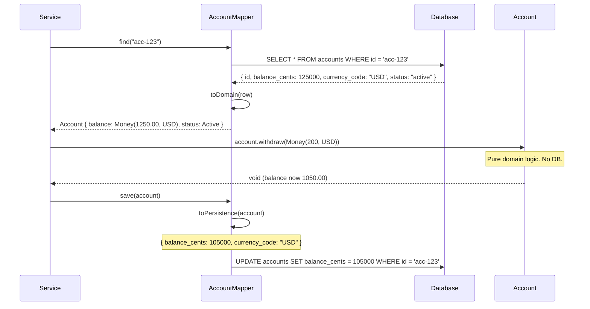

# Data Mapper

## 1. The Problem

Your fintech application started with Active Record. The `Account` class handles both business logic and persistence:

```typescript
class Account {
  id: string;
  balance: number;
  currency: string;
  status: string;

  async save() {
    await db.query("UPDATE accounts SET balance=$1 WHERE id=$2", [this.balance, this.id]);
  }

  static async find(id: string) {
    const row = await db.query("SELECT * FROM accounts WHERE id=$1", [id]);
    return new Account(row);
  }

  // Domain logic mixed in...
  withdraw(amount: number) {
    if (this.status === "frozen") throw new Error("Account frozen");
    if (amount > this.balance) throw new Error("Insufficient funds");
    this.balance -= amount;
  }
}
```

This worked fine until:

1. **Schema divergence.** The database stores `balance_cents` (integer), but the domain works with `balance` (decimal). The domain also needs `dailyWithdrawalLimit` which is computed from 3 tables (account_type → tier → limits). The domain object's shape stopped matching the table.

2. **Untestable domain logic.** Testing `withdraw()` requires a database connection because `Account` imports `db`. Your 400 unit tests take 12 minutes because they each spin up a test database.

3. **Multiple representations.** The REST API returns `{ balance: "1,250.00", currency: "USD" }`. The internal event stream emits `{ balanceCents: 125000 }`. The database stores `{ balance_cents: 125000, currency_code: "USD" }`. Active Record forces one shape.

4. **Domain corruption.** A junior developer added `async updateStatus() { await db.query(...) }` directly on the `Account` class. Now there are two ways to update status — through the domain method and through direct SQL on the class. Business rules are bypassed.

**The domain object is doing too many things.** It's a database row, a business rule container, AND a persistence mechanism.

---

## 2. Naïve Solutions (and Why They Fail)

### Attempt 1: Split Methods into Categories

```typescript
class Account {
  // ---- Domain ----
  withdraw(amount: number) { ... }
  
  // ---- Persistence ----
  async save() { ... }
  static async find() { ... }
  
  // ---- Serialization ----
  toAPI() { ... }
  toEvent() { ... }
}
```

**Why it breaks:**
- Still one class. Still imported by everything. Still needs a database to construct.
- Adding a new database column means changing the domain object. Domain shouldn't know about columns.

### Attempt 2: Repository That Returns Active Record

```typescript
class AccountRepository {
  async findById(id: string): Promise<Account> {
    const row = await db.query(...);
    return new Account(row); // Account still has save()
  }
}
```

**Why it breaks:**
- `Account` still carries `save()`, `find()`, and database awareness.
- The repository is a thin wrapper. Nothing actually changed.

---

## 3. The Insight

**Completely separate the domain object from its persistence.** The domain object (`Account`) knows nothing about databases, SQL, or tables. It's a pure in-memory object with business logic. A separate **mapper** object knows how to load the domain object from the database and save it back. The domain object is **persistence-ignorant**.

---

## 4. The Pattern

### Data Mapper

**Definition:** A layer of mappers that moves data between domain objects and a database while keeping them independent of each other and the mapper itself. Domain objects have no knowledge of the database. The mapper handles all SQL, row-to-object conversion, and object-to-row conversion.

**Guarantees:**
- Domain objects are persistence-ignorant. No `save()`, no `find()`, no SQL.
- The database schema can differ from the domain model (different names, types, structures).
- Domain objects are fully testable without a database.

**Non-guarantees:**
- More code than Active Record. Mapper classes are additional coding effort.
- Does NOT automatically track changes (combine with Unit of Work for that).

---

## 5. Mental Model

Think of a **translator at a diplomatic meeting**. The diplomat (domain object) speaks fluent policy language. The database speaks SQL. The translator (mapper) converts between the two — taking the diplomat's statements and writing them in the database's language, and reading database records back into the diplomat's language. The diplomat never learns SQL. The database never learns policy.

---

## 6. Structure

```mermaid
classDiagram
    class Account {
        +id: string
        +balance: Money
        +status: AccountStatus
        +withdraw(amount: Money): void
        +freeze(): void
        +unfreeze(): void
    }

    class AccountMapper {
        -db: Pool
        +find(id: string): Account
        +save(account: Account): void
        +delete(id: string): void
        -toDomain(row: DbRow): Account
        -toPersistence(account: Account): DbRow
    }

    class Database {
        <<table: accounts>>
        id: uuid
        balance_cents: integer
        currency_code: varchar
        status: varchar
    }

    AccountMapper --> Account : creates/reads
    AccountMapper --> Database : queries

    Note for Account "No database knowledge.\nPure domain logic.\nFully testable."
    Note for AccountMapper "Handles all SQL.\nMaps between domain and DB schemas."
```



---

## 7. Code Example

### TypeScript

```typescript
import { Pool } from "pg";

// ========== DOMAIN (no database knowledge) ==========
class Money {
  constructor(public readonly cents: number, public readonly currency: string) {}

  static fromDecimal(amount: number, currency: string): Money {
    return new Money(Math.round(amount * 100), currency);
  }

  get decimal(): number {
    return this.cents / 100;
  }

  subtract(other: Money): Money {
    if (this.currency !== other.currency) throw new Error("Currency mismatch");
    return new Money(this.cents - other.cents, this.currency);
  }

  isGreaterThan(other: Money): boolean {
    return this.cents > other.cents;
  }
}

type AccountStatus = "active" | "frozen" | "closed";

class Account {
  constructor(
    public readonly id: string,
    private _balance: Money,
    private _status: AccountStatus
  ) {}

  get balance(): Money {
    return this._balance;
  }

  get status(): AccountStatus {
    return this._status;
  }

  withdraw(amount: Money): void {
    if (this._status === "frozen") throw new Error("Account is frozen");
    if (this._status === "closed") throw new Error("Account is closed");
    if (amount.isGreaterThan(this._balance)) throw new Error("Insufficient funds");
    this._balance = this._balance.subtract(amount);
  }

  freeze(): void {
    if (this._status === "closed") throw new Error("Cannot freeze closed account");
    this._status = "frozen";
  }

  unfreeze(): void {
    if (this._status !== "frozen") throw new Error("Account is not frozen");
    this._status = "active";
  }
}

// ========== MAPPER (handles all persistence) ==========
interface AccountRow {
  id: string;
  balance_cents: number;
  currency_code: string;
  status: string;
}

class AccountMapper {
  constructor(private db: Pool) {}

  async find(id: string): Promise<Account | null> {
    const { rows } = await this.db.query<AccountRow>(
      "SELECT id, balance_cents, currency_code, status FROM accounts WHERE id = $1",
      [id]
    );
    return rows[0] ? this.toDomain(rows[0]) : null;
  }

  async findByStatus(status: AccountStatus): Promise<Account[]> {
    const { rows } = await this.db.query<AccountRow>(
      "SELECT id, balance_cents, currency_code, status FROM accounts WHERE status = $1",
      [status]
    );
    return rows.map((row) => this.toDomain(row));
  }

  async save(account: Account): Promise<void> {
    const row = this.toPersistence(account);
    await this.db.query(
      `INSERT INTO accounts (id, balance_cents, currency_code, status)
       VALUES ($1, $2, $3, $4)
       ON CONFLICT (id) DO UPDATE SET balance_cents=$2, currency_code=$3, status=$4`,
      [row.id, row.balance_cents, row.currency_code, row.status]
    );
  }

  async delete(id: string): Promise<void> {
    await this.db.query("DELETE FROM accounts WHERE id = $1", [id]);
  }

  // Domain ↔ Persistence mapping
  private toDomain(row: AccountRow): Account {
    return new Account(
      row.id,
      new Money(row.balance_cents, row.currency_code),
      row.status as AccountStatus
    );
  }

  private toPersistence(account: Account): AccountRow {
    return {
      id: account.id,
      balance_cents: account.balance.cents,
      currency_code: account.balance.currency,
      status: account.status,
    };
  }
}

// ========== SERVICE (uses mapper, works with domain) ==========
class TransferService {
  constructor(private mapper: AccountMapper) {}

  async transfer(fromId: string, toId: string, amount: number, currency: string) {
    const from = await this.mapper.find(fromId);
    const to = await this.mapper.find(toId);
    if (!from || !to) throw new Error("Account not found");

    const money = Money.fromDecimal(amount, currency);

    // Pure domain logic — no database here
    from.withdraw(money);
    // (In reality, `to` would have a `deposit` method)

    // Persist both
    await this.mapper.save(from);
    await this.mapper.save(to);
  }
}

// ========== TESTS (no database needed!) ==========
function testWithdraw() {
  const account = new Account("test-1", Money.fromDecimal(1000, "USD"), "active");
  account.withdraw(Money.fromDecimal(200, "USD"));
  console.assert(account.balance.decimal === 800);

  try {
    account.withdraw(Money.fromDecimal(900, "USD"));
    console.assert(false, "Should have thrown");
  } catch (e) {
    console.assert((e as Error).message === "Insufficient funds");
  }
}

function testFrozenAccount() {
  const account = new Account("test-2", Money.fromDecimal(500, "USD"), "active");
  account.freeze();
  try {
    account.withdraw(Money.fromDecimal(100, "USD"));
    console.assert(false, "Should have thrown");
  } catch (e) {
    console.assert((e as Error).message === "Account is frozen");
  }
}
```

### Go

```go
package main

import (
	"database/sql"
	"errors"
	"fmt"
)

// ========== DOMAIN (no database knowledge) ==========
type Money struct {
	Cents    int64
	Currency string
}

func NewMoney(decimal float64, currency string) Money {
	return Money{Cents: int64(decimal * 100), Currency: currency}
}

func (m Money) Decimal() float64 { return float64(m.Cents) / 100 }

func (m Money) Subtract(other Money) (Money, error) {
	if m.Currency != other.Currency {
		return Money{}, errors.New("currency mismatch")
	}
	return Money{Cents: m.Cents - other.Cents, Currency: m.Currency}, nil
}

type AccountStatus string

const (
	StatusActive AccountStatus = "active"
	StatusFrozen AccountStatus = "frozen"
	StatusClosed AccountStatus = "closed"
)

type Account struct {
	ID      string
	balance Money
	status  AccountStatus
}

func NewAccount(id string, balance Money, status AccountStatus) *Account {
	return &Account{ID: id, balance: balance, status: status}
}

func (a *Account) Balance() Money        { return a.balance }
func (a *Account) Status() AccountStatus { return a.status }

func (a *Account) Withdraw(amount Money) error {
	if a.status == StatusFrozen {
		return errors.New("account is frozen")
	}
	if a.status == StatusClosed {
		return errors.New("account is closed")
	}
	if amount.Cents > a.balance.Cents {
		return errors.New("insufficient funds")
	}
	result, err := a.balance.Subtract(amount)
	if err != nil {
		return err
	}
	a.balance = result
	return nil
}

func (a *Account) Freeze() error {
	if a.status == StatusClosed {
		return errors.New("cannot freeze closed account")
	}
	a.status = StatusFrozen
	return nil
}

// ========== MAPPER ==========
type AccountMapper struct {
	db *sql.DB
}

func NewAccountMapper(db *sql.DB) *AccountMapper {
	return &AccountMapper{db: db}
}

func (m *AccountMapper) Find(id string) (*Account, error) {
	var (
		balanceCents int64
		currencyCode string
		status       string
	)
	err := m.db.QueryRow(
		"SELECT balance_cents, currency_code, status FROM accounts WHERE id=$1", id,
	).Scan(&balanceCents, &currencyCode, &status)
	if err == sql.ErrNoRows {
		return nil, nil
	}
	if err != nil {
		return nil, err
	}
	return m.toDomain(id, balanceCents, currencyCode, status), nil
}

func (m *AccountMapper) Save(a *Account) error {
	row := m.toPersistence(a)
	_, err := m.db.Exec(
		`INSERT INTO accounts (id, balance_cents, currency_code, status) 
		 VALUES ($1,$2,$3,$4)
		 ON CONFLICT (id) DO UPDATE SET balance_cents=$2, currency_code=$3, status=$4`,
		row.id, row.balanceCents, row.currencyCode, row.status,
	)
	return err
}

// Internal mapping types
type accountRow struct {
	id           string
	balanceCents int64
	currencyCode string
	status       string
}

func (m *AccountMapper) toDomain(id string, cents int64, currency, status string) *Account {
	return NewAccount(id, Money{Cents: cents, Currency: currency}, AccountStatus(status))
}

func (m *AccountMapper) toPersistence(a *Account) accountRow {
	return accountRow{
		id:           a.ID,
		balanceCents: a.balance.Cents,
		currencyCode: a.balance.Currency,
		status:       string(a.status),
	}
}

// ========== TESTS (no database!) ==========
func TestWithdraw() {
	account := NewAccount("test-1", NewMoney(1000, "USD"), StatusActive)
	err := account.Withdraw(NewMoney(200, "USD"))
	if err != nil {
		panic("unexpected error")
	}
	if account.Balance().Decimal() != 800 {
		panic(fmt.Sprintf("expected 800, got %f", account.Balance().Decimal()))
	}

	err = account.Withdraw(NewMoney(900, "USD"))
	if err == nil {
		panic("expected insufficient funds error")
	}
}
```

---

## 8. Gotchas & Beginner Mistakes

| Mistake | Why It Hurts |
|---|---|
| **Anemic domain objects** | Domain objects are just getters/setters with no behavior. All logic is in the service layer. If the domain has no rules, Active Record is simpler. |
| **Identity problems** | Two mapper calls for the same ID return two different object instances. Modifying one doesn't affect the other. Use an Identity Map to cache loaded objects. |
| **No change tracking** | Mapper doesn't know what changed. It saves all fields every time. Combine with Unit of Work for change tracking. |
| **Mapper does too much** | Mapper validates business rules or computes derived values. Mapper only maps — domain logic stays on the domain object. |
| **Exposing mapper to presentation** | Controllers import the mapper directly, bypassing the service layer and domain validation. |

---

## 9. Related & Confusable Patterns

| Pattern | How It Differs |
|---|---|
| **Active Record** | Domain object IS the mapper — it contains persistence logic. Data Mapper separates them completely. |
| **Repository** | A higher-level abstraction. Repository provides a collection-like interface and may use Data Mapper internally. |
| **DAO** | Data Access Object — table-oriented. Data Mapper is domain-oriented. DAO returns rows; mapper returns domain objects. |
| **ORM** | ORMs (Hibernate, SQLAlchemy, Entity Framework) ARE data mapper implementations, usually with change tracking built in. |

---

## 10. When This Pattern Is the WRONG Choice

- **Simple CRUD** — If the domain object is just `{ id, name, email }` and maps 1:1 to the database, the mapper adds a layer of code that does nothing interesting. Use Active Record.
- **Prototype / MVP** — Speed matters. Data Mapper is more code than Active Record. You can refactor to Data Mapper later when domain complexity warrants it.
- **When your ORM already does it** — Prisma, TypeORM, GORM already implement Data Mapper. Writing your own mapper on top of an ORM that's already a mapper is redundant.

**Symptoms you chose it too early:**
- `toDomain()` and `toPersistence()` are identity functions (same fields, same names).
- Domain objects have no meaningful business logic — just data containers.
- You're spending more time writing mappers than business features.

**How to back out:** Merge the mapper into the domain object (Active Record) or use an ORM's built-in mapping. Keep the domain logic; delete the manual mapping code.
