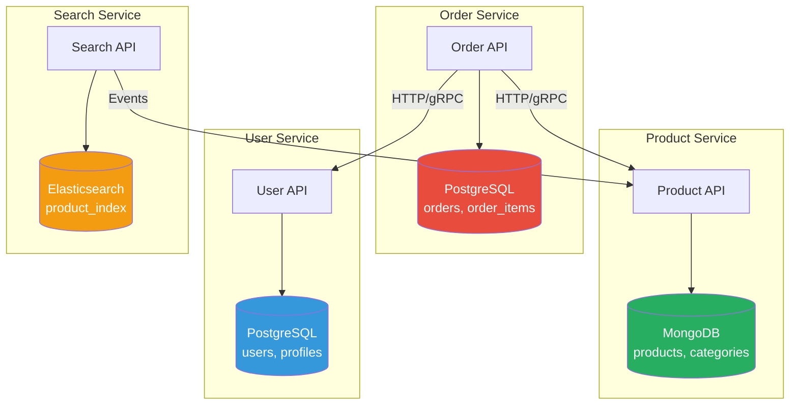
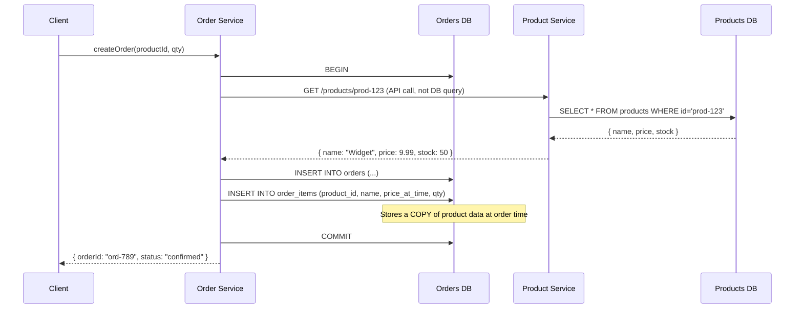

# Database per Service

## 1. The Problem

You have a "microservices" architecture with 5 services: Orders, Products, Users, Payments, Shipping. They all connect to the same PostgreSQL instance:

```
OrderService    → postgres://shared-db/myapp
ProductService  → postgres://shared-db/myapp
UserService     → postgres://shared-db/myapp
PaymentService  → postgres://shared-db/myapp
ShippingService → postgres://shared-db/myapp
```

Every service reads and writes to the same tables. Then the problems start:

1. **Schema coupling.** The Product team wants to rename `products.name` to `products.title`. But the Order service joins on `products.name` in 14 queries. The User service reads `products.name` for recommendations. Renaming one column requires coordinating 3 teams. The rename takes 6 weeks.

2. **Resource contention.** The Shipping service runs a nightly analytics query that takes 45 minutes and saturates the connection pool. Order processing slows to a crawl during that window. One service's usage pattern wrecks everyone.

3. **Deployment coupling.** A migration in the Users service adds a column. The migration locks the `users` table. The Orders service (which joins to `users`) hangs. You can't deploy one service's schema change without affecting all services.

4. **Data access anarchy.** The Payments team discovers they can directly `SELECT * FROM orders` instead of calling the Orders API. Why not? The database is right there. Now Payments depends on the Orders table schema directly. The "microservices" are a distributed monolith.

**Having separate services share a database negates the independence that microservices promise.**

---

## 2. Naïve Solutions (and Why They Fail)

### Attempt 1: Schema-per-Service (Same Database)

```sql
CREATE SCHEMA orders;
CREATE SCHEMA products;
CREATE SCHEMA users;
-- Each service only accesses its own schema
```

**Why it breaks:**
- Still shared infrastructure. One service's long-running query affects everyone.
- Cross-schema JOINs are technically possible and will be used.
- Database migration locks still affect the shared instance.
- One backup, one replication strategy, one connection pool for everything.

### Attempt 2: Read-Only Access to Others' Tables

```sql
GRANT SELECT ON products.* TO order_service;
-- Order service can read products but not write
```

**Why it breaks:**
- Still coupled to the Products table schema. Column renames break the order service.
- Read traffic from other services competes with the owning service's queries.
- No API abstraction. Services depend on raw table structure instead of a defined contract.

---

## 3. The Insight

**Each service owns its data completely — its own database, its own schema, its own storage engine.** No other service can access that data directly. All cross-service data access happens through the service's public API. The service's database is a private implementation detail, like a private variable in a class.

---

## 4. The Pattern

### Database per Service

**Definition:** Each microservice has its own private database that only it can access. Other services access that data exclusively through the service's public API (REST, gRPC, events). The database technology, schema, and storage engine are chosen independently by each service.

**Guarantees:**
- Schema changes are local. Renaming a column in the Orders DB affects only the Orders service.
- Independent scaling. Add read replicas to the read-heavy service without affecting others.
- Technology freedom. Orders uses PostgreSQL, Search uses Elasticsearch, Cache uses Redis.
- True independence. Services can be deployed, scaled, and maintained independently.

**Non-guarantees:**
- Does NOT provide cross-service transactions. Use Saga for that.
- Does NOT provide cross-service joins. Denormalize or use API composition.
- Does NOT eliminate data consistency challenges. Introduces eventual consistency.

---

## 5. Mental Model

Think of **departments in a company**, each with their own filing system. Accounting has their ledgers. HR has their personnel files. Engineering has their technical docs. If Accounting needs an employee's salary grade, they don't walk into HR's office and rifle through the filing cabinet — they send a request to HR, and HR responds. HR can reorganize their filing system without telling Accounting. The filing system is HR's private business.

---

## 6. Structure





---

## 7. Code Example

### TypeScript

```typescript
import express from "express";
import { Pool } from "pg";

// ========== PRODUCT SERVICE (owns product data) ==========
const productDb = new Pool({ connectionString: "postgres://localhost/products_db" });
const productApp = express();
productApp.use(express.json());

productApp.get("/products/:id", async (req, res) => {
  const { rows } = await productDb.query(
    "SELECT id, name, price, stock FROM products WHERE id = $1",
    [req.params.id]
  );
  if (!rows[0]) return res.status(404).json({ error: "Not found" });
  res.json(rows[0]);
});

productApp.patch("/products/:id/stock", async (req, res) => {
  const { delta } = req.body; // negative = deduct, positive = restock
  const { rows } = await productDb.query(
    "UPDATE products SET stock = stock + $1 WHERE id = $2 AND stock + $1 >= 0 RETURNING stock",
    [delta, req.params.id]
  );
  if (!rows[0]) return res.status(409).json({ error: "Insufficient stock" });
  res.json({ stock: rows[0].stock });
});

productApp.listen(3001);

// ========== ORDER SERVICE (owns order data, calls product API) ==========
const orderDb = new Pool({ connectionString: "postgres://localhost/orders_db" });
const orderApp = express();
orderApp.use(express.json());

orderApp.post("/orders", async (req, res) => {
  const { customerId, items } = req.body;

  // Fetch product data via API (NOT direct DB query)
  const productDetails = await Promise.all(
    items.map(async (item: { productId: string; qty: number }) => {
      const resp = await fetch(`http://product-service:3001/products/${item.productId}`);
      if (!resp.ok) throw new Error(`Product ${item.productId} not found`);
      const product = await resp.json();
      return { ...item, name: product.name, price: product.price };
    })
  );

  // Store order with denormalized product data (price at order time)
  const client = await orderDb.connect();
  try {
    await client.query("BEGIN");
    const orderId = crypto.randomUUID();
    const total = productDetails.reduce((sum, p) => sum + p.price * p.qty, 0);

    await client.query(
      "INSERT INTO orders (id, customer_id, total, status) VALUES ($1,$2,$3,$4)",
      [orderId, customerId, total, "pending"]
    );

    for (const p of productDetails) {
      await client.query(
        "INSERT INTO order_items (order_id, product_id, product_name, price_at_time, quantity) VALUES ($1,$2,$3,$4,$5)",
        [orderId, p.productId, p.name, p.price, p.qty]
      );
    }

    await client.query("COMMIT");

    // Deduct stock via API (separately — this is where Saga would help)
    for (const p of productDetails) {
      await fetch(`http://product-service:3001/products/${p.productId}/stock`, {
        method: "PATCH",
        body: JSON.stringify({ delta: -p.qty }),
        headers: { "Content-Type": "application/json" },
      });
    }

    res.status(201).json({ orderId, total });
  } catch (err) {
    await client.query("ROLLBACK");
    res.status(500).json({ error: "Order creation failed" });
  } finally {
    client.release();
  }
});

orderApp.listen(3002);
```

### Go

```go
package main

import (
	"database/sql"
	"encoding/json"
	"fmt"
	"log"
	"net/http"

	_ "github.com/lib/pq"
)

// ========== PRODUCT SERVICE ==========
var productDB *sql.DB

func productHandler(w http.ResponseWriter, r *http.Request) {
	id := r.URL.Path[len("/products/"):]

	var name string
	var price float64
	var stock int
	err := productDB.QueryRow(
		"SELECT name, price, stock FROM products WHERE id=$1", id,
	).Scan(&name, &price, &stock)
	if err != nil {
		http.Error(w, "not found", 404)
		return
	}

	json.NewEncoder(w).Encode(map[string]interface{}{
		"id": id, "name": name, "price": price, "stock": stock,
	})
}

// ========== ORDER SERVICE ==========
var orderDB *sql.DB

type OrderRequest struct {
	CustomerID string `json:"customer_id"`
	Items      []struct {
		ProductID string `json:"product_id"`
		Qty       int    `json:"qty"`
	} `json:"items"`
}

func createOrder(w http.ResponseWriter, r *http.Request) {
	var req OrderRequest
	json.NewDecoder(r.Body).Decode(&req)

	// Fetch product data via HTTP API (NOT direct DB access)
	type productInfo struct {
		Name  string  `json:"name"`
		Price float64 `json:"price"`
	}

	products := make(map[string]productInfo)
	for _, item := range req.Items {
		resp, err := http.Get(fmt.Sprintf("http://product-service:3001/products/%s", item.ProductID))
		if err != nil || resp.StatusCode != 200 {
			http.Error(w, fmt.Sprintf("product %s unavailable", item.ProductID), 400)
			return
		}
		var p productInfo
		json.NewDecoder(resp.Body).Decode(&p)
		resp.Body.Close()
		products[item.ProductID] = p
	}

	// Write to order service's own database
	tx, _ := orderDB.Begin()
	orderID := fmt.Sprintf("ord-%s", req.CustomerID)
	total := 0.0
	for _, item := range req.Items {
		p := products[item.ProductID]
		total += p.Price * float64(item.Qty)
	}

	tx.Exec("INSERT INTO orders (id, customer_id, total, status) VALUES ($1,$2,$3,$4)",
		orderID, req.CustomerID, total, "confirmed")

	for _, item := range req.Items {
		p := products[item.ProductID]
		tx.Exec("INSERT INTO order_items (order_id, product_id, product_name, price_at_time, qty) VALUES ($1,$2,$3,$4,$5)",
			orderID, item.ProductID, p.Name, p.Price, item.Qty)
	}

	tx.Commit()
	json.NewEncoder(w).Encode(map[string]interface{}{"order_id": orderID, "total": total})
}

func main() {
	productDB, _ = sql.Open("postgres", "postgres://localhost/products_db?sslmode=disable")
	orderDB, _ = sql.Open("postgres", "postgres://localhost/orders_db?sslmode=disable")

	// Product service
	go func() {
		mux := http.NewServeMux()
		mux.HandleFunc("/products/", productHandler)
		log.Fatal(http.ListenAndServe(":3001", mux))
	}()

	// Order service
	mux := http.NewServeMux()
	mux.HandleFunc("/orders", createOrder)
	log.Fatal(http.ListenAndServe(":3002", mux))
}
```

---

## 8. Gotchas & Beginner Mistakes

| Mistake | Why It Hurts |
|---|---|
| **Cross-service JOINs via shared DB** | "Just one little JOIN" leads to coupling. Now schema changes in one service break another. Use API calls instead. |
| **Not denormalizing** | Order service stores just `product_id`. When product is deleted or price changes, order history is broken. Store `product_name` and `price_at_time` at order creation. |
| **N+1 API calls** | Order page needs 50 product details → 50 HTTP calls. Implement batch endpoints: `GET /products?ids=1,2,3`. |
| **Synchronous API chains** | Order → Product → Inventory → Pricing, each waiting for the other. Use async events or batch composition. |
| **Separate DB, shared schema** | Two services with separate PostgreSQL instances but identical table schemas secretly coupled. Shared database doesn't mean same instance — it means shared schema ownership. |
| **Ignoring data duplication costs** | Product name stored in orders, in search index, in recommendation cache. When the name changes, all copies are stale until updated. Accept eventual consistency or use events. |

---

## 9. Related & Confusable Patterns

| Pattern | How It Differs |
|---|---|
| **Shared Database** | Opposite approach: all services share one database. Simpler but tightly coupled. Good for small teams / monoliths. |
| **Saga** | Manages distributed transactions when each service has its own database. They're complementary. |
| **API Composition** | Aggregates data from multiple services' APIs to answer a query that would have been a JOIN. Replaces cross-service JOINs. |
| **Event-Driven Architecture** | Services publish events when data changes, allowing other services to maintain local copies. Solves the "how do I get data from another service" problem asynchronously. |

---

## 10. When This Pattern Is the WRONG Choice

- **Small team (< 5 developers)** — The operational overhead of multiple databases (backups, monitoring, migrations, connection management per service) exceeds the benefit.
- **Strong consistency requirements** — If ORDER and PAYMENT must be atomically consistent, separate databases make this extremely hard. Keep them in one service.
- **Heavy cross-entity queries** — Analytics dashboards joining orders, products, and users. Separate databases make this a nightmare. Use a shared analytics/data warehouse instead.
- **Early-stage product** — Schema is changing weekly. Managing migrations across 5 databases is slower than one shared database with conventions.

**Symptoms you chose it too early:**
- Every service calls 3 other services' APIs on every request (data lives elsewhere).
- You maintain 5 database backup strategies when you have 2 developers.
- "Can you just give me direct DB access?" is asked weekly by other teams.

**How to back out:** Consolidate databases. Migrate tables into a shared database. Replace API calls with direct queries. Use schema-per-service as an intermediate step (shared instance, separate schemas).
