# Event Sourcing

## 1. The Problem

You run an online banking platform. A customer calls support:

> "My account balance shows $450, but I deposited $500 yesterday and only spent $30 on coffee. Where's my $20?"

Your support agent queries the database:

```sql
SELECT balance FROM accounts WHERE id = 'acc-789';
-- Result: 450.00
```

That's the **current state**. But how did it get to $450? You check the `updated_at` column — it says "yesterday at 3:47 PM." That's when the balance was last changed. But WHY? Was there a fee? A reversal? A concurrent deduction?

You search the application logs: `[INFO] Account acc-789 balance updated to 450.00`. That tells you nothing. There's no audit trail. No causal chain. No ability to reconstruct what happened.

Your `accounts` table stores **what IS** — current balance. It doesn't store **what happened** — the sequence of deposits, withdrawals, fees, and reversals that produced that balance.

**More pain:**
- **Regulatory audit:** "Show us every state change for account acc-789 in the last 90 days." You can't.
- **Bug investigation:** "Users report phantom charges." Without history, you can't reproduce the issue.
- **Retroactive policy:** "Apply the new fee schedule to all transactions since January." You can't recompute because you don't have the transactions, just the current balance.

---

## 2. Naïve Solutions (and Why They Fail)

### Attempt 1: Audit Log Table

```sql
CREATE TABLE audit_log (
  id SERIAL,
  entity_type VARCHAR,
  entity_id VARCHAR,
  field_name VARCHAR,
  old_value TEXT,
  new_value TEXT,
  changed_at TIMESTAMP,
  changed_by VARCHAR
);
```

**Why it breaks:**
- It records WHAT changed but not WHY. `old_value: 480, new_value: 450` — was this a purchase? A fee? A chargeback?
- Audit log is a second-class citizen. Developers forget to write to it. It drifts from reality.
- No domain meaning. "balance changed from X to Y" is raw data, not a business event.
- Can't reconstruct intermediate states. If you need "what was the balance at 2:15 PM?", you need to replay from the beginning.

### Attempt 2: Versioned Snapshots

```sql
CREATE TABLE account_snapshots (
  account_id VARCHAR,
  version INT,
  balance DECIMAL,
  snapshot_at TIMESTAMP
);
-- Store state at every change
```

**Why it breaks:**
- Storage explodes. 1 million accounts × 100 changes each = 100 million snapshot rows.
- Still doesn't capture intent. Snapshot says "balance = 450" but not "because of a $30 coffee purchase at Starbucks."
- Schema changes break old snapshots. Adding a new field makes old snapshots incomplete.

---

## 3. The Insight

**Store the events, not the state.** Instead of storing `balance = 450`, store the sequence of events that produced that balance: `AccountOpened(1000)`, `MoneyDeposited(500)`, `MoneyWithdrawn(30)`, `FeeCharged(20)`. The current state is derived by replaying events. The events ARE the source of truth. The current state is a cached computation.

---

## 4. The Pattern

### Event Sourcing

**Definition:** A pattern where the state of an entity is determined by a **sequence of events** recorded in an append-only event store. Instead of storing current state and overwriting it on changes, every state change is captured as an immutable event. The current state is reconstructed by replaying events from the beginning (or from a snapshot).

**Guarantees:**
- Complete audit trail — every state change is recorded with business context.
- Temporal queries — reconstruct state at any point in time.
- Events are immutable — history cannot be altered.
- Decoupled read models — project events into any shape.

**Non-guarantees:**
- Does NOT simplify queries. Current-state queries require replaying events (mitigate with snapshots/projections).
- Does NOT eliminate consistency challenges. Events are still eventually consistent when projected.
- Does NOT allow "DELETE" — events are immutable. Regulatory deletions require crypto-shredding or special handling.

---

## 5. Mental Model

Think of a **ledger in double-entry accounting**. An accountant never erases an entry. If there's an error, they add a correcting entry. The balance at any point is computed by summing all entries up to that point. The ledger IS the source of truth, not the balance. Event sourcing applies this principle to software: the event stream is the ledger.

---

## 6. Structure

```mermaid
graph TB
    CMD[Command: Withdraw $30] --> AH[Aggregate Handler]
    AH -->|Load events| ES[(Event Store<br/>Append-only)]
    AH -->|Replay events| A[Account Aggregate<br/>Computed state]
    A -->|Validate & decide| AH
    AH -->|Append new event| ES

    ES -->|Stream events| P1[Projection: Balance View]
    ES -->|Stream events| P2[Projection: Transaction History]
    ES -->|Stream events| P3[Projection: Analytics]

    P1 --> RDB1[(Read DB: Balances)]
    P2 --> RDB2[(Read DB: History)]

    style ES fill:#e74c3c,color:#fff
    style A fill:#3498db,color:#fff
```




---

## 7. Code Example

### TypeScript

```typescript
// ========== EVENTS (immutable, past-tense) ==========
type AccountEvent =
  | { type: "AccountOpened"; data: { accountId: string; initialBalance: number; openedAt: Date } }
  | { type: "MoneyDeposited"; data: { amount: number; source: string; depositedAt: Date } }
  | { type: "MoneyWithdrawn"; data: { amount: number; description: string; withdrawnAt: Date } }
  | { type: "AccountFrozen"; data: { reason: string; frozenAt: Date } }
  | { type: "AccountUnfrozen"; data: { unfrozenAt: Date } };

// ========== AGGREGATE (state from events) ==========
class Account {
  id = "";
  balance = 0;
  status: "active" | "frozen" = "active";
  version = 0;
  private uncommittedEvents: AccountEvent[] = [];

  // Replay: Build state from events
  static fromEvents(events: AccountEvent[]): Account {
    const account = new Account();
    for (const event of events) {
      account.apply(event);
      account.version++;
    }
    return account;
  }

  // Apply event to state (no side effects, no validation)
  private apply(event: AccountEvent): void {
    switch (event.type) {
      case "AccountOpened":
        this.id = event.data.accountId;
        this.balance = event.data.initialBalance;
        this.status = "active";
        break;
      case "MoneyDeposited":
        this.balance += event.data.amount;
        break;
      case "MoneyWithdrawn":
        this.balance -= event.data.amount;
        break;
      case "AccountFrozen":
        this.status = "frozen";
        break;
      case "AccountUnfrozen":
        this.status = "active";
        break;
    }
  }

  // Commands: Validate, then emit events
  withdraw(amount: number, description: string): void {
    if (this.status === "frozen") throw new Error("Account is frozen");
    if (amount <= 0) throw new Error("Amount must be positive");
    if (amount > this.balance) throw new Error("Insufficient funds");

    const event: AccountEvent = {
      type: "MoneyWithdrawn",
      data: { amount, description, withdrawnAt: new Date() },
    };
    this.apply(event);
    this.uncommittedEvents.push(event);
  }

  deposit(amount: number, source: string): void {
    if (amount <= 0) throw new Error("Amount must be positive");

    const event: AccountEvent = {
      type: "MoneyDeposited",
      data: { amount, source, depositedAt: new Date() },
    };
    this.apply(event);
    this.uncommittedEvents.push(event);
  }

  freeze(reason: string): void {
    if (this.status === "frozen") throw new Error("Already frozen");
    const event: AccountEvent = {
      type: "AccountFrozen",
      data: { reason, frozenAt: new Date() },
    };
    this.apply(event);
    this.uncommittedEvents.push(event);
  }

  getUncommittedEvents(): AccountEvent[] {
    return [...this.uncommittedEvents];
  }

  clearUncommittedEvents(): void {
    this.uncommittedEvents = [];
  }
}

// ========== EVENT STORE ==========
import { Pool } from "pg";

class EventStore {
  constructor(private db: Pool) {}

  async loadEvents(aggregateId: string): Promise<AccountEvent[]> {
    const { rows } = await this.db.query(
      "SELECT type, data FROM events WHERE aggregate_id = $1 ORDER BY version ASC",
      [aggregateId]
    );
    return rows.map((r) => ({ type: r.type, data: r.data }));
  }

  async saveEvents(aggregateId: string, events: AccountEvent[], expectedVersion: number): Promise<void> {
    const client = await this.db.connect();
    try {
      await client.query("BEGIN");

      // Optimistic concurrency: check version hasn't changed
      const { rows } = await client.query(
        "SELECT MAX(version) as max_version FROM events WHERE aggregate_id = $1",
        [aggregateId]
      );
      const currentVersion = rows[0]?.max_version ?? -1;

      if (currentVersion !== expectedVersion) {
        throw new Error(
          `Concurrency conflict: expected version ${expectedVersion}, got ${currentVersion}`
        );
      }

      for (let i = 0; i < events.length; i++) {
        await client.query(
          "INSERT INTO events (aggregate_id, version, type, data, created_at) VALUES ($1,$2,$3,$4,NOW())",
          [aggregateId, expectedVersion + 1 + i, events[i].type, JSON.stringify(events[i].data)]
        );
      }

      await client.query("COMMIT");
    } catch (err) {
      await client.query("ROLLBACK");
      throw err;
    } finally {
      client.release();
    }
  }
}

// ========== USAGE ==========
async function withdrawMoney(store: EventStore, accountId: string, amount: number) {
  // 1. Load events
  const events = await store.loadEvents(accountId);

  // 2. Rebuild state
  const account = Account.fromEvents(events);

  // 3. Execute business logic
  account.withdraw(amount, "ATM withdrawal");

  // 4. Persist new events
  await store.saveEvents(accountId, account.getUncommittedEvents(), account.version);
  account.clearUncommittedEvents();

  return account.balance;
}

// Temporal query: what was the balance at event #3?
async function balanceAtVersion(store: EventStore, accountId: string, version: number) {
  const allEvents = await store.loadEvents(accountId);
  const eventsUpToVersion = allEvents.slice(0, version);
  const account = Account.fromEvents(eventsUpToVersion);
  return account.balance;
}
```

### Go

```go
package main

import (
	"database/sql"
	"encoding/json"
	"errors"
	"fmt"
	"time"
)

// Events
type EventType string

const (
	AccountOpened  EventType = "AccountOpened"
	MoneyDeposited EventType = "MoneyDeposited"
	MoneyWithdrawn EventType = "MoneyWithdrawn"
	AccountFrozen  EventType = "AccountFrozen"
)

type Event struct {
	Type    EventType
	Data    json.RawMessage
	Version int
}

type OpenedData struct {
	AccountID      string  `json:"account_id"`
	InitialBalance float64 `json:"initial_balance"`
}

type DepositData struct {
	Amount float64   `json:"amount"`
	Source string    `json:"source"`
	At     time.Time `json:"at"`
}

type WithdrawData struct {
	Amount      float64   `json:"amount"`
	Description string    `json:"description"`
	At          time.Time `json:"at"`
}

// Aggregate
type Account struct {
	ID                string
	Balance           float64
	Status            string
	Version           int
	uncommittedEvents []Event
}

func NewAccountFromEvents(events []Event) *Account {
	a := &Account{Status: "active"}
	for _, e := range events {
		a.apply(e)
		a.Version++
	}
	return a
}

func (a *Account) apply(e Event) {
	switch e.Type {
	case AccountOpened:
		var d OpenedData
		json.Unmarshal(e.Data, &d)
		a.ID = d.AccountID
		a.Balance = d.InitialBalance
	case MoneyDeposited:
		var d DepositData
		json.Unmarshal(e.Data, &d)
		a.Balance += d.Amount
	case MoneyWithdrawn:
		var d WithdrawData
		json.Unmarshal(e.Data, &d)
		a.Balance -= d.Amount
	case AccountFrozen:
		a.Status = "frozen"
	}
}

func (a *Account) Withdraw(amount float64, desc string) error {
	if a.Status == "frozen" {
		return errors.New("account is frozen")
	}
	if amount > a.Balance {
		return errors.New("insufficient funds")
	}

	data, _ := json.Marshal(WithdrawData{Amount: amount, Description: desc, At: time.Now()})
	event := Event{Type: MoneyWithdrawn, Data: data}
	a.apply(event)
	a.uncommittedEvents = append(a.uncommittedEvents, event)
	return nil
}

func (a *Account) UncommittedEvents() []Event { return a.uncommittedEvents }
func (a *Account) ClearUncommitted()          { a.uncommittedEvents = nil }

// Event Store
type EventStore struct {
	db *sql.DB
}

func (s *EventStore) LoadEvents(aggregateID string) ([]Event, error) {
	rows, err := s.db.Query(
		"SELECT type, data, version FROM events WHERE aggregate_id=$1 ORDER BY version",
		aggregateID,
	)
	if err != nil {
		return nil, err
	}
	defer rows.Close()

	var events []Event
	for rows.Next() {
		var e Event
		var raw []byte
		if err := rows.Scan(&e.Type, &raw, &e.Version); err != nil {
			return nil, err
		}
		e.Data = raw
		events = append(events, e)
	}
	return events, nil
}

func (s *EventStore) SaveEvents(aggregateID string, events []Event, expectedVersion int) error {
	tx, err := s.db.Begin()
	if err != nil {
		return err
	}
	defer tx.Rollback()

	var currentVersion int
	err = tx.QueryRow("SELECT COALESCE(MAX(version),-1) FROM events WHERE aggregate_id=$1", aggregateID).
		Scan(&currentVersion)
	if err != nil {
		return err
	}
	if currentVersion != expectedVersion {
		return fmt.Errorf("concurrency conflict: expected %d, got %d", expectedVersion, currentVersion)
	}

	for i, e := range events {
		_, err := tx.Exec(
			"INSERT INTO events (aggregate_id, version, type, data) VALUES ($1,$2,$3,$4)",
			aggregateID, expectedVersion+1+i, e.Type, e.Data,
		)
		if err != nil {
			return err
		}
	}
	return tx.Commit()
}
```

---

## 8. Gotchas & Beginner Mistakes

| Mistake | Why It Hurts |
|---|---|
| **Replaying millions of events** | Without snapshots, loading an account with 100K events takes seconds. Take periodic snapshots and replay only events after the last snapshot. |
| **Mutable events** | Changing event schemas breaks replay. Events are immutable. Use upcasting (version migration) for schema evolution. |
| **Events as commands** | `WithdrawMoney` is a command. `MoneyWithdrawn` is an event. Events are past tense — something that already happened. Commands are requests. |
| **No event versioning** | Adding a field to an event type breaks deserialization of old events. Always version your event schemas. |
| **Using event sourcing for everything** | Product catalog, user preferences, feature flags — these don't need event sourcing. Use it where audit trail and temporal queries add value. |
| **Ignoring projections** | Querying the event store directly for reads. Build read models (projections) that update asynchronously. |

---

## 9. Related & Confusable Patterns

| Pattern | How It Differs |
|---|---|
| **CQRS** | Separates read and write models. Often paired with Event Sourcing (events → projections) but CQRS doesn't require ES. |
| **Event-Driven Architecture** | Systems communicate via events. Event Sourcing stores events as state. EDA is about communication; ES is about storage. |
| **Change Data Capture** | Captures database row changes as events. ES stores domain events intentionally; CDC captures passive technical changes. |
| **Audit Log** | Records "what changed." Event Sourcing records "what happened and why." ES IS the system of record. |

---

## 10. When This Pattern Is the WRONG Choice

- **Simple CRUD domains** — A blog, a TODO app. No one needs temporal queries on blog post edits. Overhead without value.
- **Queries over current state** — "Show all active users." This requires materializing events into a projection. If most queries are current-state, the complexity isn't worth it.
- **GDPR / right to deletion** — Event stores are append-only. "Delete my data" requires crypto-shredding (encrypting per-user, deleting the key) or tombstone events. This complexity may not be justified.
- **High-frequency updates** — A sensor emitting 10K events/second per entity. The event stream becomes enormous. Use time-series databases instead.

**Symptoms you chose it too early:**
- You have more projection code than domain code.
- Nobody uses temporal queries. The event store is just a write-ahead log for a CRUD app.
- Event schemas change monthly because the domain is still being discovered.

**How to back out:** Project current state from events into a regular database table. Switch reads and writes to use that table. Decommission the event store. Keep it as a read-only archive if needed.
