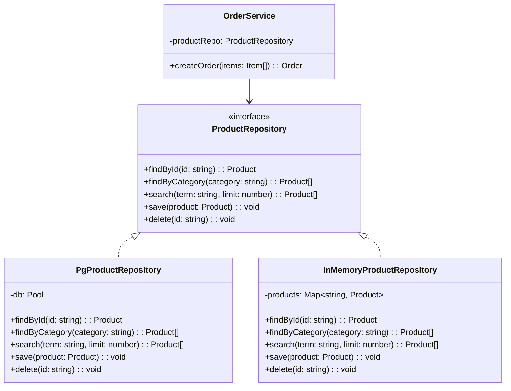
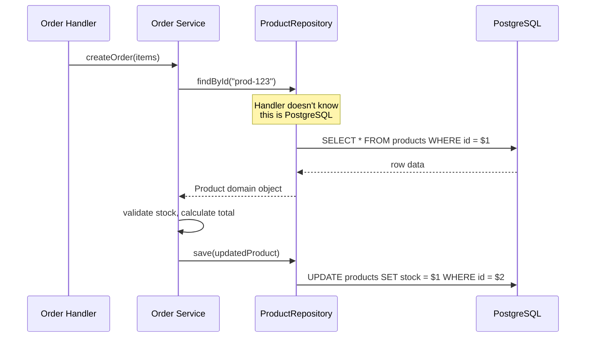

# Repository Pattern

## 1. The Problem

You're building an e-commerce platform. Product-related database queries are everywhere:

```typescript
// In the order handler
const product = await db.query("SELECT * FROM products WHERE id = $1", [productId]);

// In the search handler
const results = await db.query(
  "SELECT * FROM products WHERE name ILIKE $1 AND category = $2 ORDER BY created_at DESC LIMIT $3",
  [`%${term}%`, category, limit]
);

// In the admin dashboard
const low = await db.query(
  "SELECT * FROM products WHERE stock < $1 ORDER BY stock ASC",
  [threshold]
);

// In the recommendation engine
const popular = await db.query(
  "SELECT p.* FROM products p JOIN order_items oi ON p.id = oi.product_id GROUP BY p.id ORDER BY COUNT(*) DESC LIMIT $1",
  [limit]
);
```

**The pain:**

1. **Duplicated queries** — The "find product by ID" query appears in 14 different files with slight variations.
2. **SQL scattered** — Business logic handlers know about table names, column names, JOIN syntax.
3. **Untestable** — Testing the recommendation engine requires a real database because SQL is hardcoded.
4. **Schema change = shotgun surgery** — Renaming `products.name` to `products.title` requires updating 30+ files.
5. **No polymorphism** — Switching from PostgreSQL to Elasticsearch for search means rewriting every query.

---

## 2. Naïve Solutions (and Why They Fail)

### Attempt 1: Helper Functions

```typescript
// helpers/db.ts
export async function findProduct(id: string) {
  return db.query("SELECT * FROM products WHERE id = $1", [id]);
}

export async function searchProducts(term: string) {
  return db.query("SELECT * FROM products WHERE name ILIKE $1", [`%${term}%`]);
}
```

**Why it breaks:**
- Still returns raw database rows. Consumers deal with `rows[0].product_name` instead of domain objects.
- No interface — still coupled to PostgreSQL. `findProduct` can't be swapped for an Elasticsearch implementation.
- Functions grow unbounded. `dbHelpers.ts` becomes 2,000 lines with no conceptual grouping.

### Attempt 2: ORM Direct Usage

```typescript
// Use Prisma/Sequelize everywhere
const product = await prisma.product.findUnique({ where: { id } });
```

**Why it breaks partially:**
- Better than raw SQL, but now you're coupled to Prisma everywhere.
- Complex queries (joins, aggregations) still leak ORM-specific syntax into business logic.
- Testing requires either a real database or mocking Prisma's API — which is massive.
- ORM migration (Prisma → DrizzleORM) requires changing every file that imports Prisma.

---

## 3. The Insight

**Create a boundary between your domain and your data source.** Define a **contract** (interface) that describes what data operations your domain needs — `findById`, `search`, `save` — without specifying HOW they're implemented. Business logic depends on the contract. The concrete implementation (PostgreSQL, Elasticsearch, in-memory for tests) lives behind the contract.

---

## 4. The Pattern

### Repository

**Definition:** An object that mediates between the domain and data mapping layers, acting like an **in-memory collection of domain objects**. Consumers interact with the repository as if it were a simple collection (add, remove, find), while the repository encapsulates all data access logic — queries, ORM calls, caching, or API calls.

**Guarantees:**
- Domain code never knows about SQL, table names, or database drivers.
- Data access logic is centralized per entity type.
- Implementations are swappable (same interface, different backend).

**Non-guarantees:**
- Does NOT manage transactions across multiple repositories (that's Unit of Work).
- Does NOT hide all persistence complexity (complex reporting queries may bypass the repository).

---

## 5. Mental Model

Think of a **librarian**. You walk up and say "I need books by Dijkstra about graph algorithms." The librarian knows which shelf, which catalog system, which cross-reference to use. You don't know — or care — whether the library uses Dewey Decimal or Library of Congress. You just get the books. The librarian is the repository. The catalog system is the database.

---

## 6. Structure





---

## 7. Code Example

### TypeScript

```typescript
// ========== DOMAIN ==========
interface Product {
  id: string;
  name: string;
  price: number;
  stock: number;
  category: string;
}

// ========== REPOSITORY INTERFACE ==========
interface ProductRepository {
  findById(id: string): Promise<Product | null>;
  findByCategory(category: string): Promise<Product[]>;
  search(term: string, limit?: number): Promise<Product[]>;
  save(product: Product): Promise<void>;
  delete(id: string): Promise<void>;
}

// ========== POSTGRES IMPLEMENTATION ==========
import { Pool } from "pg";

class PgProductRepository implements ProductRepository {
  constructor(private db: Pool) {}

  async findById(id: string): Promise<Product | null> {
    const { rows } = await this.db.query(
      "SELECT id, name, price, stock, category FROM products WHERE id = $1",
      [id]
    );
    return rows[0] ? this.toDomain(rows[0]) : null;
  }

  async findByCategory(category: string): Promise<Product[]> {
    const { rows } = await this.db.query(
      "SELECT id, name, price, stock, category FROM products WHERE category = $1 ORDER BY name",
      [category]
    );
    return rows.map(this.toDomain);
  }

  async search(term: string, limit = 20): Promise<Product[]> {
    const { rows } = await this.db.query(
      "SELECT id, name, price, stock, category FROM products WHERE name ILIKE $1 LIMIT $2",
      [`%${term}%`, limit]
    );
    return rows.map(this.toDomain);
  }

  async save(product: Product): Promise<void> {
    await this.db.query(
      `INSERT INTO products (id, name, price, stock, category)
       VALUES ($1, $2, $3, $4, $5)
       ON CONFLICT (id) DO UPDATE SET name=$2, price=$3, stock=$4, category=$5`,
      [product.id, product.name, product.price, product.stock, product.category]
    );
  }

  async delete(id: string): Promise<void> {
    await this.db.query("DELETE FROM products WHERE id = $1", [id]);
  }

  private toDomain(row: any): Product {
    return {
      id: row.id,
      name: row.name,
      price: parseFloat(row.price),
      stock: parseInt(row.stock),
      category: row.category,
    };
  }
}

// ========== IN-MEMORY IMPLEMENTATION (for tests) ==========
class InMemoryProductRepository implements ProductRepository {
  private products = new Map<string, Product>();

  async findById(id: string): Promise<Product | null> {
    return this.products.get(id) || null;
  }

  async findByCategory(category: string): Promise<Product[]> {
    return [...this.products.values()].filter((p) => p.category === category);
  }

  async search(term: string, limit = 20): Promise<Product[]> {
    return [...this.products.values()]
      .filter((p) => p.name.toLowerCase().includes(term.toLowerCase()))
      .slice(0, limit);
  }

  async save(product: Product): Promise<void> {
    this.products.set(product.id, { ...product });
  }

  async delete(id: string): Promise<void> {
    this.products.delete(id);
  }
}

// ========== BUSINESS LOGIC (depends on interface, not implementation) ==========
class OrderService {
  constructor(private productRepo: ProductRepository) {}

  async createOrder(items: { productId: string; quantity: number }[]) {
    for (const item of items) {
      const product = await this.productRepo.findById(item.productId);
      if (!product) throw new Error(`Product ${item.productId} not found`);
      if (product.stock < item.quantity)
        throw new Error(`Insufficient stock for ${product.name}`);

      product.stock -= item.quantity;
      await this.productRepo.save(product);
    }
    return { status: "confirmed" };
  }
}

// ========== USAGE ==========
// Production
const pgRepo = new PgProductRepository(new Pool({ connectionString: "..." }));
const orderService = new OrderService(pgRepo);

// Tests — no database required
const testRepo = new InMemoryProductRepository();
await testRepo.save({ id: "1", name: "Widget", price: 9.99, stock: 10, category: "tools" });
const testService = new OrderService(testRepo);
```

### Go

```go
package main

import (
	"context"
	"database/sql"
	"fmt"
	"strings"
	"sync"
)

// Domain entity
type Product struct {
	ID       string
	Name     string
	Price    float64
	Stock    int
	Category string
}

// Repository interface
type ProductRepository interface {
	FindByID(ctx context.Context, id string) (*Product, error)
	FindByCategory(ctx context.Context, category string) ([]*Product, error)
	Search(ctx context.Context, term string, limit int) ([]*Product, error)
	Save(ctx context.Context, product *Product) error
	Delete(ctx context.Context, id string) error
}

// PostgreSQL implementation
type PgProductRepository struct {
	db *sql.DB
}

func NewPgProductRepository(db *sql.DB) *PgProductRepository {
	return &PgProductRepository{db: db}
}

func (r *PgProductRepository) FindByID(ctx context.Context, id string) (*Product, error) {
	var p Product
	err := r.db.QueryRowContext(ctx,
		"SELECT id, name, price, stock, category FROM products WHERE id = $1", id,
	).Scan(&p.ID, &p.Name, &p.Price, &p.Stock, &p.Category)
	if err == sql.ErrNoRows {
		return nil, nil
	}
	return &p, err
}

func (r *PgProductRepository) FindByCategory(ctx context.Context, category string) ([]*Product, error) {
	rows, err := r.db.QueryContext(ctx,
		"SELECT id, name, price, stock, category FROM products WHERE category = $1", category)
	if err != nil {
		return nil, err
	}
	defer rows.Close()
	return r.scanProducts(rows)
}

func (r *PgProductRepository) Search(ctx context.Context, term string, limit int) ([]*Product, error) {
	rows, err := r.db.QueryContext(ctx,
		"SELECT id, name, price, stock, category FROM products WHERE name ILIKE $1 LIMIT $2",
		"%"+term+"%", limit)
	if err != nil {
		return nil, err
	}
	defer rows.Close()
	return r.scanProducts(rows)
}

func (r *PgProductRepository) Save(ctx context.Context, p *Product) error {
	_, err := r.db.ExecContext(ctx,
		`INSERT INTO products (id, name, price, stock, category) VALUES ($1,$2,$3,$4,$5)
		 ON CONFLICT (id) DO UPDATE SET name=$2, price=$3, stock=$4, category=$5`,
		p.ID, p.Name, p.Price, p.Stock, p.Category)
	return err
}

func (r *PgProductRepository) Delete(ctx context.Context, id string) error {
	_, err := r.db.ExecContext(ctx, "DELETE FROM products WHERE id = $1", id)
	return err
}

func (r *PgProductRepository) scanProducts(rows *sql.Rows) ([]*Product, error) {
	var products []*Product
	for rows.Next() {
		var p Product
		if err := rows.Scan(&p.ID, &p.Name, &p.Price, &p.Stock, &p.Category); err != nil {
			return nil, err
		}
		products = append(products, &p)
	}
	return products, rows.Err()
}

// In-memory implementation (for tests)
type InMemoryProductRepository struct {
	mu       sync.RWMutex
	products map[string]*Product
}

func NewInMemoryProductRepository() *InMemoryProductRepository {
	return &InMemoryProductRepository{products: make(map[string]*Product)}
}

func (r *InMemoryProductRepository) FindByID(_ context.Context, id string) (*Product, error) {
	r.mu.RLock()
	defer r.mu.RUnlock()
	p, ok := r.products[id]
	if !ok {
		return nil, nil
	}
	copy := *p
	return &copy, nil
}

func (r *InMemoryProductRepository) FindByCategory(_ context.Context, category string) ([]*Product, error) {
	r.mu.RLock()
	defer r.mu.RUnlock()
	var result []*Product
	for _, p := range r.products {
		if p.Category == category {
			copy := *p
			result = append(result, &copy)
		}
	}
	return result, nil
}

func (r *InMemoryProductRepository) Search(_ context.Context, term string, limit int) ([]*Product, error) {
	r.mu.RLock()
	defer r.mu.RUnlock()
	var result []*Product
	for _, p := range r.products {
		if strings.Contains(strings.ToLower(p.Name), strings.ToLower(term)) {
			copy := *p
			result = append(result, &copy)
			if len(result) >= limit {
				break
			}
		}
	}
	return result, nil
}

func (r *InMemoryProductRepository) Save(_ context.Context, p *Product) error {
	r.mu.Lock()
	defer r.mu.Unlock()
	copy := *p
	r.products[p.ID] = &copy
	return nil
}

func (r *InMemoryProductRepository) Delete(_ context.Context, id string) error {
	r.mu.Lock()
	defer r.mu.Unlock()
	delete(r.products, id)
	return nil
}

// Business logic depends on interface
type OrderService struct {
	products ProductRepository
}

func (s *OrderService) CreateOrder(ctx context.Context, items []OrderItem) error {
	for _, item := range items {
		product, err := s.products.FindByID(ctx, item.ProductID)
		if err != nil {
			return err
		}
		if product == nil {
			return fmt.Errorf("product %s not found", item.ProductID)
		}
		if product.Stock < item.Quantity {
			return fmt.Errorf("insufficient stock for %s", product.Name)
		}
		product.Stock -= item.Quantity
		if err := s.products.Save(ctx, product); err != nil {
			return err
		}
	}
	return nil
}

type OrderItem struct {
	ProductID string
	Quantity  int
}
```

---

## 8. Gotchas & Beginner Mistakes

| Mistake | Why It Hurts |
|---|---|
| **Leaking ORM types** | Repository returns Prisma models instead of domain objects. Consumers become coupled to Prisma. Return plain domain types. |
| **God repository** | `ProductRepository` with 50 methods. Split into focused repositories or use a specification/criteria pattern for complex queries. |
| **Repository doing business logic** | `repo.deductStock()` — stock validation belongs in the domain/service layer, not the repository. |
| **Ignoring transactions** | Two `repo.save()` calls that need to be atomic. Repository alone can't manage cross-entity transactions — use Unit of Work. |
| **One repository per table** | Creating `OrderItemRepository` when `OrderRepository` should manage order items as part of the Order aggregate. |

---

## 9. Related & Confusable Patterns

| Pattern | How It Differs |
|---|---|
| **Data Mapper** | Maps between domain objects and database rows. Repository USES a data mapper internally but provides a collection-like interface. |
| **Active Record** | Domain objects know how to persist themselves (`product.save()`). Repository keeps persistence knowledge OUT of domain objects. |
| **Unit of Work** | Tracks changes across multiple repositories and commits them as a transaction. Complements Repository. |
| **DAO (Data Access Object)** | Similar concept but table-oriented. Repository is domain-oriented (speaks in domain terms, not table terms). |

---

## 10. When This Pattern Is the WRONG Choice

- **Simple CRUD apps** — If every operation is "get row, update row, save row," a repository adds a layer without adding value. Use ORM directly.
- **Reporting/analytics queries** — Complex JOIN-heavy queries that span many tables don't map well to a "collection of entities" abstraction. Use query objects or direct SQL.
- **Prototyping** — Speed matters more than architecture. Repository adds indirection. Start with direct data access, refactor later.

**Symptoms you chose it too early:**
- Repository methods have 10+ parameters to handle query variations.
- Every service method calls exactly one repository method — the repository is just a pass-through.
- You're writing `IRepository<T>` with generic CRUD and never specializing it.

**How to back out:** Inline repository methods into service/handler code. Replace `repo.findById(id)` with `db.query(...)` directly.
