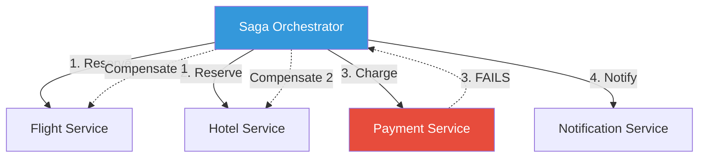
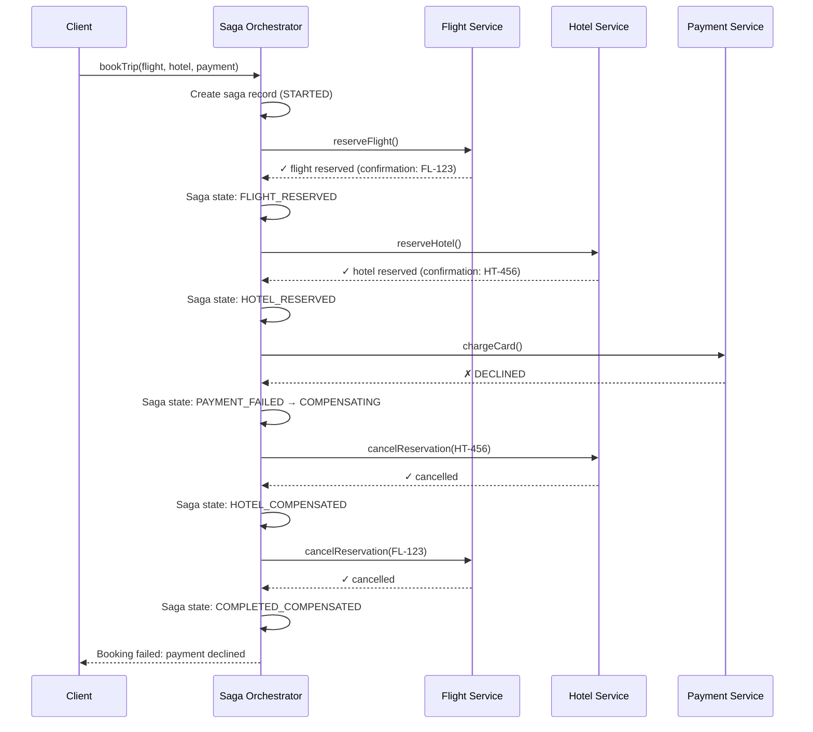

# Saga Pattern

## 1. The Problem

You're building a travel booking platform. When a customer books a trip, you need to:

1. **Reserve a flight** (Flight Service — owns `flights` database)
2. **Reserve a hotel** (Hotel Service — owns `hotels` database)
3. **Charge the credit card** (Payment Service — owns `payments` database)
4. **Send confirmation email** (Notification Service)

Each service owns its own database. There's no shared database. You can't use a single SQL transaction:

```sql
-- THIS IS IMPOSSIBLE across microservices:
BEGIN;
  INSERT INTO flights.reservations ...  -- Flight Service DB
  INSERT INTO hotels.reservations ...   -- Hotel Service DB
  INSERT INTO payments.charges ...      -- Payment Service DB
COMMIT;
```

What actually happens:

```typescript
async function bookTrip(trip: TripRequest) {
  const flight = await flightService.reserve(trip.flight);     // ✓ Success
  const hotel = await hotelService.reserve(trip.hotel);         // ✓ Success
  const payment = await paymentService.charge(trip.payment);    // ✗ FAILS — card declined

  // Flight is reserved. Hotel is reserved. Payment failed.
  // Two services have committed data. One hasn't.
  // The system is in an inconsistent state.
}
```

You need to **undo** the flight and hotel reservations. But there's no `ROLLBACK` across service boundaries. Each service committed independently.

---

## 2. Naïve Solutions (and Why They Fail)

### Attempt 1: Two-Phase Commit (2PC)

Lock all resources, ask all participants to prepare, then commit or abort.

**Why it breaks:**
- All services must be available simultaneously. One slow service blocks everything.
- Locks held during prepare phase prevent other transactions. Throughput drops.
- Coordinator failure leaves participants in a stuck "prepared but not committed" state.
- Microservices use heterogeneous databases (Postgres, MongoDB, APIs). 2PC requires a compatible transaction protocol.

### Attempt 2: Manual Compensation

```typescript
try {
  const flight = await reserve(trip.flight);
  try {
    const hotel = await reserve(trip.hotel);
    try {
      await charge(trip.payment);
    } catch {
      await cancelHotel(hotel.id);
      await cancelFlight(flight.id);
    }
  } catch {
    await cancelFlight(flight.id);
  }
} catch {
  // nothing to compensate
}
```

**Why it breaks:**
- Nested try-catch pyramid of doom.
- What if `cancelHotel()` fails? Now you have a reserved flight, a reserved hotel, and no payment.
- Adding a 5th step (car rental) makes this exponentially more complex.
- No retry logic. No persistence. Process crash = lost compensation.

---

## 3. The Insight

**Model the distributed transaction as a sequence of local transactions, each with a corresponding compensating transaction.** If step N fails, execute compensating transactions for steps N-1, N-2, ..., 1 in reverse order. Persist the saga state so it survives crashes. Coordinate either through a central **orchestrator** or through services **choreographing** events.

---

## 4. The Pattern

### Saga

**Definition:** A pattern for managing data consistency across microservices in distributed transaction scenarios. A saga is a sequence of local transactions where each local transaction updates its own service's database and publishes an event/message to trigger the next step. If a step fails, the saga executes **compensating transactions** to undo the preceding steps.

**Two coordination styles:**
- **Orchestration:** A central saga coordinator tells each service what to do. Easier to understand and debug.
- **Choreography:** Each service listens for events and decides what to do next. More decoupled but harder to trace.

**Guarantees:**
- Eventual consistency across services.
- Each step either completes or is compensated.
- Saga state is persisted — survives process crashes.

**Non-guarantees:**
- NOT atomically consistent. Between steps, the system is in an intermediate state.
- Compensations are NOT rollbacks. `cancelFlight()` is a new operation, not an undo.
- Compensations can fail. You need retry logic and idempotency.

---

## 5. Mental Model

Think of planning a **wedding with multiple vendors**. You book the venue, then the caterer, then the photographer. If the photographer cancels, you don't magically "rollback" the venue booking — you call the venue and say "I need to cancel." Each vendor has its own cancellation (compensation) process. If the venue has a no-cancellation policy, you need a different strategy (rebooking). The wedding planner (orchestrator) coordinates the whole process.

---

## 6. Structure

### Orchestration Style





---

## 7. Code Example

### TypeScript (Orchestrator)

```typescript
import { Pool } from "pg";

// ========== SAGA STEP DEFINITION ==========
interface SagaStep<TContext> {
  name: string;
  execute: (ctx: TContext) => Promise<void>;
  compensate: (ctx: TContext) => Promise<void>;
}

// ========== SAGA ORCHESTRATOR ==========
class SagaOrchestrator<TContext> {
  constructor(
    private name: string,
    private steps: SagaStep<TContext>[],
    private db: Pool
  ) {}

  async run(ctx: TContext, sagaId: string): Promise<void> {
    const completedSteps: SagaStep<TContext>[] = [];

    // Persist saga start
    await this.db.query(
      "INSERT INTO sagas (id, name, status, context, step_index) VALUES ($1,$2,$3,$4,$5)",
      [sagaId, this.name, "RUNNING", JSON.stringify(ctx), 0]
    );

    try {
      for (let i = 0; i < this.steps.length; i++) {
        const step = this.steps[i];

        // Update current step
        await this.db.query(
          "UPDATE sagas SET step_index=$1, current_step=$2 WHERE id=$3",
          [i, step.name, sagaId]
        );

        console.log(`[Saga ${sagaId}] Executing: ${step.name}`);
        await step.execute(ctx);
        completedSteps.push(step);

        // Record step completion
        await this.db.query(
          "INSERT INTO saga_steps (saga_id, step_name, status) VALUES ($1,$2,$3)",
          [sagaId, step.name, "COMPLETED"]
        );
      }

      // All steps succeeded
      await this.db.query("UPDATE sagas SET status=$1 WHERE id=$2", ["COMPLETED", sagaId]);
      console.log(`[Saga ${sagaId}] Completed successfully`);
    } catch (error) {
      console.error(`[Saga ${sagaId}] Step failed, compensating...`, error);
      await this.db.query("UPDATE sagas SET status=$1 WHERE id=$2", ["COMPENSATING", sagaId]);

      // Compensate in reverse order
      for (let i = completedSteps.length - 1; i >= 0; i--) {
        const step = completedSteps[i];
        try {
          console.log(`[Saga ${sagaId}] Compensating: ${step.name}`);
          await step.compensate(ctx);
          await this.db.query(
            "INSERT INTO saga_steps (saga_id, step_name, status) VALUES ($1,$2,$3)",
            [sagaId, step.name, "COMPENSATED"]
          );
        } catch (compError) {
          console.error(`[Saga ${sagaId}] Compensation failed for ${step.name}`, compError);
          await this.db.query(
            "INSERT INTO saga_steps (saga_id, step_name, status) VALUES ($1,$2,$3)",
            [sagaId, step.name, "COMPENSATION_FAILED"]
          );
          // In production: raise alert, schedule retry, dead-letter
        }
      }

      await this.db.query("UPDATE sagas SET status=$1 WHERE id=$2", ["COMPENSATED", sagaId]);
      throw error; // Re-throw for caller
    }
  }
}

// ========== TRIP BOOKING SAGA ==========
interface TripContext {
  customerId: string;
  flightId: string;
  hotelId: string;
  amount: number;
  flightConfirmation?: string;
  hotelConfirmation?: string;
  paymentId?: string;
}

const tripBookingSaga = new SagaOrchestrator<TripContext>(
  "BookTrip",
  [
    {
      name: "ReserveFlight",
      execute: async (ctx) => {
        const res = await fetch("http://flight-service/reserve", {
          method: "POST",
          body: JSON.stringify({ flightId: ctx.flightId, customerId: ctx.customerId }),
          headers: { "Content-Type": "application/json" },
        });
        const data = await res.json();
        if (!res.ok) throw new Error(`Flight reservation failed: ${data.error}`);
        ctx.flightConfirmation = data.confirmationId;
      },
      compensate: async (ctx) => {
        await fetch(`http://flight-service/cancel/${ctx.flightConfirmation}`, {
          method: "POST",
        });
      },
    },
    {
      name: "ReserveHotel",
      execute: async (ctx) => {
        const res = await fetch("http://hotel-service/reserve", {
          method: "POST",
          body: JSON.stringify({ hotelId: ctx.hotelId, customerId: ctx.customerId }),
          headers: { "Content-Type": "application/json" },
        });
        const data = await res.json();
        if (!res.ok) throw new Error(`Hotel reservation failed: ${data.error}`);
        ctx.hotelConfirmation = data.confirmationId;
      },
      compensate: async (ctx) => {
        await fetch(`http://hotel-service/cancel/${ctx.hotelConfirmation}`, {
          method: "POST",
        });
      },
    },
    {
      name: "ChargePayment",
      execute: async (ctx) => {
        const res = await fetch("http://payment-service/charge", {
          method: "POST",
          body: JSON.stringify({ customerId: ctx.customerId, amount: ctx.amount }),
          headers: { "Content-Type": "application/json" },
        });
        const data = await res.json();
        if (!res.ok) throw new Error(`Payment failed: ${data.error}`);
        ctx.paymentId = data.paymentId;
      },
      compensate: async (ctx) => {
        await fetch(`http://payment-service/refund/${ctx.paymentId}`, {
          method: "POST",
        });
      },
    },
  ],
  pool
);

// Usage
const sagaId = crypto.randomUUID();
await tripBookingSaga.run(
  { customerId: "cust-1", flightId: "FL-100", hotelId: "HT-200", amount: 1500 },
  sagaId
);
```

### Go (Orchestrator)

```go
package main

import (
	"context"
	"database/sql"
	"fmt"
	"log"
)

type SagaStep struct {
	Name       string
	Execute    func(ctx context.Context) error
	Compensate func(ctx context.Context) error
}

type SagaOrchestrator struct {
	name  string
	steps []SagaStep
	db    *sql.DB
}

func NewSaga(name string, db *sql.DB, steps ...SagaStep) *SagaOrchestrator {
	return &SagaOrchestrator{name: name, steps: steps, db: db}
}

func (s *SagaOrchestrator) Run(ctx context.Context, sagaID string) error {
	s.db.Exec("INSERT INTO sagas (id, name, status) VALUES ($1,$2,$3)", sagaID, s.name, "RUNNING")

	var completedSteps []SagaStep

	for _, step := range s.steps {
		log.Printf("[Saga %s] Executing: %s", sagaID, step.Name)
		if err := step.Execute(ctx); err != nil {
			log.Printf("[Saga %s] %s failed: %v — compensating", sagaID, step.Name, err)

			// Compensate in reverse
			for i := len(completedSteps) - 1; i >= 0; i-- {
				cs := completedSteps[i]
				log.Printf("[Saga %s] Compensating: %s", sagaID, cs.Name)
				if compErr := cs.Compensate(ctx); compErr != nil {
					log.Printf("[Saga %s] Compensation FAILED for %s: %v", sagaID, cs.Name, compErr)
					// Alert, retry queue, etc.
				}
			}

			s.db.Exec("UPDATE sagas SET status='COMPENSATED' WHERE id=$1", sagaID)
			return fmt.Errorf("saga failed at %s: %w", step.Name, err)
		}
		completedSteps = append(completedSteps, step)
	}

	s.db.Exec("UPDATE sagas SET status='COMPLETED' WHERE id=$1", sagaID)
	return nil
}

// Trip context passed via context.Context
type tripContextKey struct{}
type TripContext struct {
	CustomerID         string
	FlightID           string
	HotelID            string
	Amount             float64
	FlightConfirmation string
	HotelConfirmation  string
}

func main() {
	var db *sql.DB // initialized elsewhere

	tc := &TripContext{
		CustomerID: "cust-1",
		FlightID:   "FL-100",
		HotelID:    "HT-200",
		Amount:     1500,
	}
	ctx := context.WithValue(context.Background(), tripContextKey{}, tc)

	saga := NewSaga("BookTrip", db,
		SagaStep{
			Name: "ReserveFlight",
			Execute: func(ctx context.Context) error {
				tc := ctx.Value(tripContextKey{}).(*TripContext)
				// Call flight service...
				tc.FlightConfirmation = "FL-CONF-123"
				return nil
			},
			Compensate: func(ctx context.Context) error {
				tc := ctx.Value(tripContextKey{}).(*TripContext)
				// Cancel flight reservation
				log.Printf("Cancelling flight %s", tc.FlightConfirmation)
				return nil
			},
		},
		SagaStep{
			Name: "ReserveHotel",
			Execute: func(ctx context.Context) error {
				tc := ctx.Value(tripContextKey{}).(*TripContext)
				tc.HotelConfirmation = "HT-CONF-456"
				return nil
			},
			Compensate: func(ctx context.Context) error {
				tc := ctx.Value(tripContextKey{}).(*TripContext)
				log.Printf("Cancelling hotel %s", tc.HotelConfirmation)
				return nil
			},
		},
		SagaStep{
			Name: "ChargePayment",
			Execute: func(ctx context.Context) error {
				return fmt.Errorf("payment declined") // Simulate failure
			},
			Compensate: func(ctx context.Context) error {
				return nil // Nothing was charged
			},
		},
	)

	if err := saga.Run(ctx, "saga-001"); err != nil {
		log.Printf("Trip booking failed: %v", err)
	}
}
```

---

## 8. Gotchas & Beginner Mistakes

| Mistake | Why It Hurts |
|---|---|
| **Non-idempotent steps** | If `reserveFlight` is retried (e.g., network timeout), it creates a second reservation. Every step must be idempotent (use idempotency keys). |
| **Non-idempotent compensations** | `cancelFlight` called twice should not fail on the second call. Check if already cancelled. |
| **No saga state persistence** | Process crashes mid-saga. Without persisted state, you can't resume or compensate. Always store saga progress in a database. |
| **Assuming atomicity** | Between steps 1 and 3, the flight is reserved but the hotel isn't yet. Users might SEE this intermediate state. Design the UI for it ("Booking in progress..."). |
| **Compensations that can't compensate** | Hotel has a non-cancellable rate. Your compensation WILL fail. Plan for it: manual intervention queue, human escalation. |
| **Too many steps** | A saga with 15 steps is nearly undebuggable. Decompose into sub-sagas or rethink service boundaries. |

---

## 9. Related & Confusable Patterns

| Pattern | How It Differs |
|---|---|
| **Two-Phase Commit (2PC)** | Locks resources across participants for atomicity. Saga never locks — uses compensation instead. Saga tolerates partial failure. |
| **Transaction Outbox** | Ensures a database write and message publish happen atomically within ONE service. Saga coordinates ACROSS services. |
| **Event Sourcing** | Stores events as source of truth. Often paired with Saga (events trigger saga steps), but independent concepts. |
| **Process Manager** | A broader coordination pattern. Saga is a specific type of process manager focused on compensating transactions. |

---

## 10. When This Pattern Is the WRONG Choice

- **Single database** — If all data lives in one database, use regular database transactions. Saga is for cross-service/cross-database coordination.
- **All-or-nothing semantics required** — Saga provides eventual consistency, not atomicity. If you need strict ACID, reconsider your service boundaries.
- **Simple workflows** — Two services with one call each? A try/catch with manual compensation is fine. Saga machinery adds unjustified complexity.

**Symptoms you chose it too early:**
- Every saga has exactly two steps. The orchestrator overhead exceeds the logic.
- Compensations are never triggered because steps never fail.
- You're fighting the saga framework more than solving business problems.

**How to back out:** Merge services that need transactional consistency into one service with one database. Use a database transaction instead of a saga.
