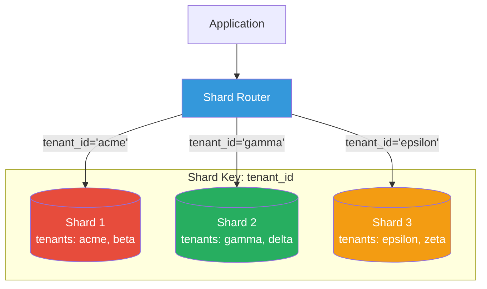
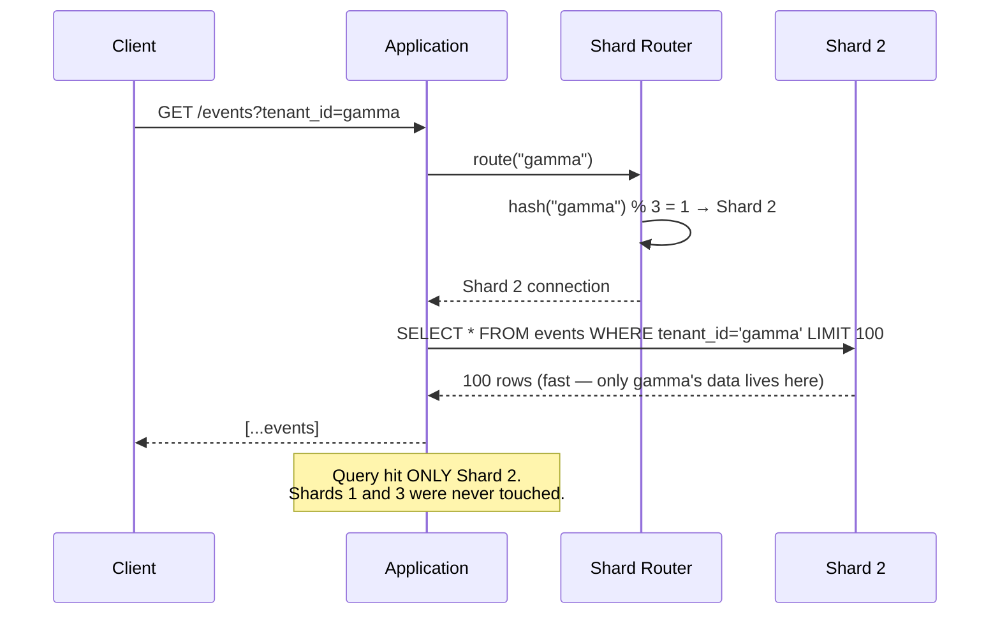

# Sharding

## 1. The Problem

Your SaaS analytics platform stores event data. At launch, one PostgreSQL instance handles everything. After 18 months:

- **2 billion rows** in the `events` table.
- **1.2 TB** of data on a single disk.
- Inserts take **45ms** (was 2ms at launch). Index maintenance dominates.
- `SELECT COUNT(*) FROM events WHERE tenant_id = 'acme'` takes **8 seconds** — a full table scan despite the index.
- `VACUUM` runs for **6 hours** and causes noticeable latency spikes.
- The disk is 85% full. Adding more disk is possible, but the query performance problem won't improve.

**Vertical scaling has limits.** You've already maxed out the machine:
- 64 cores — queries still slow (I/O bound, not CPU bound).
- 512 GB RAM — hot dataset doesn't fit in memory anymore.
- NVMe SSDs — fast, but scanning 1.2 TB is still slow.

The single database is a bottleneck. You can't make ONE database faster. You need to spread the data across MULTIPLE databases.

---

## 2. Naïve Solutions (and Why They Fail)

### Attempt 1: Read Replicas

Add 3 PostgreSQL read replicas.

**Why it breaks:**
- Read replicas solve read LOAD, not read LATENCY. The same 8-second query runs on every replica.
- Write throughput doesn't improve. One primary handles all writes.
- Replication lag means replicas serve stale data.

### Attempt 2: Partitioning (Table Partitioning in PostgreSQL)

```sql
CREATE TABLE events (
  id UUID, tenant_id VARCHAR, event_type VARCHAR, payload JSONB, created_at TIMESTAMP
) PARTITION BY RANGE (created_at);

CREATE TABLE events_2024_q1 PARTITION OF events FOR VALUES FROM ('2024-01-01') TO ('2024-04-01');
```

**Why it breaks partially:**
- Partitioning splits ONE TABLE into smaller pieces on the SAME database server.
- Helps query performance (partition pruning), but doesn't solve:
  - Total storage limit of one machine.
  - Write throughput limit of one machine.
  - Memory/CPU limits of one machine.
- All partitions share the same disk, CPU, and connection pool.

### Attempt 3: Archive Old Data

Move events older than 6 months to cold storage.

**Why it breaks:**
- Customers need historical analytics. "Show me trends for the last 2 years."
- Archived data needs a separate query path. Now you're maintaining two systems.
- Doesn't solve the problem for tenants with massive recent data.

---

## 3. The Insight

**Split the data across multiple independent database instances**, each holding a subset of the data. Route queries to the correct instance based on a **shard key** — a value that determines which instance holds that data. Each shard is a fully independent database that can be scaled, backed up, and maintained independently.

---

## 4. The Pattern

### Sharding

**Definition:** A horizontal scaling technique that distributes data across multiple database instances (shards). Each shard holds a subset of the total data, determined by a **shard key**. A routing layer directs reads and writes to the correct shard. Each shard is operationally independent — separate storage, separate CPU, separate connections.

**Core decisions:**
- **Shard key:** Which column determines data placement (e.g., `tenant_id`, `user_id`).
- **Shard strategy:** How the key maps to shards (hash, range, directory).
- **Number of shards:** How many database instances.

**Guarantees:**
- Horizontal write scaling — each shard handles its own writes.
- Storage scales linearly — add shards, add capacity.
- Query performance improves for shard key-filtered queries.

**Non-guarantees:**
- Cross-shard queries are expensive or impossible (no cross-shard JOINs).
- Resharding (changing the number of shards) is operationally painful.
- Application complexity increases significantly.

---

## 5. Mental Model

Think of a **library system across a city**. Instead of one mega-library with 10 million books, you have 10 branch libraries. Each branch holds books for specific neighborhoods (shard key = neighborhood). If you live in Brooklyn, you go to the Brooklyn branch — fast, everything you need is there. But if you want to search all books across all branches, you need to query each branch and merge results — much slower.

---

## 6. Structure





---

## 7. Code Example

### TypeScript

```typescript
import { Pool } from "pg";

// ========== SHARD CONFIGURATION ==========
interface ShardConfig {
  id: number;
  connectionString: string;
}

const SHARD_CONFIGS: ShardConfig[] = [
  { id: 0, connectionString: "postgres://localhost:5432/shard_0" },
  { id: 1, connectionString: "postgres://localhost:5433/shard_1" },
  { id: 2, connectionString: "postgres://localhost:5434/shard_2" },
];

// ========== SHARD ROUTER ==========
class ShardRouter {
  private pools: Map<number, Pool> = new Map();
  private shardCount: number;

  constructor(configs: ShardConfig[]) {
    this.shardCount = configs.length;
    for (const config of configs) {
      this.pools.set(config.id, new Pool({ connectionString: config.connectionString }));
    }
  }

  // Hash-based routing: consistent distribution
  getShardId(tenantId: string): number {
    let hash = 0;
    for (let i = 0; i < tenantId.length; i++) {
      hash = (hash * 31 + tenantId.charCodeAt(i)) | 0;
    }
    return Math.abs(hash) % this.shardCount;
  }

  getPool(tenantId: string): Pool {
    const shardId = this.getShardId(tenantId);
    const pool = this.pools.get(shardId);
    if (!pool) throw new Error(`No pool for shard ${shardId}`);
    return pool;
  }

  // For cross-shard queries (expensive — use sparingly)
  getAllPools(): Pool[] {
    return [...this.pools.values()];
  }

  async close(): Promise<void> {
    for (const pool of this.pools.values()) {
      await pool.end();
    }
  }
}

// ========== SHARDED REPOSITORY ==========
interface Event {
  id: string;
  tenantId: string;
  eventType: string;
  payload: Record<string, unknown>;
  createdAt: Date;
}

class ShardedEventRepository {
  constructor(private router: ShardRouter) {}

  // Single-shard write: fast, goes to exactly one shard
  async insert(event: Event): Promise<void> {
    const pool = this.router.getPool(event.tenantId);
    await pool.query(
      "INSERT INTO events (id, tenant_id, event_type, payload, created_at) VALUES ($1,$2,$3,$4,$5)",
      [event.id, event.tenantId, event.eventType, JSON.stringify(event.payload), event.createdAt]
    );
  }

  // Single-shard query: fast, hits only the relevant shard
  async findByTenant(tenantId: string, limit = 100): Promise<Event[]> {
    const pool = this.router.getPool(tenantId);
    const { rows } = await pool.query(
      "SELECT * FROM events WHERE tenant_id = $1 ORDER BY created_at DESC LIMIT $2",
      [tenantId, limit]
    );
    return rows;
  }

  // Cross-shard query: SLOW — scatter-gather across all shards
  async countByEventType(eventType: string): Promise<number> {
    const pools = this.router.getAllPools();
    const results = await Promise.all(
      pools.map(async (pool) => {
        const { rows } = await pool.query(
          "SELECT COUNT(*) as count FROM events WHERE event_type = $1",
          [eventType]
        );
        return parseInt(rows[0].count);
      })
    );
    return results.reduce((sum, count) => sum + count, 0);
  }
}

// ========== USAGE ==========
const router = new ShardRouter(SHARD_CONFIGS);
const repo = new ShardedEventRepository(router);

// Write — routed to the correct shard automatically
await repo.insert({
  id: crypto.randomUUID(),
  tenantId: "acme",
  eventType: "page_view",
  payload: { url: "/dashboard" },
  createdAt: new Date(),
});

// Read — hits only acme's shard
const events = await repo.findByTenant("acme", 50);

// Cross-shard (slow!) — hits ALL shards
const totalPageViews = await repo.countByEventType("page_view");
```

### Go

```go
package main

import (
	"context"
	"database/sql"
	"encoding/json"
	"fmt"
	"hash/fnv"
	"sync"
)

// Shard router
type ShardRouter struct {
	shards []*sql.DB
	count  int
}

func NewShardRouter(dsns []string) (*ShardRouter, error) {
	router := &ShardRouter{count: len(dsns)}
	for _, dsn := range dsns {
		db, err := sql.Open("postgres", dsn)
		if err != nil {
			return nil, fmt.Errorf("connecting to shard: %w", err)
		}
		router.shards = append(router.shards, db)
	}
	return router, nil
}

func (r *ShardRouter) GetShard(tenantID string) *sql.DB {
	h := fnv.New32a()
	h.Write([]byte(tenantID))
	idx := int(h.Sum32()) % r.count
	return r.shards[idx]
}

func (r *ShardRouter) AllShards() []*sql.DB {
	return r.shards
}

// Event
type Event struct {
	ID        string                 `json:"id"`
	TenantID  string                 `json:"tenant_id"`
	EventType string                 `json:"event_type"`
	Payload   map[string]interface{} `json:"payload"`
}

// Sharded repository
type ShardedEventRepo struct {
	router *ShardRouter
}

func (r *ShardedEventRepo) Insert(ctx context.Context, e Event) error {
	db := r.router.GetShard(e.TenantID)
	payload, _ := json.Marshal(e.Payload)
	_, err := db.ExecContext(ctx,
		"INSERT INTO events (id, tenant_id, event_type, payload) VALUES ($1,$2,$3,$4)",
		e.ID, e.TenantID, e.EventType, payload,
	)
	return err
}

func (r *ShardedEventRepo) FindByTenant(ctx context.Context, tenantID string, limit int) ([]Event, error) {
	db := r.router.GetShard(tenantID)
	rows, err := db.QueryContext(ctx,
		"SELECT id, tenant_id, event_type, payload FROM events WHERE tenant_id=$1 LIMIT $2",
		tenantID, limit,
	)
	if err != nil {
		return nil, err
	}
	defer rows.Close()

	var events []Event
	for rows.Next() {
		var e Event
		var raw []byte
		rows.Scan(&e.ID, &e.TenantID, &e.EventType, &raw)
		json.Unmarshal(raw, &e.Payload)
		events = append(events, e)
	}
	return events, nil
}

// Cross-shard scatter-gather
func (r *ShardedEventRepo) CountByType(ctx context.Context, eventType string) (int, error) {
	shards := r.router.AllShards()
	counts := make([]int, len(shards))
	var wg sync.WaitGroup
	var firstErr error

	for i, db := range shards {
		wg.Add(1)
		go func(idx int, db *sql.DB) {
			defer wg.Done()
			var count int
			err := db.QueryRowContext(ctx,
				"SELECT COUNT(*) FROM events WHERE event_type=$1", eventType,
			).Scan(&count)
			if err != nil && firstErr == nil {
				firstErr = err
			}
			counts[idx] = count
		}(i, db)
	}

	wg.Wait()
	if firstErr != nil {
		return 0, firstErr
	}

	total := 0
	for _, c := range counts {
		total += c
	}
	return total, nil
}
```

---

## 8. Gotchas & Beginner Mistakes

| Mistake | Why It Hurts |
|---|---|
| **Bad shard key** | Sharding by `created_at` (range) puts ALL recent writes on the newest shard. Shard by tenant or user for even distribution. |
| **Hot shards** | One tenant has 10x more data than others. That shard is overloaded. Monitor shard sizes and consider tenant-aware rebalancing. |
| **Cross-shard JOINs** | `SELECT ... FROM events e JOIN users u ON ...` — users are on a different shard (or not sharded). JOINs don't work across databases. Denormalize or use application-level joins. |
| **Resharding** | Adding a 4th shard when you have 3 means rehashing: `hash(key) % 3` ≠ `hash(key) % 4`. Billions of rows need to move. Use consistent hashing or virtual shards to minimize movement. |
| **Auto-increment IDs** | `SERIAL` produces conflicts across shards (each shard generates ID 1, 2, 3...). Use UUIDs or shard-prefixed IDs. |
| **No shard-awareness in queries** | Querying without filtering by shard key → scatter query across ALL shards. Always include the shard key in WHERE clauses. |

---

## 9. Related & Confusable Patterns

| Pattern | How It Differs |
|---|---|
| **Partitioning** | Splits a table within ONE database. Sharding splits across MULTIPLE database instances. Partitioning doesn't scale beyond one machine. |
| **Read Replicas** | Copies all data to read-only instances. Sharding splits DIFFERENT data across instances. Replicas solve read load; sharding solves data size. |
| **Database per Service** | Each service has its own database. Sharding splits one service's data across databases. Different motivations (independence vs. scale). |
| **Consistent Hashing** | A specific algorithm for mapping keys to shards. Minimizes data movement when adding/removing shards. Used within sharding, not an alternative. |

---

## 10. When This Pattern Is the WRONG Choice

- **Data fits on one machine** — If your database is 50 GB and handles your throughput on one instance, sharding adds complexity for zero benefit.
- **Many cross-shard queries** — If most queries need data from multiple shards (analytics, reporting), sharding makes them ALL slower. Use a data warehouse for analytics.
- **No natural shard key** — If there's no column that neatly partitions data (every query needs every row), sharding doesn't help.
- **Small team** — Operating 5 database instances requires 5x the monitoring, backup, and maintenance. If you have 3 developers, this isn't sustainable.

**Symptoms you chose it too early:**
- Every query is a scatter-gather (no shard key filtering).
- One shard holds 90% of data (bad key choice).
- You spend more time on shard operations than product features.

**How to back out:** Merge shards into a single database. This is operationally intensive (data migration, ID conflicts). Easier to prevent than reverse. Try vertical scaling, read replicas, and partitioning before sharding.
