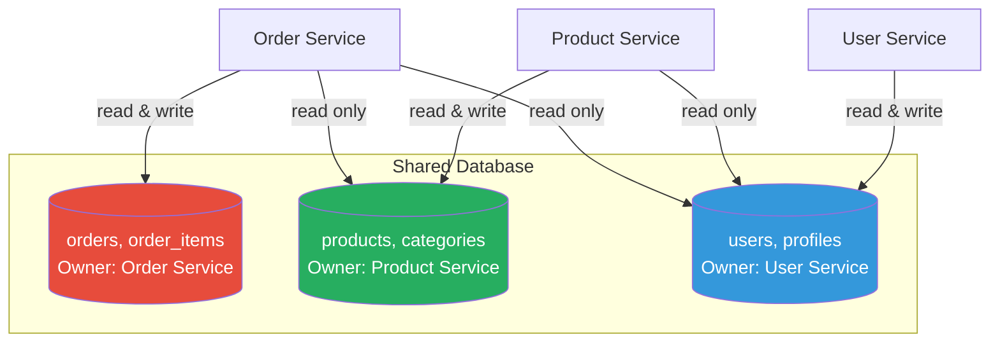
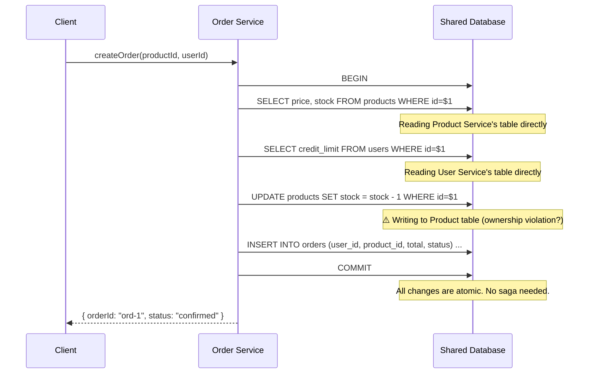

# Shared Database

## 1. The Problem

Your startup is growing. You've split your monolith into 3 services: Orders, Inventory, and Users. Each team wants to deploy independently. The CTO read about "database per service" and mandated separate databases.

Six months later:

1. **The product listing page** needs product info (Inventory DB), seller rating (Users DB), and recent order count (Orders DB). What used to be:

   ```sql
   SELECT p.*, u.rating, COUNT(o.id) as order_count
   FROM products p
   JOIN users u ON p.seller_id = u.id
   LEFT JOIN orders o ON o.product_id = p.id
   GROUP BY p.id, u.rating;
   ```

   Now requires 3 API calls, client-side joining, and takes 400ms instead of 15ms.

2. **Consistency nightmares.** When an order is placed, you need to atomically deduct inventory and create the order. Two databases. No shared transaction. You implemented a Saga, which took 3 weeks and has 4 edge-case bugs in production.

3. **Operational burden.** 3 PostgreSQL instances. 3 backup schedules. 3 monitoring dashboards. 3 sets of connection pools. Your team is 4 people. One person spends 30% of their time on database operations.

4. **Data duplication.** Product names are stored in all 3 databases (denormalized for query independence). When a product name changes, 3 databases need updating. Last week, a user saw different product names on different pages.

**You split the database for independence, but gained complexity, inconsistency, and operational overhead that your small team can't afford.**

---

## 2. Naïve Solutions (and Why They Fail)

### Attempt 1: Keep Separate Databases, Add API Composition

```typescript
async function getProductPage(productId: string) {
  const [product, seller, orders] = await Promise.all([
    inventoryService.getProduct(productId),
    userService.getUser(product.sellerId),     // Can't — need product first
    orderService.getOrderCount(productId),
  ]);
  // Manually merge...
}
```

**Why it breaks:**
- Serial dependencies (need product first to get seller ID).
- One service down = entire page fails.
- Latency: 3 network hops vs 1 database query.
- N+1: listing 50 products = 150 API calls.

### Attempt 2: Data Replication via Events

Each service subscribes to others' events and maintains local copies.

**Why it breaks for a small team:**
- Now you're maintaining an event bus, event schemas, projectors, and dealing with eventual consistency bugs.
- More infrastructure than your 4-person team can maintain.
- Over-engineering for your scale.

---

## 3. The Insight

**When services need strong consistency and your team is small, a shared database with clear ownership conventions is pragmatically better than separate databases with complex synchronization.** Each service "owns" its tables (only it can write to them), but all services can read from any table. The database provides consistency and joins. Conventions replace infrastructure.

---

## 4. The Pattern

### Shared Database

**Definition:** Multiple services or modules connect to the same database instance. Each service **owns** specific tables (only it can write to them), but can read data from tables owned by other services. The database schema serves as the integration layer. Cross-service consistency comes from database transactions and joins.

**Guarantees:**
- ACID transactions across all tables (cross-service consistency).
- SQL JOINs across any tables (query flexibility).
- One database to operate (backup, monitor, maintain).
- Simple data access — no API composition or event synchronization.

**Non-guarantees:**
- Does NOT provide schema independence. Renaming a column used by multiple readers requires coordination.
- Does NOT allow independent technology choices. Everyone uses the same database engine.
- Does NOT enable independent scaling per service.

---

## 5. Mental Model

Think of a **shared kitchen in an apartment**. Each roommate has their own shelf in the fridge (ownership — only they put food in). But everyone can see what's in the fridge (read access). Cooking a meal with ingredients from multiple shelves is easy — you're in the same kitchen. The rules are: "Don't move someone else's food, but you can look at it and use it with permission." This works great with 4 roommates. It breaks down with 40.

---

## 6. Structure





---

## 7. Code Example

### TypeScript

```typescript
import { Pool } from "pg";
import express from "express";

// One database, shared by all services
const db = new Pool({ connectionString: "postgres://localhost/app_db" });

// ========== OWNERSHIP: Order Service owns orders/order_items ==========
// ========== OWNERSHIP: Product Service owns products/categories ==========
// ========== OWNERSHIP: User Service owns users/profiles ==========

// ========== ORDER SERVICE ==========
const orderApp = express();
orderApp.use(express.json());

orderApp.post("/orders", async (req, res) => {
  const { userId, productId, quantity } = req.body;
  const client = await db.connect();

  try {
    await client.query("BEGIN");

    // READ from Product table (owned by Product Service) — allowed
    const { rows: products } = await client.query(
      "SELECT id, name, price, stock FROM products WHERE id = $1 FOR UPDATE",
      [productId]
    );
    if (!products[0]) throw new Error("Product not found");
    if (products[0].stock < quantity) throw new Error("Insufficient stock");

    // READ from User table (owned by User Service) — allowed
    const { rows: users } = await client.query(
      "SELECT id, name, email FROM users WHERE id = $1",
      [userId]
    );
    if (!users[0]) throw new Error("User not found");

    const total = products[0].price * quantity;

    // WRITE to orders table (owned by Order Service) — allowed
    const { rows: orders } = await client.query(
      `INSERT INTO orders (id, user_id, product_id, product_name, price_at_time, quantity, total, status)
       VALUES (gen_random_uuid(), $1, $2, $3, $4, $5, $6, 'confirmed')
       RETURNING id`,
      [userId, productId, products[0].name, products[0].price, quantity, total]
    );

    // WRITE to products table (owned by Product Service) — CONVENTION:
    // Option A: Product Service exposes a function/stored proc for this.
    // Option B: Order Service writes directly with team agreement.
    await client.query(
      "UPDATE products SET stock = stock - $1 WHERE id = $2",
      [quantity, productId]
    );

    await client.query("COMMIT");
    res.status(201).json({ orderId: orders[0].id, total });
  } catch (err) {
    await client.query("ROLLBACK");
    res.status(400).json({ error: (err as Error).message });
  } finally {
    client.release();
  }
});

// ========== PRODUCT LISTING (cross-service JOIN — trivial) ==========
orderApp.get("/products/listing", async (req, res) => {
  // A single query that would require 3 API calls with separate databases
  const { rows } = await db.query(`
    SELECT 
      p.id, p.name, p.price, p.stock,
      u.name as seller_name,
      u.rating as seller_rating,
      COUNT(o.id) as total_orders
    FROM products p
    JOIN users u ON p.seller_id = u.id
    LEFT JOIN orders o ON o.product_id = p.id
    GROUP BY p.id, u.id
    ORDER BY total_orders DESC
    LIMIT 50
  `);
  res.json(rows);
});

orderApp.listen(3000);
```

### Go

```go
package main

import (
	"database/sql"
	"encoding/json"
	"log"
	"net/http"

	_ "github.com/lib/pq"
)

// Shared database connection
var db *sql.DB

type CreateOrderRequest struct {
	UserID    string `json:"user_id"`
	ProductID string `json:"product_id"`
	Quantity  int    `json:"quantity"`
}

func createOrder(w http.ResponseWriter, r *http.Request) {
	var req CreateOrderRequest
	json.NewDecoder(r.Body).Decode(&req)

	tx, err := db.Begin()
	if err != nil {
		http.Error(w, "db error", 500)
		return
	}
	defer tx.Rollback()

	// Read from products table (owned by Product Service)
	var productName string
	var price float64
	var stock int
	err = tx.QueryRow(
		"SELECT name, price, stock FROM products WHERE id=$1 FOR UPDATE", req.ProductID,
	).Scan(&productName, &price, &stock)
	if err != nil {
		http.Error(w, "product not found", 404)
		return
	}
	if stock < req.Quantity {
		http.Error(w, "insufficient stock", 409)
		return
	}

	// Read from users table (owned by User Service)
	var userName string
	err = tx.QueryRow("SELECT name FROM users WHERE id=$1", req.UserID).Scan(&userName)
	if err != nil {
		http.Error(w, "user not found", 404)
		return
	}

	total := price * float64(req.Quantity)

	// Write to orders table (owned by Order Service)
	var orderID string
	tx.QueryRow(
		`INSERT INTO orders (user_id, product_id, product_name, price_at_time, quantity, total, status)
		 VALUES ($1,$2,$3,$4,$5,$6,'confirmed') RETURNING id`,
		req.UserID, req.ProductID, productName, price, req.Quantity, total,
	).Scan(&orderID)

	// Write to products table (stock deduction — with team agreement)
	tx.Exec("UPDATE products SET stock = stock - $1 WHERE id = $2", req.Quantity, req.ProductID)

	if err := tx.Commit(); err != nil {
		http.Error(w, "commit failed", 500)
		return
	}

	json.NewEncoder(w).Encode(map[string]interface{}{
		"order_id": orderID, "total": total,
	})
}

// Product listing with cross-table JOIN
func productListing(w http.ResponseWriter, r *http.Request) {
	rows, err := db.Query(`
		SELECT p.id, p.name, p.price, u.name as seller, COUNT(o.id) as orders
		FROM products p
		JOIN users u ON p.seller_id = u.id
		LEFT JOIN orders o ON o.product_id = p.id
		GROUP BY p.id, u.id
		ORDER BY orders DESC LIMIT 50
	`)
	if err != nil {
		http.Error(w, "query error", 500)
		return
	}
	defer rows.Close()

	type listing struct {
		ID     string  `json:"id"`
		Name   string  `json:"name"`
		Price  float64 `json:"price"`
		Seller string  `json:"seller"`
		Orders int     `json:"orders"`
	}

	var results []listing
	for rows.Next() {
		var l listing
		rows.Scan(&l.ID, &l.Name, &l.Price, &l.Seller, &l.Orders)
		results = append(results, l)
	}
	json.NewEncoder(w).Encode(results)
}

func main() {
	var err error
	db, err = sql.Open("postgres", "postgres://localhost/app_db?sslmode=disable")
	if err != nil {
		log.Fatal(err)
	}

	http.HandleFunc("/orders", createOrder)
	http.HandleFunc("/products/listing", productListing)
	log.Fatal(http.ListenAndServe(":3000", nil))
}
```

---

## 8. Gotchas & Beginner Mistakes

| Mistake | Why It Hurts |
|---|---|
| **No ownership rules** | Every service writes to every table. Schema changes are impossible. Establish clear ownership: only the owner writes. |
| **Coupling to column names** | Service A reads `products.name`. Product team renames to `products.title`. Service A breaks. Use views or versioned APIs if instability is expected. |
| **God queries** | A single query that JOINs 7 tables across 4 services' domains. Refactor into smaller, focused queries. |
| **Lock contention** | Order Service locks the products row for stock deduction while Product Service locks it for price update. Deadlocks. Agree on locking order conventions. |
| **No migration coordination** | Product team deploys a migration that drops a column used by 3 other services. Add cross-team migration reviews. |

---

## 9. Related & Confusable Patterns

| Pattern | How It Differs |
|---|---|
| **Database per Service** | Opposite approach: each service has its own database. Better isolation, more operational complexity. |
| **Schema per Service** | Middle ground: shared database instance but separate schemas per service. Some isolation with shared infrastructure. |
| **Shared Kernel (DDD)** | Two bounded contexts explicitly agree to share a subset of the domain. Shared Database is about infrastructure sharing; Shared Kernel is about domain sharing. |
| **API Composition** | Aggregates data from multiple API calls. Replacement for JOINs when using database-per-service. Not needed with shared DB. |

---

## 10. When This Pattern Is the WRONG Choice

- **Large organizations (> 3 teams)** — Coordination overhead for schema changes becomes prohibitive. Each migration needs N-team approval.
- **Different scaling needs** — One service needs 100x read throughput. With a shared database, scaling that service scales the entire database.
- **Polyglot persistence** — Some services need PostgreSQL, others need MongoDB, others need Redis. A shared database forces one technology.
- **Independent deployment** — If deploying Service A must never affect Service B, shared tables create implicit coupling through schema changes and lock contention.

**Symptoms it's time to split:**
- Schema migration reviews take longer than writing the migration.
- One service's queries cause latency spikes for other services.
- Teams move at different speeds, but the shared database forces them to synchronize.
- "Don't touch that column, the other team uses it" is heard weekly.

**How to back out:** Gradually migrate to database-per-service: (1) Create service-owned databases, (2) Dual-write to both, (3) Migrate reads to the new database, (4) Stop writing to the shared database, (5) Drop shared tables. Use Strangler Fig approach.
