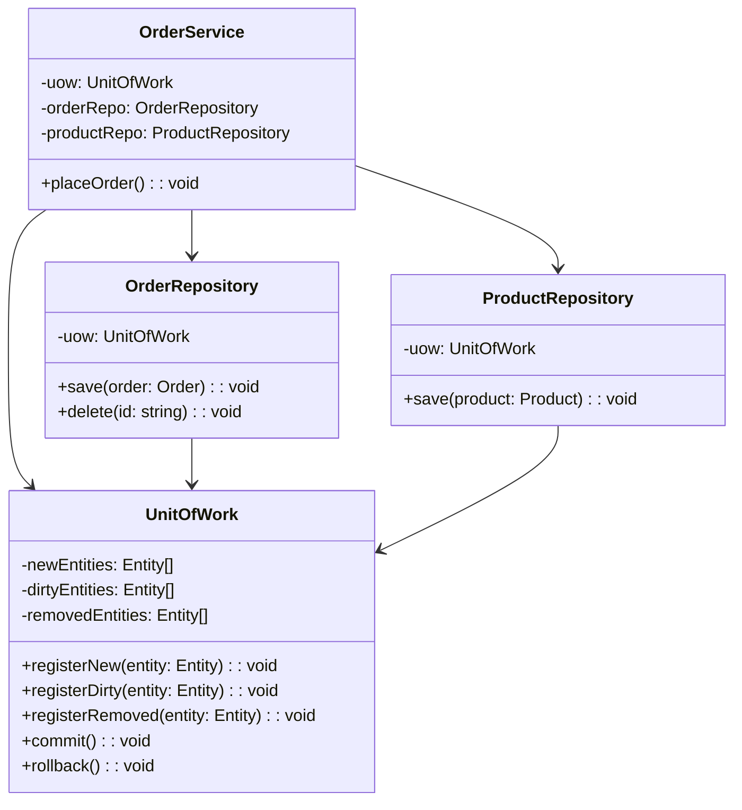
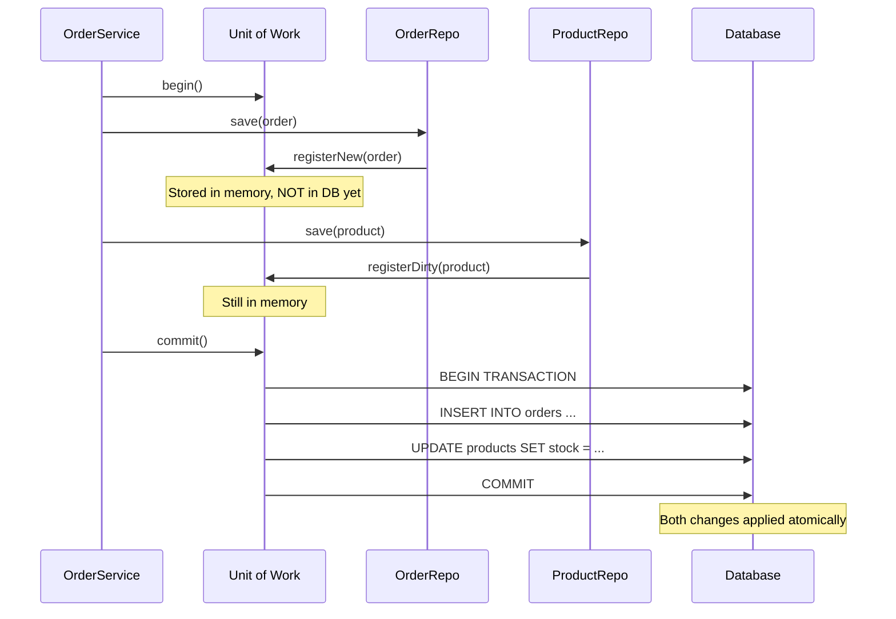

# Unit of Work

## 1. The Problem

You're building a checkout system. When a customer places an order, you need to:

1. **Create** the order record.
2. **Deduct** stock from each product.
3. **Create** order items linking the order to products.
4. **Update** the customer's loyalty points.

```typescript
async function placeOrder(customerId: string, items: CartItem[]) {
  const orderId = generateId();
  
  // Step 1: Create order
  await orderRepo.save({ id: orderId, customerId, status: "pending" });
  
  // Step 2: Deduct stock for each item
  for (const item of items) {
    const product = await productRepo.findById(item.productId);
    product.stock -= item.quantity;
    await productRepo.save(product);
  }
  
  // Step 3: Create order items
  for (const item of items) {
    await orderItemRepo.save({ orderId, productId: item.productId, quantity: item.quantity });
  }
  
  // Step 4: Update loyalty points  <-- THIS FAILS (network timeout)
  const customer = await customerRepo.findById(customerId);
  customer.loyaltyPoints += calculatePoints(items);
  await customerRepo.save(customer);   // 💥 Timeout error
}
```

**Step 4 fails.** Now you have:
- An order created ✓
- Stock deducted ✓
- Order items created ✓
- Loyalty points NOT updated ✗

**The database is in an inconsistent state.** The order exists but the customer's points don't reflect it. Worse: if you retry, stock gets deducted twice.

Each `repo.save()` is an independent database call. There's no coordination. There's no "all or nothing."

---

## 2. Naïve Solutions (and Why They Fail)

### Attempt 1: Manual Rollback

```typescript
try {
  await orderRepo.save(order);
  await productRepo.save(product);
  await orderItemRepo.save(orderItem);
  await customerRepo.save(customer);
} catch (err) {
  // Manually undo everything
  await orderRepo.delete(orderId);
  for (const item of items) {
    const product = await productRepo.findById(item.productId);
    product.stock += item.quantity;  // Restore stock
    await productRepo.save(product);
  }
  // What if the ROLLBACK fails?
}
```

**Why it breaks:**
- What if the rollback fails? Now you have partial data AND a failed rollback.
- Race condition: between the write and the rollback, another request reads the inconsistent data.
- You're implementing a hand-rolled transaction manager. Every new operation needs custom rollback logic.

### Attempt 2: Pass a Transaction to Each Repository

```typescript
const trx = await db.beginTransaction();
await orderRepo.save(order, trx);
await productRepo.save(product, trx);
await orderItemRepo.save(orderItem, trx);
await trx.commit();
```

**Why it breaks partially:**
- Works technically but leaks database transactions into business logic.
- Every service method now manages transactions. `trx` is passed everywhere.
- Repositories lose their clean interface — every method needs an optional `trx` parameter.
- Forgetting to pass `trx` means that operation runs outside the transaction silently.

---

## 3. The Insight

**Track all changes made within a business operation, then commit them all at once in a single transaction.** Instead of each repository immediately writing to the database, register changes (inserts, updates, deletes) in a shared tracker. When the operation completes successfully, flush all changes in one atomic database transaction. If anything fails, discard all changes — nothing was written.

---

## 4. The Pattern

### Unit of Work

**Definition:** An object that maintains a list of objects affected by a business transaction and coordinates the writing of changes and the resolution of concurrency problems. It tracks which objects have been created, modified, or deleted, and commits all changes atomically when the business operation is complete.

**Guarantees:**
- All changes within a business operation succeed or fail atomically.
- No partial writes — either everything is committed or nothing is.
- Each entity is persisted exactly once, even if modified multiple times during the operation.

**Non-guarantees:**
- Does NOT work across multiple databases or services (that's the Saga pattern).
- Does NOT handle concurrent modifications from other transactions (that requires optimistic/pessimistic locking).

---

## 5. Mental Model

Think of a **shopping cart** at a physical store. You walk around the store adding items to your cart, removing some, swapping sizes. Nothing leaves the store until you **checkout** (commit). If you decide to abandon the cart, everything goes back — nothing was purchased. The cart is the Unit of Work. Checkout is the commit. Walking out without buying is the rollback.

---

## 6. Structure





---

## 7. Code Example

### TypeScript

```typescript
import { Pool, PoolClient } from "pg";

// ========== DOMAIN ==========
interface Order {
  id: string;
  customerId: string;
  total: number;
  status: string;
}

interface Product {
  id: string;
  name: string;
  stock: number;
  price: number;
}

// ========== UNIT OF WORK ==========
type EntityType = "order" | "product";
type ChangeType = "insert" | "update" | "delete";

interface TrackedChange {
  entityType: EntityType;
  changeType: ChangeType;
  entity: any;
}

class UnitOfWork {
  private changes: TrackedChange[] = [];
  private client: PoolClient | null = null;

  constructor(private pool: Pool) {}

  registerNew(entityType: EntityType, entity: any) {
    this.changes.push({ entityType, changeType: "insert", entity });
  }

  registerDirty(entityType: EntityType, entity: any) {
    // Deduplicate: if entity already tracked, update the reference
    const existingIdx = this.changes.findIndex(
      (c) => c.entityType === entityType && c.entity.id === entity.id
    );
    if (existingIdx >= 0) {
      this.changes[existingIdx].entity = entity;
    } else {
      this.changes.push({ entityType, changeType: "update", entity });
    }
  }

  registerRemoved(entityType: EntityType, entity: any) {
    this.changes.push({ entityType, changeType: "delete", entity });
  }

  async commit(): Promise<void> {
    this.client = await this.pool.connect();
    try {
      await this.client.query("BEGIN");

      for (const change of this.changes) {
        await this.applyChange(change);
      }

      await this.client.query("COMMIT");
      this.changes = [];
    } catch (err) {
      await this.client.query("ROLLBACK");
      this.changes = [];
      throw err;
    } finally {
      this.client.release();
      this.client = null;
    }
  }

  private async applyChange(change: TrackedChange): Promise<void> {
    const { entityType, changeType, entity } = change;

    if (entityType === "order") {
      if (changeType === "insert") {
        await this.client!.query(
          "INSERT INTO orders (id, customer_id, total, status) VALUES ($1, $2, $3, $4)",
          [entity.id, entity.customerId, entity.total, entity.status]
        );
      } else if (changeType === "update") {
        await this.client!.query(
          "UPDATE orders SET total=$1, status=$2 WHERE id=$3",
          [entity.total, entity.status, entity.id]
        );
      } else if (changeType === "delete") {
        await this.client!.query("DELETE FROM orders WHERE id=$1", [entity.id]);
      }
    }

    if (entityType === "product") {
      if (changeType === "update") {
        await this.client!.query(
          "UPDATE products SET stock=$1, price=$2 WHERE id=$3",
          [entity.stock, entity.price, entity.id]
        );
      }
    }
  }
}

// ========== REPOSITORIES (register changes with UoW instead of writing directly) ==========
class OrderRepository {
  constructor(private uow: UnitOfWork, private pool: Pool) {}

  async findById(id: string): Promise<Order | null> {
    const { rows } = await this.pool.query("SELECT * FROM orders WHERE id=$1", [id]);
    return rows[0] || null;
  }

  save(order: Order): void {
    this.uow.registerNew("order", order);
  }

  update(order: Order): void {
    this.uow.registerDirty("order", order);
  }

  delete(order: Order): void {
    this.uow.registerRemoved("order", order);
  }
}

class ProductRepository {
  constructor(private uow: UnitOfWork, private pool: Pool) {}

  async findById(id: string): Promise<Product | null> {
    const { rows } = await this.pool.query("SELECT * FROM products WHERE id=$1", [id]);
    return rows[0] || null;
  }

  update(product: Product): void {
    this.uow.registerDirty("product", product);
  }
}

// ========== BUSINESS LOGIC ==========
async function placeOrder(pool: Pool, customerId: string, items: { productId: string; qty: number }[]) {
  const uow = new UnitOfWork(pool);
  const orderRepo = new OrderRepository(uow, pool);
  const productRepo = new ProductRepository(uow, pool);

  // Step 1: Create order (tracked, not written)
  const orderId = crypto.randomUUID();
  let total = 0;

  for (const item of items) {
    const product = await productRepo.findById(item.productId);
    if (!product) throw new Error(`Product ${item.productId} not found`);
    if (product.stock < item.qty) throw new Error(`Insufficient stock for ${product.name}`);

    product.stock -= item.qty;
    total += product.price * item.qty;
    productRepo.update(product); // Tracked, not written
  }

  orderRepo.save({ id: orderId, customerId, total, status: "confirmed" }); // Tracked, not written

  // Step 2: Commit everything atomically
  await uow.commit(); // BEGIN → INSERT order → UPDATE all products → COMMIT
  
  return orderId;
}
```

### Go

```go
package main

import (
	"context"
	"database/sql"
	"fmt"
)

// Domain
type Order struct {
	ID         string
	CustomerID string
	Total      float64
	Status     string
}

type Product struct {
	ID    string
	Name  string
	Stock int
	Price float64
}

// Change tracking
type changeType int

const (
	changeInsert changeType = iota
	changeUpdate
	changeDelete
)

type trackedChange struct {
	table  string
	change changeType
	entity interface{}
}

// Unit of Work
type UnitOfWork struct {
	db      *sql.DB
	changes []trackedChange
}

func NewUnitOfWork(db *sql.DB) *UnitOfWork {
	return &UnitOfWork{db: db}
}

func (u *UnitOfWork) RegisterNew(table string, entity interface{}) {
	u.changes = append(u.changes, trackedChange{table, changeInsert, entity})
}

func (u *UnitOfWork) RegisterDirty(table string, entity interface{}) {
	u.changes = append(u.changes, trackedChange{table, changeUpdate, entity})
}

func (u *UnitOfWork) RegisterRemoved(table string, entity interface{}) {
	u.changes = append(u.changes, trackedChange{table, changeDelete, entity})
}

func (u *UnitOfWork) Commit(ctx context.Context) error {
	tx, err := u.db.BeginTx(ctx, nil)
	if err != nil {
		return err
	}
	defer tx.Rollback() // no-op if already committed

	for _, c := range u.changes {
		if err := u.applyChange(ctx, tx, c); err != nil {
			return fmt.Errorf("applying change to %s: %w", c.table, err)
		}
	}

	if err := tx.Commit(); err != nil {
		return err
	}

	u.changes = nil
	return nil
}

func (u *UnitOfWork) applyChange(ctx context.Context, tx *sql.Tx, c trackedChange) error {
	switch c.table {
	case "orders":
		o := c.entity.(*Order)
		switch c.change {
		case changeInsert:
			_, err := tx.ExecContext(ctx,
				"INSERT INTO orders (id, customer_id, total, status) VALUES ($1,$2,$3,$4)",
				o.ID, o.CustomerID, o.Total, o.Status)
			return err
		case changeUpdate:
			_, err := tx.ExecContext(ctx,
				"UPDATE orders SET total=$1, status=$2 WHERE id=$3",
				o.Total, o.Status, o.ID)
			return err
		case changeDelete:
			_, err := tx.ExecContext(ctx, "DELETE FROM orders WHERE id=$1", o.ID)
			return err
		}
	case "products":
		p := c.entity.(*Product)
		if c.change == changeUpdate {
			_, err := tx.ExecContext(ctx,
				"UPDATE products SET stock=$1, price=$2 WHERE id=$3",
				p.Stock, p.Price, p.ID)
			return err
		}
	}
	return nil
}

// Business logic
func PlaceOrder(ctx context.Context, db *sql.DB, customerID string, items []struct {
	ProductID string
	Qty       int
}) (string, error) {
	uow := NewUnitOfWork(db)
	total := 0.0

	for _, item := range items {
		var p Product
		err := db.QueryRowContext(ctx,
			"SELECT id, name, stock, price FROM products WHERE id=$1", item.ProductID,
		).Scan(&p.ID, &p.Name, &p.Stock, &p.Price)
		if err != nil {
			return "", fmt.Errorf("product %s not found", item.ProductID)
		}
		if p.Stock < item.Qty {
			return "", fmt.Errorf("insufficient stock for %s", p.Name)
		}

		p.Stock -= item.Qty
		total += p.Price * float64(item.Qty)
		uow.RegisterDirty("products", &p) // Tracked, not written
	}

	orderID := fmt.Sprintf("ord-%s", customerID) // simplified
	uow.RegisterNew("orders", &Order{
		ID: orderID, CustomerID: customerID, Total: total, Status: "confirmed",
	})

	// Commit: BEGIN → INSERT order → UPDATE products → COMMIT
	if err := uow.Commit(ctx); err != nil {
		return "", err
	}
	return orderID, nil
}
```

---

## 8. Gotchas & Beginner Mistakes

| Mistake | Why It Hurts |
|---|---|
| **Long-lived Unit of Work** | Holding a UoW across an entire request lifecycle. Database connections are held for minutes. Keep UoW scope tight: begin, do work, commit. |
| **Reads inside the UoW** | Reading uncommitted changes from the UoW's tracked entities while also reading from the DB. Identity map confusion. Decide: read from UoW cache or DB. |
| **No concurrency control** | Two UoWs modify the same product simultaneously. Last write wins. Add optimistic locking (version column) or pessimistic locking (SELECT FOR UPDATE). |
| **Cross-service UoW** | Trying to make a UoW span two microservices. Can't — each has its own database. Use the Saga pattern instead. |
| **Forgetting to commit** | Registering changes but never calling `commit()`. All work is silently lost. Always commit in a deferred/finally block. |

---

## 9. Related & Confusable Patterns

| Pattern | How It Differs |
|---|---|
| **Repository** | Abstracts data access for a single entity type. UoW coordinates transactions ACROSS multiple repositories. |
| **Transaction Script** | Procedural code that runs SQL in a transaction. UoW is object-oriented: entities register changes, UoW flushes them. |
| **Saga** | Coordinates transactions across services/databases. UoW is single-database. |
| **Event Sourcing** | Records events instead of state changes. Can replace UoW's tracking mechanism — the event log IS the unit of work. |

---

## 10. When This Pattern Is the WRONG Choice

- **Single entity operations** — If each request only touches one table, a simple `BEGIN; UPDATE; COMMIT` suffices. No tracking overhead needed.
- **Distributed systems** — UoW assumes a single database transaction. Multiple services = multiple databases = can't use UoW. Use Saga.
- **High-throughput writes** — UoW batches writes, but the in-memory tracking has overhead. For bulk inserts (ETL, data migration), use direct batch SQL.

**Symptoms you chose it too early:**
- Every UoW commit contains exactly one change. The tracking is overhead for nothing.
- You're passing the UoW object through 5 layers of function calls.
- The UoW's `applyChange` method is 500 lines of entity-specific SQL.

**How to back out:** Remove the UoW. Pass a database transaction object (`trx`) to repository methods directly, or use simple procedural transaction scripts.
