# Write-Ahead Log (WAL)

## 1. The Problem

You're building a key-value store. When a client sends `PUT key=user:42 value={name:"Alice"}`, you write directly to a data file on disk:

```typescript
async function put(key: string, value: string) {
  const offset = dataFile.length;
  dataFile.write(`${key}=${value}\n`);  // Write to data file
  index.set(key, offset);              // Update in-memory index
}
```

This is fast. Average write: 5ms. But there's a fatal problem.

**Scenario:** A client sends `PUT user:42 {name:"Alice"}`. Your process receives it, starts writing to the data file, writes 60% of the bytes... and the power goes out.

When the system restarts:
- The data file has a **partially written** record: `user:42={name:"Ali` — corrupted.
- The in-memory index is gone (it was RAM-only).
- You have no way to determine what was in-flight when the crash happened.
- You can't tell which records are complete and which are torn.

**Worse scenario:** Between two writes, you update the in-memory index BEFORE the data file is fully flushed to disk. The index says the record exists at offset 8192, but the actual bytes at offset 8192 are partially written garbage.

**The fundamental problem:** Writing directly to the data structure's storage is not crash-safe. A crash during a write leaves the data structure in an inconsistent state.

---

## 2. Naïve Solutions (and Why They Fail)

### Attempt 1: fsync After Every Write

```typescript
async function put(key: string, value: string) {
  dataFile.write(`${key}=${value}\n`);
  await dataFile.fsync();  // Force flush to disk
  index.set(key, offset);
}
```

**Why it breaks partially:**
- `fsync` guarantees the bytes are on disk, but doesn't help with partial writes. If you crash MID-write (after writing 60%), fsync doesn't help — the partial data is on disk.
- Adding fsync per write tanks throughput: from 50,000 writes/sec to ~500 (disk latency per fsync).

### Attempt 2: Copy-on-Write

Write new data to a temp file, then atomically rename.

**Why it breaks:**
- Works for single-file key-value stores, but not for complex data structures (B-trees, LSM trees, multi-file databases).
- Copying the entire file for each write is O(n) in data size. With 10 GB of data, every write copies 10 GB.

### Attempt 3: In-Memory Only (Just Accept Loss)

Keep everything in RAM. Fast writes. Accept that crashes lose data.

**Why it breaks:**
- Unacceptable for any system that promises durability. Banking, e-commerce, messaging — data loss is not an option.

---

## 3. The Insight

**Write the operation to a sequential log FIRST, before applying it to the actual data structure.** If the system crashes, replay the log to recover. The log is append-only and sequential, which is the fastest possible disk write pattern. The actual data structure update can happen asynchronously. Even if the data structure is corrupted by a crash, the log contains the complete record of what should have happened.

---

## 4. The Pattern

### Write-Ahead Log (WAL)

**Definition:** A technique where all modifications are written to a **sequential, append-only log** on durable storage before being applied to the actual data structure. On crash recovery, the log is replayed to restore the system to a consistent state. The log provides durability and atomicity for individual operations.

Also known as: **Transaction log**, **Redo log**, **Journal**

**Guarantees:**
- Durability — committed writes survive crashes.
- Atomicity — a write either fully appears in the log or doesn't.
- Recovery — replay the log from the last checkpoint to rebuild state.

**Non-guarantees:**
- Does NOT provide isolation (concurrent access control).
- Does NOT guarantee performance — fsync to WAL is required for true durability.
- Does NOT replace the need for the actual data structure. The WAL is supplementary.

---

## 5. Mental Model

Think of a **ship captain's logbook**. Before any maneuver (changing course, deploying anchor), the captain writes the intended action in the logbook. If the captain is incapacitated mid-maneuver, the first mate reads the logbook to understand what was happening and can complete or reverse the action. The logbook IS the authoritative record of what was decided. The ship's current position is derived from the logbook.

---

## 6. Structure

```mermaid
sequenceDiagram
    participant C as Client
    participant E as Engine
    participant W as WAL
    participant D as Data File

    C->>E: PUT("user:42", "{name:'Alice'}")
    E->>W: Append: [PUT, user:42, {name:'Alice'}, checksum]
    W->>W: fsync() — ensure on disk
    W-->>E: Log written (LSN: 1001)
    E-->>C: ACK — write is durable

    Note over E: Asynchronously...
    E->>D: Write to B-tree / hash table
    Note over D: Even if this crashes, WAL has the record

    Note over E: 💥 CRASH during data file write

    Note over E: === RECOVERY ===
    E->>W: Read WAL from last checkpoint
    W-->>E: [PUT, user:42, {name:'Alice'}]
    E->>D: Re-apply: write to data file
    Note over D: Data structure is now consistent
```




---

## 7. Code Example

### TypeScript

```typescript
import * as fs from "fs";
import * as crypto from "crypto";

// ========== WAL ENTRY ==========
interface WalEntry {
  lsn: number;         // Log Sequence Number
  operation: "PUT" | "DELETE";
  key: string;
  value?: string;
  checksum: string;    // Integrity check
  timestamp: number;
}

function computeChecksum(op: string, key: string, value?: string): string {
  return crypto.createHash("sha256").update(`${op}:${key}:${value || ""}`).digest("hex").slice(0, 16);
}

// ========== WRITE-AHEAD LOG ==========
class WriteAheadLog {
  private fd: number;
  private currentLsn: number = 0;

  constructor(private logPath: string) {
    this.fd = fs.openSync(logPath, "a+");
    this.currentLsn = this.recoverLsn();
  }

  // Append entry to WAL (sequential write + fsync)
  append(operation: "PUT" | "DELETE", key: string, value?: string): number {
    this.currentLsn++;
    const entry: WalEntry = {
      lsn: this.currentLsn,
      operation,
      key,
      value,
      checksum: computeChecksum(operation, key, value),
      timestamp: Date.now(),
    };

    const line = JSON.stringify(entry) + "\n";
    fs.writeSync(this.fd, line);
    fs.fsyncSync(this.fd); // Critical: ensure on disk before returning

    return this.currentLsn;
  }

  // Read all entries (for recovery)
  readAll(): WalEntry[] {
    const content = fs.readFileSync(this.logPath, "utf-8");
    const entries: WalEntry[] = [];

    for (const line of content.split("\n").filter(Boolean)) {
      try {
        const entry: WalEntry = JSON.parse(line);
        // Verify checksum — detect torn writes
        const expected = computeChecksum(entry.operation, entry.key, entry.value);
        if (entry.checksum === expected) {
          entries.push(entry);
        } else {
          console.warn(`Corrupt WAL entry at LSN ${entry.lsn}, skipping`);
        }
      } catch {
        console.warn("Unparseable WAL line, skipping (torn write)");
      }
    }
    return entries;
  }

  // Truncate log after checkpoint (entries already applied to data store)
  truncate(upToLsn: number): void {
    const entries = this.readAll().filter((e) => e.lsn > upToLsn);
    fs.writeFileSync(this.logPath, entries.map((e) => JSON.stringify(e) + "\n").join(""));
    this.fd = fs.openSync(this.logPath, "a+");
  }

  private recoverLsn(): number {
    const entries = this.readAll();
    return entries.length > 0 ? entries[entries.length - 1].lsn : 0;
  }

  close(): void {
    fs.closeSync(this.fd);
  }
}

// ========== KEY-VALUE STORE WITH WAL ==========
class KVStore {
  private data: Map<string, string> = new Map();
  private wal: WriteAheadLog;
  private lastAppliedLsn: number = 0;

  constructor(walPath: string) {
    this.wal = new WriteAheadLog(walPath);
    this.recover();
  }

  put(key: string, value: string): void {
    // Step 1: Write to WAL first (durable)
    const lsn = this.wal.append("PUT", key, value);

    // Step 2: Apply to in-memory data structure
    this.data.set(key, value);
    this.lastAppliedLsn = lsn;
  }

  delete(key: string): void {
    const lsn = this.wal.append("DELETE", key);
    this.data.delete(key);
    this.lastAppliedLsn = lsn;
  }

  get(key: string): string | undefined {
    return this.data.get(key);
  }

  // Recovery: replay WAL to rebuild in-memory state
  private recover(): void {
    const entries = this.wal.readAll();
    console.log(`Recovering ${entries.length} WAL entries...`);

    for (const entry of entries) {
      if (entry.operation === "PUT" && entry.value !== undefined) {
        this.data.set(entry.key, entry.value);
      } else if (entry.operation === "DELETE") {
        this.data.delete(entry.key);
      }
      this.lastAppliedLsn = entry.lsn;
    }

    console.log(`Recovery complete. ${this.data.size} keys restored.`);
  }

  // Checkpoint: entries are safely persisted elswhere, truncate WAL
  checkpoint(): void {
    this.wal.truncate(this.lastAppliedLsn);
    console.log(`Checkpoint at LSN ${this.lastAppliedLsn}`);
  }
}

// ========== USAGE ==========
const store = new KVStore("/tmp/mydb.wal");
store.put("user:1", '{"name":"Alice"}');
store.put("user:2", '{"name":"Bob"}');
store.delete("user:1");

console.log(store.get("user:2")); // {"name":"Bob"}

// After restart, recover() replays the WAL automatically
```

### Go

```go
package main

import (
	"bufio"
	"crypto/sha256"
	"encoding/json"
	"fmt"
	"os"
	"sync"
)

type WalEntry struct {
	LSN       int    `json:"lsn"`
	Operation string `json:"operation"` // "PUT" or "DELETE"
	Key       string `json:"key"`
	Value     string `json:"value,omitempty"`
	Checksum  string `json:"checksum"`
}

func checksum(op, key, value string) string {
	h := sha256.Sum256([]byte(fmt.Sprintf("%s:%s:%s", op, key, value)))
	return fmt.Sprintf("%x", h[:8])
}

// Write-Ahead Log
type WAL struct {
	mu   sync.Mutex
	file *os.File
	lsn  int
}

func OpenWAL(path string) (*WAL, error) {
	f, err := os.OpenFile(path, os.O_CREATE|os.O_RDWR|os.O_APPEND, 0644)
	if err != nil {
		return nil, err
	}
	w := &WAL{file: f}
	entries := w.ReadAll()
	if len(entries) > 0 {
		w.lsn = entries[len(entries)-1].LSN
	}
	return w, nil
}

func (w *WAL) Append(op, key, value string) int {
	w.mu.Lock()
	defer w.mu.Unlock()

	w.lsn++
	entry := WalEntry{
		LSN:       w.lsn,
		Operation: op,
		Key:       key,
		Value:     value,
		Checksum:  checksum(op, key, value),
	}

	data, _ := json.Marshal(entry)
	w.file.Write(append(data, '\n'))
	w.file.Sync() // fsync — ensure durable
	return w.lsn
}

func (w *WAL) ReadAll() []WalEntry {
	w.file.Seek(0, 0)
	scanner := bufio.NewScanner(w.file)
	var entries []WalEntry

	for scanner.Scan() {
		var e WalEntry
		if err := json.Unmarshal(scanner.Bytes(), &e); err != nil {
			continue // Skip corrupt entries (torn writes)
		}
		if checksum(e.Operation, e.Key, e.Value) != e.Checksum {
			continue // Checksum mismatch — torn write
		}
		entries = append(entries, e)
	}
	return entries
}

// Key-Value Store with WAL
type KVStore struct {
	mu   sync.RWMutex
	data map[string]string
	wal  *WAL
}

func NewKVStore(walPath string) (*KVStore, error) {
	wal, err := OpenWAL(walPath)
	if err != nil {
		return nil, err
	}
	store := &KVStore{data: make(map[string]string), wal: wal}
	store.recover()
	return store, nil
}

func (s *KVStore) Put(key, value string) {
	s.wal.Append("PUT", key, value) // WAL first
	s.mu.Lock()
	s.data[key] = value // Then memory
	s.mu.Unlock()
}

func (s *KVStore) Get(key string) (string, bool) {
	s.mu.RLock()
	defer s.mu.RUnlock()
	v, ok := s.data[key]
	return v, ok
}

func (s *KVStore) Delete(key string) {
	s.wal.Append("DELETE", key, "")
	s.mu.Lock()
	delete(s.data, key)
	s.mu.Unlock()
}

func (s *KVStore) recover() {
	entries := s.wal.ReadAll()
	fmt.Printf("Recovering %d WAL entries...\n", len(entries))

	for _, e := range entries {
		switch e.Operation {
		case "PUT":
			s.data[e.Key] = e.Value
		case "DELETE":
			delete(s.data, e.Key)
		}
	}
	fmt.Printf("Recovery complete. %d keys.\n", len(s.data))
}

func main() {
	store, _ := NewKVStore("/tmp/mydb.wal")
	store.Put("user:1", `{"name":"Alice"}`)
	store.Put("user:2", `{"name":"Bob"}`)
	store.Delete("user:1")

	if v, ok := store.Get("user:2"); ok {
		fmt.Println(v) // {"name":"Bob"}
	}
}
```

---

## 8. Gotchas & Beginner Mistakes

| Mistake | Why It Hurts |
|---|---|
| **No fsync on WAL writes** | OS buffers writes. Crash before flush = data loss. `fsync` is the price of durability. Batch writes to amortize cost. |
| **No checksums** | Torn writes produce partial JSON. Without checksums, you can't distinguish complete from corrupt entries on recovery. |
| **Unbounded WAL growth** | Never checkpointing. WAL grows forever. Recovery replays millions of entries. Checkpoint periodically. |
| **WAL as primary storage** | Using the WAL as a database instead of a recovery mechanism. WAL is for sequemtial writes; random reads require a separate data structure. |
| **Skipping recovery on startup** | "It's probably fine." Always replay the WAL on startup. There may be entries not yet applied to the data structure. |

---

## 9. Related & Confusable Patterns

| Pattern | How It Differs |
|---|---|
| **Event Sourcing** | Events are the source of truth forever. WAL is temporary — entries are discarded after checkpointing. ES keeps all events; WAL keeps only unapplied ones. |
| **Transaction Outbox** | Writes an event to an outbox table in the same DB transaction. WAL is a file-level durability mechanism; outbox is an application-level pattern. |
| **Change Data Capture** | Captures changes from the database's internal WAL. CDC reads the WAL; the WAL pattern writes it. |
| **Journaling (Filesystems)** | ext4, NTFS use the same principle for filesystem consistency. Database WAL and filesystem journaling are the same idea at different layers. |

---

## 10. When This Pattern Is the WRONG Choice

- **In-memory caches** — Redis (without persistence), Memcached. If data can be reconstructed from another source, WAL overhead is unnecessary.
- **Idempotent operations** — If every write is idempotent and can be safely retried, crash recovery via retry is simpler than WAL replay.
- **Ephemeral data** — Session tokens, temporary computation results. Losing them on crash is acceptable.

**Symptoms you chose it too early:**
- WAL entries are never actually used for recovery (you always rebuild from a backup anyway).
- The WAL adds latency (fsync per write) but durability isn't a real requirement.
- Your data fits in memory and can be reconstructed from upstream sources.

**How to back out:** Remove the WAL. Accept that crashes may lose recent writes. If durability matters, your backing store (PostgreSQL, etc.) already has its own WAL — you don't need a second one.
