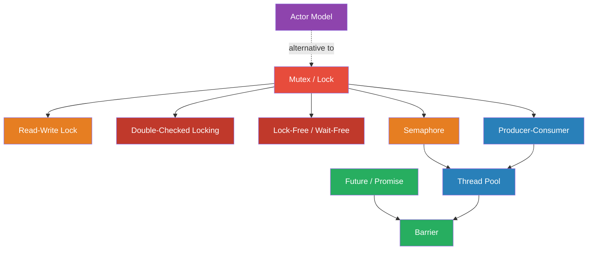

# Module 04 — Concurrency & Parallelism Patterns

> How systems handle multiple things at once without corrupting state, deadlocking, or wasting resources.

## Why This Module Matters

Every backend service handles concurrent requests. Every modern CPU has multiple cores. The gap between "it works on my machine" and "it works under load" is almost always a concurrency bug. These patterns are the vocabulary for reasoning about what happens when multiple threads, goroutines, or async tasks touch shared state.

## Patterns in This Module

| # | Pattern | Core Problem |
|---|---|---|
| 1 | [Mutex / Lock](mutex.md) | Two goroutines increment a counter — final value is wrong |
| 2 | [Read-Write Lock](read-write-lock.md) | Readers block each other unnecessarily |
| 3 | [Semaphore](semaphore.md) | Too many concurrent connections crash external services |
| 4 | [Producer-Consumer](producer-consumer.md) | Producer overwhelms consumer or consumer starves |
| 5 | [Thread Pool](thread-pool.md) | Spawning a thread per request exhausts OS resources |
| 6 | [Actor Model](actor-model.md) | Shared mutable state with locks is error-prone |
| 7 | [Future / Promise](future-promise.md) | Callback hell from chaining async operations |
| 8 | [Barrier](barrier.md) | Parallel workers must synchronize before proceeding |
| 9 | [Double-Checked Locking](double-checked-locking.md) | Expensive initialization happens repeatedly or races |
| 10 | [Lock-Free / Wait-Free](lock-free.md) | Locks cause contention under high throughput |

## Dependency Graph

## Reading Order

**Foundation first:** Mutex → Read-Write Lock → Semaphore (the locking primitives).

**Then coordination:** Producer-Consumer → Thread Pool → Barrier (orchestrating workers).

**Then alternatives:** Actor Model (avoid locks entirely), Future/Promise (compose async).

**Then optimization:** Double-Checked Locking → Lock-Free (reducing lock overhead).

## Prerequisites

- Module 00 (Orientation)
- Basic understanding of threads, goroutines, or async/await
- Familiarity with race conditions (you've seen one, even if you didn't understand it)
