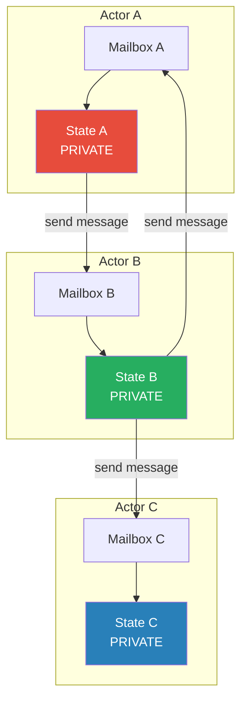
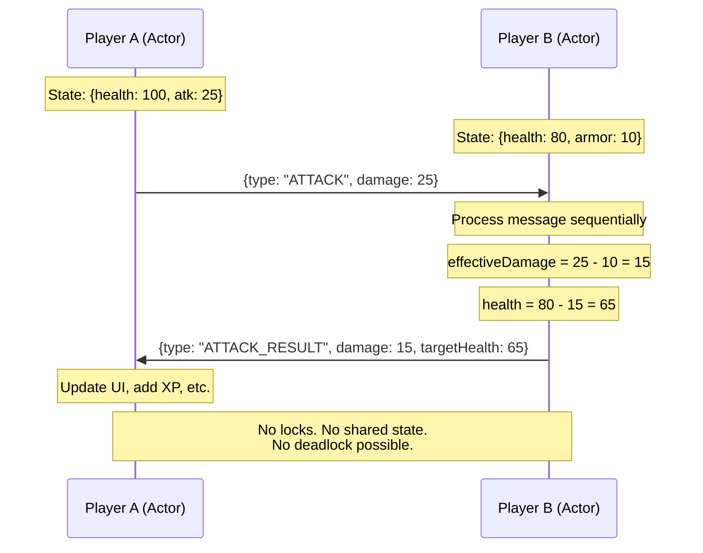

# Actor Model

## 1. The Problem

You're building a multiplayer game server. Each player has state: position, health, inventory, active buffs. When two players interact (trade, attack, enter the same zone), both player states must be read and modified.

```go
type Player struct {
    mu        sync.Mutex
    ID        string
    Health    int
    Inventory []Item
    Position  Vec2
}

func (attacker *Player) Attack(target *Player) {
    attacker.mu.Lock()
    target.mu.Lock() // ← DEADLOCK RISK

    damage := attacker.calculateDamage()
    target.Health -= damage
    attacker.Inventory = append(attacker.Inventory, generateLoot())

    target.mu.Unlock()
    attacker.mu.Unlock()
}
```

**Deadlock scenario:** Player A attacks Player B. Player B simultaneously attacks Player A.
- Goroutine 1: `A.mu.Lock() → trying B.mu.Lock()` (B is locked by goroutine 2).
- Goroutine 2: `B.mu.Lock() → trying A.mu.Lock()` (A is locked by goroutine 1).
- Both wait forever. The game freezes.

You try fixing this with lock ordering (always lock the lower ID first). It works until a trade involves three players. Or a zone event affects 50 players. Lock ordering across N entities is fragile and error-prone. One developer forgets the ordering rule, and you get a deadlock at 3 AM during a boss fight.

**The root cause:** Shared mutable state with locks is fundamentally hard to scale. More entities = more locks = more deadlock surfaces.

---

## 2. Naïve Solutions (and Why They Fail)

### Attempt 1: Single Global Lock

```go
var gameMu sync.Mutex

func attack(attacker, target *Player) {
    gameMu.Lock()
    defer gameMu.Unlock()
    // Modify both players
}
```

**Why it breaks:**
- One lock for the entire game. Every player interaction serializes globally. With 10,000 concurrent players, throughput collapses. Two players on opposite sides of the map wait for each other.

### Attempt 2: Lock-Free with Atomic Operations

```go
func (p *Player) TakeDamage(amount int) {
    atomic.AddInt64(&p.Health, -int64(amount))
}
```

**Why it's insufficient:**
- Atomics work for single fields, not compound operations. "Check if health > 0, then subtract damage, then add loot" requires multiple fields to be updated atomically. Atomics can't protect multi-field invariants.

### Attempt 3: Copy-on-Write

Clone player state, modify the copy, atomically swap.

**Why it breaks:**
- Two goroutines clone the same state, both modify their copy, both try to swap. One wins, the other's changes are lost. Trading requires two players' state to be updated consistently — copy-on-write can't coordinate across two entities.

---

## 3. The Insight

**Instead of sharing state between threads and protecting it with locks, give each entity exclusive ownership of its state and communicate by sending messages.** No entity directly accesses another's state. When player A wants to attack player B, A sends a message to B: "take 50 damage." B processes the message in its own context, on its own schedule, with no locks needed. There is no shared mutable state — only private state and message passing.

---

## 4. The Pattern

### Actor Model

**Definition:** A concurrency model where each **actor** is an independent unit with: (1) private state that only it can access, (2) a **mailbox** (message queue) for incoming messages, and (3) behavior logic that processes one message at a time. Actors communicate exclusively through asynchronous message passing. No shared state, no locks.

**Guarantees:**
- No shared mutable state — each actor owns its data exclusively.
- Messages are processed sequentially per actor — no concurrent access to an actor's state.
- Actors are location-transparent — they can be local or remote.

**Non-guarantees:**
- Does NOT guarantee message ordering between different actor pairs (A→C and B→C may interleave).
- Does NOT guarantee message delivery (messages can be lost in distributed systems).
- Does NOT prevent logical deadlocks (actor A waiting for a reply from B, which is waiting for A).

---

## 5. Mental Model

A **company where employees only communicate via email**. No one walks into another person's office and touches their files. Each employee (actor) has a private desk (state) and an inbox (mailbox). They process emails one at a time. To get something done, you send an email and wait for a response. No one ever has two people modifying the same document simultaneously — because every document lives on exactly one desk.

---

## 6. Structure





---

## 7. Code Example

### TypeScript

```typescript
// ========== ACTOR SYSTEM ==========
type Message = Record<string, unknown> & { type: string };

abstract class Actor<TState> {
  private mailbox: Message[] = [];
  private processing = false;
  protected state: TState;
  private actors: Map<string, Actor<unknown>>;

  constructor(
    public readonly id: string,
    initialState: TState,
    actorRegistry: Map<string, Actor<unknown>>
  ) {
    this.state = initialState;
    this.actors = actorRegistry;
    this.actors.set(id, this as Actor<unknown>);
  }

  // Send a message to another actor (async, non-blocking)
  protected send(targetId: string, message: Message): void {
    const target = this.actors.get(targetId);
    if (!target) {
      console.warn(`Actor ${targetId} not found`);
      return;
    }
    target.receive(message);
  }

  // Receive a message into mailbox
  receive(message: Message): void {
    this.mailbox.push(message);
    this.drainMailbox();
  }

  // Process messages one at a time (no concurrent access to state)
  private async drainMailbox(): Promise<void> {
    if (this.processing) return; // Already draining
    this.processing = true;

    while (this.mailbox.length > 0) {
      const msg = this.mailbox.shift()!;
      await this.handleMessage(msg);
    }

    this.processing = false;
  }

  // Subclasses implement message handling
  protected abstract handleMessage(message: Message): Promise<void>;
}

// ========== GAME ACTORS ==========
interface PlayerState {
  health: number;
  attack: number;
  armor: number;
  inventory: string[];
}

class PlayerActor extends Actor<PlayerState> {
  protected async handleMessage(msg: Message): Promise<void> {
    switch (msg.type) {
      case "ATTACK": {
        const damage = (msg.damage as number) - this.state.armor;
        const effective = Math.max(0, damage);
        this.state.health -= effective;
        console.log(
          `[${this.id}] took ${effective} damage, health: ${this.state.health}`
        );

        // Reply to attacker with result
        this.send(msg.from as string, {
          type: "ATTACK_RESULT",
          target: this.id,
          damageDealt: effective,
          targetHealth: this.state.health,
          killed: this.state.health <= 0,
        });

        if (this.state.health <= 0) {
          this.send(msg.from as string, {
            type: "LOOT_DROP",
            items: this.state.inventory,
          });
        }
        break;
      }

      case "ATTACK_RESULT": {
        console.log(
          `[${this.id}] dealt ${msg.damageDealt} to ${msg.target}` +
          (msg.killed ? " — KILL!" : "")
        );
        break;
      }

      case "LOOT_DROP": {
        const items = msg.items as string[];
        this.state.inventory.push(...items);
        console.log(`[${this.id}] looted: ${items.join(", ")}`);
        break;
      }

      case "HEAL": {
        this.state.health = Math.min(100, this.state.health + (msg.amount as number));
        console.log(`[${this.id}] healed to ${this.state.health}`);
        break;
      }
    }
  }
}

// ========== USAGE ==========
const registry = new Map<string, Actor<unknown>>();

const player1 = new PlayerActor("warrior", {
  health: 100, attack: 25, armor: 5, inventory: ["sword"]
}, registry);

const player2 = new PlayerActor("mage", {
  health: 70, attack: 40, armor: 2, inventory: ["staff", "potion"]
}, registry);

// Player 1 attacks Player 2 — no locks, no shared state
player1.receive({ type: "DO_ATTACK", target: "mage", from: "warrior",
  // This triggers warrior to send ATTACK to mage
});

// Simulate: warrior sends attack to mage
player2.receive({ type: "ATTACK", damage: 25, from: "warrior" });
// Mage fights back simultaneously — no deadlock possible
player1.receive({ type: "ATTACK", damage: 40, from: "mage" });
```

### Go

```go
package main

import (
	"fmt"
	"sync"
)

// ========== MESSAGE ==========
type Message struct {
	Type string
	From string
	Data map[string]interface{}
}

// ========== ACTOR ==========
type Actor struct {
	ID      string
	mailbox chan Message
	state   map[string]interface{}
	handler func(actor *Actor, msg Message)
	system  *ActorSystem
	done    chan struct{}
}

func (a *Actor) Send(targetID string, msg Message) {
	a.system.Send(targetID, msg)
}

func (a *Actor) run() {
	for msg := range a.mailbox {
		a.handler(a, msg)
	}
	close(a.done)
}

// ========== ACTOR SYSTEM ==========
type ActorSystem struct {
	mu     sync.RWMutex
	actors map[string]*Actor
}

func NewActorSystem() *ActorSystem {
	return &ActorSystem{actors: make(map[string]*Actor)}
}

func (s *ActorSystem) Spawn(id string, initialState map[string]interface{},
	handler func(*Actor, Message)) *Actor {
	actor := &Actor{
		ID:      id,
		mailbox: make(chan Message, 100),
		state:   initialState,
		handler: handler,
		system:  s,
		done:    make(chan struct{}),
	}
	s.mu.Lock()
	s.actors[id] = actor
	s.mu.Unlock()

	go actor.run() // Each actor processes messages in its own goroutine
	return actor
}

func (s *ActorSystem) Send(targetID string, msg Message) {
	s.mu.RLock()
	actor, ok := s.actors[targetID]
	s.mu.RUnlock()
	if ok {
		actor.mailbox <- msg
	}
}

func (s *ActorSystem) Shutdown() {
	s.mu.Lock()
	defer s.mu.Unlock()
	for _, actor := range s.actors {
		close(actor.mailbox)
		<-actor.done
	}
}

// ========== PLAYER HANDLER ==========
func playerHandler(actor *Actor, msg Message) {
	switch msg.Type {
	case "ATTACK":
		damage := int(msg.Data["damage"].(float64))
		armor := int(actor.state["armor"].(float64))
		effective := damage - armor
		if effective < 0 {
			effective = 0
		}

		health := int(actor.state["health"].(float64)) - effective
		actor.state["health"] = float64(health)
		fmt.Printf("[%s] took %d damage, health: %d\n", actor.ID, effective, health)

		// Reply — no locks, just a message
		actor.Send(msg.From, Message{
			Type: "ATTACK_RESULT",
			From: actor.ID,
			Data: map[string]interface{}{
				"damageDealt":  float64(effective),
				"targetHealth": float64(health),
				"killed":       health <= 0,
			},
		})

	case "ATTACK_RESULT":
		fmt.Printf("[%s] dealt %.0f to %s",
			actor.ID, msg.Data["damageDealt"], msg.From)
		if msg.Data["killed"].(bool) {
			fmt.Print(" — KILL!")
		}
		fmt.Println()

	case "HEAL":
		amount := int(msg.Data["amount"].(float64))
		health := int(actor.state["health"].(float64)) + amount
		if health > 100 {
			health = 100
		}
		actor.state["health"] = float64(health)
		fmt.Printf("[%s] healed to %d\n", actor.ID, health)
	}
}

func main() {
	system := NewActorSystem()

	system.Spawn("warrior", map[string]interface{}{
		"health": 100.0, "attack": 25.0, "armor": 5.0,
	}, playerHandler)

	system.Spawn("mage", map[string]interface{}{
		"health": 70.0, "attack": 40.0, "armor": 2.0,
	}, playerHandler)

	// Simultaneous attacks — no deadlock possible!
	system.Send("mage", Message{
		Type: "ATTACK", From: "warrior",
		Data: map[string]interface{}{"damage": 25.0},
	})
	system.Send("warrior", Message{
		Type: "ATTACK", From: "mage",
		Data: map[string]interface{}{"damage": 40.0},
	})

	// Heal
	system.Send("warrior", Message{
		Type: "HEAL", From: "system",
		Data: map[string]interface{}{"amount": 20.0},
	})

	// Let messages process
	system.Send("warrior", Message{Type: "DONE", From: "system", Data: nil})
	system.Send("mage", Message{Type: "DONE", From: "system", Data: nil})

	system.Shutdown()
}
```

---

## 8. Gotchas & Beginner Mistakes

| Mistake | Why It Hurts |
|---|---|
| **Sharing state between actors** | Passing a pointer in a message. Now two actors access the same object — you've violated the core invariant. Always copy or transfer ownership. |
| **Unbounded mailboxes** | Actor can't process messages fast enough. Mailbox grows. OOM. Bound the mailbox and handle backpressure (drop, reject, or slow the sender). |
| **Synchronous ask pattern** | Actor A sends to B and blocks waiting for a reply. If B sends to A and blocks, deadlock. Prefer async fire-and-forget with callback messages. |
| **Too many actors** | Creating an actor per HTTP request. Actors should represent long-lived entities (players, devices, sessions), not individual operations. |
| **God actor** | One actor processes all message types. It becomes a bottleneck — a single-threaded event loop processing everything. Decompose into multiple specialized actors. |

---

## 9. Related & Confusable Patterns

| Pattern | How It Differs |
|---|---|
| **Mutex / Locks** | Protect shared state by serializing access. Actor model eliminates shared state entirely. Mutex = concurrent access to shared state. Actor = private state with message passing. |
| **CSP (Communicating Sequential Processes)** | Go's goroutine + channel model. CSP focuses on channels (typed pipes between anonymous processes). Actor model focuses on named actors with mailboxes. Similar philosophy, different emphasis. |
| **Event-Driven Architecture** | Events broadcast to many consumers. Actor messages target a specific actor. EDA is a system-level pattern; Actor is a concurrency-level pattern. |
| **Microservices** | Each service owns its data and communicates via APIs/messages. Microservices are the distributed-system analog of the actor model. |

---

## 10. When This Pattern Is the WRONG Choice

- **Simple shared counters** — An atomic integer is simpler and faster. Don't create an actor just to increment a number.
- **Tight CPU pipelines** — If stages need to share large data without copying (e.g., video frame processing), message-passing overhead is too high. Shared memory with locks is more efficient.
- **Request-response APIs** — A stateless HTTP handler doesn't need an actor. Actors model long-lived stateful entities, not short-lived request handlers.
- **Small teams / simple systems** — Actor systems add architectural complexity. If you have 3 services and no concurrency bugs, don't adopt actors to prevent hypothetical problems.

**Symptoms you chose it wrong:**
- Actors are stateless — they just forward messages. That's a message bus, not an actor.
- You're constantly fighting the "no shared state" rule by passing references.
- Debugging is harder because you can't see which messages are in which mailbox.
- Most actors have exactly one message type — they're functions disguised as actors.

**How to back out:** Replace actors with goroutines + mutexes for simple cases. Replace with channels (CSP) if the communication pattern is producer-consumer. Replace with a shared database if the state needs to survive restarts.
