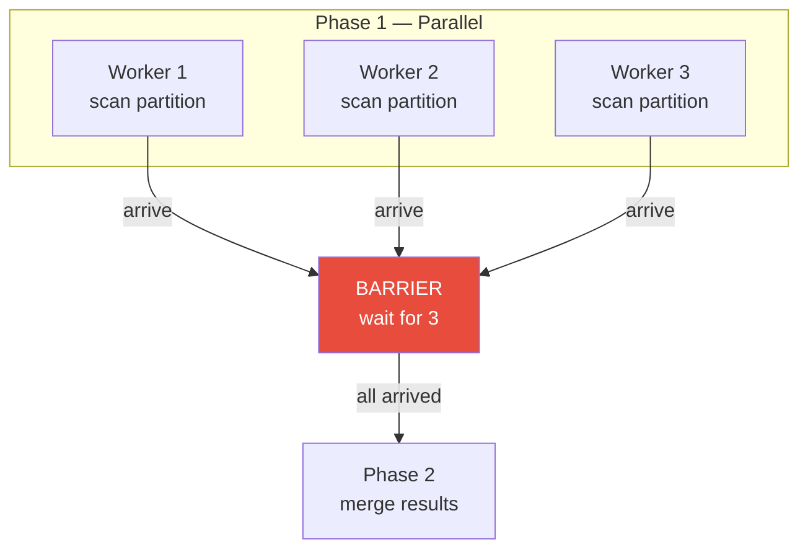
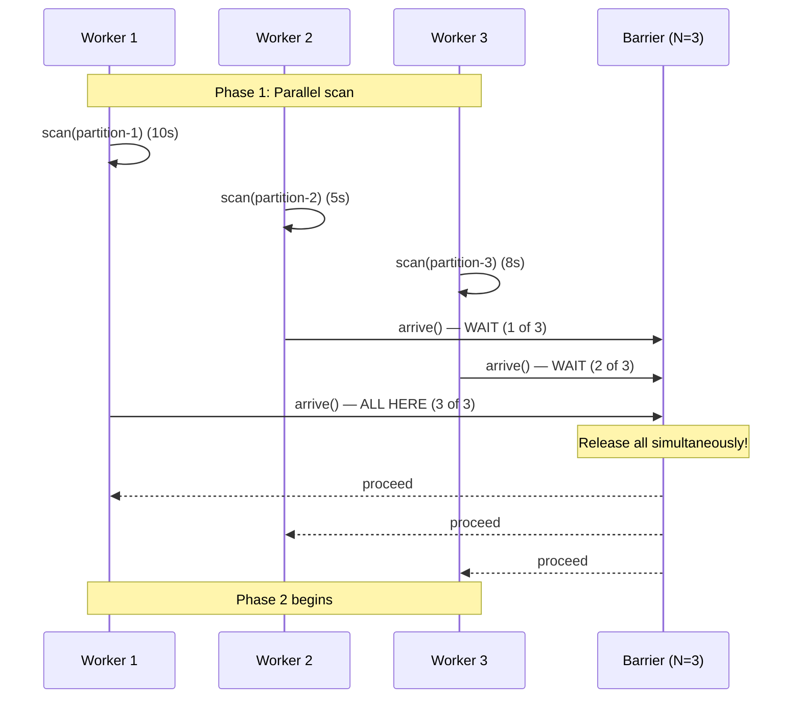

# Barrier

## 1. The Problem

You're building a map-reduce data pipeline. Phase 1: 8 worker goroutines each scan a partition of a 100GB dataset. Phase 2: a single goroutine merges the 8 partial results into a final report.

```go
func pipeline(partitions []Partition) Report {
    var results [8]PartialResult
    
    for i, partition := range partitions {
        go func(idx int, p Partition) {
            results[idx] = scan(p) // Takes 5-30 seconds per partition
        }(i, partition)
    }
    
    // How do we know when ALL 8 goroutines are done?
    return merge(results[:]) // ← This runs immediately — results are empty!
}
```

`merge()` executes before any goroutine writes its result. The report is garbage.

You try adding a sleep:

```go
time.Sleep(30 * time.Second) // "Should be enough"
return merge(results[:])
```

This "works" on your machine but:
- If any partition takes 31 seconds, you get partial results.
- If all partitions finish in 5 seconds, you waste 25 seconds waiting.
- In production, partition sizes vary. There is no correct sleep duration.

**The fundamental need:** All workers must reach a specific point before ANY of them (or downstream logic) proceeds past that point. You need a rendezvous — a synchronization barrier.

---

## 2. Naïve Solutions (and Why They Fail)

### Attempt 1: Polling a Counter

```go
var done int64

go func() { scan(p1); atomic.AddInt64(&done, 1) }()
go func() { scan(p2); atomic.AddInt64(&done, 1) }()

for atomic.LoadInt64(&done) < 2 {
    time.Sleep(10 * time.Millisecond) // Busy wait
}
merge()
```

**Why it breaks:**
- Polling wastes CPU (busy-waiting) and adds latency (up to 10ms after the last worker finishes).
- Fragile if the worker count changes. Hardcoded `< 2`.
- No way to reset for multi-phase pipelines.

### Attempt 2: Channel Per Worker

```go
ch1 := make(chan PartialResult)
ch2 := make(chan PartialResult)

go func() { ch1 <- scan(p1) }()
go func() { ch2 <- scan(p2) }()

r1, r2 := <-ch1, <-ch2
merge(r1, r2)
```

**Why it's limited:**
- Works for 2 workers. With 100 workers, you create 100 channels and receive from each. Verbose but functional.
- Doesn't generalize to multi-phase: "wait for all, then do phase 2, then wait for all again, then do phase 3."
- Each worker needs its own channel — can't share.

### Attempt 3: WaitGroup (Almost Right)

```go
var wg sync.WaitGroup
for i := 0; i < 8; i++ {
    wg.Add(1)
    go func(idx int) {
        defer wg.Done()
        results[idx] = scan(partitions[idx])
    }(i)
}
wg.Wait()
merge(results[:])
```

This actually works for a single phase. But `WaitGroup` is a **one-shot barrier** — it can't be reused for cyclic synchronization (phase 1 → barrier → phase 2 → barrier → phase 3).

---

## 3. The Insight

**Provide a rendezvous point where all participants must arrive before any can proceed.** The barrier blocks each arriving goroutine until the last one arrives, then releases all of them simultaneously. For multi-phase work, a cyclic barrier can be reused: all goroutines synchronize, proceed to the next phase, and synchronize again.

---

## 4. The Pattern

### Barrier

**Definition:** A synchronization primitive that blocks a set of threads (or goroutines) until **all** of them have reached the barrier point. Once the last thread arrives, all are released simultaneously. A **cyclic barrier** can be reset and reused across multiple phases.

Also known as: **Rendezvous**, **Sync Point**, **CyclicBarrier** (Java)

**Guarantees:**
- All participants reach the barrier before any proceed past it.
- Strict phase ordering — phase N completes fully before phase N+1 begins.
- (Cyclic barrier) Can be reused for multiple rounds.

**Non-guarantees:**
- Does NOT guarantee the order in which goroutines arrive at the barrier.
- Does NOT handle partial failures — if one goroutine crashes, the rest wait forever.
- Does NOT propagate errors from individual participants.

---

## 5. Mental Model

A **group of friends carpooling to a restaurant**. Everyone drives separately to the parking lot (does their parallel work). No one enters the restaurant until ALL friends have arrived (barrier). The last person to arrive triggers everyone walking in together. If you're doing a pub crawl (cyclic barrier), you repeat this at every stop.

---

## 6. Structure





---

## 7. Code Example

### TypeScript

```typescript
// ========== BARRIER ==========
class Barrier {
  private count: number = 0;
  private waiting: Array<() => void> = [];

  constructor(private parties: number) {}

  async arrive(): Promise<void> {
    this.count++;
    if (this.count >= this.parties) {
      // Last arrival — release everyone
      this.count = 0; // Reset for cyclic reuse
      const waiters = this.waiting.splice(0);
      waiters.forEach((resolve) => resolve());
      return; // Last arrival proceeds immediately
    }
    // Not everyone is here — wait
    return new Promise<void>((resolve) => {
      this.waiting.push(resolve);
    });
  }
}

// ========== MAP-REDUCE PIPELINE ==========
interface Partition {
  id: number;
  data: number[];
}

interface PartialResult {
  partitionId: number;
  sum: number;
  count: number;
  max: number;
}

async function scanPartition(partition: Partition): Promise<PartialResult> {
  // Simulate variable processing time
  await new Promise((r) => setTimeout(r, Math.random() * 1000));
  return {
    partitionId: partition.id,
    sum: partition.data.reduce((a, b) => a + b, 0),
    count: partition.data.length,
    max: Math.max(...partition.data),
  };
}

async function mapReducePipeline(data: number[], numWorkers: number) {
  // Partition data
  const chunkSize = Math.ceil(data.length / numWorkers);
  const partitions: Partition[] = Array.from({ length: numWorkers }, (_, i) => ({
    id: i,
    data: data.slice(i * chunkSize, (i + 1) * chunkSize),
  }));

  const barrier = new Barrier(numWorkers);
  const results: PartialResult[] = new Array(numWorkers);

  // Phase 1: Parallel scan
  const workers = partitions.map(async (partition, idx) => {
    // Do work
    results[idx] = await scanPartition(partition);
    console.log(`Worker ${idx} finished scan`);

    // Wait at barrier until all workers finish
    await barrier.arrive();
    console.log(`Worker ${idx} passed barrier`);
  });

  await Promise.all(workers);

  // Phase 2: Merge (all results are ready)
  const finalResult = {
    totalSum: results.reduce((a, r) => a + r.sum, 0),
    totalCount: results.reduce((a, r) => a + r.count, 0),
    globalMax: Math.max(...results.map((r) => r.max)),
  };

  console.log("Final result:", finalResult);
  return finalResult;
}

// ========== USAGE ==========
const testData = Array.from({ length: 1000 }, () =>
  Math.floor(Math.random() * 10000)
);
mapReducePipeline(testData, 4);
```

### Go

```go
package main

import (
	"fmt"
	"math/rand"
	"sync"
	"time"
)

// ========== CYCLIC BARRIER ==========
type CyclicBarrier struct {
	parties   int
	count     int
	mu        sync.Mutex
	cond      *sync.Cond
	generation int
}

func NewCyclicBarrier(parties int) *CyclicBarrier {
	b := &CyclicBarrier{parties: parties}
	b.cond = sync.NewCond(&b.mu)
	return b
}

func (b *CyclicBarrier) Arrive() {
	b.mu.Lock()
	gen := b.generation
	b.count++

	if b.count >= b.parties {
		// Last arrival — reset and release all
		b.count = 0
		b.generation++
		b.cond.Broadcast()
		b.mu.Unlock()
		return
	}

	// Wait until generation changes (all arrived)
	for b.generation == gen {
		b.cond.Wait()
	}
	b.mu.Unlock()
}

// ========== MAP-REDUCE WITH BARRIER ==========
type PartialResult struct {
	PartitionID int
	Sum         int64
	Count       int
	Max         int
}

func scanPartition(data []int, partitionID int) PartialResult {
	time.Sleep(time.Duration(rand.Intn(1000)) * time.Millisecond)

	var sum int64
	max := data[0]
	for _, v := range data {
		sum += int64(v)
		if v > max {
			max = v
		}
	}
	return PartialResult{
		PartitionID: partitionID,
		Sum:         sum,
		Count:       len(data),
		Max:         max,
	}
}

func main() {
	// Generate test data
	data := make([]int, 10000)
	for i := range data {
		data[i] = rand.Intn(100000)
	}

	numWorkers := 4
	chunkSize := len(data) / numWorkers
	results := make([]PartialResult, numWorkers)

	// ---- Using CyclicBarrier ----
	barrier := NewCyclicBarrier(numWorkers)
	var wg sync.WaitGroup
	start := time.Now()

	for i := 0; i < numWorkers; i++ {
		wg.Add(1)
		go func(id int) {
			defer wg.Done()

			startIdx := id * chunkSize
			endIdx := startIdx + chunkSize
			if id == numWorkers-1 {
				endIdx = len(data) // Last worker gets remainder
			}

			// Phase 1: Scan partition
			results[id] = scanPartition(data[startIdx:endIdx], id)
			fmt.Printf("Worker %d finished scan (sum=%d)\n", id, results[id].Sum)

			// Barrier: wait for all workers
			barrier.Arrive()

			// Phase 2: Everyone can proceed (only worker 0 does the merge)
			if id == 0 {
				var totalSum int64
				globalMax := 0
				totalCount := 0
				for _, r := range results {
					totalSum += r.Sum
					totalCount += r.Count
					if r.Max > globalMax {
						globalMax = r.Max
					}
				}
				fmt.Printf("\nMerge result: sum=%d, count=%d, max=%d\n",
					totalSum, totalCount, globalMax)
			}
		}(i)
	}

	wg.Wait()
	fmt.Printf("Completed in %v\n", time.Since(start))

	// ---- Simpler: using sync.WaitGroup (one-shot barrier) ----
	fmt.Println("\n--- WaitGroup version (simpler for single phase) ---")
	var wg2 sync.WaitGroup
	for i := 0; i < numWorkers; i++ {
		wg2.Add(1)
		go func(id int) {
			defer wg2.Done()
			startIdx := id * chunkSize
			endIdx := startIdx + chunkSize
			if id == numWorkers-1 {
				endIdx = len(data)
			}
			results[id] = scanPartition(data[startIdx:endIdx], id)
		}(i)
	}
	wg2.Wait() // Single barrier point
	fmt.Println("All workers done — merge can proceed")
}
```

---

## 8. Gotchas & Beginner Mistakes

| Mistake | Why It Hurts |
|---|---|
| **One worker crashes** | All others wait at the barrier forever. Add timeouts or use context cancellation. Detect and handle worker failures. |
| **Wrong party count** | `NewCyclicBarrier(5)` with 4 workers. The barrier never triggers. Always match the barrier count to the actual number of participants. |
| **Work after barrier but before next phase** | Worker does extra work between `barrier.Arrive()` and the actual next phase, causing inconsistent reads. Keep the post-barrier logic minimal. |
| **Using barrier for simple fan-out / fan-in** | If you just need "wait for all goroutines," use `sync.WaitGroup`. Barriers are for multi-phase cyclic synchronization. |
| **Non-uniform work distribution** | One partition is 10x larger. All workers wait for the slowest one. Balance work evenly or use work-stealing. |

---

## 9. Related & Confusable Patterns

| Pattern | How It Differs |
|---|---|
| **WaitGroup (Go)** | A one-shot barrier. `wg.Wait()` blocks until all `wg.Done()` calls match `wg.Add()`. Cannot be reused for cyclic phases. |
| **CountDownLatch (Java)** | One or more threads wait for N events. Not reusable (counts down to 0, done). Barrier is mutual — all wait for each other. |
| **Promise.all** | Waits for all promises to resolve. Semantically similar to a barrier for a fixed set of async operations. |
| **Fork-Join** | Fork spawns subtasks, join waits for them. The join point is conceptually a barrier, but fork-join allows dynamic task creation. |
| **Phaser (Java)** | A generalization of CyclicBarrier that supports dynamic registration of parties (workers can join/leave between phases). |

---

## 10. When This Pattern Is the WRONG Choice

- **Unequal completion times** — If workers have wildly different workloads, fast workers idle at the barrier. Use work-stealing or a task queue instead.
- **Single-phase parallelism** — If you just need "run N tasks and collect results," use `WaitGroup` or `Promise.all()`. Barriers add unnecessary complexity for one-shot synchronization.
- **Dynamic worker counts** — Barriers require a fixed number of participants. If workers can join or leave, use a Phaser or redesign with channels.
- **Streaming pipelines** — If data flows continuously (not in discrete phases), barriers add latency by forcing everything to wait. Use producer-consumer with channels instead.

**Symptoms you should reconsider:**
- One worker is always the last to arrive (unbalanced work — rebalance, don't barrier).
- The barrier is only used once (just use WaitGroup / Promise.all).
- Workers need to communicate partial results during the phase (barrier only syncs at the end).

**How to back out:** Replace with `sync.WaitGroup` for one-shot synchronization. Replace with channels for continuous coordination. Replace with a task queue / work-stealing for unbalanced workloads.
