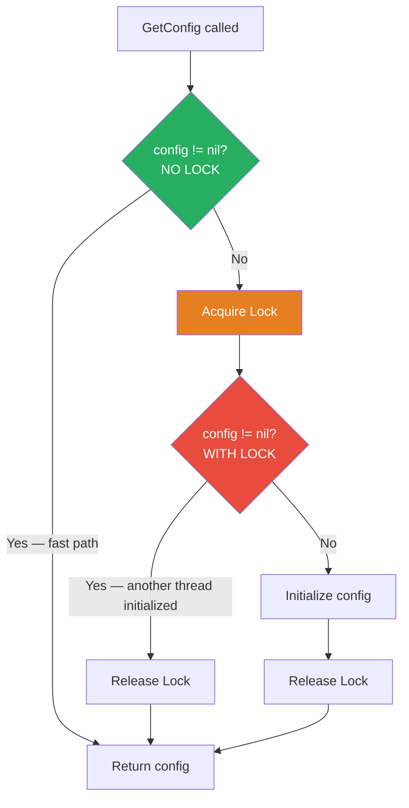
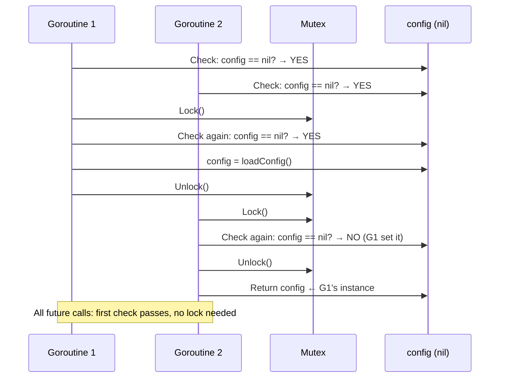

# Double-Checked Locking

## 1. The Problem

Your application has a configuration object that's expensive to create — it reads from a file, validates fields, and performs DNS resolution. It takes 2 seconds to initialize. It's used by every request handler, and you only want to create it once.

```go
var config *AppConfig

func GetConfig() *AppConfig {
    if config == nil {
        config = loadConfig() // 2 seconds
    }
    return config
}
```

In a single-threaded world, this works. The first call creates it, subsequent calls return the cached instance.

**In a concurrent world, it breaks.** 100 goroutines call `GetConfig()` simultaneously at startup. All 100 see `config == nil` (it hasn't been set yet). All 100 call `loadConfig()`. You've created 100 config objects (wasting 200 seconds of CPU) and only the last one survives (the rest are garbage collected). Even worse: if `loadConfig()` opens database connections, you've opened 100 of them.

**Naive fix: add a mutex.**

```go
var mu sync.Mutex

func GetConfig() *AppConfig {
    mu.Lock()
    defer mu.Unlock()
    if config == nil {
        config = loadConfig()
    }
    return config
}
```

This is correct but wasteful. After the first call, `config` is never nil again. But **every subsequent call** still acquires the mutex — paying the lock overhead even though the check will always succeed. At 10,000 requests/second, that's 10,000 unnecessary lock acquisitions per second.

---

## 2. Naïve Solutions (and Why They Fail)

### Attempt 1: Check Without Lock

```go
func GetConfig() *AppConfig {
    if config == nil {
        mu.Lock()
        config = loadConfig()
        mu.Unlock()
    }
    return config
}
```

**Why it breaks:**
- The `if config == nil` check is outside the lock. Two goroutines both see `nil`, both acquire the lock (one after the other), both create the config. The check doesn't protect against the race — it just reduces the window.

### Attempt 2: Initialize at Package Load

```go
var config = loadConfig() // Runs at import time
```

**Why it's sometimes wrong:**
- Config might not be ready at import time (database isn't up yet, flag parsing hasn't happened).
- Forces initialization even if `GetConfig()` is never called (e.g., in test builds that don't need the config).
- No lazy initialization — pays the 2-second cost at startup even for CLI tools that never use the config.

### Attempt 3: Accept the Mutex Overhead

Just lock on every call. It's "fast enough."

**Why it matters at scale:**
- Mutex contention under high concurrency. 10,000 goroutines serializing on a mutex. p99 latency spikes.
- The lock is protecting a check that ALWAYS succeeds after the first call. Zero value for 99.99% of invocations.

---

## 3. The Insight

**Check the condition WITHOUT the lock first (fast path). Only if the check indicates initialization is needed, acquire the lock and check AGAIN (to handle the race).** The second check inside the lock handles the case where another thread initialized between the first check and the lock acquisition. After initialization, all callers take the fast path (no lock).

---

## 4. The Pattern

### Double-Checked Locking

**Definition:** A concurrency optimization for lazy initialization where the condition is checked **twice**: once without a lock (to skip the lock on subsequent calls) and once with a lock (to ensure at-most-once initialization). This avoids the overhead of lock acquisition after initialization is complete.

Also known as: **DCL**, **Lock Hint**

**Guarantees:**
- At-most-once initialization (the expensive operation runs exactly once).
- No lock overhead after initialization (fast path is lock-free).
- Thread-safe initialization despite concurrent access.

**Non-guarantees:**
- Does NOT work correctly without memory barriers/atomic operations (broken in pre-Java-5, needs `volatile` or atomic).
- Does NOT provide ongoing mutual exclusion — only protects initialization.
- Does NOT handle re-initialization or invalidation.

---

## 5. Mental Model

A **locked medicine cabinet** in an office. Before opening the cabinet (acquiring the lock), you glance at the sign on the door: "STOCKED" or "EMPTY." If it says "STOCKED" (already initialized), you just reach for the medicine — no need to unlock the cabinet. If it says "EMPTY," you unlock the cabinet, check the shelves (might have been stocked while you were getting the key), and if truly empty, restock it. You only unlock when necessary.

---

## 6. Structure





---

## 7. Code Example

### TypeScript

```typescript
// In single-threaded Node.js, double-checked locking isn't needed for sync code.
// But it matters for ASYNC initialization (multiple concurrent requests trigger init).

class ServiceRegistry {
  private static instance: ServiceRegistry | null = null;
  private static initializing: Promise<ServiceRegistry> | null = null;

  private services: Map<string, unknown>;

  private constructor(services: Map<string, unknown>) {
    this.services = services;
  }

  static async getInstance(): Promise<ServiceRegistry> {
    // First check: already initialized? (fast path)
    if (ServiceRegistry.instance !== null) {
      return ServiceRegistry.instance;
    }

    // "Lock" — use a single initialization promise
    if (ServiceRegistry.initializing === null) {
      ServiceRegistry.initializing = ServiceRegistry.initialize();
    }

    return ServiceRegistry.initializing;
  }

  private static async initialize(): Promise<ServiceRegistry> {
    console.log("Initializing ServiceRegistry (expensive)...");
    await new Promise((r) => setTimeout(r, 2000)); // Simulate 2s init

    const services = new Map<string, unknown>();
    services.set("db", { host: "postgres.internal", pool: 10 });
    services.set("cache", { host: "redis.internal", ttl: 300 });

    ServiceRegistry.instance = new ServiceRegistry(services);
    return ServiceRegistry.instance;
  }

  get(name: string): unknown {
    return this.services.get(name);
  }
}

// ========== DATABASE POOL (ASYNC DOUBLE-CHECKED LOCKING) ==========
class DatabasePool {
  private pool: unknown = null;
  private initPromise: Promise<unknown> | null = null;

  async getPool(): Promise<unknown> {
    // Fast path: already initialized
    if (this.pool !== null) {
      return this.pool;
    }

    // Slow path: initialize (only once even with concurrent callers)
    if (this.initPromise === null) {
      this.initPromise = this.createPool();
    }

    return this.initPromise;
  }

  private async createPool(): Promise<unknown> {
    console.log("Creating DB pool...");
    await new Promise((r) => setTimeout(r, 1000));
    this.pool = { connected: true, size: 10 };
    return this.pool;
  }
}

// ========== USAGE ==========
async function main() {
  const db = new DatabasePool();

  // 10 concurrent requests all call getPool()
  const promises = Array.from({ length: 10 }, () => db.getPool());
  const pools = await Promise.all(promises);

  // All get the same instance
  console.log("Same instance?", new Set(pools).size === 1); // true
  console.log("'Creating DB pool...' printed only once");
}

main();
```

### Go

```go
package main

import (
	"fmt"
	"sync"
	"sync/atomic"
	"time"
	"unsafe"
)

// ========== DOUBLE-CHECKED LOCKING (Manual) ==========
type AppConfig struct {
	DBHost    string
	CacheTTL  int
	CreatedAt time.Time
}

var (
	configInstance unsafe.Pointer // *AppConfig stored atomically
	configMu       sync.Mutex
)

func GetConfig() *AppConfig {
	// First check: no lock (fast path)
	p := atomic.LoadPointer(&configInstance)
	if p != nil {
		return (*AppConfig)(p)
	}

	// Slow path: acquire lock
	configMu.Lock()
	defer configMu.Unlock()

	// Second check: inside lock (another goroutine may have initialized)
	p = atomic.LoadPointer(&configInstance)
	if p != nil {
		return (*AppConfig)(p)
	}

	// Actually initialize
	fmt.Println("Initializing config (expensive)...")
	time.Sleep(2 * time.Second)
	cfg := &AppConfig{
		DBHost:    "postgres.internal",
		CacheTTL:  300,
		CreatedAt: time.Now(),
	}

	atomic.StorePointer(&configInstance, unsafe.Pointer(cfg))
	return cfg
}

// ========== sync.Once: GO'S BUILT-IN DCL ==========
// In practice, ALWAYS use sync.Once instead of manual DCL in Go.

var (
	onceConfig *AppConfig
	configOnce sync.Once
)

func GetConfigOnce() *AppConfig {
	configOnce.Do(func() {
		fmt.Println("Initializing config via sync.Once...")
		time.Sleep(2 * time.Second)
		onceConfig = &AppConfig{
			DBHost:    "postgres.internal",
			CacheTTL:  300,
			CreatedAt: time.Now(),
		}
	})
	return onceConfig
}

func main() {
	// ---- sync.Once version (preferred) ----
	var wg sync.WaitGroup
	start := time.Now()

	for i := 0; i < 10; i++ {
		wg.Add(1)
		go func(id int) {
			defer wg.Done()
			cfg := GetConfigOnce()
			fmt.Printf("Goroutine %d got config (DB: %s)\n", id, cfg.DBHost)
		}(i)
	}

	wg.Wait()
	fmt.Printf("All goroutines done in %v\n", time.Since(start))
	fmt.Println("Config initialized exactly once despite 10 concurrent callers")
}
```

---

## 8. Gotchas & Beginner Mistakes

| Mistake | Why It Hurts |
|---|---|
| **No memory barrier on the first check** | In Go, reading a pointer without `atomic.Load` can see a partially constructed object (CPU/compiler reorder). Always use `atomic.LoadPointer` or `sync.Once`. |
| **Using DCL when `sync.Once` exists** | Go provides `sync.Once` — it's DCL implemented correctly with proper memory barriers. Manual DCL is almost never needed in Go. |
| **Forgetting the second check** | Lock acquired, but you skip the nil check inside the lock. Two goroutines both initialize. The whole point is the SECOND check. |
| **Using DCL for mutable state** | DCL is for one-time initialization. If the "singleton" can change (config reload, cache invalidation), DCL doesn't help. Use atomic swap or RWMutex instead. |
| **Broken in pre-Java-5** | Old Java Memory Model didn't guarantee that an object was fully constructed before publication. DCL was famously broken. Modern Java with `volatile` fixes this. |

---

## 9. Related & Confusable Patterns

| Pattern | How It Differs |
|---|---|
| **sync.Once (Go)** | Go's built-in DCL. Handles all memory ordering correctly. Use this — don't implement DCL manually in Go. |
| **Singleton** | A creational pattern: exactly one instance. DCL is a **mechanism** for thread-safe lazy singleton creation. Singleton is the goal; DCL is one way to achieve it. |
| **Lazy Initialization** | Create the object on first access (regardless of thread safety). DCL makes lazy init thread-safe and avoids lock overhead after init. |
| **Mutex** | Full mutual exclusion on every call. DCL avoids the lock after initialization. Mutex = always lock. DCL = lock only once. |

---

## 10. When This Pattern Is the WRONG Choice

- **When `sync.Once` is available** — In Go, always prefer `sync.Once`. It's simpler, correct, and optimized. Manual DCL is an anti-pattern in Go.
- **When initialization is cheap** — If creating the object takes 1μs, the complexity of DCL isn't justified. Just use a mutex or initialize eagerly.
- **When the singleton needs updating** — DCL initializes once. If the config needs to be reloaded, DCL doesn't help. Use `atomic.Value` with periodic refresh.
- **When there's no contention** — If only one goroutine ever calls `GetConfig()`, a simple nil check (no lock) is sufficient.

**Symptoms you chose it wrong:**
- You implemented DCL but could have used `sync.Once` (in Go) or a static initializer.
- The initialized object is being replaced/refreshed (DCL doesn't support that).
- You have DCL bugs from incorrect memory ordering (use the language's built-in mechanism).

**How to back out:** Replace with `sync.Once` (Go), `volatile` + `synchronized` (Java), or eager initialization. If the object needs refreshing, switch to `atomic.Value` or a read-write lock.
