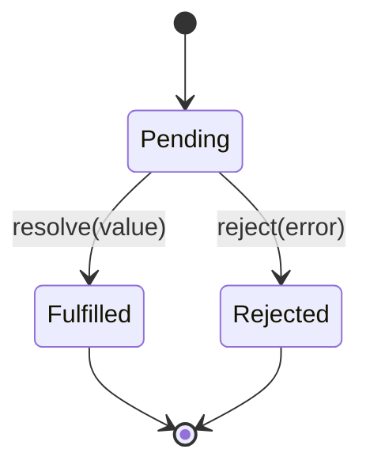
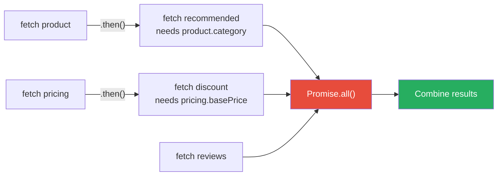

# Future / Promise

## 1. The Problem

You're building a product page that aggregates data from three microservices: product details, pricing, and reviews. Each call takes 200-300ms.

```typescript
async function getProductPage(productId: string) {
  const product = await fetch(`/api/products/${productId}`).then(r => r.json());
  const pricing = await fetch(`/api/pricing/${productId}`).then(r => r.json());
  const reviews = await fetch(`/api/reviews/${productId}`).then(r => r.json());
  
  return { product, pricing, reviews };
}
```

Total time: 200 + 250 + 300 = **750ms**. But these three calls are **independent** — none depends on the result of another. They could run in parallel in ~300ms (the slowest one). You're wasting 450ms by awaiting each one sequentially.

**Worse:** Requirements evolve. Now you need to fetch recommended products based on category (from the product call) AND fetch user-specific pricing (from the pricing call). This creates a dependency chain:

```
product → recommendedProducts (needs product.category)
pricing → discountedPricing (needs pricing.basePrice + user.tier)
reviews (independent)
```

You need to express: "start these three calls in parallel, then when product finishes, start recommended products; when pricing finishes, start discounted pricing; when ALL of them finish, combine and return."

With raw callbacks, this becomes:

```typescript
function getProductPage(productId, callback) {
  fetch(`/api/products/${productId}`, (err, product) => {
    fetch(`/api/recommended/${product.category}`, (err, recommended) => {
      fetch(`/api/pricing/${productId}`, (err, pricing) => {
        fetch(`/api/discount/${pricing.basePrice}`, (err, discount) => {
          fetch(`/api/reviews/${productId}`, (err, reviews) => {
            callback(null, { product, recommended, pricing, discount, reviews });
          });
        });
      });
    });
  });
}
```

**Callback hell.** And this doesn't even run things in parallel — it's completely sequential despite the independence.

---

## 2. Naïve Solutions (and Why They Fail)

### Attempt 1: Nested Callbacks with Manual Parallelism

```typescript
let product, pricing, reviews;
let remaining = 3;

fetch("/api/products/1", (err, p) => { product = p; if (--remaining === 0) combine(); });
fetch("/api/pricing/1", (err, p) => { pricing = p; if (--remaining === 0) combine(); });
fetch("/api/reviews/1", (err, r) => { reviews = r; if (--remaining === 0) combine(); });
```

**Why it breaks:**
- Error handling is scattered. If pricing fails, `remaining` never reaches 0. The request hangs forever.
- Adding dependent calls (recommended products after product loads) requires restructuring the entire callback tree.
- Untestable, unreadable, unmaintainable.

### Attempt 2: Event Emitter

```typescript
const emitter = new EventEmitter();
emitter.on("product-loaded", (product) => { /* ... */ });
emitter.on("pricing-loaded", (pricing) => { /* ... */ });
emitter.on("all-loaded", () => { /* combine */ });
```

**Why it breaks:**
- No built-in way to say "when both product AND pricing are done." You manually track which events have fired.
- Event ordering is implicit. Hard to reason about what happens first.
- Error events can be missed (unhandled error events crash Node.js).

### Attempt 3: Blocking Wait

```go
ch := make(chan interface{}, 3)
go func() { ch <- fetchProduct(id) }()
go func() { ch <- fetchPricing(id) }()
go func() { ch <- fetchReviews(id) }()

results := []interface{}{<-ch, <-ch, <-ch}
```

**Why it's limited:**
- You don't know which result is which (channel returns `interface{}`).
- No way to express "when product finishes, THEN start recommended." Channels don't compose as a dependency graph.
- Error handling requires wrapping every result in a struct with err field.

---

## 3. The Insight

**Represent an in-progress computation as a value.** Instead of waiting for a result or providing a callback, return an object that represents "the eventual result." This object (a Future or Promise) can be composed: chained (`.then()`), combined (`Promise.all()`), raced (`Promise.race()`), and error-handled (`.catch()`). The dependency graph between async operations becomes explicit and composable.

---

## 4. The Pattern

### Future / Promise

**Definition:** An object that represents the **eventual result** of an asynchronous computation. A Promise starts in a pending state and transitions to either fulfilled (with a value) or rejected (with an error). Promises can be chained (`.then()`), combined (`Promise.all()`), and composed to express complex async dependency graphs declaratively.

In some languages: **Future** (Go, Java, Scala), **Promise** (JavaScript), **Task** (C#), **Deferred** (Python Twisted)

**Guarantees:**
- A promise resolves exactly once (fulfilled or rejected).
- `.then()` chains are executed in order.
- `Promise.all()` waits for all; `Promise.race()` waits for first.
- Error propagation — a rejected promise propagates through the chain until caught.

**Non-guarantees:**
- Does NOT cancel in-flight operations (cancellation requires `AbortController` or context).
- Does NOT guarantee ordering of concurrent promises.
- Does NOT retry on failure (retry logic is separate).

---

## 5. Mental Model

An **order receipt** at a restaurant. When you order food, you get a receipt immediately (the Promise). The food isn't ready yet, but the receipt represents your future meal. You can:
- Wait at the counter (`.await` / `.then()`).
- Order multiple dishes and wait for all (`Promise.all()`).
- Ask "which is ready first?" (`Promise.race()`).
- Be told "we're out of that" (rejection / error).

The receipt IS the handle to the eventual result. You can pass it around, combine it with other receipts, without the food existing yet.

---

## 6. Structure





---

## 7. Code Example

### TypeScript

```typescript
// ========== PARALLEL + DEPENDENT FETCHING ==========
interface Product {
  id: string;
  name: string;
  category: string;
}
interface Pricing {
  basePrice: number;
  currency: string;
}
interface Review {
  rating: number;
  text: string;
}

// Simulated API calls
async function fetchProduct(id: string): Promise<Product> {
  await new Promise((r) => setTimeout(r, 200));
  return { id, name: "Widget Pro", category: "electronics" };
}

async function fetchPricing(id: string): Promise<Pricing> {
  await new Promise((r) => setTimeout(r, 250));
  return { basePrice: 49.99, currency: "USD" };
}

async function fetchReviews(id: string): Promise<Review[]> {
  await new Promise((r) => setTimeout(r, 300));
  return [{ rating: 4.5, text: "Great product!" }];
}

async function fetchRecommended(category: string): Promise<string[]> {
  await new Promise((r) => setTimeout(r, 150));
  return ["Widget Mini", "Widget Ultra"];
}

async function fetchDiscount(basePrice: number): Promise<number> {
  await new Promise((r) => setTimeout(r, 100));
  return basePrice * 0.9; // 10% off
}

// ========== COMPOSITION ==========
async function getProductPage(productId: string) {
  const start = Date.now();

  // Start all independent fetches in parallel
  const productPromise = fetchProduct(productId);
  const pricingPromise = fetchPricing(productId);
  const reviewsPromise = fetchReviews(productId);

  // Chain dependent calls — they start as soon as their dependency resolves
  const recommendedPromise = productPromise.then((p) =>
    fetchRecommended(p.category)
  );
  const discountPromise = pricingPromise.then((p) =>
    fetchDiscount(p.basePrice)
  );

  // Wait for EVERYTHING
  const [product, pricing, reviews, recommended, discount] = await Promise.all([
    productPromise,
    pricingPromise,
    reviewsPromise,
    recommendedPromise,
    discountPromise,
  ]);

  const elapsed = Date.now() - start;
  console.log(`Loaded in ${elapsed}ms`);
  // ~450ms (max(200+150, 250+100, 300)) instead of 1000ms sequential

  return { product, pricing, reviews, recommended, discountPrice: discount };
}

// ========== ERROR HANDLING ==========
async function getProductPageSafe(productId: string) {
  const result = await Promise.allSettled([
    fetchProduct(productId),
    fetchPricing(productId),
    fetchReviews(productId),
  ]);

  const [productResult, pricingResult, reviewsResult] = result;

  return {
    product:
      productResult.status === "fulfilled" ? productResult.value : null,
    pricing:
      pricingResult.status === "fulfilled" ? pricingResult.value : null,
    reviews:
      reviewsResult.status === "fulfilled" ? reviewsResult.value : [],
    errors: result
      .filter((r) => r.status === "rejected")
      .map((r) => (r as PromiseRejectedResult).reason),
  };
}

// ========== RACE: FIRST RESPONSE WINS ==========
async function fetchWithFallback(productId: string): Promise<Product> {
  return Promise.race([
    fetchProduct(productId),                       // Primary
    new Promise<Product>((_, reject) =>
      setTimeout(() => reject(new Error("timeout")), 500)  // Timeout
    ),
  ]);
}

getProductPage("prod-123").then(console.log);
```

### Go

```go
package main

import (
	"context"
	"fmt"
	"sync"
	"time"
)

// Go doesn't have built-in Promises, but channels + goroutines achieve the same pattern.

// Future represents an eventual result
type Future[T any] struct {
	ch   chan result[T]
	val  result[T]
	once sync.Once
}

type result[T any] struct {
	value T
	err   error
}

func NewFuture[T any](fn func() (T, error)) *Future[T] {
	f := &Future[T]{ch: make(chan result[T], 1)}
	go func() {
		val, err := fn()
		f.ch <- result[T]{value: val, err: err}
	}()
	return f
}

func (f *Future[T]) Get() (T, error) {
	f.once.Do(func() {
		f.val = <-f.ch
	})
	return f.val.value, f.val.err
}

// Then chains a dependent computation
func Then[A, B any](f *Future[A], fn func(A) (B, error)) *Future[B] {
	return NewFuture(func() (B, error) {
		a, err := f.Get()
		if err != nil {
			var zero B
			return zero, err
		}
		return fn(a)
	})
}

// All waits for all futures
func All[T any](futures ...*Future[T]) ([]T, error) {
	results := make([]T, len(futures))
	for i, f := range futures {
		val, err := f.Get()
		if err != nil {
			return nil, err
		}
		results[i] = val
	}
	return results, nil
}

// ========== USAGE ==========
type Product struct {
	ID       string
	Name     string
	Category string
}

type Pricing struct {
	BasePrice float64
	Currency  string
}

func fetchProduct(id string) (Product, error) {
	time.Sleep(200 * time.Millisecond)
	return Product{ID: id, Name: "Widget Pro", Category: "electronics"}, nil
}

func fetchPricing(id string) (Pricing, error) {
	time.Sleep(250 * time.Millisecond)
	return Pricing{BasePrice: 49.99, Currency: "USD"}, nil
}

func fetchReviews(id string) ([]string, error) {
	time.Sleep(300 * time.Millisecond)
	return []string{"Great product!"}, nil
}

func fetchRecommended(category string) ([]string, error) {
	time.Sleep(150 * time.Millisecond)
	return []string{"Widget Mini", "Widget Ultra"}, nil
}

func main() {
	start := time.Now()

	// Start independent fetches in parallel
	productFuture := NewFuture(func() (Product, error) {
		return fetchProduct("prod-123")
	})
	pricingFuture := NewFuture(func() (Pricing, error) {
		return fetchPricing("prod-123")
	})
	reviewsFuture := NewFuture(func() ([]string, error) {
		return fetchReviews("prod-123")
	})

	// Chain dependent call
	recommendedFuture := Then(productFuture, func(p Product) ([]string, error) {
		return fetchRecommended(p.Category)
	})

	// Wait for all
	product, _ := productFuture.Get()
	pricing, _ := pricingFuture.Get()
	reviews, _ := reviewsFuture.Get()
	recommended, _ := recommendedFuture.Get()

	elapsed := time.Since(start)
	fmt.Printf("Loaded in %v\n", elapsed)
	fmt.Printf("Product: %s, Price: %.2f %s\n", product.Name, pricing.BasePrice, pricing.Currency)
	fmt.Printf("Reviews: %v\n", reviews)
	fmt.Printf("Recommended: %v\n", recommended)

	// ========== IDIOMATIC GO: errgroup ==========
	// In practice, use golang.org/x/sync/errgroup
	_ = context.Background()
}
```

---

## 8. Gotchas & Beginner Mistakes

| Mistake | Why It Hurts |
|---|---|
| **Sequential awaiting** | `await a; await b; await c` when they're independent. Use `Promise.all([a, b, c])` for parallel execution. |
| **Unhandled rejections** | A promise rejects and no `.catch()` or `try/catch` handles it. In Node.js, this crashes the process (unhandledRejection). Always handle errors. |
| **Promise.all fails fast** | If one promise rejects, `Promise.all` rejects immediately. Other promises still run but their results are discarded. Use `Promise.allSettled` for partial results. |
| **Creating unnecessary promises** | `new Promise((resolve) => resolve(fetch(...)))` — just return `fetch(...)`. Don't wrap existing promises in new Promise constructors. |
| **Fire-and-forget** | Calling an async function without `await` or `.then()`. Errors are silently swallowed. Always handle the promise or explicitly document ignoring it. |

---

## 9. Related & Confusable Patterns

| Pattern | How It Differs |
|---|---|
| **Callback** | The predecessor. Pass a function to call when done. No composition, no error propagation chain, no `Promise.all()`. Promises replaced callbacks. |
| **Observable (RxJS)** | Promises represent ONE eventual value. Observables represent a STREAM of values over time. Use Observable for event streams, Promise for one-shot async. |
| **async/await** | Syntactic sugar over Promises. `await promise` is equivalent to `promise.then(value => ...)`. Same pattern, better syntax. |
| **Channel (Go)** | A typed pipe between goroutines. Can send multiple values. A Future is a single-value channel. Channels are more general. |
| **Actor Model** | Actors send messages asynchronously. A message is like a fire-and-forget promise without a return value. Actors handle replies via callback messages. |

---

## 10. When This Pattern Is the WRONG Choice

- **CPU-bound synchronous work** — Wrapping synchronous computation in a Promise adds overhead without benefit. `Promise.resolve(2 + 2)` is pointless.
- **Event streams** — Multiple values over time (WebSocket messages, mouse events) need Observables or event emitters, not Promises (which resolve once).
- **Cancellation-heavy flows** — Promises don't cancel. If you need to cancel in-flight HTTP requests (component unmount, navigation), use `AbortController` or a library with cancellation support.
- **Simple sequential logic** — If operations genuinely depend on each other in sequence, `await` is fine. Don't force `Promise.all()` for dependent operations.

**Symptoms you should reconsider:**
- You're using `Promise.all()` but all promises depend on each other (just use sequential `await`).
- You're creating custom Promise wrappers for synchronous code.
- Error handling is getting lost in `.catch()` chains — use `try/catch` with `async/await` instead.

**How to back out:** Replace with direct function calls for synchronous code. Replace with Observables for event streams. Replace with callbacks if you're in a callback-based codebase (don't mix paradigms without a strategy).
