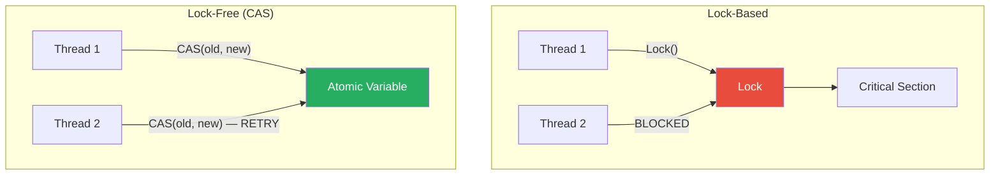
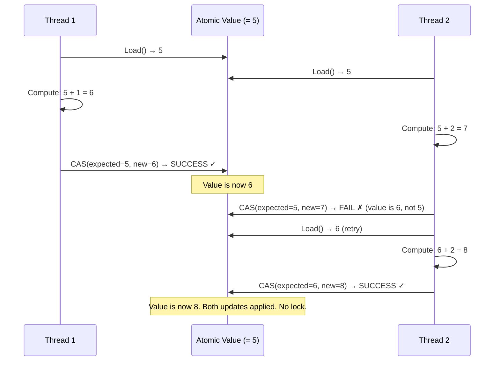

# Lock-Free / Wait-Free Data Structures

## 1. The Problem

You're building a high-frequency trading system. An order book tracks bid/ask prices. Hundreds of threads read the current best price, and incoming market data updates it thousands of times per second.

```go
type OrderBook struct {
    mu       sync.Mutex
    bestBid  int64
    bestAsk  int64
    volume   int64
}

func (ob *OrderBook) GetBestBid() int64 {
    ob.mu.Lock()
    defer ob.mu.Unlock()
    return ob.bestBid
}

func (ob *OrderBook) UpdateBid(price int64) {
    ob.mu.Lock()
    defer ob.mu.Unlock()
    ob.bestBid = price
    ob.volume++
}
```

Performance profile at 100,000 updates/second:
- `Lock()` average: 50ns. Under contention: **5μs** (100x worse).
- 200 reader threads contending on the same mutex: p99 read latency spikes to **50μs**.
- Profiling shows 40% of CPU time is spent in `runtime.semacquire` (waiting for the lock).

In HFT, 50μs is an eternity. Competitors with lock-free order books respond in 5μs. You're losing 45μs per trade to lock contention—thousands of dollars per day.

**The fundamental cost:** Mutexes put threads to sleep (context switch to kernel, wake up later). Even uncontended, there's overhead: memory fences, atomic compare-and-swap for the lock itself, potential context switch. Under high contention, threads stack up waiting, and the CPU spends more time managing the queue than doing useful work.

---

## 2. Naïve Solutions (and Why They Fail)

### Attempt 1: Sharded Locks

```go
type ShardedOrderBook struct {
    shards [16]struct {
        mu      sync.Mutex
        bestBid int64
    }
}
```

**Why it's insufficient:**
- Reduces contention by spreading load across shards. But the bid price is ONE value — sharding doesn't help when everyone reads the same field.
- Shard selection logic adds complexity. Read-your-own-write guarantees are harder.

### Attempt 2: Read-Write Lock

```go
var rw sync.RWMutex

func GetBestBid() int64 {
    rw.RLock()
    defer rw.RUnlock()
    return bestBid
}
```

**Why it's still slow:**
- `RLock()` still increments an atomic counter (the reader count). Under 200 concurrent readers, that counter is a hot cache line bouncing between CPU cores. Not as bad as a mutex, but still not lock-free.
- Writer starvation: pending writer blocks new readers, causing reader latency spikes.

### Attempt 3: Spin Lock

```go
type SpinLock struct {
    flag int32
}

func (s *SpinLock) Lock() {
    for !atomic.CompareAndSwapInt32(&s.flag, 0, 1) {
        runtime.Gosched() // Yield
    }
}
```

**Why it wastes resources:**
- Busy-waiting consumes CPU cycles while spinning. Under contention, multiple cores spin on the same value—burning power, wasting compute.
- In Go, `runtime.Gosched()` helps but goroutines don't map 1:1 to OS threads (GOMAXPROCS), so spinning can block other goroutines.

---

## 3. The Insight

**Use atomic CPU instructions (Compare-And-Swap, Load-Linked/Store-Conditional) to modify shared state without ever acquiring a lock.** Instead of "lock → read → modify → write → unlock," do "read → compute new value → atomically swap if unchanged, else retry." No thread is ever blocked by another. Progress is guaranteed even if threads are arbitrarily delayed.

---

## 4. The Pattern

### Lock-Free / Wait-Free Data Structures

**Definition:** Data structures and algorithms that guarantee progress without using locks. **Lock-free** guarantees that at least one thread makes progress in a finite number of steps (individual threads may retry). **Wait-free** guarantees that EVERY thread makes progress in a bounded number of steps (no retries). Both use atomic operations (CAS, atomic load/store) instead of mutexes.

**Guarantees:**
- **Lock-free:** System-wide progress — no deadlocks, no lock-convoy. At least one thread always makes progress.
- **Wait-free:** Per-thread progress — every thread completes in bounded steps. Stronger than lock-free.
- No priority inversion — a low-priority thread can't block a high-priority one.
- No deadlocks — no locks to deadlock on.

**Non-guarantees:**
- Does NOT guarantee fairness (lock-free allows starvation of individual threads).
- Does NOT simplify code — lock-free algorithms are significantly harder to write correctly.
- Does NOT always improve throughput — under low contention, mutexes may be faster (less CAS overhead).

---

## 5. Mental Model

A **collaborative whiteboard** where multiple people update simultaneously. There's no queue to access the marker. Everyone reads the current state, writes their update on a sticky note, and attempts to paste it on the board. If someone else pasted theirs first and the board changed, you throw away your note, read the new state, prepare a new note, and try again. No one ever waits in line — they just retry if their paste was too late.

---

## 6. Structure





---

## 7. Code Example

### TypeScript

```typescript
// JavaScript is single-threaded for CPU, but SharedArrayBuffer + Atomics
// enable lock-free patterns in Web Workers.

// ========== LOCK-FREE COUNTER (Conceptual) ==========
// In Node.js, we model the CAS loop pattern:

class LockFreeCounter {
  private value: number = 0;

  // Simulated CAS — in real multi-threaded code, this uses hardware atomics
  private compareAndSwap(expected: number, newValue: number): boolean {
    if (this.value === expected) {
      this.value = newValue;
      return true;
    }
    return false;
  }

  increment(): number {
    while (true) {
      const current = this.value;
      const next = current + 1;
      if (this.compareAndSwap(current, next)) {
        return next; // CAS succeeded
      }
      // CAS failed — another thread modified value. Retry.
    }
  }

  get(): number {
    return this.value;
  }
}

// ========== LOCK-FREE STACK (Treiber Stack) ==========
interface Node<T> {
  value: T;
  next: Node<T> | null;
}

class LockFreeStack<T> {
  private head: Node<T> | null = null;

  push(value: T): void {
    const newNode: Node<T> = { value, next: null };
    while (true) {
      const currentHead = this.head;
      newNode.next = currentHead;
      // CAS: if head is still currentHead, set to newNode
      if (this.head === currentHead) {
        this.head = newNode;
        return;
      }
      // Retry — head changed between read and CAS
    }
  }

  pop(): T | undefined {
    while (true) {
      const currentHead = this.head;
      if (currentHead === null) return undefined;
      const nextHead = currentHead.next;
      // CAS: if head is still currentHead, advance to next
      if (this.head === currentHead) {
        this.head = nextHead;
        return currentHead.value;
      }
      // Retry
    }
  }
}

// ========== ATOMIC REFERENCE WITH CAS (for complex objects) ==========
class AtomicReference<T> {
  private ref: T;

  constructor(initial: T) {
    this.ref = initial;
  }

  get(): T {
    return this.ref;
  }

  compareAndSet(expected: T, newValue: T): boolean {
    if (this.ref === expected) {
      this.ref = newValue;
      return true;
    }
    return false;
  }

  update(fn: (current: T) => T): T {
    while (true) {
      const current = this.ref;
      const next = fn(current);
      if (this.compareAndSet(current, next)) {
        return next;
      }
    }
  }
}

// Usage: Lock-free config snapshot
interface Config {
  dbHost: string;
  cacheTimeout: number;
}

const configRef = new AtomicReference<Config>({
  dbHost: "postgres.internal",
  cacheTimeout: 300,
});

// Readers: always get a consistent snapshot (no lock)
const current = configRef.get();

// Writer: atomically replace the entire config
configRef.update((c) => ({ ...c, cacheTimeout: 600 }));
```

### Go

```go
package main

import (
	"fmt"
	"sync"
	"sync/atomic"
	"unsafe"
)

// ========== LOCK-FREE COUNTER ==========
type LockFreeCounter struct {
	value int64
}

func (c *LockFreeCounter) Increment() int64 {
	return atomic.AddInt64(&c.value, 1) // Hardware atomic, no lock
}

func (c *LockFreeCounter) Get() int64 {
	return atomic.LoadInt64(&c.value)
}

// ========== LOCK-FREE STACK (Treiber Stack) ==========
type node struct {
	value interface{}
	next  unsafe.Pointer // *node
}

type LockFreeStack struct {
	head unsafe.Pointer // *node
}

func (s *LockFreeStack) Push(value interface{}) {
	newNode := &node{value: value}
	for {
		oldHead := atomic.LoadPointer(&s.head)
		newNode.next = oldHead
		if atomic.CompareAndSwapPointer(&s.head, oldHead, unsafe.Pointer(newNode)) {
			return // CAS succeeded
		}
		// CAS failed — another goroutine pushed. Retry.
	}
}

func (s *LockFreeStack) Pop() (interface{}, bool) {
	for {
		oldHead := atomic.LoadPointer(&s.head)
		if oldHead == nil {
			return nil, false // Empty
		}
		oldNode := (*node)(oldHead)
		newHead := oldNode.next
		if atomic.CompareAndSwapPointer(&s.head, oldHead, newHead) {
			return oldNode.value, true // CAS succeeded
		}
		// CAS failed — retry
	}
}

// ========== ATOMIC.VALUE: LOCK-FREE CONFIG SNAPSHOT ==========
type Config struct {
	DBHost       string
	CacheTimeout int
}

var configStore atomic.Value // Stores *Config

func GetConfig() *Config {
	return configStore.Load().(*Config) // Lock-free read
}

func UpdateConfig(newConfig *Config) {
	configStore.Store(newConfig) // Lock-free write (atomic pointer swap)
}

// ========== BENCHMARK COMPARISON ==========
func main() {
	// Lock-free counter
	counter := &LockFreeCounter{}
	var wg sync.WaitGroup

	for i := 0; i < 1000; i++ {
		wg.Add(1)
		go func() {
			defer wg.Done()
			for j := 0; j < 1000; j++ {
				counter.Increment()
			}
		}()
	}
	wg.Wait()
	fmt.Printf("Lock-free counter: %d (expected 1000000)\n", counter.Get())

	// Lock-free stack
	stack := &LockFreeStack{}
	for i := 0; i < 100; i++ {
		stack.Push(i)
	}
	for {
		val, ok := stack.Pop()
		if !ok {
			break
		}
		_ = val
	}
	fmt.Println("Lock-free stack: drained successfully")

	// Atomic config snapshot
	configStore.Store(&Config{DBHost: "pg.internal", CacheTimeout: 300})
	cfg := GetConfig()
	fmt.Printf("Config: %s, TTL: %d\n", cfg.DBHost, cfg.CacheTimeout)

	// Update (readers never block, always see a consistent snapshot)
	UpdateConfig(&Config{DBHost: "pg.internal", CacheTimeout: 600})
	cfg2 := GetConfig()
	fmt.Printf("Updated Config: TTL: %d\n", cfg2.CacheTimeout)
}
```

---

## 8. Gotchas & Beginner Mistakes

| Mistake | Why It Hurts |
|---|---|
| **ABA problem** | Value changes from A → B → A. CAS sees A and succeeds, but the state has changed. Use tagged pointers or generation counters. |
| **Memory ordering bugs** | Compiler and CPU reorder instructions. Without proper memory barriers (`atomic.Load/Store`), you read stale data even with CAS. |
| **Livelock** | Two threads repeatedly CAS-fail against each other. Both retry forever. Add exponential backoff or randomized delays. |
| **Complexity** | Lock-free code is 5-10x harder to write correctly. Even experts get it wrong. Prefer proven libraries over custom implementations. |
| **Premature optimization** | Using lock-free structures when a mutex serves fine. Under low contention, a mutex is actually FASTER (no retry loops). Profile first. |

---

## 9. Related & Confusable Patterns

| Pattern | How It Differs |
|---|---|
| **Mutex** | Blocks threads. Simpler, correct by default. Lock-free avoids blocking but adds complexity. Profile to see which is actually faster for your workload. |
| **Spin Lock** | Busy-waits on a lock (uses atomics internally but still a lock). Lock-free algorithms don't have a lock at all — they transform the data directly. |
| **Read-Copy-Update (RCU)** | Readers pay zero overhead (no atomics). Writers copy the data, update the copy, and atomically swap. Used extensively in the Linux kernel. |
| **Immutable Data Structures** | No mutation = no synchronization needed. Every "write" creates a new version. Conceptually similar to RCU. |
| **Software Transactional Memory (STM)** | Wrap shared state mutations in transactions that atomically commit or abort. Higher-level than CAS, with retry semantics. |

---

## 10. When This Pattern Is the WRONG Choice

- **Moderate contention** — If 10 goroutines share a counter, `sync.Mutex` is simple and fast enough. Lock-free complexity is not justified.
- **Complex multi-field operations** — CAS works on single variables. Updating 3 fields atomically requires transactions (or a lock). Lock-free multi-word CAS is extremely hard.
- **When correctness trumps performance** — Financial calculations, medical systems. A subtle CAS bug is harder to detect than a lock bug. Use locks and test thoroughly.
- **Application-level code** — Lock-free is for infrastructure: database internals, kernel schedulers, runtime libraries. Application developers should use higher-level abstractions.

**Symptoms you chose it wrong:**
- Your CAS retry loop retries more than it succeeds (high contention — a lock would actually be faster by putting threads to sleep).
- You're debugging data corruption that only appears under load (likely a memory ordering bug in your lock-free code).
- You spent a week implementing a lock-free queue that's 5% faster than `sync.Mutex + slice`.

**How to back out:** Replace with `sync.Mutex` or `sync.RWMutex`. Use `atomic.Value` for simple read-heavy/write-rare patterns. Use channel-based designs to avoid shared state entirely. In Go, the mantra is: "Don't communicate by sharing memory; share memory by communicating."
