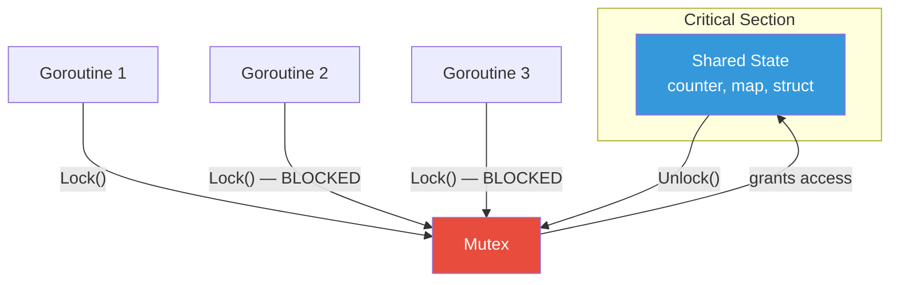
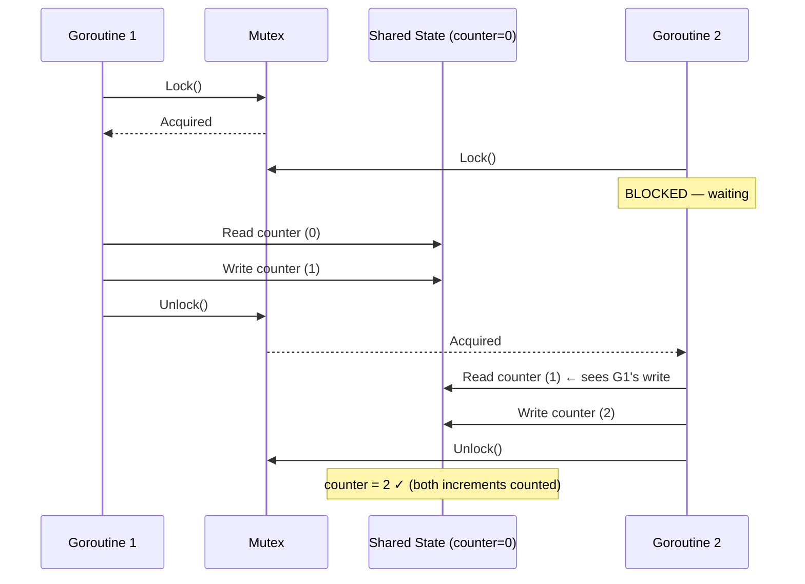

# Mutex / Lock

## 1. The Problem

You're building an analytics service. Every API request increments a counter tracking total requests served:

```go
var requestCount int64 = 0

func handleRequest(w http.ResponseWriter, r *http.Request) {
    requestCount++  // Read current value, add 1, write back
    processRequest(r)
    w.WriteHeader(200)
}
```

In testing, it works perfectly. You deploy. The server handles 10,000 requests per second across 8 CPU cores. After processing exactly 1,000,000 requests (you verified via access logs), you check the counter: **987,431**.

You've lost 12,569 increments. No errors. No crashes. Silent data corruption.

**Why?** `requestCount++` is not one operation. It's three:
1. Read the current value of `requestCount` (say, 500).
2. Add 1 (501).
3. Write 501 back to `requestCount`.

When two goroutines execute simultaneously:
- Goroutine A reads 500.
- Goroutine B reads 500 (before A writes).
- A writes 501.
- B writes 501 (overwriting A's increment).
- Two increments happened, but the counter only moved by 1.

This is the **lost update** problem, the simplest form of a race condition.

---

## 2. Naïve Solutions (and Why They Fail)

### Attempt 1: Use a Channel

```go
var counterCh = make(chan int64, 1)

func init() { counterCh <- 0 }

func increment() {
    val := <-counterCh
    counterCh <- val + 1
}
```

**Why it's problematic:**
- Semantically correct but absurdly slow. Every increment requires a channel send and receive — synchronization overhead far exceeds the cost of `val + 1`.
- If any caller forgets to put the value back, the channel blocks forever (deadlock).
- This uses a concurrency primitive (channels) to simulate something simpler (a lock).

### Attempt 2: "Just Be Fast"

```go
func increment() {
    temp := requestCount
    requestCount = temp + 1
}
```

Making the code "faster" doesn't help. Modern CPUs run instructions out of order and cache values per-core. Even if the operations are nanoseconds apart, the race window exists.

### Attempt 3: Disable Concurrency

Run with `GOMAXPROCS=1` to force single-threaded execution.

**Why it breaks everything:**
- Eliminates the bug but destroys throughput. You bought an 8-core machine to use 1 core.
- Doesn't help with I/O concurrency (goroutines multiplexed on the single OS thread still interleave).

---

## 3. The Insight

**Wrap the critical section — the code that reads and writes shared state — in a mechanism that guarantees only one thread of execution can enter at a time.** The mechanism "locks" the critical section, forcing all other threads to wait until the current one finishes. This converts a concurrent read-modify-write into a sequential one, at the cost of serializing access.

---

## 4. The Pattern

### Mutex (Mutual Exclusion Lock)

**Definition:** A synchronization primitive that enforces **mutual exclusion**: at most one thread (or goroutine, or coroutine) can hold the lock at any time. Code between `Lock()` and `Unlock()` is called the **critical section**. All other threads attempting to acquire the lock will block until it is released.

**Guarantees:**
- Mutual exclusion — at most one holder at a time.
- Visibility — changes made inside the critical section are visible to the next holder (memory barrier).
- Safety — data protected by the mutex cannot be corrupted by concurrent access (assuming ALL accesses use the mutex).

**Non-guarantees:**
- Does NOT prevent deadlocks (two mutexes locked in opposite order).
- Does NOT guarantee fairness (which thread gets the lock next is implementation-dependent).
- Does NOT guarantee performance — serializing access can become a bottleneck.

---

## 5. Mental Model

A **single-occupancy bathroom** in a coffee shop. The door has a lock. One person enters, locks the door, does their business, unlocks, and exits. Others form a queue outside. No one can enter while it's occupied. The lock guarantees privacy (mutual exclusion), but if someone takes 30 minutes (holds the lock too long), the queue grows (contention).

---

## 6. Structure





---

## 7. Code Example

### TypeScript

```typescript
// TypeScript/Node.js is single-threaded for CPU work, but async operations
// interleave. Mutex matters for protecting async critical sections.

class Mutex {
  private locked = false;
  private waiting: Array<() => void> = [];

  async acquire(): Promise<void> {
    if (!this.locked) {
      this.locked = true;
      return;
    }
    return new Promise<void>((resolve) => {
      this.waiting.push(resolve);
    });
  }

  release(): void {
    if (this.waiting.length > 0) {
      const next = this.waiting.shift()!;
      next(); // Hand lock to next waiter
    } else {
      this.locked = false;
    }
  }
}

// ========== SAFE BANK ACCOUNT ==========
class BankAccount {
  private balance: number;
  private mutex = new Mutex();

  constructor(initial: number) {
    this.balance = initial;
  }

  async transfer(amount: number): Promise<boolean> {
    await this.mutex.acquire();
    try {
      // Critical section: read-check-modify must be atomic
      if (this.balance < amount) {
        return false;
      }
      // Simulate async I/O (database write)
      await new Promise((resolve) => setTimeout(resolve, 10));
      this.balance -= amount;
      return true;
    } finally {
      this.mutex.release(); // Always release, even on error
    }
  }

  async deposit(amount: number): Promise<void> {
    await this.mutex.acquire();
    try {
      await new Promise((resolve) => setTimeout(resolve, 10));
      this.balance += amount;
    } finally {
      this.mutex.release();
    }
  }

  getBalance(): number {
    return this.balance;
  }
}

// ========== WITHOUT MUTEX: RACE CONDITION ==========
async function demonstrateRace() {
  const account = new BankAccount(100);
  // 10 concurrent withdrawals of 20 each (should only allow 5)
  const results = await Promise.all(
    Array.from({ length: 10 }, () => account.transfer(20))
  );
  const successes = results.filter(Boolean).length;
  console.log(`Successes: ${successes}, Balance: ${account.getBalance()}`);
  // With mutex: exactly 5 succeed, balance = 0
  // Without mutex: more than 5 might succeed, balance goes negative
}

demonstrateRace();
```

### Go

```go
package main

import (
	"fmt"
	"sync"
)

// ========== WITHOUT MUTEX: BROKEN ==========
type UnsafeCounter struct {
	count int64
}

func (c *UnsafeCounter) Increment() {
	c.count++ // Race condition!
}

// ========== WITH MUTEX: CORRECT ==========
type SafeCounter struct {
	mu    sync.Mutex
	count int64
}

func (c *SafeCounter) Increment() {
	c.mu.Lock()
	defer c.mu.Unlock()
	c.count++
}

func (c *SafeCounter) Get() int64 {
	c.mu.Lock()
	defer c.mu.Unlock()
	return c.count
}

// ========== PROTECTING A MAP ==========
type SafeMap struct {
	mu   sync.Mutex
	data map[string]int
}

func NewSafeMap() *SafeMap {
	return &SafeMap{data: make(map[string]int)}
}

func (m *SafeMap) Set(key string, value int) {
	m.mu.Lock()
	defer m.mu.Unlock()
	m.data[key] = value
}

func (m *SafeMap) Get(key string) (int, bool) {
	m.mu.Lock()
	defer m.mu.Unlock()
	v, ok := m.data[key]
	return v, ok
}

// ========== DEMONSTRATION ==========
func main() {
	counter := &SafeCounter{}
	var wg sync.WaitGroup

	// 1000 goroutines each increment 1000 times
	for i := 0; i < 1000; i++ {
		wg.Add(1)
		go func() {
			defer wg.Done()
			for j := 0; j < 1000; j++ {
				counter.Increment()
			}
		}()
	}

	wg.Wait()
	fmt.Printf("Expected: 1000000, Got: %d\n", counter.Get())
	// Always prints 1000000 with mutex

	// Without mutex:
	unsafeCounter := &UnsafeCounter{}
	for i := 0; i < 1000; i++ {
		wg.Add(1)
		go func() {
			defer wg.Done()
			for j := 0; j < 1000; j++ {
				unsafeCounter.Increment()
			}
		}()
	}
	wg.Wait()
	fmt.Printf("Unsafe expected: 1000000, Got: %d\n", unsafeCounter.count)
	// Prints some number less than 1000000
}
```

---

## 8. Gotchas & Beginner Mistakes

| Mistake | Why It Hurts |
|---|---|
| **Forgetting to unlock** | Goroutine panics or returns early without `Unlock()`. Every other goroutine waits forever. Use `defer mu.Unlock()` in Go, `try/finally` in TS. |
| **Locking too broadly** | Wrapping entire request handlers in a mutex. Throughput drops to 1 request at a time. Lock only the critical section. |
| **Nested locks (deadlock)** | Lock A, then Lock B. Another goroutine: Lock B, then Lock A. Both wait forever. Always acquire locks in consistent order. |
| **Copying a mutex** | In Go, `sync.Mutex` must not be copied (passing by value). Use pointers or embed in a struct. |
| **Protecting reads but not writes** | Only locking during writes. Readers see partially-written data (torn reads). Lock both reads and writes. |

---

## 9. Related & Confusable Patterns

| Pattern | How It Differs |
|---|---|
| **Read-Write Lock** | Allows multiple concurrent readers. Mutex blocks everyone — readers and writers alike. Use RWMutex when reads vastly outnumber writes. |
| **Semaphore** | Allows N concurrent holders (not just 1). Mutex is a semaphore with N=1. |
| **Atomic Operations** | Lock-free. `atomic.AddInt64` for simple counters. No lock overhead, but only works for individual variables, not compound operations. |
| **Channel (Go)** | Communicates data between goroutines. Can simulate mutex but with different semantics. "Share memory by communicating" vs. "communicate by sharing memory." |
| **Actor Model** | Eliminates shared state entirely. Each actor owns its state and communicates via messages. No locks needed. |

---

## 10. When This Pattern Is the WRONG Choice

- **Read-heavy workloads** — If 95% of operations are reads, a Mutex serializes them unnecessarily. Use a Read-Write Lock instead.
- **Simple counters** — `sync/atomic` (`atomic.AddInt64`) is faster and lock-free for single-variable operations.
- **Cross-process synchronization** — Mutex works within a single process. For cross-process, use file locks, database locks, or distributed locks (Redis, etcd).
- **High-contention hot paths** — If 100 goroutines fight over one mutex, throughput collapses. Consider sharding the state, using lock-free structures, or redesigning to avoid shared state.

**Symptoms you're over-using it:**
- Profiling shows goroutines spending most time waiting on `Lock()`.
- Throughput doesn't increase when adding more CPU cores.
- You have more than 3 mutexes, and you've had deadlock-related incidents.

**How to back out:** Replace with atomic operations (for simple counters), channels (for data flow), or the Actor model (for complex state). Sometimes the answer is to redesign so state isn't shared at all.
