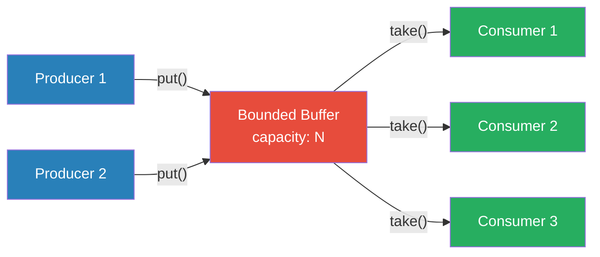
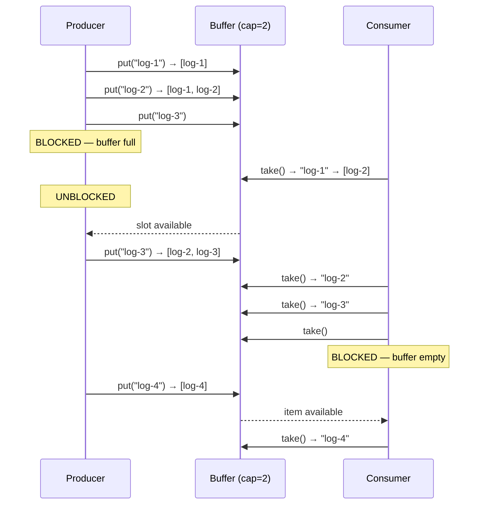

# Producer-Consumer

## 1. The Problem

You're building a log processing pipeline. Your web servers produce log lines at 50,000 lines/second during peak traffic. A downstream component parses, enriches, and stores each log line — this takes ~5ms per line (200 lines/second per worker).

**Attempt: Direct call.**

```go
func handleRequest(w http.ResponseWriter, r *http.Request) {
    processRequest(r)
    logLine := formatLog(r)
    parseAndStore(logLine) // 5ms — blocks the response!
    w.WriteHeader(200)
}
```

This adds 5ms to every request. At 50,000 req/sec, that's 50,000 × 5ms = 250 seconds of CPU time per second. You'd need 250 cores just for logging.

**Attempt: Fire and forget with goroutines.**

```go
func handleRequest(w http.ResponseWriter, r *http.Request) {
    processRequest(r)
    go parseAndStore(formatLog(r)) // Don't wait
    w.WriteHeader(200)
}
```

Now requests are fast, but you've spawned 50,000 goroutines per second. Each one allocates memory for the log line and goroutine stack. During a traffic spike, you have 500,000 goroutines alive simultaneously. Memory usage explodes. The garbage collector thrashes. If the downstream database is slow, goroutines accumulate. Eventually: OOM kill.

**The tension:** The producer (web server) and consumer (log processor) operate at wildly different speeds. Directly coupling them makes the fast one wait for the slow one. Decoupling with unbounded goroutines exhausts resources.

---

## 2. Naïve Solutions (and Why They Fail)

### Attempt 1: Unbounded In-Memory Queue

```go
var logQueue = make([]string, 0) // Unbounded slice

func produce(line string) {
    logQueue = append(logQueue, line) // Grows forever
}
```

**Why it breaks:**
- No back-pressure. The producer can add faster than the consumer removes. Memory grows without bound. Under sustained load: OOM.
- No thread safety. Concurrent append/read on a slice is a data race.

### Attempt 2: Shared Array with Polling

Consumer polls the array in a loop:

```go
for {
    if len(logQueue) > 0 {
        item := logQueue[0]
        logQueue = logQueue[1:]
        process(item)
    }
    time.Sleep(10 * time.Millisecond) // Poll interval
}
```

**Why it breaks:**
- Polling wastes CPU when the queue is empty (busy-waiting with sleep).
- 10ms polling interval means up to 10ms latency even when items are available.
- Still no thread safety or back-pressure.

### Attempt 3: Locking on Every Enqueue/Dequeue

```go
var mu sync.Mutex
var queue []string

func enqueue(item string) {
    mu.Lock()
    queue = append(queue, item)
    mu.Unlock()
}
```

**Why it's incomplete:**
- Thread-safe, but no blocking when empty (consumer spins), no bounding when full (still OOM-vulnerable), and no signal mechanism (consumer doesn't know when items arrive).

---

## 3. The Insight

**Place a bounded, thread-safe buffer between the producer and consumer.** The buffer decouples their speeds: the producer adds items without waiting for the consumer, and the consumer takes items without waiting for the producer. When the buffer is full, the producer blocks (back-pressure). When the buffer is empty, the consumer blocks (no busy-waiting). This naturally flow-controls the faster side.

---

## 4. The Pattern

### Producer-Consumer

**Definition:** A concurrency pattern where one or more **producers** generate data items and place them into a shared **bounded buffer**, and one or more **consumers** remove and process items from the buffer. The buffer provides decoupling, back-pressure, and thread-safe handoff between the two groups.

**Guarantees:**
- Decoupling — producers and consumers run independently.
- Back-pressure — producers slow down when the buffer is full.
- Blocking — consumers wait efficiently when the buffer is empty (no polling).
- Thread safety — the buffer handles synchronization internally.

**Non-guarantees:**
- Does NOT guarantee ordering across multiple consumers (items may be processed out of order).
- Does NOT guarantee delivery if the process crashes (buffer is in-memory).
- Does NOT handle poison pills or graceful shutdown by itself.

---

## 5. Mental Model

A **sushi conveyor belt**. The chef (producer) places sushi plates on the belt. Customers (consumers) pick plates off. The belt has limited space — if it's full, the chef waits. If it's empty, customers wait. The belt decouples the chef's cooking speed from the customers' eating speed. Multiple chefs can add plates; multiple customers can grab them.

---

## 6. Structure





---

## 7. Code Example

### TypeScript

```typescript
import { EventEmitter } from "events";

// ========== BOUNDED BUFFER ==========
class BoundedBuffer<T> {
  private buffer: T[] = [];
  private emitter = new EventEmitter();

  constructor(private capacity: number) {
    this.emitter.setMaxListeners(1000);
  }

  async put(item: T): Promise<void> {
    while (this.buffer.length >= this.capacity) {
      await new Promise((resolve) => this.emitter.once("taken", resolve));
    }
    this.buffer.push(item);
    this.emitter.emit("added");
  }

  async take(): Promise<T> {
    while (this.buffer.length === 0) {
      await new Promise((resolve) => this.emitter.once("added", resolve));
    }
    const item = this.buffer.shift()!;
    this.emitter.emit("taken");
    return item;
  }

  size(): number {
    return this.buffer.length;
  }
}

// ========== LOG PROCESSING PIPELINE ==========
interface LogEntry {
  timestamp: Date;
  level: string;
  message: string;
  requestId: string;
}

// Producer: generates log entries
async function logProducer(
  buffer: BoundedBuffer<LogEntry>,
  count: number,
  producerId: string
) {
  for (let i = 0; i < count; i++) {
    const entry: LogEntry = {
      timestamp: new Date(),
      level: i % 10 === 0 ? "ERROR" : "INFO",
      message: `Request processed by ${producerId}`,
      requestId: `${producerId}-${i}`,
    };
    await buffer.put(entry);
  }
  console.log(`Producer ${producerId} done`);
}

// Consumer: parses and stores log entries
async function logConsumer(
  buffer: BoundedBuffer<LogEntry>,
  consumerId: string,
  signal: { done: boolean }
) {
  let processed = 0;
  while (!signal.done || buffer.size() > 0) {
    try {
      const entry = await Promise.race([
        buffer.take(),
        new Promise<never>((_, reject) =>
          setTimeout(() => reject(new Error("timeout")), 100)
        ),
      ]);
      // Simulate processing (parse, enrich, store)
      await new Promise((r) => setTimeout(r, 2));
      processed++;
    } catch {
      // Timeout — check if we should exit
      if (signal.done && buffer.size() === 0) break;
    }
  }
  console.log(`Consumer ${consumerId} processed ${processed} entries`);
}

// ========== ORCHESTRATION ==========
async function main() {
  const buffer = new BoundedBuffer<LogEntry>(100); // Bounded: max 100 items
  const signal = { done: false };

  // 3 producers, 5 consumers
  const producers = [
    logProducer(buffer, 200, "web-1"),
    logProducer(buffer, 200, "web-2"),
    logProducer(buffer, 200, "web-3"),
  ];

  const consumers = Array.from({ length: 5 }, (_, i) =>
    logConsumer(buffer, `worker-${i}`, signal)
  );

  await Promise.all(producers);
  signal.done = true;
  console.log("All producers done, draining buffer...");

  await Promise.all(consumers);
  console.log("All consumers done");
}

main();
```

### Go

```go
package main

import (
	"fmt"
	"sync"
	"time"
)

// In Go, a buffered channel IS the bounded buffer.
// The producer-consumer pattern is native to Go.

type LogEntry struct {
	Timestamp time.Time
	Level     string
	Message   string
	RequestID string
}

// Producer
func logProducer(ch chan<- LogEntry, count int, producerID string, wg *sync.WaitGroup) {
	defer wg.Done()

	for i := 0; i < count; i++ {
		level := "INFO"
		if i%10 == 0 {
			level = "ERROR"
		}
		entry := LogEntry{
			Timestamp: time.Now(),
			Level:     level,
			Message:   fmt.Sprintf("Request processed by %s", producerID),
			RequestID: fmt.Sprintf("%s-%d", producerID, i),
		}
		ch <- entry // Blocks if channel is full (back-pressure!)
	}
	fmt.Printf("Producer %s done\n", producerID)
}

// Consumer
func logConsumer(ch <-chan LogEntry, consumerID string, wg *sync.WaitGroup) {
	defer wg.Done()
	processed := 0

	for entry := range ch { // Blocks if empty, exits when closed
		// Simulate processing
		_ = entry
		time.Sleep(1 * time.Millisecond)
		processed++
	}
	fmt.Printf("Consumer %s processed %d entries\n", consumerID, processed)
}

func main() {
	// Buffered channel = bounded buffer
	ch := make(chan LogEntry, 100) // Capacity: 100

	var producerWg, consumerWg sync.WaitGroup

	// Start 3 producers
	for i := 0; i < 3; i++ {
		producerWg.Add(1)
		go logProducer(ch, 500, fmt.Sprintf("web-%d", i), &producerWg)
	}

	// Start 5 consumers
	for i := 0; i < 5; i++ {
		consumerWg.Add(1)
		go logConsumer(ch, fmt.Sprintf("worker-%d", i), &consumerWg)
	}

	// Wait for producers to finish, then close the channel
	producerWg.Wait()
	close(ch) // Signal consumers: no more data
	fmt.Println("All producers done, draining...")

	// Wait for consumers to finish processing remaining items
	consumerWg.Wait()
	fmt.Println("All consumers done")
}
```

---

## 8. Gotchas & Beginner Mistakes

| Mistake | Why It Hurts |
|---|---|
| **Unbounded buffer** | "Just use a big buffer." Memory grows without limit. Under sustained overload, OOM kill. Always bound the buffer. |
| **Buffer too small** | Buffer of 1 serializes everything — producer blocks after every item. Measure throughput and set the buffer to absorb bursts. |
| **Buffer too large** | Hides back-pressure. Producer fills 100,000 items, consumer is 10 minutes behind. On crash, you lose 100,000 items. Balance latency vs. safety. |
| **Not closing the channel** | In Go, consumers `range` over the channel. If you never `close(ch)`, consumers block forever. Close the channel after all producers finish. |
| **Single consumer bottleneck** | One consumer can't keep up with multiple producers. Scale consumers horizontally. Measure consumer throughput ÷ total production rate. |

---

## 9. Related & Confusable Patterns

| Pattern | How It Differs |
|---|---|
| **Message Queue (RabbitMQ, SQS)** | Distributed producer-consumer. Process-level pattern vs. in-memory pattern. Use message queues for cross-service, producer-consumer for in-process. |
| **Fan-Out / Fan-In** | Multiple workers process items AND merge results. Producer-consumer doesn't necessarily merge results. |
| **Pipeline / Chain** | Each stage is both consumer (of previous stage) and producer (for next stage). A chain of producer-consumer pairs. |
| **Thread Pool** | Workers (consumers) are pre-created and reused. Thread pool manages the lifecycle; producer-consumer is the coordination pattern. |
| **Pub-Sub** | Every subscriber gets every message. Producer-consumer: each item goes to exactly one consumer (competing consumers). |

---

## 10. When This Pattern Is the WRONG Choice

- **Request-response semantics** — If the producer needs to wait for the result anyway, a buffer just adds complexity. Just call the function directly.
- **Single-item processing** — If there's one producer, one consumer, and no speed mismatch, a direct function call is simpler.
- **Durability requirements** — In-memory buffers don't survive crashes. If you can't afford to lose buffered items, use a persistent message queue (Kafka, SQS).
- **Latency-sensitive paths** — Buffering adds latency (item waits in the buffer). For real-time paths (chat messages, trading), minimize buffering.

**Symptoms you should reconsider:**
- Buffer is always empty (no speed difference — just call directly).
- Buffer is always full (consumer can't keep up — need more consumers or a faster consumer, not a bigger buffer).
- You're building your own thread-safe queue. In Go, use channels. In other languages, use battle-tested concurrent queue implementations.

**How to back out:** Replace with a direct function call if there's no speed mismatch. Replace with a managed message queue if durability matters. Replace with a thread pool if you mainly need to limit concurrency.
