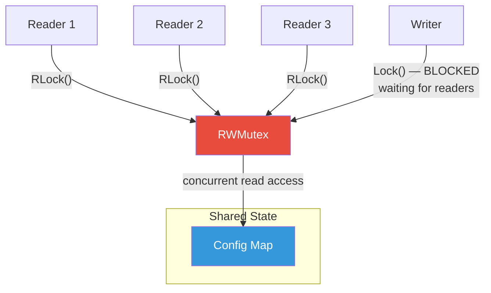
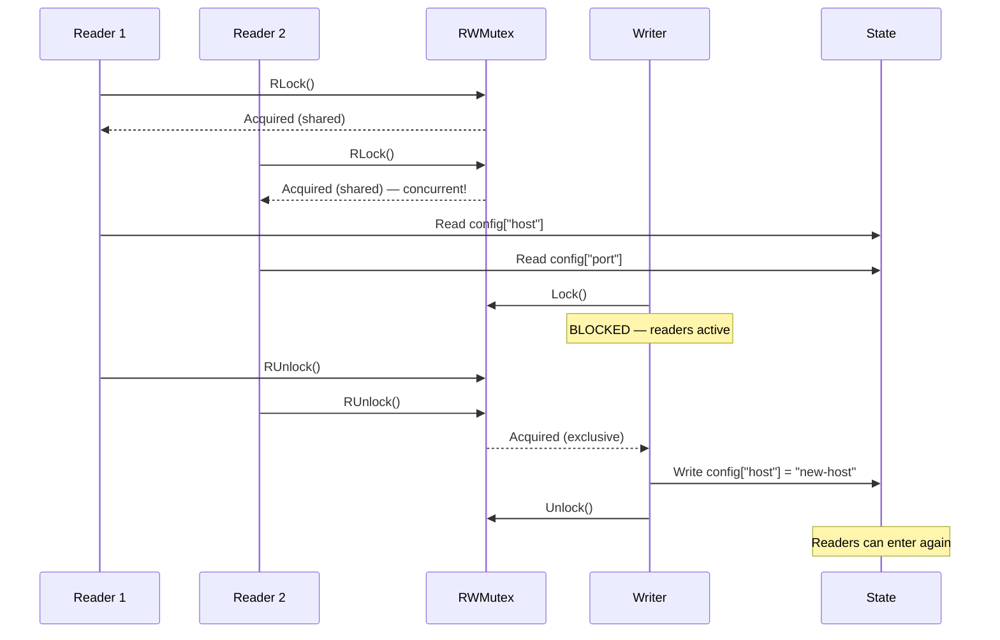

# Read-Write Lock

## 1. The Problem

You're building a configuration service. Hundreds of microservices poll it every 5 seconds to read their config. An admin updates config maybe once per hour.

```go
type ConfigStore struct {
    mu     sync.Mutex
    config map[string]string
}

func (s *ConfigStore) Get(key string) string {
    s.mu.Lock()
    defer s.mu.Unlock()
    return s.config[key]
}

func (s *ConfigStore) Set(key, value string) {
    s.mu.Lock()
    defer s.mu.Unlock()
    s.config[key] = value
}
```

200 services each query 10 keys every 5 seconds = 400 reads/second. A regular mutex serializes all of them — each read waits for the previous read to finish, even though **reads don't modify anything**. Under load, the p99 latency for `Get()` spikes to 200ms because 400 goroutines are queuing behind one lock.

The admin writes once per hour. But because of the mutex, that one write has the same contention cost as a read: it waits in line behind hundreds of reads.

**The core waste:** Readers are blocking other readers. Two readers can safely look at the same data simultaneously — there's no corruption risk. The mutex doesn't know this. It treats everyone the same.

---

## 2. Naïve Solutions (and Why They Fail)

### Attempt 1: Remove the Lock for Reads

```go
func (s *ConfigStore) Get(key string) string {
    return s.config[key]  // No lock — fast!
}
```

**Why it breaks:**
- Go maps are not safe for concurrent read/write. If a write happens while a read is in progress, the program panics with `concurrent map read and map write`.
- Even for simpler types, you risk torn reads (reading a partially-written struct).

### Attempt 2: Copy-on-Read

```go
func (s *ConfigStore) Get(key string) string {
    s.mu.Lock()
    configCopy := make(map[string]string)
    for k, v := range s.config {
        configCopy[k] = v
    }
    s.mu.Unlock()
    return configCopy[key]
}
```

**Why it breaks:**
- Copying the entire map on every read is O(n). With 10,000 config keys and 400 reads/second, that's 4 million map copies per second.
- Still holds the mutex during the copy, so contention remains.

### Attempt 3: Use Channels

```go
type readRequest struct {
    key    string
    result chan string
}
```

Route all reads through a single goroutine via channels.

**Why it breaks:**
- The single goroutine becomes the bottleneck. All reads serialize through it — same problem as the mutex, but with channel overhead added.

---

## 3. The Insight

**Distinguish between readers and writers.** Readers don't conflict with each other — any number can safely read simultaneously. Only writers need exclusive access (no readers or other writers). By tracking which kind of access is requested, you can allow concurrent reads while still protecting writes.

---

## 4. The Pattern

### Read-Write Lock (RWMutex)

**Definition:** A synchronization primitive that allows **multiple concurrent readers** or **one exclusive writer**, but not both simultaneously. When a writer holds the lock, all readers and other writers are blocked. When readers hold the lock, other readers can proceed but writers are blocked.

Also known as: **Shared-Exclusive Lock**, **Multiple Readers / Single Writer Lock**

**Guarantees:**
- Multiple readers can proceed concurrently (shared access).
- Writers have exclusive access — no readers or other writers.
- Visibility — writes made by a writer are visible to subsequent readers.

**Non-guarantees:**
- Does NOT prevent writer starvation (continuous readers may prevent a writer from ever acquiring the lock — implementation dependent).
- Does NOT help when reads and writes are equally frequent.
- Does NOT guarantee fairness between readers and writers.

---

## 5. Mental Model

A **museum gallery**. Many visitors (readers) can view the paintings simultaneously — they don't interfere with each other. But when a curator (writer) needs to hang a new painting, the gallery is closed: all visitors must leave, and no new visitors enter until the curator finishes. Once the curator is done, visitors flood back in.

---

## 6. Structure





---

## 7. Code Example

### TypeScript

```typescript
class RWMutex {
  private readers = 0;
  private writing = false;
  private readQueue: Array<() => void> = [];
  private writeQueue: Array<() => void> = [];

  async rLock(): Promise<void> {
    if (!this.writing && this.writeQueue.length === 0) {
      this.readers++;
      return;
    }
    return new Promise((resolve) => {
      this.readQueue.push(() => {
        this.readers++;
        resolve();
      });
    });
  }

  rUnlock(): void {
    this.readers--;
    if (this.readers === 0 && this.writeQueue.length > 0) {
      this.writing = true;
      this.writeQueue.shift()!();
    }
  }

  async lock(): Promise<void> {
    if (!this.writing && this.readers === 0) {
      this.writing = true;
      return;
    }
    return new Promise((resolve) => {
      this.writeQueue.push(resolve);
    });
  }

  unlock(): void {
    this.writing = false;
    // Prefer waking all queued readers over one writer
    if (this.readQueue.length > 0) {
      const batch = this.readQueue.splice(0);
      batch.forEach((wake) => wake());
    } else if (this.writeQueue.length > 0) {
      this.writing = true;
      this.writeQueue.shift()!();
    }
  }
}

// ========== CONFIG SERVICE ==========
interface ConfigEntry {
  value: string;
  updatedAt: Date;
}

class ConfigService {
  private rwLock = new RWMutex();
  private config = new Map<string, ConfigEntry>();

  // Many can read concurrently
  async get(key: string): Promise<string | undefined> {
    await this.rwLock.rLock();
    try {
      return this.config.get(key)?.value;
    } finally {
      this.rwLock.rUnlock();
    }
  }

  async getAll(): Promise<Record<string, string>> {
    await this.rwLock.rLock();
    try {
      const result: Record<string, string> = {};
      for (const [k, v] of this.config) {
        result[k] = v.value;
      }
      return result;
    } finally {
      this.rwLock.rUnlock();
    }
  }

  // Only one writer at a time, blocks all readers
  async set(key: string, value: string): Promise<void> {
    await this.rwLock.lock();
    try {
      this.config.set(key, { value, updatedAt: new Date() });
    } finally {
      this.rwLock.unlock();
    }
  }

  async bulkUpdate(entries: Record<string, string>): Promise<void> {
    await this.rwLock.lock();
    try {
      for (const [k, v] of Object.entries(entries)) {
        this.config.set(k, { value: v, updatedAt: new Date() });
      }
    } finally {
      this.rwLock.unlock();
    }
  }
}

// ========== USAGE ==========
async function main() {
  const config = new ConfigService();
  await config.set("db_host", "postgres.internal");
  await config.set("cache_ttl", "300");

  // 50 concurrent readers — all proceed simultaneously
  const reads = Array.from({ length: 50 }, () => config.get("db_host"));
  const results = await Promise.all(reads);
  console.log(`All 50 reads returned: ${results[0]}`);
}

main();
```

### Go

```go
package main

import (
	"fmt"
	"sync"
	"time"
)

// ========== CONFIG STORE WITH RWMutex ==========
type ConfigStore struct {
	mu     sync.RWMutex
	config map[string]string
}

func NewConfigStore() *ConfigStore {
	return &ConfigStore{config: make(map[string]string)}
}

// Multiple goroutines can call Get concurrently
func (s *ConfigStore) Get(key string) (string, bool) {
	s.mu.RLock()         // Shared lock — readers don't block each other
	defer s.mu.RUnlock()
	val, ok := s.config[key]
	return val, ok
}

func (s *ConfigStore) GetAll() map[string]string {
	s.mu.RLock()
	defer s.mu.RUnlock()
	// Return a copy to avoid data races after unlocking
	copy := make(map[string]string, len(s.config))
	for k, v := range s.config {
		copy[k] = v
	}
	return copy
}

// Only one goroutine can call Set at a time, and it blocks all readers
func (s *ConfigStore) Set(key, value string) {
	s.mu.Lock()          // Exclusive lock — blocks readers AND writers
	defer s.mu.Unlock()
	s.config[key] = value
}

func main() {
	store := NewConfigStore()
	store.Set("db_host", "postgres.internal")
	store.Set("cache_ttl", "300")

	var wg sync.WaitGroup
	start := time.Now()

	// Simulate 200 concurrent readers
	for i := 0; i < 200; i++ {
		wg.Add(1)
		go func(id int) {
			defer wg.Done()
			for j := 0; j < 100; j++ {
				val, _ := store.Get("db_host")
				_ = val
			}
		}(i)
	}

	// Simulate 1 writer (updating every 100ms)
	wg.Add(1)
	go func() {
		defer wg.Done()
		for i := 0; i < 5; i++ {
			time.Sleep(100 * time.Millisecond)
			store.Set("cache_ttl", fmt.Sprintf("%d", 300+i))
		}
	}()

	wg.Wait()
	elapsed := time.Since(start)

	val, _ := store.Get("cache_ttl")
	fmt.Printf("Final cache_ttl: %s (took %v)\n", val, elapsed)
	// Readers finish fast because they don't block each other
}
```

---

## 8. Gotchas & Beginner Mistakes

| Mistake | Why It Hurts |
|---|---|
| **Using RWMutex when writes are frequent** | If 50% of operations are writes, RWMutex gives almost no benefit over Mutex (writers still block everyone). RWMutex shines at 90%+ reads. |
| **Upgrading RLock to Lock** | Cannot atomically upgrade a read lock to a write lock. Calling `Lock()` while holding `RLock()` deadlocks. Release the read lock first. |
| **Returning references under RLock** | Returning a pointer to map values under `RLock()` — the caller uses it after `RUnlock()`, while a writer modifies it. Copy the data before returning. |
| **Write starvation** | A constant stream of readers can indefinitely delay a waiting writer. Go's `sync.RWMutex` handles this (pending writers block new readers), but custom implementations may not. |
| **Using RWMutex for fine-grained fields** | An RWMutex per struct field is overkill. One RWMutex per data structure, or use atomic operations for individual fields. |

---

## 9. Related & Confusable Patterns

| Pattern | How It Differs |
|---|---|
| **Mutex** | Always exclusive — even readers block each other. Simpler, lower overhead per operation, but doesn't scale for read-heavy workloads. |
| **Semaphore** | Allows N concurrent accessors (not just "many readers or one writer"). No read/write distinction. |
| **Lock-Free** | No locks at all. Uses atomic compare-and-swap. Better throughput under extreme contention, but much harder to implement correctly. |
| **Copy-on-Write (atomic.Value)** | In Go, `atomic.Value` stores an immutable snapshot. Readers load atomically, writers create a new version and store it. Zero reader contention. Better for very infrequent writes. |

---

## 10. When This Pattern Is the WRONG Choice

- **Equal read/write ratio** — RWMutex overhead exceeds Mutex without the read-concurrency benefit. Just use a Mutex.
- **Single-variable protection** — For an integer counter or a boolean flag, use `sync/atomic`. RWMutex has lock acquisition overhead.
- **Extremely high contention** — If thousands of goroutines fight over one RWMutex, even reader concurrency has overhead (incrementing/decrementing the reader count is itself serialized). Consider sharding or lock-free approaches.
- **When full copies are cheap** — If the data structure is small (a few kilobytes), `atomic.Value` with full copy-on-write is simpler and has zero reader overhead.

**Symptoms you chose it wrong:**
- Profiling shows most time in `RLock()/RUnlock()` overhead.
- You have RWMutex on data that only has 2 or 3 concurrent readers — Mutex would be fine.
- Writers are starved and you're implementing custom priority logic.

**How to back out:** Replace with a plain Mutex if read/write ratio doesn't justify it. Replace with `atomic.Value` if writes are very rare and data is small. Replace with channel-based ownership if the access pattern is more like message passing.
