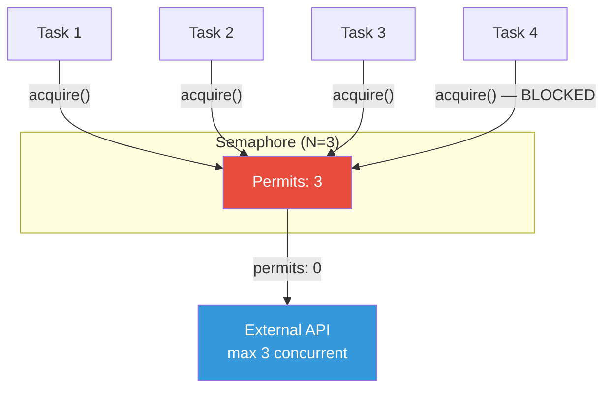
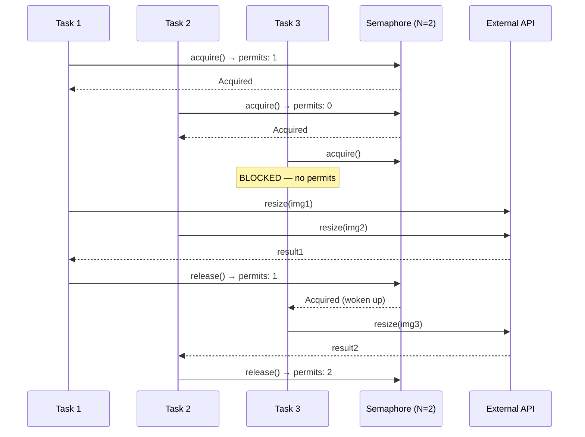

# Semaphore

## 1. The Problem

You're building an image processing service. Users upload images, and your service resizes them and uploads to S3. The resize operation calls an external GPU-accelerated API that has a hard limit: **10 concurrent connections**. More than 10, and the API returns `429 Too Many Requests` and rate-limits your account for 60 seconds.

```typescript
async function processImage(imageId: string) {
  const image = await downloadFromS3(imageId);
  const resized = await gpuApi.resize(image);  // External API call
  await uploadToS3(resized);
}

// When 50 uploads arrive simultaneously...
app.post("/upload", async (req, res) => {
  await processImage(req.body.imageId);  // 50 concurrent GPU API calls!
  res.send({ status: "done" });
});
```

50 concurrent requests hit your endpoint. All 50 immediately call the GPU API. The API accepts the first 10, rate-limits you on the 11th. Now ALL 50 fail because your account is throttled.

A mutex would fix the safety problem — only one call at a time — but that's absurdly slow. The API explicitly supports 10 concurrent calls. You need to allow **exactly 10 at once**, not 1 and not 50.

---

## 2. Naïve Solutions (and Why They Fail)

### Attempt 1: Mutex (N=1)

```typescript
const mutex = new Mutex();
async function processImage(imageId: string) {
  await mutex.acquire();
  try {
    const resized = await gpuApi.resize(image);
    // ...
  } finally {
    mutex.release();
  }
}
```

**Why it's wasteful:**
- Serializes to 1 concurrent call. The API can handle 10. You're wasting 90% of available capacity.
- With a 500ms resize time, throughput drops from 20/sec (possible) to 2/sec.

### Attempt 2: Counter with Polling

```typescript
let activeCount = 0;

async function processImage(imageId: string) {
  while (activeCount >= 10) {
    await sleep(100);  // Poll every 100ms
  }
  activeCount++;
  // ... do work ...
  activeCount--;
}
```

**Why it breaks:**
- Race condition: two tasks could both read `activeCount` as 9, both increment to 10, and proceed. Or worse — they both increment past 10.
- Polling wastes CPU cycles and adds latency (up to 100ms waiting even when a slot opens immediately).

### Attempt 3: Queue Everything, Process in Batches of 10

```typescript
const queue: Job[] = [];
setInterval(async () => {
  const batch = queue.splice(0, 10);
  await Promise.all(batch.map(processSingleImage));
}, 5000);
```

**Why it breaks:**
- Fixed batch intervals. If a batch finishes in 500ms, you wait 4.5 seconds idle. If a batch takes 10 seconds, the next batch starts at 5 seconds anyway and overlaps.
- Doesn't adapt to variable processing times.

---

## 3. The Insight

**Generalize the mutex from "at most 1" to "at most N."** Instead of a boolean (locked/unlocked), use a counter. Each acquisition decrements the counter. Each release increments it. When the counter reaches 0, new acquisitions block. This limits concurrency to exactly N, without serializing to 1.

---

## 4. The Pattern

### Semaphore

**Definition:** A synchronization primitive that maintains a counter representing available **permits**. A thread acquires a permit (decrementing the counter) before accessing a resource, and releases the permit (incrementing the counter) when done. If no permits are available, the thread blocks until one is released.

**Guarantees:**
- At most N concurrent accessors (where N = initial permit count).
- Blocking behavior — excess requests wait rather than fail.
- Fairness (implementation-dependent) — usually FIFO ordering.

**Non-guarantees:**
- Does NOT provide mutual exclusion for the resource itself (multiple threads access it concurrently).
- Does NOT track WHICH thread holds WHICH permit.
- Does NOT prevent the resource from being overwhelmed if N is set too high.

---

## 5. Mental Model

A **parking garage** with N spaces. The sign at the entrance shows available spots. A car enters (permit acquired, count decrements). A car leaves (permit released, count increments). When the sign shows 0, incoming cars queue at the entrance. The garage doesn't care which car is in which spot — it only enforces capacity.

---

## 6. Structure





---

## 7. Code Example

### TypeScript

```typescript
class Semaphore {
  private permits: number;
  private waiting: Array<() => void> = [];

  constructor(maxPermits: number) {
    this.permits = maxPermits;
  }

  async acquire(): Promise<void> {
    if (this.permits > 0) {
      this.permits--;
      return;
    }
    return new Promise<void>((resolve) => {
      this.waiting.push(() => {
        this.permits--;
        resolve();
      });
    });
  }

  release(): void {
    this.permits++;
    if (this.waiting.length > 0 && this.permits > 0) {
      this.waiting.shift()!();
    }
  }

  available(): number {
    return this.permits;
  }
}

// ========== RATE-LIMITED API CLIENT ==========
class GpuApiClient {
  private semaphore: Semaphore;

  constructor(maxConcurrent: number) {
    this.semaphore = new Semaphore(maxConcurrent);
  }

  async resize(imageBuffer: Buffer): Promise<Buffer> {
    await this.semaphore.acquire();
    try {
      console.log(`Starting resize (${this.semaphore.available()} permits left)`);
      // Simulate API call
      await new Promise((r) => setTimeout(r, 500));
      return Buffer.from("resized");
    } finally {
      this.semaphore.release();
    }
  }
}

// ========== DATABASE CONNECTION POOL ==========
class ConnectionPool {
  private semaphore: Semaphore;
  private connections: Array<{ id: number; inUse: boolean }>;

  constructor(poolSize: number) {
    this.semaphore = new Semaphore(poolSize);
    this.connections = Array.from({ length: poolSize }, (_, i) => ({
      id: i,
      inUse: false,
    }));
  }

  async acquire(): Promise<{ id: number; release: () => void }> {
    await this.semaphore.acquire();
    const conn = this.connections.find((c) => !c.inUse)!;
    conn.inUse = true;
    return {
      id: conn.id,
      release: () => {
        conn.inUse = false;
        this.semaphore.release();
      },
    };
  }
}

// ========== USAGE ==========
async function main() {
  const gpu = new GpuApiClient(10); // Max 10 concurrent

  // Process 50 images — only 10 at a time
  const images = Array.from({ length: 50 }, (_, i) => Buffer.from(`img-${i}`));
  const start = Date.now();

  await Promise.all(images.map((img) => gpu.resize(img)));

  const elapsed = (Date.now() - start) / 1000;
  console.log(`50 images in ${elapsed}s (batches of 10 × 500ms = ~2.5s)`);
}

main();
```

### Go

```go
package main

import (
	"fmt"
	"sync"
	"time"
)

// Go doesn't have a stdlib semaphore, but a buffered channel is idiomatic.
type Semaphore struct {
	ch chan struct{}
}

func NewSemaphore(n int) *Semaphore {
	return &Semaphore{ch: make(chan struct{}, n)}
}

func (s *Semaphore) Acquire() {
	s.ch <- struct{}{} // Blocks when channel is full
}

func (s *Semaphore) Release() {
	<-s.ch // Frees a slot
}

func (s *Semaphore) Available() int {
	return cap(s.ch) - len(s.ch)
}

// ========== RATE-LIMITED API CLIENT ==========
type GPUClient struct {
	sem *Semaphore
}

func NewGPUClient(maxConcurrent int) *GPUClient {
	return &GPUClient{sem: NewSemaphore(maxConcurrent)}
}

func (c *GPUClient) Resize(imageID string) (string, error) {
	c.sem.Acquire()
	defer c.sem.Release()

	fmt.Printf("Processing %s (%d permits available)\n", imageID, c.sem.Available())
	time.Sleep(500 * time.Millisecond) // Simulate API call
	return "resized-" + imageID, nil
}

// ========== BOUNDED WORKER POOL ==========
func ProcessWithLimit(items []string, maxConcurrent int) []string {
	sem := NewSemaphore(maxConcurrent)
	var mu sync.Mutex
	var wg sync.WaitGroup
	results := make([]string, len(items))

	for i, item := range items {
		wg.Add(1)
		go func(idx int, it string) {
			defer wg.Done()
			sem.Acquire()
			defer sem.Release()

			// Do bounded work
			time.Sleep(200 * time.Millisecond)
			result := "done-" + it

			mu.Lock()
			results[idx] = result
			mu.Unlock()
		}(i, item)
	}

	wg.Wait()
	return results
}

func main() {
	client := NewGPUClient(5) // Max 5 concurrent
	var wg sync.WaitGroup

	start := time.Now()

	// 20 concurrent requests — only 5 active at a time
	for i := 0; i < 20; i++ {
		wg.Add(1)
		go func(id int) {
			defer wg.Done()
			result, _ := client.Resize(fmt.Sprintf("img-%d", id))
			_ = result
		}(i)
	}

	wg.Wait()
	elapsed := time.Since(start)
	fmt.Printf("20 images in %v (batches of 5 × 500ms = ~2s)\n", elapsed)
}
```

---

## 8. Gotchas & Beginner Mistakes

| Mistake | Why It Hurts |
|---|---|
| **Releasing without acquiring** | Permits exceed the max, breaking the invariant. 11 concurrent calls where the limit was 10. Always pair acquire/release. |
| **Forgetting to release on error** | Panic or early return skips `release()`. Use `defer` in Go, `try/finally` in TS. Eventually all permits are leaked and nothing can proceed. |
| **Setting N too high** | "The API supports 100 concurrent connections" — but your network can't handle 100 simultaneous uploads. Test the actual limit. |
| **Using semaphore instead of a queue** | Semaphore limits concurrency but doesn't provide ordering or prioritization. If you need priority processing, use a priority queue + workers. |
| **Binary semaphore when you want a mutex** | A semaphore with N=1 looks like a mutex but lacks ownership: any thread can release it. Mutex enforces that only the locker can unlock. |

---

## 9. Related & Confusable Patterns

| Pattern | How It Differs |
|---|---|
| **Mutex** | N=1 exclusive access. Semaphore generalizes to N. Mutex also has ownership — only the holder can release. |
| **Thread Pool** | A pool of reusable worker threads. Often uses a semaphore internally to limit active tasks, but also manages thread lifecycle. |
| **Rate Limiter** | Limits requests per time window (e.g., 100/second). Semaphore limits concurrent requests regardless of time. A fast semaphore can allow 1000/sec as long as only N run simultaneously. |
| **Connection Pool** | Manages a fixed set of reusable connections. Semaphore is the concurrency-limiting mechanism; the pool adds connect/disconnect lifecycle management. |

---

## 10. When This Pattern Is the WRONG Choice

- **When ordering matters** — A semaphore doesn't guarantee FIFO processing. If you need "first-come, first-served" with priority, use a proper queue.
- **When you need mutual exclusion** — A semaphore with N=1 isn't a mutex. It lacks ownership semantics. Use a mutex for protecting shared state.
- **Time-based rate limiting** — "100 requests per minute" is a rate limiter problem, not a semaphore problem. Semaphore limits concurrency, not rate.
- **When the resource self-regulates** — If the external API already queues and handles backpressure gracefully, adding a semaphore is redundant complexity.

**Symptoms you should reconsider:**
- You're constantly tuning N and getting it wrong.
- The external service's capacity changes dynamically (need adaptive throttling, not fixed N).
- You're using a semaphore to protect data structure access (that's a mutex/rwlock job).

**How to back out:** Remove the semaphore and rely on the external resource's built-in throttling. Or replace with an adaptive rate limiter (token bucket, leaky bucket) if the limit is rate-based, not concurrency-based.
