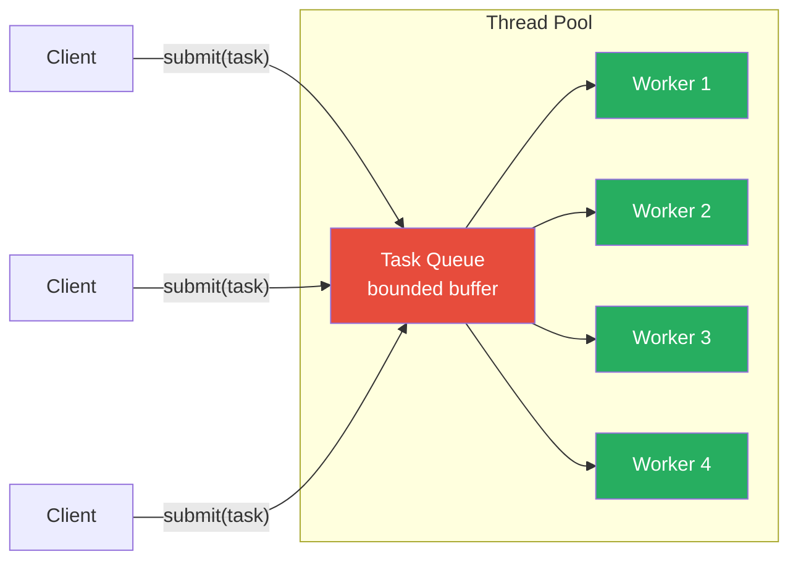
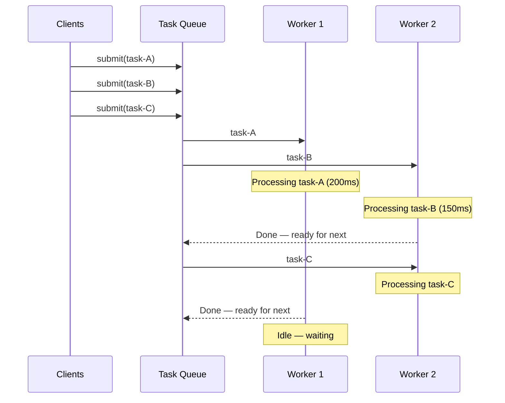

# Thread Pool

## 1. The Problem

You're building an HTTP server that processes image thumbnails. Each request involves CPU-intensive work (resizing an image, ~200ms per image). Under load, 500 requests arrive per second.

```go
func handleThumbnail(w http.ResponseWriter, r *http.Request) {
    go func() {
        // Spawn a goroutine for each request
        img := loadImage(r)
        resized := cpuResize(img, 150, 150)
        saveResult(resized)
    }()
    w.WriteHeader(202) // Accepted
}
```

At 500 req/sec, within one second you have 500 goroutines doing CPU-bound work. In 10 seconds: 5,000. Each goroutine allocates a minimum 2KB stack (grows to 1MB under load). With goroutines, Go manages this reasonably, but in languages with OS threads (Java, C++), each thread costs ~1MB of stack space. 5,000 threads = 5GB of stack memory alone.

Even in Go, 5,000 CPU-bound goroutines contend for 8 CPU cores. Context switching between goroutines adds overhead. The scheduler thrashes. Latency increases because no single task gets sustained CPU time.

**The fundamental issue:** Creating a new execution unit (thread/goroutine) per task means task arrival rate directly controls resource consumption. A traffic spike creates a proportional resource spike. There's no upper bound.

---

## 2. Naïve Solutions (and Why They Fail)

### Attempt 1: Limit With a Counter

```go
var active int64

func handleThumbnail(w http.ResponseWriter, r *http.Request) {
    if atomic.LoadInt64(&active) > 100 {
        w.WriteHeader(503) // Too busy
        return
    }
    atomic.AddInt64(&active, 1)
    go func() {
        defer atomic.AddInt64(&active, -1)
        process(r)
    }()
}
```

**Why it's incomplete:**
- Still creates and destroys a goroutine per request. Creation overhead adds up at high throughput.
- The rejected requests (503) are lost. No queuing — under load, users get errors even though the system could handle the work if sequenced.
- Race condition: check-then-act between `Load` and `Add` is not atomic.

### Attempt 2: Process Sequentially

```go
func handleThumbnail(w http.ResponseWriter, r *http.Request) {
    process(r) // Block until done
    w.WriteHeader(200)
}
```

**Why it breaks:**
- One request at a time. 8 CPU cores, using 1. Wastes 87.5% of available compute.
- Request latency proportional to queue depth.

### Attempt 3: Unbounded Goroutine Pool

```go
for req := range requests {
    go process(req) // No limit
}
```

**This is the original problem.** Unbounded = uncontrolled resource usage.

---

## 3. The Insight

**Create a fixed number of workers up front, and feed them tasks through a shared queue.** Workers are reused across tasks — no creation/destruction per request. The fixed worker count caps resource usage regardless of load. The queue buffers bursts. This decouples task arrival from task execution.

---

## 4. The Pattern

### Thread Pool (Worker Pool)

**Definition:** A pool of pre-created worker threads (or goroutines) that wait for tasks on a shared queue. When a task arrives, an idle worker picks it up, executes it, and returns to the pool to wait for the next task. The pool size is fixed, bounding the maximum concurrency.

Also known as: **Worker Pool**, **Executor Service** (Java), **goroutine pool** (Go)

**Guarantees:**
- Bounded concurrency — at most N tasks execute simultaneously.
- Worker reuse — no thread creation/destruction overhead per task.
- Queuing — tasks are buffered when all workers are busy.

**Non-guarantees:**
- Does NOT guarantee task ordering (workers pick up tasks concurrently).
- Does NOT handle task dependencies or coordination.
- Does NOT prevent queue overflow — if tasks arrive faster than workers process, the queue grows (unbounded) or rejects tasks (bounded).

---

## 5. Mental Model

A **restaurant kitchen** with 4 chefs (workers). Orders (tasks) are placed on a ticket rail (queue). Each chef takes the next ticket, cooks the dish, and grabs another ticket. Even if 50 orders arrive at once, only 4 dishes are being cooked simultaneously. The remaining orders wait on the rail. You don't hire 50 chefs for a rush — you let the rail buffer the work.

---

## 6. Structure





---

## 7. Code Example

### TypeScript

```typescript
import { EventEmitter } from "events";

// ========== WORKER POOL ==========
type Task<T> = () => Promise<T>;

class WorkerPool {
  private queue: Array<{
    task: Task<unknown>;
    resolve: (value: unknown) => void;
    reject: (error: Error) => void;
  }> = [];
  private activeWorkers = 0;

  constructor(private poolSize: number) {}

  async submit<T>(task: Task<T>): Promise<T> {
    return new Promise<T>((resolve, reject) => {
      this.queue.push({
        task: task as Task<unknown>,
        resolve: resolve as (v: unknown) => void,
        reject,
      });
      this.tryRunNext();
    });
  }

  private tryRunNext(): void {
    if (this.activeWorkers >= this.poolSize || this.queue.length === 0) {
      return;
    }

    const job = this.queue.shift()!;
    this.activeWorkers++;

    job
      .task()
      .then((result) => job.resolve(result))
      .catch((err) => job.reject(err))
      .finally(() => {
        this.activeWorkers--;
        this.tryRunNext(); // Work-stealing: grab next task
      });
  }

  get pending(): number {
    return this.queue.length;
  }

  get active(): number {
    return this.activeWorkers;
  }
}

// ========== IMAGE PROCESSING SERVICE ==========
interface ThumbnailResult {
  imageId: string;
  width: number;
  height: number;
  processingTimeMs: number;
}

class ThumbnailService {
  private pool: WorkerPool;

  constructor(workerCount: number) {
    this.pool = new WorkerPool(workerCount);
  }

  async generateThumbnail(imageId: string): Promise<ThumbnailResult> {
    return this.pool.submit(async () => {
      const start = Date.now();
      // Simulate CPU-bound resize (200ms)
      await new Promise((r) => setTimeout(r, 200));
      return {
        imageId,
        width: 150,
        height: 150,
        processingTimeMs: Date.now() - start,
      };
    });
  }
}

// ========== USAGE ==========
async function main() {
  const service = new ThumbnailService(4); // 4 workers

  const start = Date.now();

  // Submit 20 tasks — only 4 run at a time
  const results = await Promise.all(
    Array.from({ length: 20 }, (_, i) =>
      service.generateThumbnail(`img-${i}`)
    )
  );

  const elapsed = Date.now() - start;
  console.log(`20 images processed in ${elapsed}ms`);
  console.log(`Expected: ~${20 / 4 * 200}ms (20 tasks / 4 workers × 200ms)`);
  console.log(`First result:`, results[0]);
}

main();
```

### Go

```go
package main

import (
	"fmt"
	"sync"
	"time"
)

// ========== WORKER POOL ==========
type Task func() interface{}

type WorkerPool struct {
	tasks   chan taskWrapper
	wg      sync.WaitGroup
	workers int
}

type taskWrapper struct {
	fn     Task
	result chan interface{}
}

func NewWorkerPool(workers, queueSize int) *WorkerPool {
	pool := &WorkerPool{
		tasks:   make(chan taskWrapper, queueSize),
		workers: workers,
	}

	// Start fixed number of workers
	for i := 0; i < workers; i++ {
		go pool.worker(i)
	}

	return pool
}

func (p *WorkerPool) worker(id int) {
	for tw := range p.tasks {
		result := tw.fn()
		tw.result <- result
		p.wg.Done()
	}
}

func (p *WorkerPool) Submit(task Task) <-chan interface{} {
	result := make(chan interface{}, 1)
	p.wg.Add(1)
	p.tasks <- taskWrapper{fn: task, result: result}
	return result
}

func (p *WorkerPool) Wait() {
	p.wg.Wait()
}

func (p *WorkerPool) Shutdown() {
	close(p.tasks)
}

// ========== SIMPLER: IDIOMATIC GO WORKER POOL ==========
func SimpleWorkerPool(jobs <-chan string, results chan<- string, workers int) {
	var wg sync.WaitGroup

	for i := 0; i < workers; i++ {
		wg.Add(1)
		go func(workerID int) {
			defer wg.Done()
			for imageID := range jobs {
				// Simulate CPU-bound work
				time.Sleep(200 * time.Millisecond)
				results <- fmt.Sprintf("thumbnail-%s (worker %d)", imageID, workerID)
			}
		}(i)
	}

	// Close results channel when all workers are done
	go func() {
		wg.Wait()
		close(results)
	}()
}

func main() {
	// ---- Idiomatic Go version ----
	jobs := make(chan string, 50)
	results := make(chan string, 50)

	SimpleWorkerPool(jobs, results, 4) // 4 workers

	// Submit 20 jobs
	start := time.Now()
	go func() {
		for i := 0; i < 20; i++ {
			jobs <- fmt.Sprintf("img-%d", i)
		}
		close(jobs)
	}()

	// Collect results
	count := 0
	for result := range results {
		count++
		_ = result
	}

	elapsed := time.Since(start)
	fmt.Printf("%d images in %v\n", count, elapsed)
	fmt.Printf("Expected: ~%v (20/4 × 200ms)\n", time.Duration(20/4)*200*time.Millisecond)
}
```

---

## 8. Gotchas & Beginner Mistakes

| Mistake | Why It Hurts |
|---|---|
| **Pool too small** | 2 workers on an 8-core machine doing CPU work. 75% of CPU is idle. Set pool size = number of CPU cores for CPU-bound work. |
| **Pool too large** | 1,000 workers for I/O-bound work might be fine, but for CPU-bound work on 8 cores, it just adds context switching. More workers ≠ more throughput past the core count. |
| **Unbounded task queue** | Workers can't keep up, queue grows forever, OOM. Bound the queue and handle rejection (return 503, drop, apply back-pressure). |
| **Blocking tasks starve the pool** | One worker blocks on a network call for 30 seconds. That's one worker unavailable for 30 seconds. Keep tasks short or use separate pools for I/O-bound vs. CPU-bound work. |
| **Not shutting down gracefully** | Closing the application without draining the queue. In-flight tasks are lost. Send a shutdown signal, stop accepting new tasks, wait for current tasks to finish. |

---

## 9. Related & Confusable Patterns

| Pattern | How It Differs |
|---|---|
| **Producer-Consumer** | The coordination pattern. Thread Pool is a specific implementation where consumers are pre-created workers. Producer-Consumer doesn't require fixed workers. |
| **Semaphore** | Limits concurrency but doesn't manage workers. Each caller creates their own execution unit. Thread Pool reuses a fixed set. |
| **Fork-Join** | Fork spawns new subtasks, join waits for them. Creates new execution dynamically. Thread Pool reuses a fixed set. |
| **Actor Model** | Each actor is a lightweight worker with its own mailbox (queue). An actor system is like many single-task thread pools with message routing. |
| **Object Pool** | Reuses expensive objects (database connections). Thread Pool reuses threads/goroutines. Same recycling principle, different resource type. |

---

## 10. When This Pattern Is the WRONG Choice

- **I/O-bound work in Go** — Goroutines are cheap enough that spawning one per request is fine for I/O-bound work (HTTP calls, database queries). A pool adds complexity without benefit.
- **Short-lived processes** — CLI tools that run a single task don't need a pool. The overhead of creating the pool exceeds the work.
- **Dynamic scaling needs** — If the workload changes dramatically (10 tasks/hour to 10,000/second), a fixed pool can't adapt. Consider auto-scaling worker processes instead.
- **Tasks with dependencies** — If task B depends on task A's result, a thread pool can deadlock: all workers are blocked waiting for dependent tasks that are still in the queue.

**Symptoms you should reconsider:**
- Workers are mostly idle (pool too large or work is too sporadic).
- Queue is always at 0 (tasks arrive slower than workers process — direct execution is simpler).
- You're using a thread pool in Go for goroutine-cheap work — just use goroutines.

**How to back out:** Replace with direct goroutine spawning (Go), or use language-provided executors (Java `Executors.newFixedThreadPool()`). For dynamic scaling, use a message queue + auto-scaling consumers instead of an in-process pool.
