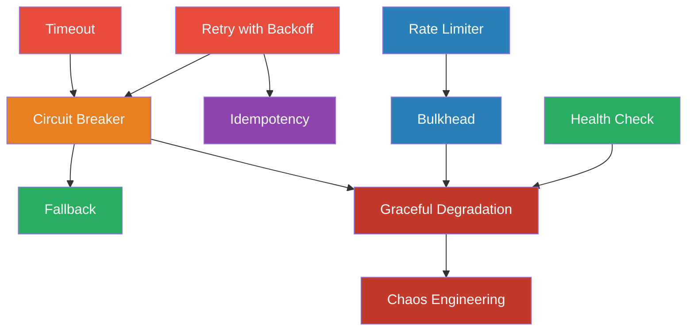

# Module 05 — Reliability & Resilience Patterns

> How systems survive failure — gracefully degrading, recovering automatically, and protecting downstream dependencies.

## Why This Module Matters

In distributed systems, failure isn't an edge case — it's the norm. Networks partition. Services crash. Databases go down. Disks fill up. The patterns here are the difference between "it self-healed in 3 seconds" and "it took down the entire system for 4 hours." These patterns appear in every production postmortem you'll ever read.

## Patterns in This Module

| # | Pattern | Core Problem |
|---|---|---|
| 1 | [Circuit Breaker](circuit-breaker.md) | Failing service drags down all callers |
| 2 | [Retry with Backoff](retry-backoff.md) | Transient failure causes permanent failure |
| 3 | [Timeout](timeout.md) | Slow dependency hangs the entire request |
| 4 | [Bulkhead](bulkhead.md) | One failing endpoint exhausts all resources |
| 5 | [Fallback](fallback.md) | Primary path fails with no alternative |
| 6 | [Health Check](health-check.md) | Unhealthy instances keep receiving traffic |
| 7 | [Rate Limiter](rate-limiter.md) | Too many requests overwhelm the service |
| 8 | [Idempotency](idempotency.md) | Retries cause duplicate side effects |
| 9 | [Graceful Degradation](graceful-degradation.md) | Partial failure takes down everything |
| 10 | [Chaos Engineering](chaos-engineering.md) | Unknown failure modes only discovered in production |

## Dependency Graph

## Reading Order

**Foundation:** Timeout → Retry with Backoff → Circuit Breaker (the resilience trio — every production service needs these).

**Resource protection:** Rate Limiter → Bulkhead (limit access, isolate failure).

**Recovery strategies:** Fallback → Health Check → Idempotency (what to do when things fail).

**System-level:** Graceful Degradation → Chaos Engineering (designing for failure, proactively testing it).

## Prerequisites

- Module 00 (Orientation)
- Module 01 (Communication & Messaging) — for understanding service interaction patterns
- Experience operating a service that has failed in production
