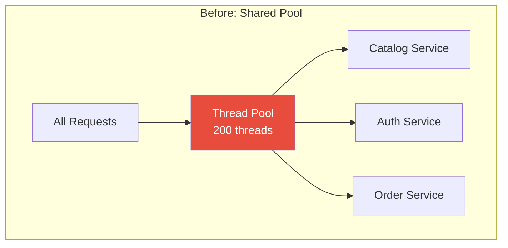
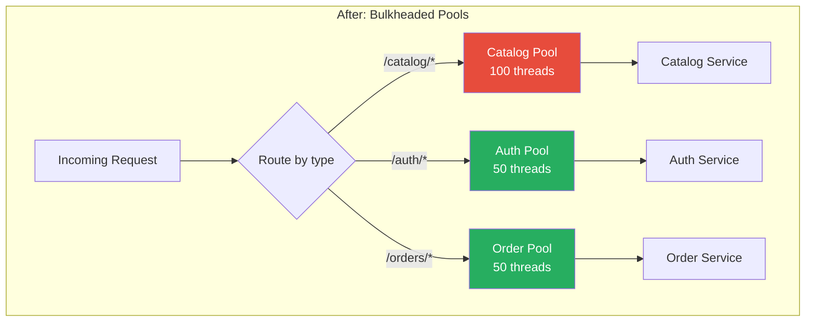
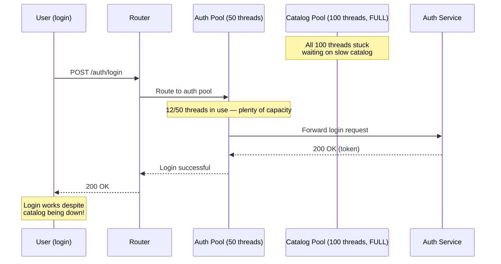

# Bulkhead

## 1. The Problem

Your API gateway handles three types of traffic: product catalog browsing, user authentication, and order processing. All requests share a single connection pool of 200 threads.

One day, the catalog service starts responding slowly (database migration running). Catalog requests — which are 80% of traffic — start piling up. Each request occupies a thread for 30 seconds instead of 100ms.

```
Thread pool: 200 threads
Catalog requests in-flight: 190 threads (stuck, waiting on slow catalog service)
Auth requests waiting: 40 in queue (no threads available)
Order requests waiting: 25 in queue (no threads available)
```

Users can't log in. Orders can't be placed. **The catalog service being slow has taken down the entire platform** — even though auth and order services are perfectly healthy.

This is the blast radius problem: one degraded dependency affects all functionality because all traffic shares the same pool of resources.

---

## 2. Naïve Solutions (and Why They Fail)

### Attempt 1: Bigger Thread Pool

```
Thread pool: 2000 threads (10× more!)
```

**Why it's suboptimal:**
- More threads = more memory, more context switching, more GC pressure. 2000 threads each with 1MB stack = 2GB just for stacks.
- When catalog service is truly stuck, it doesn't matter if you have 200 or 2000 threads — they'll all eventually fill up. You just delayed the problem by 10×.

### Attempt 2: Priority Queue

```typescript
function handleRequest(req: Request) {
  if (req.path.startsWith("/orders")) {
    enqueueHighPriority(req);
  } else {
    enqueueLowPriority(req);
  }
}
```

**Why it's insufficient:**
- Priority helps with ordering, but all work still shares the same threads. High-priority work waits behind stuck threads that are already occupied by low-priority work.
- You can't preempt a thread that's blocked on a network call.

### Attempt 3: Timeout on All Calls

```typescript
const response = await fetch(catalogUrl, { signal: AbortSignal.timeout(3000) });
```

**Why it's incomplete:**
- Timeouts help each request fail faster, but during those 3 seconds, each request still holds a thread. At 100 requests/second to catalog, you have 300 threads blocked at any moment — still enough to starve auth and orders.

---

## 3. The Insight

**Partition resources into isolated pools — one per dependency or workload type. A slow catalog service can only exhaust the catalog pool. Auth and order pools remain untouched, with their own reserved capacity.**

---

## 4. The Pattern

### Bulkhead

**Definition:** An isolation strategy that partitions shared resources (thread pools, connection pools, memory, queues) into separate, bounded compartments. Each compartment has a fixed capacity. When one compartment fills up, the failure is contained — other compartments continue operating normally.

**Guarantees:**
- Fault isolation: a failing dependency can only exhaust its own allocated resources.
- Predictable capacity: each workload type has a guaranteed minimum of resources.
- Graceful degradation: the system degrades partially rather than completely.

**Non-guarantees:**
- Does NOT fix the failing dependency — catalog is still slow.
- Does NOT optimize resource usage — some pools may be idle while others are full. Total throughput may be lower than a single shared pool during normal operation.
- Does NOT prevent failure within a compartment — catalog requests still fail, just without affecting others.

---

## 5. Mental Model

**Watertight compartments on a ship** (this is literally where the name comes from). A ship's hull is divided into compartments by walls called bulkheads. If one compartment floods (takes on water), the bulkhead walls prevent water from spreading to adjacent compartments. The ship stays afloat even with one flooded section. Without bulkheads, a single hull breach sinks the entire ship.

---

## 6. Structure







---

## 7. Code Example

### TypeScript

```typescript
// ========== BULKHEAD IMPLEMENTATION ==========
class Bulkhead {
  private active = 0;
  private queue: Array<{
    resolve: () => void;
    reject: (err: Error) => void;
  }> = [];

  constructor(
    private readonly name: string,
    private readonly maxConcurrent: number,
    private readonly maxQueue: number
  ) {}

  async execute<T>(fn: () => Promise<T>): Promise<T> {
    if (this.active >= this.maxConcurrent) {
      // Pool is full — try the queue
      if (this.queue.length >= this.maxQueue) {
        throw new BulkheadRejectError(this.name, this.active, this.queue.length);
      }

      // Wait in queue for a slot to open
      await new Promise<void>((resolve, reject) => {
        this.queue.push({ resolve, reject });
      });
    }

    this.active++;
    try {
      return await fn();
    } finally {
      this.active--;
      this.releaseNext();
    }
  }

  private releaseNext() {
    if (this.queue.length > 0) {
      const next = this.queue.shift()!;
      next.resolve();
    }
  }

  stats() {
    return {
      name: this.name,
      active: this.active,
      queued: this.queue.length,
      maxConcurrent: this.maxConcurrent,
    };
  }
}

class BulkheadRejectError extends Error {
  constructor(name: string, active: number, queued: number) {
    super(
      `Bulkhead "${name}" rejected: ${active} active, ${queued} queued`
    );
    this.name = "BulkheadRejectError";
  }
}

// ========== PER-SERVICE BULKHEADS ==========
const bulkheads = {
  catalog:  new Bulkhead("catalog", 100, 50),  // Max 100 concurrent, 50 queued
  auth:     new Bulkhead("auth", 50, 20),       // Max 50 concurrent, 20 queued
  orders:   new Bulkhead("orders", 50, 30),     // Max 50 concurrent, 30 queued
};

// ========== API GATEWAY ==========
async function handleRequest(req: Request): Promise<Response> {
  const url = new URL(req.url);

  try {
    if (url.pathname.startsWith("/catalog")) {
      return await bulkheads.catalog.execute(
        () => callCatalogService(req)
      );
    }
    if (url.pathname.startsWith("/auth")) {
      return await bulkheads.auth.execute(
        () => callAuthService(req)
      );
    }
    if (url.pathname.startsWith("/orders")) {
      return await bulkheads.orders.execute(
        () => callOrderService(req)
      );
    }
    return new Response("Not Found", { status: 404 });
  } catch (error) {
    if (error instanceof BulkheadRejectError) {
      // Shed load immediately — don't queue indefinitely
      return new Response("Service overloaded, try later", { status: 503 });
    }
    throw error;
  }
}

async function callCatalogService(req: Request): Promise<Response> {
  const resp = await fetch("http://catalog:8080" + new URL(req.url).pathname, {
    signal: AbortSignal.timeout(3000),
  });
  return new Response(resp.body, { status: resp.status });
}

async function callAuthService(req: Request): Promise<Response> {
  const resp = await fetch("http://auth:8080" + new URL(req.url).pathname, {
    signal: AbortSignal.timeout(1000),
  });
  return new Response(resp.body, { status: resp.status });
}

async function callOrderService(req: Request): Promise<Response> {
  const resp = await fetch("http://orders:8080" + new URL(req.url).pathname, {
    signal: AbortSignal.timeout(5000),
  });
  return new Response(resp.body, { status: resp.status });
}
```

### Go

```go
package main

import (
	"errors"
	"fmt"
	"net/http"
	"sync"
	"time"
)

// ========== BULKHEAD ==========
type Bulkhead struct {
	name     string
	sem      chan struct{}
	queueSem chan struct{}
}

var ErrBulkheadFull = errors.New("bulkhead full")

func NewBulkhead(name string, maxConcurrent, maxQueue int) *Bulkhead {
	return &Bulkhead{
		name:     name,
		sem:      make(chan struct{}, maxConcurrent),
		queueSem: make(chan struct{}, maxConcurrent+maxQueue),
	}
}

func (b *Bulkhead) Execute(fn func() error) error {
	// Try to enter the outer queue (maxConcurrent + maxQueue)
	select {
	case b.queueSem <- struct{}{}:
		defer func() { <-b.queueSem }()
	default:
		return fmt.Errorf("%w: %s rejected (queue full)", ErrBulkheadFull, b.name)
	}

	// Wait for a concurrency slot
	b.sem <- struct{}{}
	defer func() { <-b.sem }()

	return fn()
}

func (b *Bulkhead) Stats() (active, queued int) {
	active = len(b.sem)
	queued = len(b.queueSem) - active
	return
}

// ========== PER-SERVICE BULKHEADS ==========
var (
	catalogBulkhead = NewBulkhead("catalog", 100, 50)
	authBulkhead    = NewBulkhead("auth", 50, 20)
	orderBulkhead   = NewBulkhead("orders", 50, 30)
)

// ========== API GATEWAY ==========
func gatewayHandler(w http.ResponseWriter, r *http.Request) {
	path := r.URL.Path

	var bulkhead *Bulkhead
	var upstream string

	switch {
	case startsWith(path, "/catalog"):
		bulkhead = catalogBulkhead
		upstream = "http://catalog:8080"
	case startsWith(path, "/auth"):
		bulkhead = authBulkhead
		upstream = "http://auth:8080"
	case startsWith(path, "/orders"):
		bulkhead = orderBulkhead
		upstream = "http://orders:8080"
	default:
		http.NotFound(w, r)
		return
	}

	err := bulkhead.Execute(func() error {
		client := &http.Client{Timeout: 3 * time.Second}
		resp, err := client.Get(upstream + path)
		if err != nil {
			return err
		}
		defer resp.Body.Close()
		w.WriteHeader(resp.StatusCode)
		return nil
	})

	if err != nil {
		if errors.Is(err, ErrBulkheadFull) {
			http.Error(w, "Service overloaded", http.StatusServiceUnavailable)
			return
		}
		http.Error(w, err.Error(), http.StatusBadGateway)
	}
}

func startsWith(s, prefix string) bool {
	return len(s) >= len(prefix) && s[:len(prefix)] == prefix
}

// ========== MONITORING ==========
func monitorBulkheads(interval time.Duration) {
	ticker := time.NewTicker(interval)
	defer ticker.Stop()
	for range ticker.C {
		for _, b := range []*Bulkhead{catalogBulkhead, authBulkhead, orderBulkhead} {
			active, queued := b.Stats()
			fmt.Printf("[%s] active=%d queued=%d\n", b.name, active, queued)
		}
	}
}

func main() {
	var wg sync.WaitGroup
	wg.Add(1)
	go func() {
		defer wg.Done()
		monitorBulkheads(5 * time.Second)
	}()

	http.HandleFunc("/", gatewayHandler)
	fmt.Println("Gateway on :8080")
	http.ListenAndServe(":8080", nil)
}
```

**Go's advantage:** Buffered channels are natural semaphores. The bulkhead is literally "try to put a token in a channel; if it's full, reject." No external semaphore library needed.

---

## 8. Gotchas & Beginner Mistakes

| Mistake | Why It Hurts |
|---|---|
| **Too many compartments** | A bulkhead per API endpoint (50+ pools) wastes resources. Group by downstream dependency, not by endpoint. `/products`, `/products/:id`, `/products/search` all call the same catalog service — one bulkhead. |
| **Pool sizes from gut feeling** | Setting catalog to 100 and auth to 50 without measuring leads to waste or starvation. Measure actual peak concurrency per service and add ~30% headroom. |
| **No queue, reject immediately** | Rejecting when the execution pool is full (no queue buffer) causes unnecessary failures during brief traffic spikes. A small queue absorbs bursts. |
| **Infinite queue** | A large queue means requests wait so long users get timeouts anyway. Cap the queue and combine with timeouts so queued requests don't wait forever. |
| **Shared client underneath** | You create per-service bulkheads but all use `http.DefaultClient`, which has a shared transport with `MaxIdleConnsPerHost: 2`. The bulkhead allows 100 concurrent, but the HTTP client only opens 2 connections. Set transport limits to match. |

---

## 9. Related & Confusable Patterns

| Pattern | How It Differs |
|---|---|
| **Circuit Breaker** | Stops calling a failing service entirely. Bulkhead limits concurrent calls but still allows them. Circuit breaker prevents calls; bulkhead limits calls. Use together. |
| **Rate Limiter** | Controls requests per time window (100 req/sec). Bulkhead controls concurrent requests (100 simultaneous). Rate limiter protects the downstream; bulkhead protects the caller. |
| **Timeout** | Limits a single call's duration. Bulkhead limits how many calls are in-flight. A request can pass the bulkhead but still need a timeout for the individual call. |
| **Thread Pool** | Bulkhead IS thread pool isolation applied as a resilience pattern. The mechanism (bounded concurrency) is the same; the intent (fault isolation) is different. |
| **Queue-Based Load Leveling** | Messages are queued to smooth out bursts. Bulkhead's queue is for brief buffering, not persistent work storage. Different scale and purpose. |

---

## 10. When This Pattern Is the WRONG Choice

- **Single dependency** — If your service only calls one downstream service, bulkhead adds complexity without benefit. There's nothing to isolate from.
- **All-or-nothing semantics** — If a checkout requires inventory AND payment AND shipping (all must succeed), isolating them doesn't help much — checkout fails if any one fails. Bulkhead helps when parts of the system can degrade independently.
- **Low traffic** — If you handle 10 requests/second, a shared pool of 20 threads will never be exhausted by a slow dependency. Bulkhead's value is proportional to traffic volume.

**Symptoms you should reconsider:**
- Pools are always at 5-10% utilization — you over-partitioned. Consolidate pools.
- You keep increasing pool sizes to handle load — the problem is throughput, not isolation. Scale horizontally.
- Requests wait in the bulkhead queue longer than the timeout, then fail. The queue is too large relative to the timeout.

**How to back out:** Merge all pools back into a single shared pool. Monitor for cascading failures. If one slow dependency takes down everything, re-introduce bulkheads with measured pool sizes.
