# Chaos Engineering

## 1. The Problem

Your e-commerce platform handles 10,000 orders/day. You've added circuit breakers, retries, timeouts, bulkheads, and health checks. The team is confident: "We've handled all the failure modes."

Then at 2 AM on Black Friday, a network partition isolates your payment service from the database for 47 seconds. Your circuit breaker opens. Good. But the circuit breaker's half-open probe happens to coincide with a garbage collection pause on the database node, so the probe fails. The circuit breaker stays open. For 2 hours. Nobody gets charged. Orders pile up in a dead-letter queue. The on-call engineer doesn't know how the circuit breaker's half-open recovery works because it's never been triggered in production.

**Your resilience code has never been tested under real failure conditions.** You have retry logic that's never retried. Circuit breakers that have never opened. Fallbacks that have never activated. Timeout configurations based on "seems reasonable" rather than measured behavior.

You don't just have unknown bugs — you have unknown failure modes. The question isn't "will something fail?" but "what happens when it fails in ways we haven't imagined?"

---

## 2. Naïve Solutions (and Why They Fail)

### Attempt 1: Unit Testing Error Paths

```typescript
test("circuit breaker opens after 5 failures", () => {
  const breaker = new CircuitBreaker({ threshold: 5 });
  for (let i = 0; i < 5; i++) {
    breaker.recordFailure();
  }
  expect(breaker.state).toBe("open");
});
```

**Why it's insufficient:**
- Unit tests verify logic in isolation. They don't reveal what happens when the circuit breaker opens AND retry logic tries reconnecting AND the fallback cache expired AND the health check falsely reports healthy — all at the same time.
- Production has emergent behaviors that unit tests can't reproduce: resource exhaustion, clock skew, partial network failures, GC pauses.

### Attempt 2: Load Testing

```bash
# Hit the system with 10,000 concurrent users
wrk -t 12 -c 10000 -d 300s http://api.example.com/checkout
```

**Why it's incomplete:**
- Load tests reveal performance bottlenecks, not resilience gaps. A system can handle 10,000 users under perfect conditions and collapse when one service returns 503 under load.
- Load tests don't inject failures — they apply traffic. Different stressors, different failures.

### Attempt 3: Manual Testing in Staging

```bash
# Kill the database in staging and see what happens
docker stop staging-postgres
```

**Why it's not enough:**
- Staging doesn't match production: different data volumes, traffic patterns, hardware, network topology.
- Manual testing is done once before launch and never repeated. Production changes weekly — new deployments, config changes, scaling events introduce new failure modes continuously.

---

## 3. The Insight

**The only way to know how your system behaves under failure is to fail it — deliberately, in production, under controlled conditions. Define what "normal" looks like (steady state), inject a specific failure (hypothesis), observe whether the system maintains steady state. If it doesn't, you've found a weakness before customers do.**

---

## 4. The Pattern

### Chaos Engineering

**Definition:** The discipline of experimenting on a distributed system to build confidence in the system's ability to withstand turbulent conditions in production. A chaos experiment follows the scientific method:

1. **Define steady state** — measurable indicators of normal behavior (error rate < 0.1%, P99 latency < 500ms, order success rate > 99.5%).
2. **Hypothesize** — "Injecting failure X will not affect steady state because resilience mechanism Y will handle it."
3. **Inject failure** — Introduce the fault (kill a pod, add network latency, fill disk, corrupt a response).
4. **Observe** — Compare actual behavior to steady state metrics.
5. **Learn** — If steady state is maintained, confidence increases. If not, fix the weakness and re-run.

**Guarantees:**
- Surfaces unknown failure modes before customers discover them.
- Validates that resilience mechanisms (circuit breakers, retries, fallbacks) actually work in production.
- Builds team knowledge — the on-call engineer has seen the circuit breaker open before, in a safe context.

**Non-guarantees:**
- Does NOT fix problems — it reveals them. You still need to implement fixes.
- Does NOT guarantee coverage — you can only test failure modes you think of (but each experiment often reveals new ones).
- Does NOT prevent production incidents — it reduces their severity and frequency.

---

## 5. Mental Model

**Fire drills.** A building has fire exits, sprinklers, and alarm systems. But do they actually work? You run a fire drill — announce a simulated fire, trigger the alarm, and observe: Do people know the exits? Does the alarm sound on every floor? Do sprinklers activate? You test the resilience mechanisms by simulating the disaster, not by waiting for a real fire.

---

## 6. Structure

```mermaid
graph TD
    subgraph "Chaos Experiment Lifecycle"
        SS["1. Define Steady State<br/>Error rate < 0.1%<br/>P99 < 500ms<br/>Order rate: 100/min"]
        HYP["2. Hypothesize<br/>'Killing 1 of 3 API pods<br/>won't affect steady state<br/>because LB redistributes'"]
        INJECT["3. Inject Failure<br/>kubectl delete pod api-2"]
        OBSERVE["4. Observe Metrics<br/>Compare to steady state"]
        LEARN["5. Learn & Fix"]

        SS --> HYP --> INJECT --> OBSERVE
        OBSERVE -->|"Steady state maintained"| CONFIDENCE["✅ Confidence++"]
        OBSERVE -->|"Steady state violated"| LEARN
        LEARN --> SS
    end

    style CONFIDENCE fill:#27ae60,color:#fff
    style LEARN fill:#e74c3c,color:#fff
```




---

## 7. Code Example

### TypeScript

```typescript
// ========== CHAOS EXPERIMENT FRAMEWORK ==========
interface SteadyState {
  errorRateThreshold: number;     // Max acceptable error rate (e.g., 0.01 = 1%)
  p99LatencyMsThreshold: number;  // Max acceptable P99 latency
  customChecks?: Array<{
    name: string;
    check: () => Promise<boolean>;
  }>;
}

interface ChaosExperiment {
  name: string;
  hypothesis: string;
  steadyState: SteadyState;
  inject: () => Promise<() => Promise<void>>; // Returns rollback function
  durationMs: number;
  blastRadius: number; // 0-1, fraction of traffic affected
}

interface ExperimentResult {
  name: string;
  hypothesis: string;
  passed: boolean;
  steadyStateBeforeInjection: MetricsSnapshot;
  steadyStateDuringInjection: MetricsSnapshot;
  violations: string[];
  duration: number;
}

interface MetricsSnapshot {
  errorRate: number;
  p99LatencyMs: number;
  requestsPerMinute: number;
  timestamp: number;
}

// ========== EXPERIMENT RUNNER ==========
class ChaosRunner {
  async run(experiment: ChaosExperiment): Promise<ExperimentResult> {
    console.log(`\n🔬 Starting chaos experiment: ${experiment.name}`);
    console.log(`   Hypothesis: ${experiment.hypothesis}`);

    // 1. Record baseline
    const baseline = await this.captureMetrics();
    console.log(`   Baseline: error=${baseline.errorRate}, p99=${baseline.p99LatencyMs}ms`);

    // 2. Verify steady state before injection
    const preCheck = this.checkSteadyState(baseline, experiment.steadyState);
    if (preCheck.length > 0) {
      console.log(`   ⚠️ System not in steady state before injection: ${preCheck.join(", ")}`);
      return this.buildResult(experiment, baseline, baseline, preCheck, false);
    }

    // 3. Inject failure
    console.log(`   Injecting failure...`);
    const rollback = await experiment.inject();

    // 4. Wait and observe
    console.log(`   Observing for ${experiment.durationMs}ms...`);
    await sleep(experiment.durationMs);

    // 5. Capture metrics during failure
    const duringFailure = await this.captureMetrics();
    console.log(`   During failure: error=${duringFailure.errorRate}, p99=${duringFailure.p99LatencyMs}ms`);

    // 6. Rollback
    console.log(`   Rolling back...`);
    await rollback();

    // 7. Evaluate
    const violations = this.checkSteadyState(duringFailure, experiment.steadyState);
    const passed = violations.length === 0;

    console.log(passed
      ? `   ✅ PASSED: Steady state maintained`
      : `   ❌ FAILED: Violations: ${violations.join(", ")}`
    );

    return this.buildResult(experiment, baseline, duringFailure, violations, passed);
  }

  private checkSteadyState(metrics: MetricsSnapshot, steady: SteadyState): string[] {
    const violations: string[] = [];
    if (metrics.errorRate > steady.errorRateThreshold) {
      violations.push(
        `Error rate ${metrics.errorRate} > threshold ${steady.errorRateThreshold}`
      );
    }
    if (metrics.p99LatencyMs > steady.p99LatencyMsThreshold) {
      violations.push(
        `P99 latency ${metrics.p99LatencyMs}ms > threshold ${steady.p99LatencyMsThreshold}ms`
      );
    }
    return violations;
  }

  private async captureMetrics(): Promise<MetricsSnapshot> {
    // In production: query Prometheus, Datadog, etc.
    const response = await fetch("http://monitoring:9090/api/v1/query", {
      method: "POST",
      body: JSON.stringify({
        query: 'rate(http_requests_total{status=~"5.."}[1m]) / rate(http_requests_total[1m])',
      }),
    }).catch(() => null);

    // Simulated metrics for example
    return {
      errorRate: 0.005 + Math.random() * 0.01,
      p99LatencyMs: 300 + Math.random() * 100,
      requestsPerMinute: 100 + Math.random() * 20,
      timestamp: Date.now(),
    };
  }

  private buildResult(
    exp: ChaosExperiment,
    before: MetricsSnapshot,
    during: MetricsSnapshot,
    violations: string[],
    passed: boolean
  ): ExperimentResult {
    return {
      name: exp.name,
      hypothesis: exp.hypothesis,
      passed,
      steadyStateBeforeInjection: before,
      steadyStateDuringInjection: during,
      violations,
      duration: exp.durationMs,
    };
  }
}

function sleep(ms: number): Promise<void> {
  return new Promise((r) => setTimeout(r, ms));
}

// ========== EXAMPLE EXPERIMENTS ==========
const experiments: ChaosExperiment[] = [
  {
    name: "Payment pod failure",
    hypothesis: "Killing 1 of 3 payment pods won't affect order success rate",
    steadyState: {
      errorRateThreshold: 0.01,
      p99LatencyMsThreshold: 500,
    },
    durationMs: 60_000,
    blastRadius: 0.33,
    inject: async () => {
      // kubectl delete pod payment-xxx
      console.log("   → Killed payment-pod-2");
      return async () => {
        console.log("   → Payment pod rescheduled by Kubernetes");
      };
    },
  },
  {
    name: "Database latency injection",
    hypothesis: "200ms added latency to DB won't cause timeouts",
    steadyState: {
      errorRateThreshold: 0.01,
      p99LatencyMsThreshold: 800,
    },
    durationMs: 120_000,
    blastRadius: 1.0,
    inject: async () => {
      // tc qdisc add dev eth0 root netem delay 200ms
      console.log("   → Added 200ms network latency to DB");
      return async () => {
        // tc qdisc del dev eth0 root netem
        console.log("   → Removed network latency");
      };
    },
  },
];

// Run experiments
async function runExperimentSuite() {
  const runner = new ChaosRunner();
  for (const exp of experiments) {
    const result = await runner.run(exp);
    console.log(JSON.stringify(result, null, 2));
  }
}
```

### Go

```go
package main

import (
	"context"
	"fmt"
	"math/rand"
	"os/exec"
	"time"
)

// ========== STEADY STATE ==========
type SteadyState struct {
	MaxErrorRate    float64
	MaxP99LatencyMs float64
}

type MetricsSnapshot struct {
	ErrorRate    float64
	P99LatencyMs float64
	ReqPerMin    float64
	Timestamp    time.Time
}

// ========== EXPERIMENT ==========
type Experiment struct {
	Name         string
	Hypothesis   string
	SteadyState  SteadyState
	Duration     time.Duration
	BlastRadius  float64
	Inject       func(ctx context.Context) (rollback func(), err error)
}

type ExperimentResult struct {
	Name       string
	Hypothesis string
	Passed     bool
	Baseline   MetricsSnapshot
	During     MetricsSnapshot
	Violations []string
}

// ========== CHAOS RUNNER ==========
type ChaosRunner struct {
	metricsURL string
}

func (r *ChaosRunner) Run(ctx context.Context, exp Experiment) ExperimentResult {
	fmt.Printf("\n--- Chaos Experiment: %s ---\n", exp.Name)
	fmt.Printf("Hypothesis: %s\n", exp.Hypothesis)

	// 1. Capture baseline
	baseline := r.captureMetrics()
	fmt.Printf("Baseline: error=%.4f, p99=%.0fms\n", baseline.ErrorRate, baseline.P99LatencyMs)

	// 2. Pre-check steady state
	if v := checkSteadyState(baseline, exp.SteadyState); len(v) > 0 {
		fmt.Printf("WARNING: System not in steady state: %v\n", v)
		return ExperimentResult{
			Name: exp.Name, Hypothesis: exp.Hypothesis,
			Passed: false, Baseline: baseline, During: baseline, Violations: v,
		}
	}

	// 3. Inject failure
	fmt.Println("Injecting failure...")
	rollback, err := exp.Inject(ctx)
	if err != nil {
		fmt.Printf("Injection failed: %v\n", err)
		return ExperimentResult{Name: exp.Name, Passed: false, Violations: []string{err.Error()}}
	}

	// 4. Observe
	fmt.Printf("Observing for %v...\n", exp.Duration)
	time.Sleep(exp.Duration)

	// 5. Capture during-failure metrics
	during := r.captureMetrics()
	fmt.Printf("During failure: error=%.4f, p99=%.0fms\n", during.ErrorRate, during.P99LatencyMs)

	// 6. Rollback
	fmt.Println("Rolling back...")
	rollback()

	// 7. Evaluate
	violations := checkSteadyState(during, exp.SteadyState)
	passed := len(violations) == 0

	if passed {
		fmt.Println("PASSED: Steady state maintained")
	} else {
		fmt.Printf("FAILED: Violations: %v\n", violations)
	}

	return ExperimentResult{
		Name: exp.Name, Hypothesis: exp.Hypothesis,
		Passed: passed, Baseline: baseline, During: during, Violations: violations,
	}
}

func (r *ChaosRunner) captureMetrics() MetricsSnapshot {
	// In production: query Prometheus API
	return MetricsSnapshot{
		ErrorRate:    0.005 + rand.Float64()*0.01,
		P99LatencyMs: 300 + rand.Float64()*100,
		ReqPerMin:    100 + rand.Float64()*20,
		Timestamp:    time.Now(),
	}
}

func checkSteadyState(m MetricsSnapshot, s SteadyState) []string {
	var v []string
	if m.ErrorRate > s.MaxErrorRate {
		v = append(v, fmt.Sprintf("error rate %.4f > %.4f", m.ErrorRate, s.MaxErrorRate))
	}
	if m.P99LatencyMs > s.MaxP99LatencyMs {
		v = append(v, fmt.Sprintf("p99 %.0fms > %.0fms", m.P99LatencyMs, s.MaxP99LatencyMs))
	}
	return v
}

// ========== EXAMPLE EXPERIMENTS ==========
func podKillExperiment() Experiment {
	return Experiment{
		Name:       "Payment pod failure",
		Hypothesis: "Killing 1/3 payment pods won't affect order success rate",
		SteadyState: SteadyState{
			MaxErrorRate:    0.01,
			MaxP99LatencyMs: 500,
		},
		Duration:    60 * time.Second,
		BlastRadius: 0.33,
		Inject: func(ctx context.Context) (func(), error) {
			// In production: use Kubernetes API
			cmd := exec.CommandContext(ctx,
				"kubectl", "delete", "pod", "payment-xyz", "--grace-period=0")
			if err := cmd.Run(); err != nil {
				return nil, fmt.Errorf("failed to kill pod: %w", err)
			}
			return func() {
				fmt.Println("Pod will be rescheduled by ReplicaSet")
			}, nil
		},
	}
}

func networkLatencyExperiment() Experiment {
	return Experiment{
		Name:       "Database latency spike",
		Hypothesis: "200ms added DB latency won't cause timeouts",
		SteadyState: SteadyState{
			MaxErrorRate:    0.01,
			MaxP99LatencyMs: 800,
		},
		Duration:    120 * time.Second,
		BlastRadius: 1.0,
		Inject: func(ctx context.Context) (func(), error) {
			// Linux traffic control: add 200ms delay
			cmd := exec.CommandContext(ctx,
				"tc", "qdisc", "add", "dev", "eth0", "root", "netem", "delay", "200ms")
			if err := cmd.Run(); err != nil {
				return nil, fmt.Errorf("failed to inject latency: %w", err)
			}
			return func() {
				exec.Command("tc", "qdisc", "del", "dev", "eth0", "root", "netem").Run()
			}, nil
		},
	}
}

func main() {
	runner := &ChaosRunner{metricsURL: "http://prometheus:9090"}
	ctx := context.Background()

	experiments := []Experiment{
		podKillExperiment(),
		networkLatencyExperiment(),
	}

	for _, exp := range experiments {
		result := runner.Run(ctx, exp)
		fmt.Printf("\nResult: %s → passed=%v, violations=%v\n",
			result.Name, result.Passed, result.Violations)
	}
}
```

---

## 8. Gotchas & Beginner Mistakes

| Mistake | Why It Hurts |
|---|---|
| **No steady state definition** | Without measurable baselines, you can't tell if the experiment affected anything. "It seems fine" is not a measurement. Define numeric thresholds first. |
| **Starting in production without prep** | Your first chaos experiment should NOT be "kill the production database." Start with staging, then non-critical production services, then gradually increase blast radius. |
| **No kill switch** | If the experiment causes unexpected damage, you need to instantly roll back. Always have an automated rollback and a manual kill switch. Monitor continuously during experiments. |
| **Running during incidents** | Injecting chaos during an existing production issue compounds the problem. Only run experiments when the system is in steady state AND the team is available to respond. |
| **Treating it as testing** | Chaos engineering isn't a QA activity. It's ongoing — the system changes weekly (new deploys, config changes, traffic patterns). Last month's passing experiment may fail today. Run regularly. |

---

## 9. Related & Confusable Patterns

| Pattern | How It Differs |
|---|---|
| **Load Testing** | Applies high traffic to find bottlenecks. Chaos engineering injects specific failures to test resilience mechanisms. Load testing = "can it handle the traffic?" Chaos = "what happens when things break under traffic?" |
| **Fault Injection** | A technique used within chaos engineering. Chaos engineering is the discipline (scientific method, hypothesis, observation); fault injection is the mechanism (killing pods, adding latency). |
| **Integration Testing** | Tests that services work together correctly under normal conditions. Chaos engineering tests that services survive when other services misbehave. Integration = happy path across boundaries; chaos = unhappy path. |
| **Game Day** | A planned, team-wide chaos exercise with predefined scenarios. Regular chaos experiments can be automated; game days are collaborative learning events. Game days use chaos engineering as a practice. |
| **Circuit Breaker / Retry** | Resilience mechanisms that chaos engineering validates. Without chaos experiments, you don't know if your circuit breaker actually opens or if your retry logic actually recovers. |

---

## 10. When This Pattern Is the WRONG Choice

- **Pre-production systems** — If you haven't built basic resilience (circuit breakers, timeouts, health checks), chaos experiments will just confirm that everything breaks. Build resilience first, then validate with chaos.
- **Non-distributed systems** — A single-server monolith with one database has limited failure modes. The ROI of chaos engineering increases with the number of services, networks, and dependencies.
- **No monitoring infrastructure** — If you can't measure error rates, latency percentiles, and throughput in real-time, you can't observe the impact of experiments. Invest in observability first.

**Symptoms you should reconsider:**
- Every experiment causes a real outage — your blast radius is too large or your resilience is too weak. Reduce blast radius and fix fundamentals.
- The team is afraid to run experiments — build confidence by starting with safe, small injections in staging. Chaos engineering should reduce fear, not create it.
- Experiments always pass — your steady state thresholds are too lenient, or you're only testing failures you've already handled. Try more creative failure modes (disk full, DNS resolution failure, clock skew).

**How to back out:** Stop running chaos experiments. Continue relying on unit/integration tests and manual validation. The cost is unknown failure modes that surprise you in production under real conditions.
