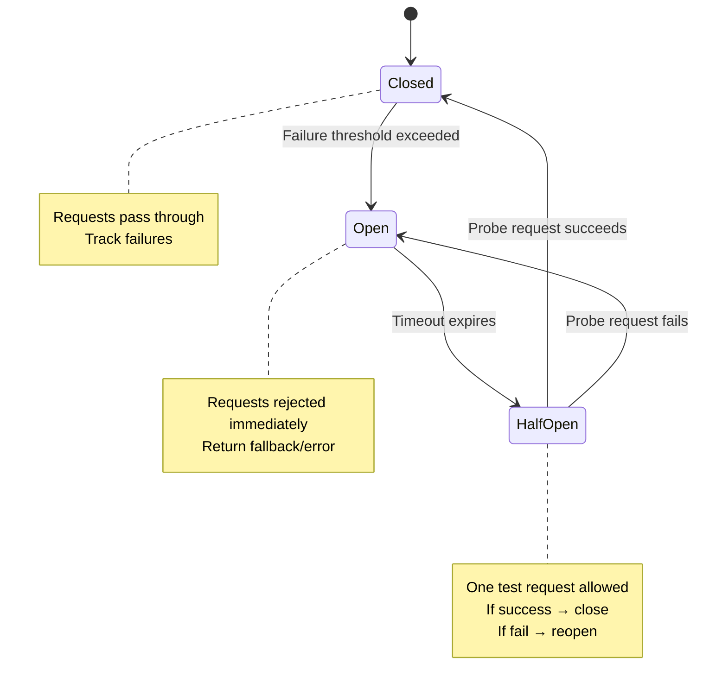
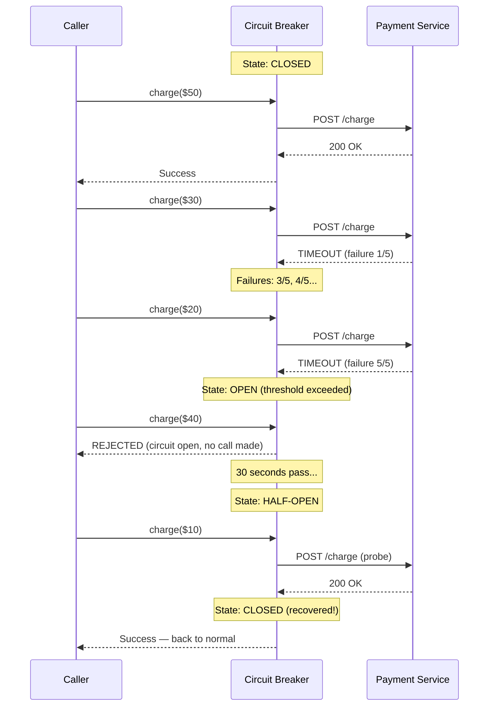

# Circuit Breaker

## 1. The Problem

Your e-commerce checkout service calls a payment gateway. The payment gateway goes down — not with a clean error, but with **30-second timeouts**. Every checkout attempt hangs for 30 seconds before failing.

```typescript
async function processCheckout(order: Order): Promise<Receipt> {
  const payment = await fetch("https://payments.example.com/charge", {
    method: "POST",
    body: JSON.stringify({ amount: order.total }),
  }); // Hangs for 30 seconds, then times out
  
  return { orderId: order.id, status: "charged" };
}
```

Your checkout service has a thread pool of 200 workers. At 10 requests/second, within 20 seconds all 200 workers are blocked waiting on the payment gateway. No new checkout requests can be accepted — even ones that don't need payment (guest browsing, cart updates). The entire checkout service is dead.

The cascading failure: services that call your checkout service also hang. Their thread pools exhaust. Within 2 minutes, the outage propagates to the product catalog, search, and homepage. A payment gateway timeout has taken down your entire e-commerce platform.

**And the payment gateway recovers after 60 seconds.** But you keep hammering it with backed-up requests (thousands queued during the outage). The gateway, already fragile, goes down again under the surge. Repeat for 4 hours.

---

## 2. Naïve Solutions (and Why They Fail)

### Attempt 1: Add a Timeout

```typescript
const controller = new AbortController();
setTimeout(() => controller.abort(), 5000); // 5s timeout
await fetch(url, { signal: controller.signal });
```

**Why it's insufficient:**
- Better than 30s, but 10 req/sec × 5s = 50 threads still blocked simultaneously. Under load, you still exhaust resources.
- You're still SENDING requests to a service you KNOW is down. Each request wastes 5 seconds before failing.

### Attempt 2: Retry on Failure

```typescript
for (let i = 0; i < 3; i++) {
  try { return await charge(order); }
  catch { continue; }
}
```

**Why it makes things worse:**
- The gateway is DOWN. Retrying 3 times per request triples the load on an already-dead service. You're actively preventing it from recovering.
- 10 req/sec × 3 retries = 30 failed requests/second hitting the gateway.

### Attempt 3: Manual Flag

```typescript
let paymentDown = false;

if (!paymentDown) {
  try { return await charge(order); }
  catch { paymentDown = true; }
}
```

**Why it's fragile:**
- Never resets. When does `paymentDown` become false? Someone does it manually? Runs a cron job? Auto-detection requires knowing WHEN the service recovered — which means testing it periodically.
- This IS the circuit breaker pattern, poorly reimplemented.

---

## 3. The Insight

**Track the health of downstream calls. When failures exceed a threshold, STOP making calls entirely (open the circuit). After a cooldown period, let ONE test request through. If it succeeds, close the circuit and resume normal traffic. If it fails, keep the circuit open and wait longer.** This prevents cascading failures and gives the downstream service time to recover.

---

## 4. The Pattern

### Circuit Breaker

**Definition:** A stability pattern that monitors calls to a downstream service and transitions between three states: **Closed** (normal operation — requests pass through), **Open** (failure detected — requests are immediately rejected without calling downstream), and **Half-Open** (recovery probe — one test request is allowed through). The circuit breaker prevents cascading failures and allows downstream services to recover.

**Guarantees:**
- Fail-fast: when the circuit is open, callers get an immediate error (no waiting).
- Downstream protection: a failing service isn't overwhelmed with requests.
- Automatic recovery: half-open state periodically probes for recovery.

**Non-guarantees:**
- Does NOT fix the downstream problem — it protects the caller.
- Does NOT guarantee when recovery happens — recovery depends on the downstream service.
- Does NOT handle partial failures well (if 50% of requests fail, the threshold decision is a tradeoff).

---

## 5. Mental Model

An **electrical circuit breaker** in your house. When too much current flows (failures), the breaker trips (opens), cutting power (rejecting requests). This prevents the wiring from catching fire (cascading failure). After the breaker trips, you can manually test by flipping it back (half-open). If the problem is fixed, it stays on (closed). If the surge returns, it trips again.

---

## 6. Structure





---

## 7. Code Example

### TypeScript

```typescript
// ========== CIRCUIT BREAKER ==========
type CircuitState = "closed" | "open" | "half-open";

interface CircuitBreakerOptions {
  failureThreshold: number;    // Failures before opening
  resetTimeoutMs: number;      // Time in open state before half-open
  monitorWindowMs: number;     // Window for counting failures
}

class CircuitBreaker {
  private state: CircuitState = "closed";
  private failures: number[] = [];  // Timestamps of recent failures
  private lastOpenedAt: number = 0;

  constructor(
    private name: string,
    private options: CircuitBreakerOptions
  ) {}

  async execute<T>(fn: () => Promise<T>): Promise<T> {
    if (this.state === "open") {
      if (Date.now() - this.lastOpenedAt >= this.options.resetTimeoutMs) {
        this.state = "half-open";
        console.log(`[${this.name}] Circuit half-open — probing`);
      } else {
        throw new CircuitOpenError(this.name);
      }
    }

    try {
      const result = await fn();
      this.onSuccess();
      return result;
    } catch (error) {
      this.onFailure();
      throw error;
    }
  }

  private onSuccess(): void {
    if (this.state === "half-open") {
      console.log(`[${this.name}] Probe succeeded — circuit closed`);
    }
    this.state = "closed";
    this.failures = [];
  }

  private onFailure(): void {
    const now = Date.now();
    this.failures.push(now);

    // Remove failures outside the monitoring window
    const windowStart = now - this.options.monitorWindowMs;
    this.failures = this.failures.filter((t) => t >= windowStart);

    if (this.state === "half-open") {
      this.state = "open";
      this.lastOpenedAt = now;
      console.log(`[${this.name}] Probe failed — circuit re-opened`);
      return;
    }

    if (this.failures.length >= this.options.failureThreshold) {
      this.state = "open";
      this.lastOpenedAt = now;
      console.log(`[${this.name}] Circuit OPENED (${this.failures.length} failures)`);
    }
  }

  getState(): CircuitState {
    return this.state;
  }
}

class CircuitOpenError extends Error {
  constructor(circuitName: string) {
    super(`Circuit breaker '${circuitName}' is open — request rejected`);
    this.name = "CircuitOpenError";
  }
}

// ========== USAGE: PAYMENT SERVICE ==========
const paymentCircuit = new CircuitBreaker("payment-gateway", {
  failureThreshold: 5,
  resetTimeoutMs: 30_000,     // 30 seconds before probe
  monitorWindowMs: 60_000,    // Count failures in last 60 seconds
});

async function chargePayment(amount: number): Promise<{ status: string }> {
  return paymentCircuit.execute(async () => {
    const response = await fetch("https://payments.example.com/charge", {
      method: "POST",
      body: JSON.stringify({ amount }),
      signal: AbortSignal.timeout(5000),
    });
    if (!response.ok) throw new Error(`Payment failed: ${response.status}`);
    return response.json();
  });
}

// Callers handle the circuit being open
async function checkout(order: { total: number }) {
  try {
    const result = await chargePayment(order.total);
    return { status: "charged", result };
  } catch (error) {
    if (error instanceof CircuitOpenError) {
      // Fallback: queue for later processing
      return { status: "queued", message: "Payment temporarily unavailable" };
    }
    throw error;
  }
}
```

### Go

```go
package main

import (
	"errors"
	"fmt"
	"sync"
	"time"
)

type CircuitState int

const (
	StateClosed CircuitState = iota
	StateOpen
	StateHalfOpen
)

type CircuitBreaker struct {
	mu               sync.Mutex
	name             string
	state            CircuitState
	failures         int
	failureThreshold int
	resetTimeout     time.Duration
	lastOpenedAt     time.Time
}

var ErrCircuitOpen = errors.New("circuit breaker is open")

func NewCircuitBreaker(name string, threshold int, resetTimeout time.Duration) *CircuitBreaker {
	return &CircuitBreaker{
		name:             name,
		failureThreshold: threshold,
		resetTimeout:     resetTimeout,
	}
}

func (cb *CircuitBreaker) Execute(fn func() error) error {
	cb.mu.Lock()

	switch cb.state {
	case StateOpen:
		if time.Since(cb.lastOpenedAt) >= cb.resetTimeout {
			cb.state = StateHalfOpen
			fmt.Printf("[%s] Circuit half-open — probing\n", cb.name)
		} else {
			cb.mu.Unlock()
			return fmt.Errorf("%w: %s", ErrCircuitOpen, cb.name)
		}
	}

	cb.mu.Unlock()

	// Execute the actual call (outside the lock)
	err := fn()

	cb.mu.Lock()
	defer cb.mu.Unlock()

	if err != nil {
		cb.failures++
		if cb.state == StateHalfOpen {
			cb.state = StateOpen
			cb.lastOpenedAt = time.Now()
			fmt.Printf("[%s] Probe failed — circuit re-opened\n", cb.name)
		} else if cb.failures >= cb.failureThreshold {
			cb.state = StateOpen
			cb.lastOpenedAt = time.Now()
			fmt.Printf("[%s] Circuit OPENED (%d failures)\n", cb.name, cb.failures)
		}
		return err
	}

	// Success
	if cb.state == StateHalfOpen {
		fmt.Printf("[%s] Probe succeeded — circuit closed\n", cb.name)
	}
	cb.state = StateClosed
	cb.failures = 0
	return nil
}

func main() {
	cb := NewCircuitBreaker("payment", 3, 5*time.Second)

	// Simulate failures
	for i := 0; i < 5; i++ {
		err := cb.Execute(func() error {
			return fmt.Errorf("connection refused")
		})
		fmt.Printf("Call %d: %v\n", i+1, err)
	}

	// Circuit is now open — calls rejected immediately
	err := cb.Execute(func() error { return nil })
	fmt.Printf("After open: %v\n", err)

	// Wait for reset timeout
	time.Sleep(6 * time.Second)

	// Half-open: probe succeeds
	err = cb.Execute(func() error { return nil })
	fmt.Printf("After reset: %v\n", err) // nil — circuit closed
}
```

---

## 8. Gotchas & Beginner Mistakes

| Mistake | Why It Hurts |
|---|---|
| **Threshold too low** | 2 failures opens the circuit. Normal error rate might be 1-2%. Circuit flaps open/closed constantly. Set threshold based on baseline error rate. |
| **Threshold too high** | 100 failures before opening. By the time the circuit opens, 100 requests have timed out (each 5s = 500s of wasted waiting). Open early. |
| **No fallback for open circuit** | Throwing a raw error to the user: "CircuitOpenError." Provide a fallback: cached data, queued processing, or a user-friendly message. |
| **Same circuit for unrelated calls** | One circuit breaker for all API calls. Payment service fails → product search circuit opens too. Use **separate circuits per dependency**. |
| **Not monitoring circuit state** | You can't see that the payment circuit has been open for 2 hours. Export circuit state as a metric. Alert when a circuit opens. |

---

## 9. Related & Confusable Patterns

| Pattern | How It Differs |
|---|---|
| **Timeout** | Limits how long a single call can take. Circuit Breaker stops making calls entirely after repeated failures. Timeout is per-call; circuit breaker is per-dependency. |
| **Retry** | Repeats a failed call. Circuit Breaker prevents retries from hitting a dead service. Use retry inside a circuit breaker: retry while closed, reject while open. |
| **Bulkhead** | Isolates resource pools per dependency. Circuit Breaker stops traffic; Bulkhead limits it. Often used together. |
| **Rate Limiter** | Limits request rate to protect the service itself. Circuit Breaker protects the caller from a failing downstream service. |
| **Fallback** | What to do when the circuit is open. Circuit Breaker decides WHEN to stop; Fallback decides WHAT to do instead. |

---

## 10. When This Pattern Is the WRONG Choice

- **Internal function calls** — Circuit breakers are for network calls with latency and failure modes. A local function that throws shouldn't have a circuit breaker.
- **Idempotent batch jobs** — If a nightly batch job processes 1M records and 5 fail, you don't want a circuit breaker stopping the entire batch. Retry the 5 individually.
- **When failure is expected** — A/B testing, feature flags, or services that return 404 for missing resources. These aren't "failures" — don't count them toward the circuit breaker threshold.
- **Database connection pools** — Connection pools already have their own timeout and retry logic. Wrapping a connection pool in a circuit breaker often conflicts with the pool's built-in health management.

**Symptoms you chose it wrong:**
- The circuit flaps (opens/closes rapidly) because the failure rate is near the threshold.
- You have a circuit breaker on every function call — it's meant for remote dependencies, not local logic.
- The circuit breaker is hiding real errors instead of surfacing them.

**How to back out:** Remove the circuit breaker and rely on timeouts + retries. If the downstream service is unreliable, address the root cause (fix the service, add redundancy) rather than wrapping the problem in a circuit breaker.
