# Fallback

## 1. The Problem

Your product page calls a recommendation engine to show "Customers also bought" suggestions. The recommendation engine is a machine-learning microservice that takes product context and returns personalized suggestions. On a good day, it responds in 80ms with 8 tailored product recommendations.

The recommendation engine goes down for maintenance. Your product page now throws a 500 error:

```typescript
async function getProductPage(productId: string): Promise<ProductPage> {
  const product = await getProduct(productId);
  const recommendations = await getRecommendations(productId); // 💥 503 error
  return { product, recommendations };
}
```

**The entire product page is broken because a non-critical feature failed.** Users can't even see the product they wanted to buy. The recommendation engine is a nice enhancement — it shouldn't be able to take down the core shopping experience.

---

## 2. Naïve Solutions (and Why They Fail)

### Attempt 1: Catch and Return Empty

```typescript
let recommendations: Product[] = [];
try {
  recommendations = await getRecommendations(productId);
} catch {
  // Swallow the error silently
}
```

**Why it's suboptimal:**
- You lose the recommendation section entirely. The UI shows a blank space or an awkward empty shelf.
- No logging — you don't know the recommendation engine is down until someone notices revenue dropping.
- Every variant of "catch and ignore" silently degrades without measuring the impact.

### Attempt 2: Retry Until It Works

```typescript
const recommendations = await withRetry(() => getRecommendations(productId), {
  maxAttempts: 5,
  baseDelayMs: 1000,
});
```

**Why it's insufficient:**
- If the service is truly down (not transient), all 5 retries fail and the user waits 15+ seconds — then still gets nothing.
- You slowed down every product page load by 15 seconds during the outage, even though you had viable alternatives.

### Attempt 3: Hard-Coded Data

```typescript
const HARDCODED_RECOMMENDATIONS = [
  { id: "best-seller-1", name: "Popular Widget" },
  { id: "best-seller-2", name: "Classic Gadget" },
];
```

**Why it's limiting:**
- Stale data that never changes. These "popular" items might be discontinued.
- Not personalized or context-aware. A user viewing headphones sees recommended lawnmowers.
- Requires a code deploy to update the fallback data.

---

## 3. The Insight

**When a dependency fails, respond with a degraded but functional alternative — cached data, a simpler computation, static defaults — ranked by quality. The caller defines the degradation hierarchy: best available > cached > static > empty. A product page with stale recommendations is infinitely better than no product page at all.**

---

## 4. The Pattern

### Fallback

**Definition:** A resilience strategy where the system switches to an alternative data source or behavior when the primary path fails. Fallbacks are organized in a chain of decreasing fidelity — from fresh personalized data down to static defaults — ensuring the system always returns a useful response.

**Guarantees:**
- The caller always gets a response (possibly degraded, never an error).
- Non-critical failures don't cascade to break critical functionality.
- Degradation is graceful and visible (the system knows it's using a fallback).

**Non-guarantees:**
- Does NOT guarantee the same quality as the primary response. Fallback data may be stale, generic, or incomplete.
- Does NOT fix the failing dependency — it masks the failure from the user.
- Does NOT eliminate the need for monitoring — you must track fallback usage rates.

---

## 5. Mental Model

**A restaurant kitchen's backup plan.** The menu says "Fresh Atlantic Salmon." The kitchen is out of salmon. Instead of telling the customer "we can't serve you," the waiter offers alternatives: "We have fresh trout prepared the same way" (best alternative) or "We have a frozen salmon we can prepare" (degraded) or "The chef recommends the chicken instead" (different but acceptable). The meal continues.

---

## 6. Structure

```mermaid
sequenceDiagram
    participant C as Product Page
    participant R as Recommendation Engine
    participant CH as Redis Cache
    participant DB as Database

    C->>R: GET /recommendations/prod-123
    R-->>C: ❌ 503 Service Unavailable

    Note over C: Primary failed.<br/>Try fallback 1: cache

    C->>CH: GET cache:recs:prod-123
    CH-->>C: ✅ [item-a, item-b, item-c] (2h old)

    Note over C: Serving cached data.<br/>Tag response: "fallback=cache"

    C->>C: Log metric: recommendation_fallback{level="cache"}
```




---

## 7. Code Example

### TypeScript

```typescript
// ========== FALLBACK CHAIN ==========
type FallbackLevel = "primary" | "cache" | "category" | "static";

interface FallbackResult<T> {
  data: T;
  level: FallbackLevel;
  stale: boolean;
}

async function withFallbackChain<T>(
  primary: () => Promise<T>,
  fallbacks: Array<{ level: FallbackLevel; fn: () => Promise<T> }>
): Promise<FallbackResult<T>> {
  // Try primary
  try {
    const data = await primary();
    return { data, level: "primary", stale: false };
  } catch (primaryErr) {
    console.warn("Primary failed:", (primaryErr as Error).message);
  }

  // Try fallbacks in order
  for (const { level, fn } of fallbacks) {
    try {
      const data = await fn();
      console.warn(`Using fallback: ${level}`);
      return { data, level, stale: true };
    } catch (err) {
      console.warn(`Fallback ${level} failed:`, (err as Error).message);
    }
  }

  throw new Error("All fallbacks exhausted");
}

// ========== RECOMMENDATION SERVICE WITH FALLBACKS ==========
interface Product {
  id: string;
  name: string;
  price: number;
}

// Simulated cache (Redis in production)
const cache = new Map<string, { data: Product[]; cachedAt: number }>();

async function getRecommendations(
  productId: string
): Promise<FallbackResult<Product[]>> {
  return withFallbackChain(
    // PRIMARY: Live recommendation engine
    async () => {
      const response = await fetch(
        `http://recs-engine:8080/recommend/${productId}`,
        { signal: AbortSignal.timeout(2000) }
      );
      if (!response.ok) throw new Error(`HTTP ${response.status}`);
      const products = (await response.json()) as Product[];

      // Update cache on success
      cache.set(productId, { data: products, cachedAt: Date.now() });
      return products;
    },

    [
      // FALLBACK 1: Cached recommendations (stale but personalized)
      {
        level: "cache",
        fn: async () => {
          const cached = cache.get(productId);
          if (!cached) throw new Error("Cache miss");
          // Accept cache up to 24 hours old
          if (Date.now() - cached.cachedAt > 24 * 60 * 60 * 1000) {
            throw new Error("Cache too stale");
          }
          return cached.data;
        },
      },

      // FALLBACK 2: Category bestsellers (not personalized, but relevant)
      {
        level: "category",
        fn: async () => {
          const product = await getProductDetails(productId);
          return getCategoryBestsellers(product.category);
        },
      },

      // FALLBACK 3: Global bestsellers (always available, never fails)
      {
        level: "static",
        fn: async () => GLOBAL_BESTSELLERS,
      },
    ]
  );
}

// ========== PRODUCT PAGE ==========
async function getProductPage(productId: string) {
  // Product data is critical — no fallback, let it fail
  const product = await getProductDetails(productId);

  // Recommendations are non-critical — use fallback chain
  const recs = await getRecommendations(productId);

  return {
    product,
    recommendations: recs.data,
    recommendationSource: recs.level, // "primary" | "cache" | "category" | "static"
    isRecommendationStale: recs.stale,
  };
}

async function getProductDetails(id: string): Promise<Product & { category: string }> {
  return { id, name: "Wireless Headphones", price: 79.99, category: "electronics" };
}

async function getCategoryBestsellers(category: string): Promise<Product[]> {
  return [
    { id: "cat-1", name: `Best ${category} item 1`, price: 29.99 },
    { id: "cat-2", name: `Best ${category} item 2`, price: 49.99 },
  ];
}

const GLOBAL_BESTSELLERS: Product[] = [
  { id: "global-1", name: "Universal Widget", price: 19.99 },
  { id: "global-2", name: "Popular Gadget", price: 39.99 },
  { id: "global-3", name: "Trending Thing", price: 24.99 },
];
```

### Go

```go
package main

import (
	"encoding/json"
	"fmt"
	"net/http"
	"sync"
	"time"
)

// ========== FALLBACK CHAIN ==========
type FallbackLevel string

const (
	LevelPrimary  FallbackLevel = "primary"
	LevelCache    FallbackLevel = "cache"
	LevelCategory FallbackLevel = "category"
	LevelStatic   FallbackLevel = "static"
)

type FallbackResult[T any] struct {
	Data  T
	Level FallbackLevel
	Stale bool
}

type FallbackOption[T any] struct {
	Level FallbackLevel
	Fn    func() (T, error)
}

func WithFallbackChain[T any](
	primary func() (T, error),
	fallbacks []FallbackOption[T],
) (FallbackResult[T], error) {
	data, err := primary()
	if err == nil {
		return FallbackResult[T]{Data: data, Level: LevelPrimary, Stale: false}, nil
	}
	fmt.Printf("Primary failed: %v\n", err)

	for _, fb := range fallbacks {
		data, err := fb.Fn()
		if err == nil {
			fmt.Printf("Using fallback: %s\n", fb.Level)
			return FallbackResult[T]{Data: data, Level: fb.Level, Stale: true}, nil
		}
		fmt.Printf("Fallback %s failed: %v\n", fb.Level, err)
	}

	var zero T
	return FallbackResult[T]{Data: zero}, fmt.Errorf("all fallbacks exhausted")
}

// ========== RECOMMENDATION CACHE ==========
type Product struct {
	ID    string  `json:"id"`
	Name  string  `json:"name"`
	Price float64 `json:"price"`
}

type cacheEntry struct {
	Products []Product
	CachedAt time.Time
}

var (
	recCache   = map[string]cacheEntry{}
	recCacheMu sync.RWMutex
)

func getCached(productID string) ([]Product, error) {
	recCacheMu.RLock()
	defer recCacheMu.RUnlock()

	entry, ok := recCache[productID]
	if !ok {
		return nil, fmt.Errorf("cache miss for %s", productID)
	}
	if time.Since(entry.CachedAt) > 24*time.Hour {
		return nil, fmt.Errorf("cache too stale for %s", productID)
	}
	return entry.Products, nil
}

func setCache(productID string, products []Product) {
	recCacheMu.Lock()
	defer recCacheMu.Unlock()
	recCache[productID] = cacheEntry{Products: products, CachedAt: time.Now()}
}

// ========== RECOMMENDATION WITH FALLBACKS ==========
func getRecommendations(productID string) (FallbackResult[[]Product], error) {
	return WithFallbackChain(
		// Primary: live recommendation engine
		func() ([]Product, error) {
			client := &http.Client{Timeout: 2 * time.Second}
			resp, err := client.Get(fmt.Sprintf("http://recs-engine:8080/recommend/%s", productID))
			if err != nil {
				return nil, err
			}
			defer resp.Body.Close()
			if resp.StatusCode != 200 {
				return nil, fmt.Errorf("HTTP %d", resp.StatusCode)
			}
			var products []Product
			if err := json.NewDecoder(resp.Body).Decode(&products); err != nil {
				return nil, err
			}
			setCache(productID, products)
			return products, nil
		},
		[]FallbackOption[[]Product]{
			{Level: LevelCache, Fn: func() ([]Product, error) {
				return getCached(productID)
			}},
			{Level: LevelCategory, Fn: func() ([]Product, error) {
				return []Product{
					{ID: "cat-1", Name: "Category Bestseller 1", Price: 29.99},
					{ID: "cat-2", Name: "Category Bestseller 2", Price: 49.99},
				}, nil
			}},
			{Level: LevelStatic, Fn: func() ([]Product, error) {
				return globalBestsellers, nil
			}},
		},
	)
}

var globalBestsellers = []Product{
	{ID: "global-1", Name: "Universal Widget", Price: 19.99},
	{ID: "global-2", Name: "Popular Gadget", Price: 39.99},
}

func productHandler(w http.ResponseWriter, r *http.Request) {
	productID := r.URL.Query().Get("id")
	recs, err := getRecommendations(productID)
	if err != nil {
		http.Error(w, err.Error(), http.StatusInternalServerError)
		return
	}

	w.Header().Set("Content-Type", "application/json")
	w.Header().Set("X-Recommendation-Source", string(recs.Level))
	json.NewEncoder(w).Encode(recs)
}

func main() {
	http.HandleFunc("/product", productHandler)
	fmt.Println("Server on :8080")
	http.ListenAndServe(":8080", nil)
}
```

---

## 8. Gotchas & Beginner Mistakes

| Mistake | Why It Hurts |
|---|---|
| **Fallback for critical paths** | If payment processing fails, a "fallback" that pretends the payment succeeded will cause real financial damage. Only use fallbacks for non-critical, read-path features. |
| **Silent fallback without metrics** | If recommendations silently fall back to static data for 3 weeks, nobody notices until revenue drops. Track `fallback_usage{level="static"}` and alert when it exceeds baseline. |
| **Expensive fallback** | If the fallback calls another slow service, you just moved the problem. Fallbacks should be fast, local, and reliable (cache lookup, in-memory data, precomputed values). |
| **Fallback hides broken primary** | The primary has been failing for months but nobody noticed because the fallback works fine. Set up monitoring and alerts on primary failure rate separately from end-user impact. |
| **Missing cache warm-up** | Fallback 1 is "cached data" but on cold start, the cache is empty. All requests skip straight to level 3 (static). Warm the cache on startup or after deploys. |

---

## 9. Related & Confusable Patterns

| Pattern | How It Differs |
|---|---|
| **Circuit Breaker** | Short-circuits calls to a failing dependency. Often triggers the fallback. Circuit breaker decides WHEN to stop calling; fallback decides WHAT to return instead. |
| **Retry with Backoff** | Retries the same operation hoping it succeeds. Fallback uses an alternative operation. Retry = try harder; fallback = try differently. |
| **Graceful Degradation** | System-level strategy of reducing features under load. Fallback is the mechanism within one feature. Graceful degradation orchestrates which fallbacks to activate. |
| **Cache-Aside** | Cache stores data for performance. Fallback uses cache for resilience. Same cache, different motivation. Cache-aside is a performance pattern; fallback is a resilience pattern. |
| **Default Value** | The simplest fallback: return a hardcoded constant. Fallback is the general pattern; default value is the simplest implementation of level 3. |

---

## 10. When This Pattern Is the WRONG Choice

- **Write operations** — A fallback for "create order" that silently drops the order is data loss. Fallbacks are primarily for read-path/display features.
- **Correctness-critical data** — If the pricing service is down, a fallback that returns yesterday's cached price could show wrong prices and cause financial disputes. Some data must be real-time or fail.
- **Short, rare outages** — If the recommendation engine is down once a quarter for 30 seconds, adding a full fallback chain is over-engineering. A simple timeout + empty response may be enough.

**Symptoms you should reconsider:**
- Fallback is always active — the primary is fundamentally unreliable. Fix the primary.
- Users complain about stale/bad data from fallbacks — the quality gap between primary and fallback is too large. Improve the fallback quality.
- The fallback chain has 5+ levels with complex logic — you've built a second system. Simplify to 2-3 levels maximum.

**How to back out:** Replace the fallback chain with a direct call. If the dependency fails, return an error to the user. If this is unacceptable, the fallback pattern was providing real value — keep it.
