# Graceful Degradation

## 1. The Problem

Your social media platform has 12 microservices powering the home feed: post service, user profiles, recommendations, ads, notifications, trending topics, stories, friend suggestions, live streams, analytics, search suggestions, and chat presence.

On Black Friday, the recommendation engine falls over (ML model OOM). The ads service can't handle the spike. The trending topics service has a database lock. Three out of twelve services are unhealthy.

Your feed rendering code:

```typescript
async function renderFeed(userId: string): Promise<Feed> {
  const [posts, profile, recommendations, ads, notifications, trending,
         stories, suggestions, streams, analytics, search, chat] =
    await Promise.all([
      getPosts(userId),
      getProfile(userId),
      getRecommendations(userId),  // 💥 503
      getAds(userId),              // 💥 timeout
      getNotifications(userId),
      getTrending(),               // 💥 deadlock
      getStories(userId),
      getSuggestions(userId),
      getLiveStreams(),
      getAnalytics(userId),
      getSearchSuggestions(),
      getChatPresence(userId),
    ]);

  return composeFeed(posts, profile, recommendations, /* ... */);
}
```

`Promise.all` rejects on the first failure. **The entire feed page is blank because trending topics had a deadlock.** Users see a white screen or a 500 error — even though posts, profiles, stories, and notifications are all working perfectly.

---

## 2. Naïve Solutions (and Why They Fail)

### Attempt 1: Catch Everything, Return a Minimal Page

```typescript
try {
  return await renderFullFeed(userId);
} catch {
  return { posts: [], message: "Something went wrong" };
}
```

**Why it's too coarse:**
- You go from "full experience" to "empty page" with nothing in between. 10 out of 12 services work, but you threw away their results because 2 failed.
- The user sees "Something went wrong" when 83% of the system is healthy.

### Attempt 2: Separate Try/Catch for Each Service

```typescript
let recommendations: Rec[] = [];
try { recommendations = await getRecommendations(userId); } catch {}
let ads: Ad[] = [];
try { ads = await getAds(userId); } catch {}
// ... 10 more try/catch blocks
```

**Why it's incomplete:**
- This handles individual failures, but doesn't coordinate. What if 6 out of 12 services are down? Do you still show the page? Is a feed with only posts and notifications worth rendering?
- No visibility into how degraded the experience is. No ability to shed non-critical features proactively.

### Attempt 3: Feature Flags to Disable Services

```typescript
if (featureFlags.enableRecommendations) {
  recommendations = await getRecommendations(userId);
}
```

**Why it's manual:**
- Someone has to notice the failure, log into the feature flag dashboard, and toggle the flag. At 3 AM, this means 30 minutes of downtime before a human responds.
- Not reactive — the system doesn't adapt automatically.

---

## 3. The Insight

**Classify every feature by criticality tier. When failures occur, automatically shed lower-tier features to preserve higher-tier ones. The system continuously adjusts the experience level based on what's currently healthy — full experience when everything works, reduced experience during partial failures, core-only during severe degradation.**

---

## 4. The Pattern

### Graceful Degradation

**Definition:** A system design strategy where features are ranked by criticality into tiers. When dependencies fail or resources are scarce, the system automatically disables lower-tier features to preserve the functionality of higher-tier (critical) features. The degradation is progressive — not all-or-nothing — and the system recovers automatically when health improves.

**Guarantees:**
- Core functionality survives partial outages. Users can still browse and buy, even if recommendations are gone.
- Degradation is automatic and proportional — no human intervention needed at 3 AM.
- The system always presents the best experience possible given current health.

**Non-guarantees:**
- Does NOT fix the failing services — it hides the impact from users.
- Does NOT guarantee the degraded experience is "good enough." If the core service (posts) fails, even graceful degradation can't help.
- Does NOT replace monitoring — you still need alerts to fix the root cause.

---

## 5. Mental Model

**A building losing power floor by floor.** When the grid's capacity drops, the building doesn't go completely dark. First, decorative lobby lights turn off (tier 3). Then non-essential HVAC adjusts (tier 2). Elevators switch to one-per-bank (tier 2). Emergency lighting and critical systems stay on until absolute minimum power (tier 1). The building is always functional — just progressively less comfortable.

---

## 6. Structure

```mermaid
graph TD
    subgraph "Tier 1 — Critical (never shed)"
        POSTS["Posts / Feed"]
        AUTH["Authentication"]
        PROFILE["User Profile"]
    end

    subgraph "Tier 2 — Important (shed under pressure)"
        NOTIF["Notifications"]
        STORIES["Stories"]
        SEARCH["Search"]
    end

    subgraph "Tier 3 — Enhancement (shed first)"
        RECS["Recommendations"]
        ADS["Ads"]
        SUGGEST["Friend Suggestions"]
        TREND["Trending Topics"]
        STREAMS["Live Streams"]
        CHAT["Chat Presence"]
    end

    HEALTH["Health Monitor"] -->|"All healthy"| FULL["Full Experience"]
    HEALTH -->|"Tier 3 failing"| REDUCED["Reduced Experience<br/>(no recs, ads, trending)"]
    HEALTH -->|"Tier 2+3 failing"| CORE["Core Only<br/>(posts + auth + profile)"]

    style POSTS fill:#27ae60,color:#fff
    style AUTH fill:#27ae60,color:#fff
    style PROFILE fill:#27ae60,color:#fff
    style RECS fill:#e74c3c,color:#fff
    style ADS fill:#e74c3c,color:#fff
    style TREND fill:#e74c3c,color:#fff
```




---

## 7. Code Example

### TypeScript

```typescript
// ========== FEATURE TIERS ==========
type Tier = 1 | 2 | 3;
type DegradationMode = "full" | "reduced" | "core";

interface Feature<T> {
  name: string;
  tier: Tier;
  fetch: () => Promise<T>;
  fallback: T; // Default value when shed
}

// ========== DEGRADATION CONTROLLER ==========
class DegradationController {
  private mode: DegradationMode = "full";
  private failedFeatures = new Set<string>();

  async fetchFeatures<T extends Record<string, unknown>>(
    features: Feature<T[keyof T]>[]
  ): Promise<{ data: Partial<T>; mode: DegradationMode; shed: string[] }> {
    const data: Record<string, unknown> = {};
    const shed: string[] = [];

    // Determine current mode based on health
    this.mode = this.calculateMode();

    const allowedTier = this.mode === "full" ? 3
                      : this.mode === "reduced" ? 2
                      : 1;

    await Promise.allSettled(
      features.map(async (feature) => {
        // Proactively skip features above the allowed tier
        if (feature.tier > allowedTier) {
          data[feature.name] = feature.fallback;
          shed.push(feature.name);
          return;
        }

        try {
          data[feature.name] = await feature.fetch();
          // Success — clear from failed set
          this.failedFeatures.delete(feature.name);
        } catch (error) {
          console.warn(`Feature ${feature.name} failed:`, (error as Error).message);
          data[feature.name] = feature.fallback;
          this.failedFeatures.add(feature.name);
          shed.push(feature.name);
        }
      })
    );

    return { data: data as Partial<T>, mode: this.mode, shed };
  }

  private calculateMode(): DegradationMode {
    const failedTier2 = [...this.failedFeatures].filter((f) =>
      this.getTier(f) <= 2
    ).length;
    const failedTier3 = this.failedFeatures.size;

    if (failedTier2 >= 2) return "core";
    if (failedTier3 >= 3) return "reduced";
    return "full";
  }

  private tierMap: Record<string, Tier> = {};

  registerTier(name: string, tier: Tier) {
    this.tierMap[name] = tier;
  }

  private getTier(name: string): Tier {
    return this.tierMap[name] ?? 3;
  }
}

// ========== FEED COMPOSITION ==========
interface FeedData {
  posts: Post[];
  profile: Profile;
  recommendations: Recommendation[];
  ads: Ad[];
  notifications: Notification[];
  trending: Topic[];
  stories: Story[];
}

const controller = new DegradationController();

async function renderFeed(userId: string): Promise<{
  feed: Partial<FeedData>;
  mode: DegradationMode;
  shed: string[];
}> {
  const features: Feature<FeedData[keyof FeedData]>[] = [
    // Tier 1 — Critical
    { name: "posts", tier: 1, fetch: () => getPosts(userId), fallback: [] },
    { name: "profile", tier: 1, fetch: () => getProfile(userId), fallback: DEFAULT_PROFILE },

    // Tier 2 — Important
    { name: "notifications", tier: 2, fetch: () => getNotifications(userId), fallback: [] },
    { name: "stories", tier: 2, fetch: () => getStories(userId), fallback: [] },

    // Tier 3 — Enhancement
    { name: "recommendations", tier: 3, fetch: () => getRecommendations(userId), fallback: [] },
    { name: "ads", tier: 3, fetch: () => getAds(userId), fallback: [] },
    { name: "trending", tier: 3, fetch: () => getTrending(), fallback: [] },
  ];

  features.forEach((f) => controller.registerTier(f.name, f.tier));

  const result = await controller.fetchFeatures<FeedData>(features);

  // Include degradation info in response headers
  console.log(`Feed rendered in ${result.mode} mode. Shed: ${result.shed.join(", ")}`);

  return { feed: result.data, mode: result.mode, shed: result.shed };
}

// Type stubs
interface Post { id: string; content: string; }
interface Profile { name: string; }
interface Recommendation { id: string; }
interface Ad { id: string; }
interface Notification { id: string; }
interface Topic { name: string; }
interface Story { id: string; }
const DEFAULT_PROFILE: Profile = { name: "User" };
async function getPosts(userId: string): Promise<Post[]> { return []; }
async function getProfile(userId: string): Promise<Profile> { return { name: "Alice" }; }
async function getNotifications(userId: string): Promise<Notification[]> { return []; }
async function getStories(userId: string): Promise<Story[]> { return []; }
async function getRecommendations(userId: string): Promise<Recommendation[]> { return []; }
async function getAds(userId: string): Promise<Ad[]> { return []; }
async function getTrending(): Promise<Topic[]> { return []; }
```

### Go

```go
package main

import (
	"context"
	"encoding/json"
	"fmt"
	"net/http"
	"sync"
	"time"
)

// ========== DEGRADATION TIERS ==========
type Tier int

const (
	TierCritical    Tier = 1
	TierImportant   Tier = 2
	TierEnhancement Tier = 3
)

type Mode string

const (
	ModeFull    Mode = "full"
	ModeReduced Mode = "reduced"
	ModeCore    Mode = "core"
)

// ========== FEATURE RESULT ==========
type FeatureSpec struct {
	Name     string
	Tier     Tier
	Fetch    func(ctx context.Context) (interface{}, error)
	Fallback interface{}
}

type FeatureResult struct {
	Name string
	Data interface{}
	Shed bool
}

// ========== DEGRADATION CONTROLLER ==========
type DegradationController struct {
	mu       sync.RWMutex
	failures map[string]Tier // feature name → tier
}

func NewDegradationController() *DegradationController {
	return &DegradationController{
		failures: make(map[string]Tier),
	}
}

func (dc *DegradationController) CurrentMode() Mode {
	dc.mu.RLock()
	defer dc.mu.RUnlock()

	tier2Failures := 0
	totalFailures := len(dc.failures)

	for _, tier := range dc.failures {
		if tier <= TierImportant {
			tier2Failures++
		}
	}

	if tier2Failures >= 2 {
		return ModeCore
	}
	if totalFailures >= 3 {
		return ModeReduced
	}
	return ModeFull
}

func (dc *DegradationController) FetchAll(
	ctx context.Context,
	specs []FeatureSpec,
) ([]FeatureResult, Mode) {
	mode := dc.CurrentMode()
	allowedTier := TierEnhancement
	if mode == ModeReduced {
		allowedTier = TierImportant
	} else if mode == ModeCore {
		allowedTier = TierCritical
	}

	results := make([]FeatureResult, len(specs))
	var wg sync.WaitGroup

	for i, spec := range specs {
		if spec.Tier > allowedTier {
			results[i] = FeatureResult{Name: spec.Name, Data: spec.Fallback, Shed: true}
			continue
		}

		wg.Add(1)
		go func(idx int, s FeatureSpec) {
			defer wg.Done()

			fetchCtx, cancel := context.WithTimeout(ctx, 2*time.Second)
			defer cancel()

			data, err := s.Fetch(fetchCtx)
			if err != nil {
				results[idx] = FeatureResult{Name: s.Name, Data: s.Fallback, Shed: true}
				dc.mu.Lock()
				dc.failures[s.Name] = s.Tier
				dc.mu.Unlock()
			} else {
				results[idx] = FeatureResult{Name: s.Name, Data: data, Shed: false}
				dc.mu.Lock()
				delete(dc.failures, s.Name)
				dc.mu.Unlock()
			}
		}(i, spec)
	}

	wg.Wait()
	return results, dc.CurrentMode()
}

// ========== FEED HANDLER ==========
var degradation = NewDegradationController()

func feedHandler(w http.ResponseWriter, r *http.Request) {
	userID := r.URL.Query().Get("userId")

	specs := []FeatureSpec{
		{Name: "posts", Tier: TierCritical, Fallback: []string{},
			Fetch: func(ctx context.Context) (interface{}, error) {
				return []string{"post-1", "post-2"}, nil
			}},
		{Name: "profile", Tier: TierCritical, Fallback: map[string]string{"name": "User"},
			Fetch: func(ctx context.Context) (interface{}, error) {
				return map[string]string{"name": "Alice", "id": userID}, nil
			}},
		{Name: "notifications", Tier: TierImportant, Fallback: []string{},
			Fetch: func(ctx context.Context) (interface{}, error) {
				return []string{"notif-1"}, nil
			}},
		{Name: "recommendations", Tier: TierEnhancement, Fallback: []string{},
			Fetch: func(ctx context.Context) (interface{}, error) {
				return nil, fmt.Errorf("ML model OOM")
			}},
		{Name: "trending", Tier: TierEnhancement, Fallback: []string{},
			Fetch: func(ctx context.Context) (interface{}, error) {
				return nil, fmt.Errorf("DB deadlock")
			}},
	}

	results, mode := degradation.FetchAll(r.Context(), specs)

	shed := []string{}
	feed := map[string]interface{}{}
	for _, r := range results {
		feed[r.Name] = r.Data
		if r.Shed {
			shed = append(shed, r.Name)
		}
	}

	w.Header().Set("Content-Type", "application/json")
	w.Header().Set("X-Degradation-Mode", string(mode))
	json.NewEncoder(w).Encode(map[string]interface{}{
		"feed": feed,
		"mode": mode,
		"shed": shed,
	})
}

func main() {
	http.HandleFunc("/feed", feedHandler)
	fmt.Println("Server on :8080")
	http.ListenAndServe(":8080", nil)
}
```

---

## 8. Gotchas & Beginner Mistakes

| Mistake | Why It Hurts |
|---|---|
| **Everything is tier 1** | If every feature is "critical," nothing can be shed and you're back to all-or-nothing failure. Be honest about what's truly critical. Can users live without trending topics for an hour? Yes. |
| **No automatic recovery** | Degradation mode is set when failures occur, but never resets. When the ML service recovers, recommendations stay disabled until someone manually resets. Health checks should auto-restore features. |
| **Shedding without notifying the user** | The recommendations section disappears silently. Users think the feature is broken. Show a subtle "Simplified view" indicator or placeholder. |
| **No metrics on degradation** | If the system runs in "reduced" mode for 3 hours and nobody knows, the degraded experience becomes the norm. Alert on mode transitions. Track revenue/engagement impact per mode. |
| **Shedding critical features** | If the definition of "critical" is wrong (marking payments as tier 2), shedding under pressure disables checkout. Revenue stops. Test your tier classifications with actual failure scenarios. |

---

## 9. Related & Confusable Patterns

| Pattern | How It Differs |
|---|---|
| **Fallback** | Provides an alternative response for one failed dependency. Graceful degradation coordinates fallbacks across the entire system, determining which features to shed based on overall health. Fallback is the tactic; graceful degradation is the strategy. |
| **Circuit Breaker** | Short-circuits calls to one unhealthy dependency. Graceful degradation decides whether to even attempt the call based on system-wide health assessment. |
| **Load Shedding** | Drops entire requests when the server is overloaded. Graceful degradation serves partial responses with reduced features. Load shedding: "no response." Graceful degradation: "partial response." |
| **Feature Flags** | Manually toggling features at deploy time. Graceful degradation does this automatically at runtime based on health signals. Feature flags are static; degradation is dynamic. |
| **Bulkhead** | Isolates failures to specific resource pools. Graceful degradation determines what the user sees when a pool is exhausted. Bulkhead contains the blast radius; graceful degradation adjusts the user experience. |

---

## 10. When This Pattern Is the WRONG Choice

- **All-or-nothing systems** — A banking transaction either succeeds completely or fails completely. You can't "partially transfer money." Graceful degradation is for composite UIs and aggregation services, not atomic operations.
- **Simple services with 1-2 dependencies** — A CRUD API that reads from one database doesn't benefit from tiered degradation. Just handle the error directly.
- **Performance-critical hot paths** — The degradation logic itself (health checks, mode calculation, tier evaluation) adds latency to every request. On a sub-millisecond trading platform, this overhead matters.

**Symptoms you should reconsider:**
- The system is always in "core" mode — too many services are down. Fix infrastructure reliability, don't just hide it behind degradation.
- Users complain about missing features — your tier 3 features are actually critical to user satisfaction. Re-evaluate tier assignments.
- The degradation controller itself becomes a single point of failure — if the health monitor crashes, every request defaults to "full" mode (no protection) or "core" mode (always degraded). Make the controller resilient.

**How to back out:** Remove the degradation controller and call all services directly. Use `Promise.allSettled` to collect results without failing on the first error. Map failed results to empty defaults. This gives you basic resilience without the tier system.
