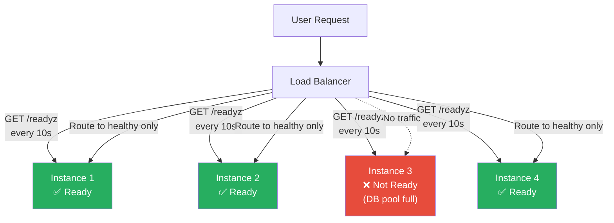
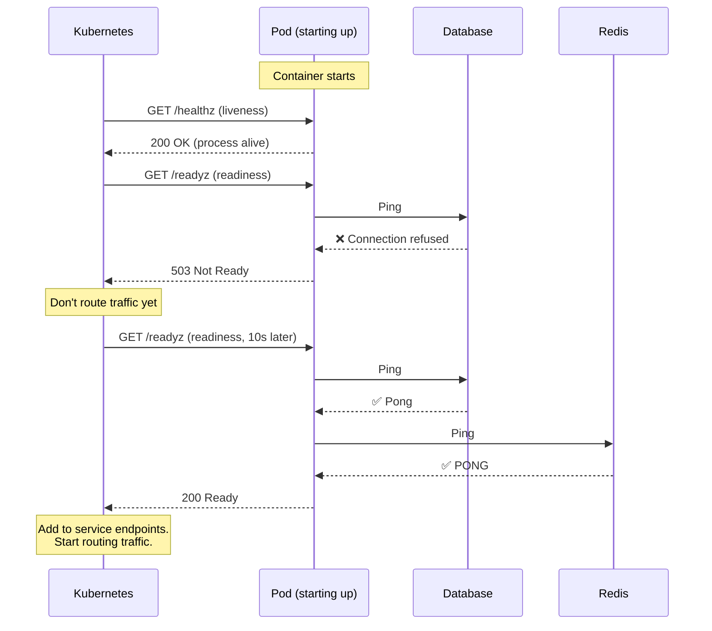

# Health Check

## 1. The Problem

You have 5 instances of your order service behind a load balancer. Instance 3 runs out of database connections. It can still accept TCP connections (the process is running, the port is open), so the load balancer keeps routing traffic to it. Every request routed to instance 3 fails with "connection pool exhausted."

```
Load Balancer → Round Robin
  Instance 1: ✅ Healthy (handling requests)
  Instance 2: ✅ Healthy (handling requests)
  Instance 3: ❌ DB pool exhausted (process alive, but can't serve)
  Instance 4: ✅ Healthy (handling requests)
  Instance 5: ✅ Healthy (handling requests)
```

20% of all requests fail. Users see intermittent errors. Sometimes checkout works, sometimes it doesn't. The experience is maddening — "it works if I keep refreshing!"

The load balancer doesn't know instance 3 is broken because it only checks "is the TCP port open?" — and yes, it is.

---

## 2. Naïve Solutions (and Why They Fail)

### Attempt 1: TCP Port Check

```
# Load balancer health check
Check: TCP connect to port 8080
Interval: 30s
```

**Why it's insufficient:**
- The process is running and accepting connections. TCP check passes. But the application can't do useful work — database connections are exhausted, disk is full, or a critical downstream is unreachable.
- TCP checks only tell you "is the process alive?" not "can the process serve requests?"

### Attempt 2: HTTP 200 on Root Path

```typescript
app.get("/", (req, res) => res.status(200).send("OK"));
```

**Why it's misleading:**
- This endpoint always returns 200 because it doesn't check anything. The database could be down, Redis could be unreachable, the disk could be full — this endpoint still says "OK."
- It's a "liveness" check at best, not a readiness check.

### Attempt 3: Full Request as Health Check

```
# Health check: make a real checkout request every 30s
POST /checkout { testOrder: true }
```

**Why it's dangerous:**
- Creates real side effects (test orders, charges, inventory changes). You need to clean up test data.
- Expensive — a full checkout might take 2 seconds, touch 5 services, and write to 3 databases. Every 30 seconds. Times 5 instances.
- If the health check itself fails due to a downstream issue (payment provider down), the instance is marked unhealthy even though it could serve catalog and auth requests fine.

---

## 3. The Insight

**Expose dedicated endpoints that report the instance's ability to serve traffic — one for "am I alive?" (liveness) and one for "am I ready to handle requests?" (readiness). The readiness check verifies critical dependencies (database, cache, disk) without performing real business logic.**

---

## 4. The Pattern

### Health Check

**Definition:** Dedicated endpoints that report a service instance's operational status. Two distinct checks serve different purposes:

- **Liveness** (`/healthz`): Is the process running and not deadlocked? If no, restart it.
- **Readiness** (`/readyz`): Can the instance handle requests right now? If no, stop sending traffic but don't restart.

**Guarantees:**
- Load balancers route traffic only to instances that can serve it.
- Unhealthy instances are automatically removed from the pool.
- Orchestrators (Kubernetes) can restart stuck processes (liveness) and hold traffic during startup (readiness).

**Non-guarantees:**
- Does NOT fix the underlying issue — it only detects and reports it.
- Does NOT prevent brief periods of failure — between health check intervals, a newly unhealthy instance still receives some traffic.
- Does NOT check every possible failure mode — only the dependencies you explicitly verify.

---

## 5. Mental Model

**A pilot's pre-flight checklist.** Before takeoff, the pilot checks: fuel level, engine gauges, control surfaces, instruments. The plane might look fine from outside (liveness), but if the fuel gauge reads empty, you don't take off (readiness). The checklist is quick — you don't fly a test route to verify the plane works. You check the critical systems.

---

## 6. Structure





---

## 7. Code Example

### TypeScript

```typescript
// ========== DEPENDENCY HEALTH CHECKS ==========
interface HealthCheck {
  name: string;
  check: () => Promise<void>;
  critical: boolean; // If true, failing this = instance not ready
}

interface HealthStatus {
  status: "healthy" | "degraded" | "unhealthy";
  checks: Record<string, { status: string; latencyMs: number; error?: string }>;
  uptime: number;
  version: string;
}

class HealthChecker {
  private checks: HealthCheck[] = [];
  private startTime = Date.now();

  register(check: HealthCheck) {
    this.checks.push(check);
  }

  async checkReadiness(): Promise<HealthStatus> {
    const results: HealthStatus["checks"] = {};
    let allHealthy = true;
    let hasCriticalFailure = false;

    await Promise.all(
      this.checks.map(async ({ name, check, critical }) => {
        const start = Date.now();
        try {
          await check();
          results[name] = { status: "healthy", latencyMs: Date.now() - start };
        } catch (error) {
          const latencyMs = Date.now() - start;
          results[name] = {
            status: "unhealthy",
            latencyMs,
            error: (error as Error).message,
          };
          allHealthy = false;
          if (critical) hasCriticalFailure = true;
        }
      })
    );

    return {
      status: hasCriticalFailure ? "unhealthy" : allHealthy ? "healthy" : "degraded",
      checks: results,
      uptime: Math.floor((Date.now() - this.startTime) / 1000),
      version: process.env.APP_VERSION || "unknown",
    };
  }

  async checkLiveness(): Promise<{ status: "alive" }> {
    // Liveness: just confirm the event loop is not frozen
    return { status: "alive" };
  }
}

// ========== REGISTERING CHECKS ==========
import { createPool, Pool } from "mysql2/promise";
import { createClient, RedisClientType } from "redis";

const db: Pool = createPool({ host: "db", database: "orders", connectionLimit: 20 });
const redis: RedisClientType = createClient({ url: "redis://cache:6379" });

const health = new HealthChecker();

// Database check — critical (can't serve without DB)
health.register({
  name: "database",
  critical: true,
  check: async () => {
    const conn = await db.getConnection();
    try {
      await conn.ping();
    } finally {
      conn.release();
    }
  },
});

// Redis check — not critical (can serve without cache, just slower)
health.register({
  name: "redis",
  critical: false,
  check: async () => {
    const pong = await redis.ping();
    if (pong !== "PONG") throw new Error("Unexpected ping response");
  },
});

// Disk space check — critical
health.register({
  name: "disk",
  critical: true,
  check: async () => {
    const { availableForNonPrivileged } = await import("node:fs/promises")
      .then((fs) => fs.statfs("/"));
    // Actually check available space
    // Simplified: just verify we can write
    const fs = await import("node:fs/promises");
    const testFile = "/tmp/health-check-test";
    await fs.writeFile(testFile, "ok");
    await fs.unlink(testFile);
  },
});

// ========== HTTP ENDPOINTS ==========
import express from "express";

const app = express();

// Readiness: Can I handle requests?
app.get("/readyz", async (req, res) => {
  const status = await health.checkReadiness();
  const httpStatus = status.status === "unhealthy" ? 503 : 200;
  res.status(httpStatus).json(status);
});

// Liveness: Am I alive?
app.get("/healthz", async (req, res) => {
  const status = await health.checkLiveness();
  res.status(200).json(status);
});

app.listen(8080);
```

### Go

```go
package main

import (
	"context"
	"database/sql"
	"encoding/json"
	"fmt"
	"net/http"
	"sync"
	"time"

	_ "github.com/go-sql-driver/mysql"
	"github.com/redis/go-redis/v9"
)

// ========== HEALTH CHECKER ==========
type Check struct {
	Name     string
	Fn       func(ctx context.Context) error
	Critical bool
}

type CheckResult struct {
	Status    string `json:"status"`
	LatencyMs int64  `json:"latencyMs"`
	Error     string `json:"error,omitempty"`
}

type HealthStatus struct {
	Status  string                 `json:"status"` // healthy, degraded, unhealthy
	Checks  map[string]CheckResult `json:"checks"`
	Uptime  int64                  `json:"uptime"`
	Version string                 `json:"version"`
}

type HealthChecker struct {
	checks    []Check
	startTime time.Time
	version   string
}

func NewHealthChecker(version string) *HealthChecker {
	return &HealthChecker{
		startTime: time.Now(),
		version:   version,
	}
}

func (h *HealthChecker) Register(c Check) {
	h.checks = append(h.checks, c)
}

func (h *HealthChecker) CheckReadiness(ctx context.Context) HealthStatus {
	results := make(map[string]CheckResult)
	var mu sync.Mutex
	var wg sync.WaitGroup

	allHealthy := true
	criticalFailure := false

	for _, c := range h.checks {
		wg.Add(1)
		go func(check Check) {
			defer wg.Done()

			checkCtx, cancel := context.WithTimeout(ctx, 5*time.Second)
			defer cancel()

			start := time.Now()
			err := check.Fn(checkCtx)
			latency := time.Since(start).Milliseconds()

			mu.Lock()
			defer mu.Unlock()

			if err != nil {
				results[check.Name] = CheckResult{
					Status:    "unhealthy",
					LatencyMs: latency,
					Error:     err.Error(),
				}
				allHealthy = false
				if check.Critical {
					criticalFailure = true
				}
			} else {
				results[check.Name] = CheckResult{
					Status:    "healthy",
					LatencyMs: latency,
				}
			}
		}(c)
	}

	wg.Wait()

	status := "healthy"
	if criticalFailure {
		status = "unhealthy"
	} else if !allHealthy {
		status = "degraded"
	}

	return HealthStatus{
		Status:  status,
		Checks:  results,
		Uptime:  int64(time.Since(h.startTime).Seconds()),
		Version: h.version,
	}
}

// ========== MAIN ==========
func main() {
	db, _ := sql.Open("mysql", "root:pass@tcp(db:3306)/orders")
	rdb := redis.NewClient(&redis.Options{Addr: "cache:6379"})

	health := NewHealthChecker("1.4.2")

	health.Register(Check{
		Name:     "database",
		Critical: true,
		Fn: func(ctx context.Context) error {
			return db.PingContext(ctx)
		},
	})

	health.Register(Check{
		Name:     "redis",
		Critical: false,
		Fn: func(ctx context.Context) error {
			return rdb.Ping(ctx).Err()
		},
	})

	// Readiness
	http.HandleFunc("/readyz", func(w http.ResponseWriter, r *http.Request) {
		status := health.CheckReadiness(r.Context())
		w.Header().Set("Content-Type", "application/json")
		if status.Status == "unhealthy" {
			w.WriteHeader(http.StatusServiceUnavailable)
		}
		json.NewEncoder(w).Encode(status)
	})

	// Liveness
	http.HandleFunc("/healthz", func(w http.ResponseWriter, r *http.Request) {
		w.Header().Set("Content-Type", "application/json")
		json.NewEncoder(w).Encode(map[string]string{"status": "alive"})
	})

	fmt.Println("Server on :8080")
	http.ListenAndServe(":8080", nil)
}
```

---

## 8. Gotchas & Beginner Mistakes

| Mistake | Why It Hurts |
|---|---|
| **Health check does real business logic** | A health check that creates test records, calls payment APIs, or writes to production tables is doing too much. Check connectivity (ping), not business operations. |
| **Liveness check calls dependencies** | If your liveness check pings the database and the DB is slow, Kubernetes thinks your pod is deadlocked and restarts it. Now you have a restart storm on top of a DB slowdown. Liveness = "is my process alive?" only. |
| **Too frequent checks on slow dependencies** | Health checks every 1s × 100 pods = 100 DB pings/second. If the database is already struggling, health checks add to the load. Use 10-30 second intervals. |
| **Missing timeout on health check** | A health check that hangs on a DB connection attempt consumes the health check thread. Always set a timeout (e.g., 5s) on each dependency check. |
| **No distinction between critical and optional** | Marking Redis (cache) as critical means a cache outage marks the instance unhealthy and removes it from the pool. Distinguish between "can't serve at all" (critical) and "slower but functional" (degraded). |

---

## 9. Related & Confusable Patterns

| Pattern | How It Differs |
|---|---|
| **Circuit Breaker** | Circuit breaker detects failure at the caller side (outbound). Health check detects failure at the instance level (inbound). Circuit breaker protects the caller; health check protects the load balancer's routing decisions. |
| **Heartbeat** | A push-based signal: "I'm alive, here's my status." Health check is pull-based: the load balancer asks "are you ready?" Both detect failures but in opposite communication directions. |
| **Watchdog** | Monitors a process externally and restarts it if unresponsive. Similar to liveness, but health check is an endpoint the infrastructure queries; watchdog is a separate monitoring process. |
| **Load Balancer** | Uses health check results to route traffic. Health check is the signal; load balancer is the consumer. They work together but are separate concerns. |
| **Graceful Shutdown** | When an instance is shutting down, it should fail readiness checks to drain traffic before stopping. Health check enables graceful shutdown by signaling "don't send me new requests." |

---

## 10. When This Pattern Is the WRONG Choice

- **Single instance** — If you have one server with no load balancer, a health check endpoint has no consumer. Monitor with external tools instead.
- **Serverless / FaaS** — Functions are ephemeral. The platform manages liveness. You don't control or need health check infrastructure.
- **Very fast startup** — If your service starts in 500ms with no warm-up needed, the startup readiness gate adds negligible value.

**Symptoms you should reconsider:**
- Health checks are always green but users report errors. Your checks don't cover the right dependencies. Add checks for the failing components.
- Instances flap between ready/not-ready rapidly. The health check threshold is too sensitive. Add consecutive-failure thresholds (e.g., 3 failures = unhealthy).
- Health checks themselves cause load on dependencies (100 pods × 1s interval = 100 DB pings/sec). Increase the interval or reduce check frequency.

**How to back out:** Remove the `/readyz` endpoint and configure the load balancer to use TCP checks only. Monitor for increased user-visible errors from traffic routed to unhealthy instances. If errors increase, re-add the health check.
