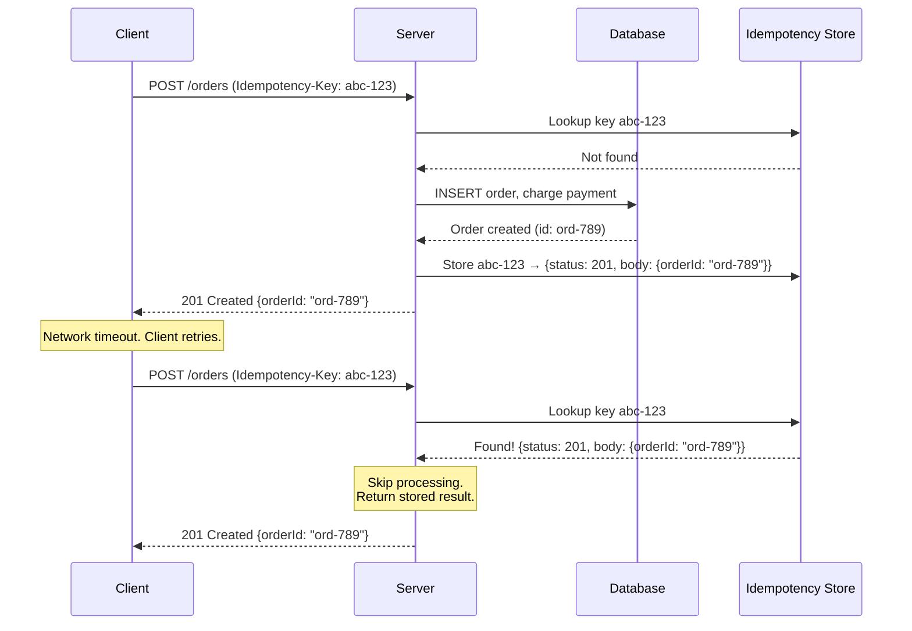
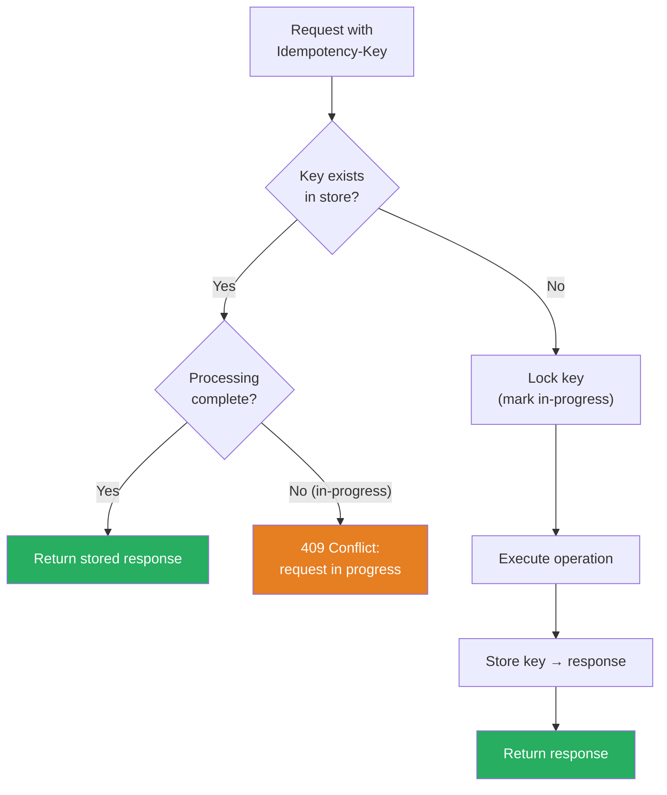

# Idempotency

## 1. The Problem

A user clicks "Place Order" on your checkout page. The request takes 3 seconds (slow payment provider). The user gets impatient and clicks again. Or their browser's JavaScript retries on a timeout. Or the load balancer retries on a 502.

```
User clicks → POST /orders → Payment charged $49.99 ✅
  Browser timeout (3.5s) → POST /orders (retry) → Payment charged $49.99 again ❌
```

The customer is charged twice. $49.99 becomes $99.98. Two orders are created. Two shipments go out. The customer calls support furious.

This happens constantly in production:
- **User double-clicks** the submit button.
- **Browser/client retries** on network timeout.
- **Load balancer retries** when the backend returns a 502.
- **Message queue redelivers** a message the consumer already processed but didn't acknowledge in time.

Every retry of a non-idempotent operation is a potential duplicate side effect.

---

## 2. Naïve Solutions (and Why They Fail)

### Attempt 1: Disable the Button

```html
<button onclick="this.disabled = true; submitOrder()">Place Order</button>
```

**Why it's insufficient:**
- Prevents UI double-clicks, but not network-level retries. The browser, a proxy, or a message queue can retry without any button click.
- JavaScript can be bypassed; mobile apps have their own retry logic.

### Attempt 2: Deduplication by Payload

```typescript
async function createOrder(req: Request) {
  const existing = await db.query(
    "SELECT * FROM orders WHERE user_id = ? AND total = ? AND created_at > NOW() - INTERVAL 1 MINUTE",
    [req.userId, req.total]
  );
  if (existing.length > 0) return existing[0]; // Duplicate!
}
```

**Why it's fragile:**
- Two legitimate orders for $49.99 within 1 minute? User orders two different products at the same price. Your dedup blocks the second legitimate order.
- Time-window dedup is a heuristic, not a guarantee. Off by one second at the boundary and it fails.
- Doesn't work for partial match — what if the items differ but total is the same?

### Attempt 3: Database Unique Constraint

```sql
ALTER TABLE orders ADD UNIQUE (user_id, product_id);
```

**Why it's too narrow:**
- A user can legitimately order the same product twice (gift + personal). This prevents valid orders.
- Unique constraints work for some cases (one vote per user per poll) but not generalizable to all operations.

---

## 3. The Insight

**Assign every mutation a unique idempotency key before it's submitted. The server stores the key with the result. On duplicate submission, the server returns the stored result without re-executing the operation. The operation happens exactly once, no matter how many times the request is sent.**

---

## 4. The Pattern

### Idempotency (via Idempotency Keys)

**Definition:** A request processing strategy where the client attaches a unique identifier (idempotency key) to each mutation. The server uses this key to detect duplicates: on the first request, it processes the operation and stores the key→result mapping. On subsequent requests with the same key, it returns the stored result without re-executing.

**Guarantees:**
- **At-most-once execution:** The side effect (payment charge, order creation) happens exactly once per idempotency key.
- **Safe retries:** The client can retry as many times as needed without causing duplicates.
- **Consistent response:** All retries receive the same response as the original request.

**Non-guarantees:**
- Does NOT prevent the first request from failing. If the operation fails before the result is stored, retries will re-execute it.
- Does NOT work retroactively. If the operation was already executed without an idempotency key, you can't recover.
- Does NOT handle different payloads with the same key — the server typically ignores the payload on retries and returns the stored result.

---

## 5. Mental Model

**A stamped receipt.** When you buy something, you get a receipt with a unique number. If you accidentally double-tap your card, the cashier checks the receipt number — "I already processed transaction #4821, here's your receipt." You don't get charged twice. The transaction number is the idempotency key.

---

## 6. Structure





---

## 7. Code Example

### TypeScript

```typescript
// ========== IDEMPOTENCY STORE ==========
interface StoredResponse {
  statusCode: number;
  body: unknown;
  completedAt: number;
}

interface IdempotencyEntry {
  key: string;
  status: "processing" | "complete";
  response?: StoredResponse;
  createdAt: number;
}

// In production: use Redis with TTL
const idempotencyStore = new Map<string, IdempotencyEntry>();

const IDEMPOTENCY_TTL_MS = 24 * 60 * 60 * 1000; // 24 hours

// ========== IDEMPOTENCY MIDDLEWARE ==========
async function withIdempotency(
  idempotencyKey: string,
  handler: () => Promise<{ statusCode: number; body: unknown }>
): Promise<{ statusCode: number; body: unknown }> {
  // Step 1: Check for existing entry
  const existing = idempotencyStore.get(idempotencyKey);

  if (existing) {
    if (existing.status === "processing") {
      // Another request with this key is currently being processed
      return { statusCode: 409, body: { error: "Request already in progress" } };
    }
    if (existing.status === "complete" && existing.response) {
      // Already processed — return the stored result
      console.log(`Idempotent hit: key=${idempotencyKey}`);
      return existing.response;
    }
  }

  // Step 2: Lock the key (mark as processing)
  idempotencyStore.set(idempotencyKey, {
    key: idempotencyKey,
    status: "processing",
    createdAt: Date.now(),
  });

  try {
    // Step 3: Execute the actual operation
    const response = await handler();

    // Step 4: Store the result
    idempotencyStore.set(idempotencyKey, {
      key: idempotencyKey,
      status: "complete",
      response: { ...response, completedAt: Date.now() },
      createdAt: Date.now(),
    });

    return response;
  } catch (error) {
    // Operation failed — remove the lock so retries can re-execute
    idempotencyStore.delete(idempotencyKey);
    throw error;
  }
}

// ========== ORDER CREATION WITH IDEMPOTENCY ==========
async function createOrder(req: Request): Promise<Response> {
  const idempotencyKey = req.headers.get("Idempotency-Key");
  if (!idempotencyKey) {
    return new Response(
      JSON.stringify({ error: "Idempotency-Key header required" }),
      { status: 400 }
    );
  }

  const result = await withIdempotency(idempotencyKey, async () => {
    const body = await req.json() as { userId: string; items: string[]; total: number };

    // This is the critical section — happens AT MOST ONCE per key
    const chargeId = await chargePayment(body.total);
    const orderId = await insertOrder(body.userId, body.items, chargeId);

    return {
      statusCode: 201,
      body: { orderId, chargeId, message: "Order created" },
    };
  });

  return new Response(JSON.stringify(result.body), {
    status: result.statusCode,
    headers: { "Content-Type": "application/json" },
  });
}

// Stubs
async function chargePayment(amount: number): Promise<string> {
  return `ch_${Math.random().toString(36).slice(2)}`;
}
async function insertOrder(userId: string, items: string[], chargeId: string): Promise<string> {
  return `ord_${Math.random().toString(36).slice(2)}`;
}
```

### Go

```go
package main

import (
	"encoding/json"
	"fmt"
	"net/http"
	"sync"
	"time"
)

// ========== IDEMPOTENCY STORE ==========
type StoredResponse struct {
	StatusCode int         `json:"statusCode"`
	Body       interface{} `json:"body"`
}

type IdempotencyEntry struct {
	Key         string
	Status      string // "processing" | "complete"
	Response    *StoredResponse
	CompletedAt time.Time
}

type IdempotencyStore struct {
	mu      sync.RWMutex
	entries map[string]*IdempotencyEntry
}

func NewIdempotencyStore() *IdempotencyStore {
	return &IdempotencyStore{entries: make(map[string]*IdempotencyEntry)}
}

// TryLock attempts to acquire the idempotency key.
// Returns (storedResponse, locked).
// If storedResponse != nil: already completed, return the stored result.
// If locked: key is now yours, proceed with processing.
func (s *IdempotencyStore) TryLock(key string) (*StoredResponse, bool) {
	s.mu.Lock()
	defer s.mu.Unlock()

	entry, exists := s.entries[key]
	if exists {
		if entry.Status == "complete" {
			return entry.Response, false
		}
		// Already processing — concurrent duplicate
		return &StoredResponse{StatusCode: 409, Body: map[string]string{
			"error": "Request already in progress",
		}}, false
	}

	// Lock the key
	s.entries[key] = &IdempotencyEntry{
		Key:    key,
		Status: "processing",
	}
	return nil, true
}

func (s *IdempotencyStore) Complete(key string, resp StoredResponse) {
	s.mu.Lock()
	defer s.mu.Unlock()
	s.entries[key] = &IdempotencyEntry{
		Key:         key,
		Status:      "complete",
		Response:    &resp,
		CompletedAt: time.Now(),
	}
}

func (s *IdempotencyStore) Unlock(key string) {
	s.mu.Lock()
	defer s.mu.Unlock()
	delete(s.entries, key)
}

// ========== ORDER HANDLER ==========
var store = NewIdempotencyStore()

func createOrderHandler(w http.ResponseWriter, r *http.Request) {
	key := r.Header.Get("Idempotency-Key")
	if key == "" {
		http.Error(w, `{"error":"Idempotency-Key header required"}`, http.StatusBadRequest)
		return
	}

	// Check idempotency store
	stored, locked := store.TryLock(key)
	if stored != nil {
		// Already processed or in-progress
		w.Header().Set("Content-Type", "application/json")
		w.WriteHeader(stored.StatusCode)
		json.NewEncoder(w).Encode(stored.Body)
		return
	}
	if !locked {
		http.Error(w, "Failed to acquire lock", http.StatusInternalServerError)
		return
	}

	// Process the order (at-most-once per key)
	var orderReq struct {
		UserID string   `json:"userId"`
		Items  []string `json:"items"`
		Total  float64  `json:"total"`
	}
	if err := json.NewDecoder(r.Body).Decode(&orderReq); err != nil {
		store.Unlock(key) // Release lock on failure
		http.Error(w, err.Error(), http.StatusBadRequest)
		return
	}

	// Simulate payment + order creation
	orderID := fmt.Sprintf("ord_%d", time.Now().UnixNano())
	chargeID := fmt.Sprintf("ch_%d", time.Now().UnixNano())

	result := StoredResponse{
		StatusCode: 201,
		Body: map[string]string{
			"orderId":  orderID,
			"chargeId": chargeID,
			"message":  "Order created",
		},
	}

	store.Complete(key, result)

	w.Header().Set("Content-Type", "application/json")
	w.WriteHeader(result.StatusCode)
	json.NewEncoder(w).Encode(result.Body)
}

func main() {
	http.HandleFunc("POST /orders", createOrderHandler)
	fmt.Println("Server on :8080")
	http.ListenAndServe(":8080", nil)
}
```

---

## 8. Gotchas & Beginner Mistakes

| Mistake | Why It Hurts |
|---|---|
| **Client generates non-unique keys** | Using `Math.random()` or a counter that resets. Use UUIDv4 or UUIDv7. Collisions cause one user to get another user's order response. |
| **Key stored after execution** | If the app crashes between "charge payment" and "store key," the retry re-charges. Store the key (status=processing) BEFORE executing. Complete it after. |
| **No TTL on stored keys** | Stored forever = infinite storage growth. Set a TTL (24-72 hours). After that, the same key could theoretically be reused — but retries that late are not realistic. |
| **Different payload, same key** | Client sends key "abc" with items [A,B], then retries with key "abc" and items [A,B,C]. Which payload wins? Most implementations return the stored result and ignore the new payload. Stripe explicitly returns an error if the payload differs. |
| **GET/PUT with idempotency keys** | GET is inherently idempotent (safe to repeat). PUT is idempotent by definition (same state after each call). Only POST/DELETE and non-idempotent operations need idempotency keys. |

---

## 9. Related & Confusable Patterns

| Pattern | How It Differs |
|---|---|
| **Retry with Backoff** | Retry is the mechanism; idempotency makes retry safe. Without idempotency, retry causes duplicates. Without retry, idempotency has no trigger. They are complementary. |
| **Exactly-Once Delivery** | A message/event processing guarantee. Implemented using idempotency: the message ID is the idempotency key. "Exactly-once" = "at-least-once delivery" + "idempotent processing." |
| **Deduplication** | Detecting and removing duplicate messages in a queue. Idempotency is broader: it prevents duplicate side effects from any source (HTTP, queue, cron). Dedup is one mechanism within idempotency. |
| **Optimistic Concurrency** | Uses version numbers to prevent conflicting updates. Related but different: idempotency prevents the same update from running twice; optimistic concurrency prevents two different updates from conflicting. |
| **Transactional Outbox** | Ensures an event is published exactly once alongside a DB write. Outbox solves "write + publish atomically"; idempotency solves "process request at-most-once." |

---

## 10. When This Pattern Is the WRONG Choice

- **Read operations** — GET requests are inherently idempotent. Adding idempotency keys to reads is unnecessary overhead.
- **Truly idempotent operations** — `PUT /user/123 { name: "Alice" }` produces the same state every time. If the operation is naturally idempotent by design, you don't need a key-based mechanism.
- **High-throughput event streams** — If you process 1 million events/second, storing an idempotency key per event in Redis adds significant latency and storage. Use log offsets (Kafka consumer offsets) for dedup instead.

**Symptoms you should reconsider:**
- You're adding idempotency keys to every endpoint, including GETs and status checks. Only mutations need them.
- The idempotency store is growing unbounded — you forgot TTLs. Add expiration.
- Clients complain about 409 Conflict — concurrent retries are too aggressive. Increase the processing lock timeout or queue retries.

**How to back out:** Remove the idempotency check middleware. Duplicates will re-occur if clients retry. If duplicates are acceptable (logging, analytics, metrics), the pattern was unnecessary. If duplicates cause real damage (double charges, duplicate shipments), the pattern is essential — keep it.
