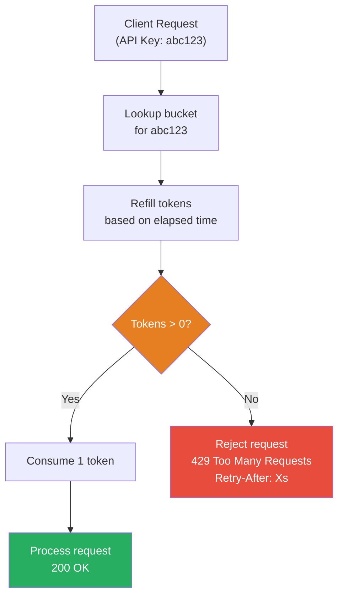
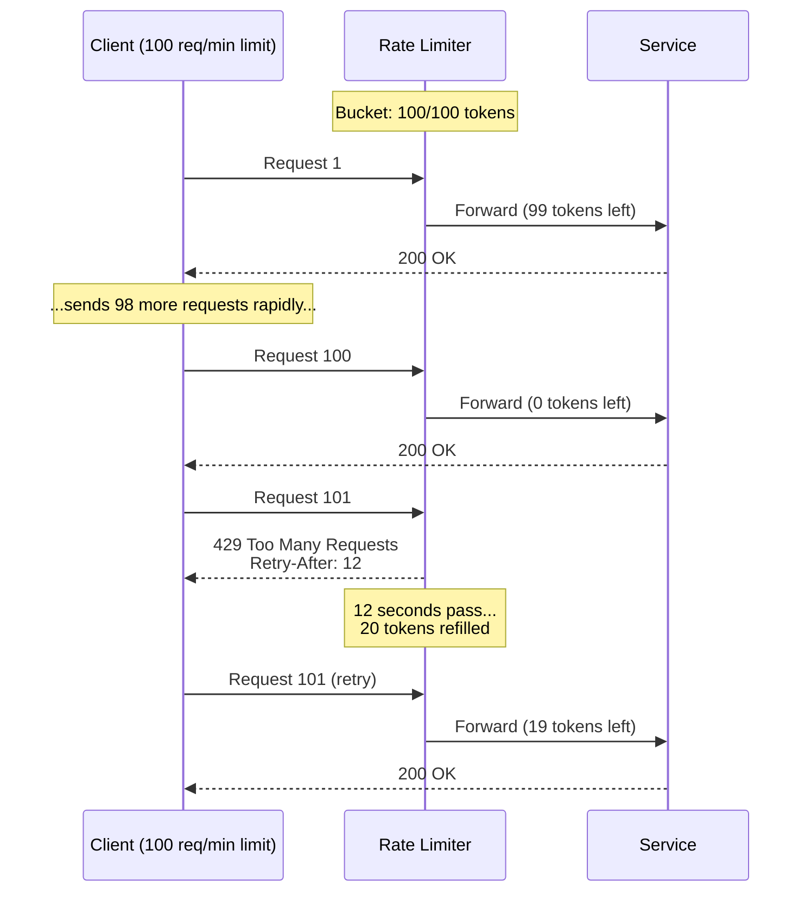

# Rate Limiter

## 1. The Problem

Your public API serves mobile apps and third-party integrations. On an average day, you handle 10,000 requests/second across all clients. Then a partner integrates your API into their application — but their code has a bug: an infinite loop that hammers your API with 50,000 requests/second from a single API key.

```
Normal traffic:     10,000 req/s (all clients combined)
Buggy client:      +50,000 req/s (one client's infinite loop)
Total:              60,000 req/s
Your capacity:      15,000 req/s
```

Your servers are overwhelmed. Response times spike from 50ms to 15 seconds. Legitimate customers see timeouts. The buggy client doesn't just break their own experience — they break everyone's.

Without any rate limiting, **one misbehaving client can deny service to all clients.** This is functionally a denial-of-service attack, even if unintentional.

---

## 2. Naïve Solutions (and Why They Fail)

### Attempt 1: Block the IP

```typescript
const BLOCKED_IPS = new Set(["192.168.1.100"]);

function handleRequest(req: Request) {
  if (BLOCKED_IPS.has(req.ip)) {
    return new Response("Blocked", { status: 403 });
  }
  // process normally
}
```

**Why it's reactive and fragile:**
- You have to manually identify the abuser and deploy a code change. By then, the outage has lasted 30 minutes.
- The client uses multiple IPs, a load balancer, or a cloud function with rotating IPs.
- Next time a different client misbehaves, you repeat the manual process.

### Attempt 2: Global Request Counter

```typescript
let requestCount = 0;
setInterval(() => { requestCount = 0; }, 1000); // Reset every second

function handleRequest(req: Request) {
  requestCount++;
  if (requestCount > 15000) {
    return new Response("Too Many Requests", { status: 429 });
  }
}
```

**Why it's unfair:**
- This limits total requests, not per-client requests. When the limit is hit, legitimate clients are rejected too — the one abuser's traffic counted toward the global limit.
- Also: race conditions with the counter across multiple server instances.

### Attempt 3: Per-Client Counter with Fixed Window

```typescript
const counts = new Map<string, number>();
setInterval(() => counts.clear(), 60000); // Reset every minute

function handleRequest(req: Request) {
  const key = req.headers.get("x-api-key")!;
  const count = (counts.get(key) ?? 0) + 1;
  counts.set(key, count);
  if (count > 100) {
    return new Response("Rate limit exceeded", { status: 429 });
  }
}
```

**Why it leaks:**
- **Boundary burst problem:** A client sends 100 requests at second 59, then 100 more at second 61. From the counter's perspective, each window has 100 (within limit), but in reality 200 requests arrived in 2 seconds.

---

## 3. The Insight

**Rate limiting is per-client, token-based, and continuous. Instead of counting requests in fixed windows, model each client as having a bucket of tokens that refills at a steady rate. Each request costs one token. If the bucket is empty, the request is rejected. This prevents bursts, is per-client fair, and works across distributed servers.**

---

## 4. The Pattern

### Rate Limiter (Token Bucket)

**Definition:** A mechanism that controls the rate at which clients can make requests by maintaining a virtual "token bucket" per client. Tokens are added at a fixed rate (the sustained rate) up to a maximum capacity (the burst limit). Each request consumes one token. When the bucket is empty, requests are rejected with `429 Too Many Requests`.

**Guarantees:**
- Per-client fairness: one abuser can't exhaust the rate limit for others.
- Burst tolerance: the bucket capacity allows short bursts above the sustained rate.
- Steady-state convergence: over time, the client's average rate converges to the refill rate.

**Non-guarantees:**
- Does NOT prevent distributed denial-of-service attacks (many different clients flooding).
- Does NOT prioritize requests — all are equal; no "important" requests skip the limit.
- Does NOT scale across multiple servers automatically — requires a shared store (Redis) or coordination.

---

## 5. Mental Model

**A turnstile at a subway station.** The turnstile lets one person through per swipe. During rush hour, people queue up — but the turnstile doesn't speed up. If you have a multi-ride pass (token bucket), you can swipe multiple times quickly (burst), but once your pass is depleted, you wait for a refill window.

---

## 6. Structure





---

## 7. Code Example

### TypeScript

```typescript
// ========== TOKEN BUCKET ==========
interface BucketConfig {
  maxTokens: number;     // Burst capacity
  refillRate: number;    // Tokens per second
}

class TokenBucket {
  private tokens: number;
  private lastRefill: number;

  constructor(
    private readonly config: BucketConfig
  ) {
    this.tokens = config.maxTokens;
    this.lastRefill = Date.now();
  }

  tryConsume(): { allowed: boolean; retryAfterMs?: number } {
    this.refill();

    if (this.tokens >= 1) {
      this.tokens -= 1;
      return { allowed: true };
    }

    // How long until 1 token is available?
    const retryAfterMs = Math.ceil(1000 / this.config.refillRate);
    return { allowed: false, retryAfterMs };
  }

  private refill() {
    const now = Date.now();
    const elapsed = (now - this.lastRefill) / 1000;
    const newTokens = elapsed * this.config.refillRate;

    this.tokens = Math.min(
      this.config.maxTokens,
      this.tokens + newTokens
    );
    this.lastRefill = now;
  }
}

// ========== RATE LIMITER MIDDLEWARE ==========
const TIER_LIMITS: Record<string, BucketConfig> = {
  free:       { maxTokens: 10,  refillRate: 1 },    // 1 req/s, burst 10
  pro:        { maxTokens: 100, refillRate: 10 },   // 10 req/s, burst 100
  enterprise: { maxTokens: 500, refillRate: 50 },   // 50 req/s, burst 500
};

const buckets = new Map<string, TokenBucket>();

function getBucket(apiKey: string, tier: string): TokenBucket {
  if (!buckets.has(apiKey)) {
    const config = TIER_LIMITS[tier] ?? TIER_LIMITS.free;
    buckets.set(apiKey, new TokenBucket(config));
  }
  return buckets.get(apiKey)!;
}

function rateLimitMiddleware(
  req: Request,
  tier: string
): Response | null {
  const apiKey = req.headers.get("x-api-key");
  if (!apiKey) {
    return new Response("Missing API key", { status: 401 });
  }

  const bucket = getBucket(apiKey, tier);
  const result = bucket.tryConsume();

  if (!result.allowed) {
    return new Response("Rate limit exceeded", {
      status: 429,
      headers: {
        "Retry-After": String(Math.ceil(result.retryAfterMs! / 1000)),
        "X-RateLimit-Limit": String(TIER_LIMITS[tier]?.maxTokens ?? 10),
        "X-RateLimit-Remaining": "0",
      },
    });
  }

  return null; // Proceed to handler
}

// ========== USAGE ==========
async function handleApiRequest(req: Request): Promise<Response> {
  const rejection = rateLimitMiddleware(req, "pro");
  if (rejection) return rejection;

  // Actual API logic
  return new Response(JSON.stringify({ data: "Hello!" }), {
    headers: { "Content-Type": "application/json" },
  });
}
```

### Go

```go
package main

import (
	"fmt"
	"math"
	"net/http"
	"strconv"
	"sync"
	"time"
)

// ========== TOKEN BUCKET ==========
type TokenBucket struct {
	mu         sync.Mutex
	tokens     float64
	maxTokens  float64
	refillRate float64 // tokens per second
	lastRefill time.Time
}

func NewTokenBucket(maxTokens, refillRate float64) *TokenBucket {
	return &TokenBucket{
		tokens:     maxTokens,
		maxTokens:  maxTokens,
		refillRate: refillRate,
		lastRefill: time.Now(),
	}
}

func (b *TokenBucket) TryConsume() (allowed bool, retryAfter time.Duration) {
	b.mu.Lock()
	defer b.mu.Unlock()

	b.refill()

	if b.tokens >= 1 {
		b.tokens--
		return true, 0
	}

	retryAfter = time.Duration(math.Ceil(1.0/b.refillRate*1000)) * time.Millisecond
	return false, retryAfter
}

func (b *TokenBucket) refill() {
	now := time.Now()
	elapsed := now.Sub(b.lastRefill).Seconds()
	b.tokens = math.Min(b.maxTokens, b.tokens+elapsed*b.refillRate)
	b.lastRefill = now
}

// ========== RATE LIMITER ==========
type TierConfig struct {
	MaxTokens  float64
	RefillRate float64
}

var tiers = map[string]TierConfig{
	"free":       {MaxTokens: 10, RefillRate: 1},
	"pro":        {MaxTokens: 100, RefillRate: 10},
	"enterprise": {MaxTokens: 500, RefillRate: 50},
}

type RateLimiter struct {
	mu      sync.RWMutex
	buckets map[string]*TokenBucket
}

func NewRateLimiter() *RateLimiter {
	return &RateLimiter{
		buckets: make(map[string]*TokenBucket),
	}
}

func (rl *RateLimiter) GetBucket(apiKey, tier string) *TokenBucket {
	rl.mu.RLock()
	bucket, ok := rl.buckets[apiKey]
	rl.mu.RUnlock()
	if ok {
		return bucket
	}

	rl.mu.Lock()
	defer rl.mu.Unlock()

	// Double-check after acquiring write lock
	if bucket, ok := rl.buckets[apiKey]; ok {
		return bucket
	}

	cfg := tiers[tier]
	if cfg.MaxTokens == 0 {
		cfg = tiers["free"]
	}
	bucket = NewTokenBucket(cfg.MaxTokens, cfg.RefillRate)
	rl.buckets[apiKey] = bucket
	return bucket
}

// ========== HTTP MIDDLEWARE ==========
func RateLimitMiddleware(limiter *RateLimiter, next http.Handler) http.Handler {
	return http.HandlerFunc(func(w http.ResponseWriter, r *http.Request) {
		apiKey := r.Header.Get("X-API-Key")
		if apiKey == "" {
			http.Error(w, "Missing API key", http.StatusUnauthorized)
			return
		}

		tier := "free" // Look up from DB in production
		bucket := limiter.GetBucket(apiKey, tier)
		allowed, retryAfter := bucket.TryConsume()

		if !allowed {
			w.Header().Set("Retry-After", strconv.Itoa(int(retryAfter.Seconds())+1))
			w.Header().Set("X-RateLimit-Remaining", "0")
			http.Error(w, "Rate limit exceeded", http.StatusTooManyRequests)
			return
		}

		next.ServeHTTP(w, r)
	})
}

func main() {
	limiter := NewRateLimiter()

	handler := http.HandlerFunc(func(w http.ResponseWriter, r *http.Request) {
		fmt.Fprintf(w, `{"data": "Hello!"}`)
	})

	http.Handle("/api/", RateLimitMiddleware(limiter, handler))
	fmt.Println("Server on :8080")
	http.ListenAndServe(":8080", nil)
}
```

---

## 8. Gotchas & Beginner Mistakes

| Mistake | Why It Hurts |
|---|---|
| **In-memory buckets, multiple servers** | Each server has its own bucket map. A client hitting 4 servers gets 4× the rate limit. Use Redis for shared state, or sticky sessions. |
| **Missing `Retry-After` header** | Without `Retry-After`, well-behaved clients don't know when to retry. They either retry immediately (making things worse) or give up. Always include the header on 429 responses. |
| **Rate limiting by IP only** | Multiple users behind a corporate NAT share one IP. One user's activity exhausts the limit for the entire office. Rate limit by API key or user ID. |
| **Same limit for all operations** | GET /products (cheap) and POST /reports (runs for 30 seconds) have the same rate limit. Heavy operations should have lower limits than lightweight reads. |
| **No monitoring** | Without tracking 429 response rates per client, you don't know if legitimate clients are being rate limited. Alert when a good client hits limits consistently. |

---

## 9. Related & Confusable Patterns

| Pattern | How It Differs |
|---|---|
| **Bulkhead** | Limits concurrent in-flight requests. Rate limiter limits requests per time window. Bulkhead: "only 100 simultaneous." Rate limiter: "only 100 per second." |
| **Circuit Breaker** | Stops calling a failing dependency. Rate limiter controls incoming traffic. Circuit breaker protects the caller from a bad downstream; rate limiter protects the service from bad callers. |
| **Throttling** | Often used interchangeably with rate limiting. Technically, throttling slows down processing (queuing excess requests); rate limiting rejects them outright. |
| **Load Shedding** | Drops requests when the server is overloaded regardless of per-client limits. Rate limiter is per-client fairness; load shedding is server self-protection. They complement each other. |
| **Leaky Bucket** | Another rate-limiting algorithm. Token bucket allows bursts up to capacity; leaky bucket enforces a constant outflow rate (no bursts). Token bucket is more common in API rate limiting. |

---

## 10. When This Pattern Is the WRONG Choice

- **Internal service-to-service calls** — If you control both caller and callee, rate limiting adds latency without benefit. Use bulkheads and circuit breakers instead. (Exception: multi-tenant platforms where internal services serve different customers.)
- **Real-time streaming** — WebSocket connections sending regular updates shouldn't be rate-limited per message. Rate-limit the connection establishment, not individual frames.
- **Batch/ETL workloads** — Data pipelines processing millions of records need throughput, not per-second limits. Use queue-based flow control instead.

**Symptoms you should reconsider:**
- Legitimate clients are constantly hitting limits — your limits are too low. Measure actual usage patterns before setting limits.
- You're increasing limits for every client who asks — there's no real limit being enforced. Either set meaningful limits or remove the rate limiter.
- Rate limiting is your only defense — it doesn't help with DDoS from diverse sources. You need infrastructure-level protection (WAF, CDN, IP filtering) for that.

**How to back out:** Remove the rate limiter middleware. Monitor for traffic spikes and server overload. If a single client can take down your service, you need rate limiting.
