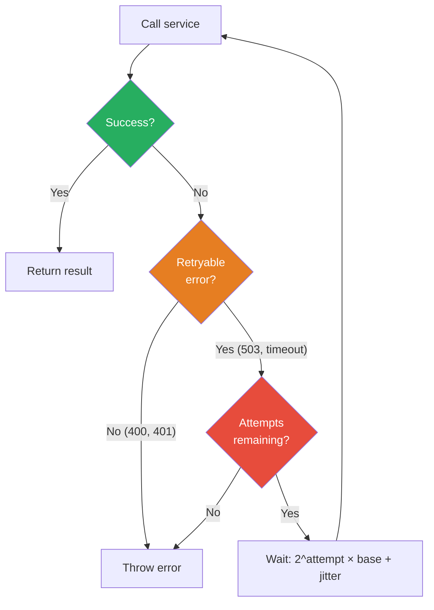
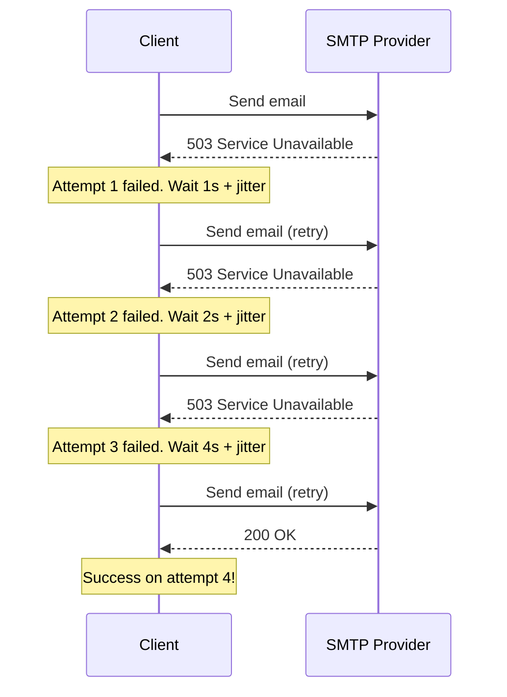

# Retry with Backoff

## 1. The Problem

Your service sends email notifications via an external SMTP provider. Occasionally the provider returns transient errors — `503 Service Unavailable`, connection resets, DNS hiccups. These failures are temporary: if you try again in a second, it works.

```typescript
async function sendEmail(to: string, subject: string, body: string) {
  const response = await fetch("https://smtp-provider.com/send", {
    method: "POST",
    body: JSON.stringify({ to, subject, body }),
  });
  if (!response.ok) throw new Error(`Email failed: ${response.status}`);
}
```

A user signs up and the welcome email fails. The user never gets it. They can't verify their account. They leave forever.

**Naive fix: retry immediately.**

```typescript
async function sendEmail(to: string, subject: string, body: string) {
  for (let i = 0; i < 5; i++) {
    try {
      await callSmtpProvider(to, subject, body);
      return;
    } catch {
      // Retry immediately
    }
  }
  throw new Error("Email failed after 5 retries");
}
```

This works for occasional errors. But when the SMTP provider is overloaded (returning 503), your 50 email-sending workers all retry immediately — 5 times each. That's 250 requests in the same second. The provider, already struggling, gets hammered harder. It takes longer to recover. Other customers' emails are delayed.

**You're making the outage worse by retrying aggressively.**

---

## 2. Naïve Solutions (and Why They Fail)

### Attempt 1: Fixed Delay Retry

```typescript
await sleep(1000); // Wait 1 second between retries
```

**Why it's suboptimal:**
- All 50 workers retry at the same time (after exactly 1 second). This creates "thundering herd" — a synchronized burst every second.
- The delay doesn't increase. If the provider needs 30 seconds to recover, you'll hammer it 30 times before backing off.

### Attempt 2: Retry Everything

```typescript
try { await chargePayment(); }
catch { await retry(chargePayment); }
```

**Why it's dangerous:**
- Retrying a non-idempotent operation (payment charge) can charge the customer twice.
- Only transient errors should be retried (503, timeout, connection reset). A `400 Bad Request` will fail every time — retrying is pointless.

### Attempt 3: Infinite Retries

```typescript
while (true) {
  try { return await sendEmail(to, subject, body); }
  catch { await sleep(1000); }
}
```

**Why it breaks:**
- If the error is permanent (invalid email address, authentication revoked), this loops forever.
- No upper bound → resource leak. Goroutines/threads accumulate.
- No visibility — how do you know 10,000 emails are stuck in retry loops?

---

## 3. The Insight

**Space out retries with increasing delays (exponential backoff), add randomness (jitter) to prevent thundering herd, and cap the maximum number of attempts. Only retry idempotent operations on transient errors.**

---

## 4. The Pattern

### Retry with Exponential Backoff and Jitter

**Definition:** A resilience technique that retries failed operations with **exponentially increasing delays** between attempts (1s, 2s, 4s, 8s...) plus **random jitter** to decorrelate retries across multiple callers. The retry stops after a maximum number of attempts or when a non-transient error is detected.

**Guarantees:**
- Transient failures are automatically recovered without human intervention.
- Back-pressure on failing services (retries are spaced, not piled).
- Jitter prevents thundering herd (synchronized retry storms).

**Non-guarantees:**
- Does NOT make non-transient errors succeed (400, 401, 404 won't magically work).
- Does NOT guarantee eventual success — the service may be down longer than the retry window.
- Does NOT provide idempotency — the caller must ensure operations are safe to retry.

---

## 5. Mental Model

**Redialing a busy phone line.** The first time, you wait 5 seconds. Still busy? Wait 30 seconds. Still busy? Wait 2 minutes. And you randomize slightly — not exactly 2 minutes, but somewhere between 1.5 and 2.5 minutes — so you and everyone else calling aren't all redialing at the same instant.

---

## 6. Structure





---

## 7. Code Example

### TypeScript

```typescript
// ========== RETRY CONFIGURATION ==========
interface RetryOptions {
  maxAttempts: number;
  baseDelayMs: number;
  maxDelayMs: number;
  jitterMs: number;
  retryableErrors?: (error: Error) => boolean;
}

const DEFAULT_RETRY: RetryOptions = {
  maxAttempts: 5,
  baseDelayMs: 1000,
  maxDelayMs: 30000,
  jitterMs: 500,
};

// ========== RETRY WITH EXPONENTIAL BACKOFF ==========
async function withRetry<T>(
  fn: () => Promise<T>,
  options: Partial<RetryOptions> = {}
): Promise<T> {
  const opts = { ...DEFAULT_RETRY, ...options };
  let lastError: Error | undefined;

  for (let attempt = 0; attempt < opts.maxAttempts; attempt++) {
    try {
      return await fn();
    } catch (error) {
      lastError = error as Error;

      // Don't retry non-transient errors
      if (opts.retryableErrors && !opts.retryableErrors(lastError)) {
        throw lastError;
      }

      if (attempt < opts.maxAttempts - 1) {
        const delay = calculateDelay(attempt, opts);
        console.log(
          `Attempt ${attempt + 1}/${opts.maxAttempts} failed: ${lastError.message}. ` +
          `Retrying in ${delay}ms`
        );
        await sleep(delay);
      }
    }
  }

  throw new Error(
    `Failed after ${opts.maxAttempts} attempts: ${lastError?.message}`
  );
}

function calculateDelay(attempt: number, opts: RetryOptions): number {
  // Exponential: 1s, 2s, 4s, 8s, 16s...
  const exponential = opts.baseDelayMs * Math.pow(2, attempt);
  // Cap at max delay
  const capped = Math.min(exponential, opts.maxDelayMs);
  // Add random jitter to prevent thundering herd
  const jitter = Math.random() * opts.jitterMs;
  return capped + jitter;
}

function sleep(ms: number): Promise<void> {
  return new Promise((r) => setTimeout(r, ms));
}

// ========== TRANSIENT ERROR DETECTION ==========
function isTransient(error: Error): boolean {
  const message = error.message.toLowerCase();
  // HTTP status codes
  if (message.includes("503") || message.includes("429") || message.includes("502")) {
    return true;
  }
  // Network errors
  if (message.includes("econnrefused") || message.includes("timeout") ||
      message.includes("econnreset") || message.includes("dns")) {
    return true;
  }
  return false;
}

// ========== USAGE ==========
async function sendWelcomeEmail(userId: string) {
  return withRetry(
    async () => {
      const response = await fetch("https://smtp.example.com/send", {
        method: "POST",
        body: JSON.stringify({
          to: userId,
          subject: "Welcome!",
          body: "Thanks for signing up.",
        }),
        signal: AbortSignal.timeout(5000),
      });
      if (!response.ok) {
        throw new Error(`SMTP error: ${response.status}`);
      }
      return response.json();
    },
    {
      maxAttempts: 4,
      baseDelayMs: 1000,
      retryableErrors: isTransient,
    }
  );
}
```

### Go

```go
package main

import (
	"errors"
	"fmt"
	"math"
	"math/rand"
	"net/http"
	"time"
)

type RetryConfig struct {
	MaxAttempts int
	BaseDelay   time.Duration
	MaxDelay    time.Duration
	Jitter      time.Duration
	IsRetryable func(error) bool
}

var DefaultRetry = RetryConfig{
	MaxAttempts: 5,
	BaseDelay:   1 * time.Second,
	MaxDelay:    30 * time.Second,
	Jitter:      500 * time.Millisecond,
	IsRetryable: func(err error) bool { return true },
}

func WithRetry[T any](fn func() (T, error), cfg RetryConfig) (T, error) {
	var lastErr error
	var zero T

	for attempt := 0; attempt < cfg.MaxAttempts; attempt++ {
		result, err := fn()
		if err == nil {
			return result, nil
		}

		lastErr = err

		if !cfg.IsRetryable(err) {
			return zero, fmt.Errorf("non-retryable error: %w", err)
		}

		if attempt < cfg.MaxAttempts-1 {
			delay := calculateDelay(attempt, cfg)
			fmt.Printf("Attempt %d/%d failed: %v. Retrying in %v\n",
				attempt+1, cfg.MaxAttempts, err, delay)
			time.Sleep(delay)
		}
	}

	return zero, fmt.Errorf("failed after %d attempts: %w", cfg.MaxAttempts, lastErr)
}

func calculateDelay(attempt int, cfg RetryConfig) time.Duration {
	exponential := time.Duration(float64(cfg.BaseDelay) * math.Pow(2, float64(attempt)))
	if exponential > cfg.MaxDelay {
		exponential = cfg.MaxDelay
	}
	jitter := time.Duration(rand.Int63n(int64(cfg.Jitter)))
	return exponential + jitter
}

// ========== HTTP-SPECIFIC RETRY ==========
var ErrTransient = errors.New("transient error")
var ErrPermanent = errors.New("permanent error")

func isHTTPRetryable(err error) bool {
	return !errors.Is(err, ErrPermanent)
}

func fetchWithRetry(url string) (*http.Response, error) {
	return WithRetry(func() (*http.Response, error) {
		resp, err := http.Get(url)
		if err != nil {
			return nil, fmt.Errorf("%w: %v", ErrTransient, err)
		}

		switch {
		case resp.StatusCode == 200:
			return resp, nil
		case resp.StatusCode == 503, resp.StatusCode == 429, resp.StatusCode == 502:
			resp.Body.Close()
			return nil, fmt.Errorf("%w: HTTP %d", ErrTransient, resp.StatusCode)
		default:
			resp.Body.Close()
			return nil, fmt.Errorf("%w: HTTP %d", ErrPermanent, resp.StatusCode)
		}
	}, RetryConfig{
		MaxAttempts: 4,
		BaseDelay:   1 * time.Second,
		MaxDelay:    15 * time.Second,
		Jitter:      500 * time.Millisecond,
		IsRetryable: isHTTPRetryable,
	})
}

func main() {
	attempt := 0
	result, err := WithRetry(func() (string, error) {
		attempt++
		if attempt < 3 {
			return "", fmt.Errorf("service unavailable")
		}
		return "email sent!", nil
	}, DefaultRetry)

	if err != nil {
		fmt.Println("Final error:", err)
	} else {
		fmt.Println("Result:", result)
	}
}
```

---

## 8. Gotchas & Beginner Mistakes

| Mistake | Why It Hurts |
|---|---|
| **Retrying non-idempotent operations** | POST /charge retried = double charge. Only retry operations that are safe to repeat (GET, PUT with same data, or operations with idempotency keys). |
| **No jitter** | 1000 clients all retry at exactly 1s, 2s, 4s. The server gets a synchronized burst every power-of-two seconds. Add randomized jitter. |
| **Retrying 400/401/404** | These are permanent errors. No amount of retrying will fix bad input, expired auth, or missing resources. Only retry 5xx and network errors. |
| **No max delay cap** | Exponential backoff without a cap: 1s, 2s, 4s, 8s, 16s, 32s, 64s, 128s, 256s... Attempt 9 waits 4+ minutes. Cap at a reasonable maximum (30s). |
| **No circuit breaker** | Retrying forever without a circuit breaker means you never stop hitting a dead service. Combine retry with circuit breaker. |

---

## 9. Related & Confusable Patterns

| Pattern | How It Differs |
|---|---|
| **Circuit Breaker** | Stops making calls after repeated failures. Retry keeps trying on each call independently. Use together: retry within a circuit breaker. |
| **Timeout** | Limits a single call's duration. Retry governs how many times to call. Timeout + Retry: each attempt has a timeout, and failures trigger retry. |
| **Idempotency** | Makes operations safe to retry. Without idempotency, retry can cause duplicate effects. Idempotency enables retry. |
| **Dead Letter Queue** | When retries are exhausted, the message goes to a DLQ for manual inspection. DLQ is the fallback when retry fails. |
| **Polling** | Repeatedly checking for a change (is the job done yet?). Not error recovery — it's a different use case for repeated calls. |

---

## 10. When This Pattern Is the WRONG Choice

- **Non-idempotent operations without idempotency keys** — Retrying `POST /orders` without an idempotency key creates duplicate orders. Add idempotency before adding retry.
- **Permanent errors** — `401 Unauthorized`, `403 Forbidden`, `404 Not Found`. These won't fix themselves. Retry wastes time and resources.
- **Real-time requirements** — If the response is needed within 100ms, retry with exponential backoff (which might wait 4 seconds) violates the SLA. Fail fast instead.
- **Downstream at capacity** — If the service is rate-limiting you (429), exponential backoff helps, but also check the `Retry-After` header and respect it. Don't blindly retry.

**Symptoms you should reconsider:**
- Retries consistently exhaust all attempts (the service isn't transiently failing — it's broken).
- You're retrying sync user-facing calls but the user has already left after 10 seconds of waiting.
- Retry masks real bugs (a configuration error causes 503, but retry makes it "work" on the 3rd try by luck).

**How to back out:** Remove retry and return errors immediately. If the operation is critical, move to async processing (queue the work for background retry). If the downstream is truly unreliable, fix the downstream service.
