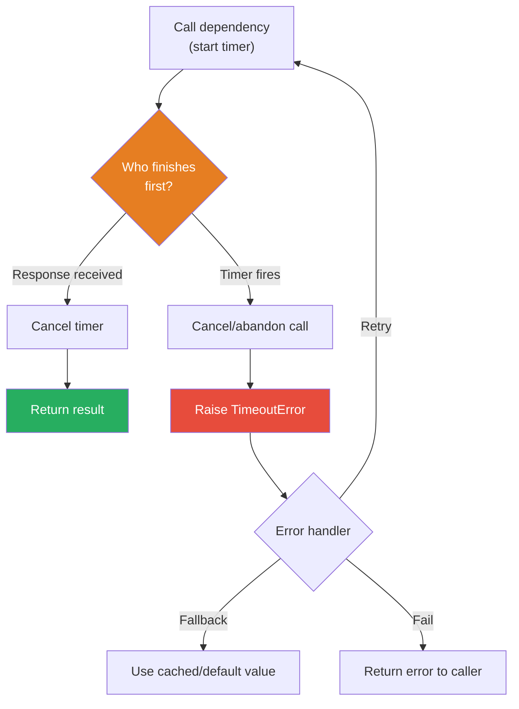
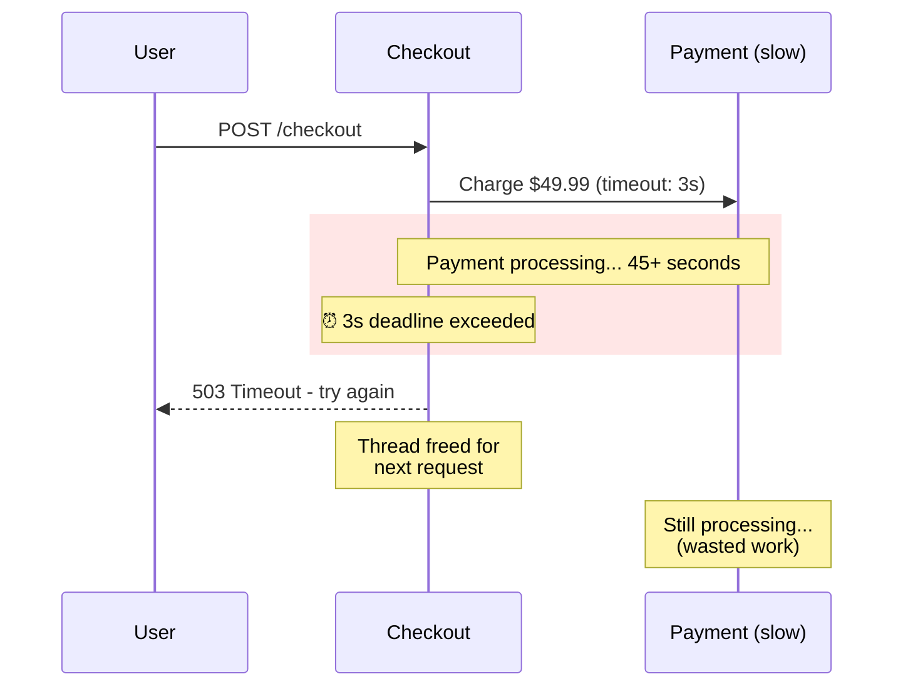

# Timeout

## 1. The Problem

Your e-commerce checkout service calls downstream services: inventory check, payment processing, shipping cost estimation. Each is a separate HTTP call. On a normal day, every call returns in 50-200ms.

Then the payment service starts having issues. Not failing outright — just getting slow. Responses that used to take 100ms now take 45 seconds. Your checkout service waits patiently for each one.

```typescript
async function checkout(cart: Cart): Promise<Order> {
  const inventory = await checkInventory(cart.items);     // 100ms
  const payment = await chargePayment(cart.total);        // 45,000ms... waiting...
  const shipping = await calculateShipping(cart.address); // never reached
  return createOrder(inventory, payment, shipping);
}
```

Your checkout handler holds an open connection for 45 seconds. Your HTTP server has a connection pool of 200 threads. Each stuck waiting on the payment service. In 4 seconds, all 200 threads are occupied. **No new checkout requests can be served.** The site is down.

The payment service isn't "failing" — it's just slow. But slow is worse than down, because slow spreads.

---

## 2. Naïve Solutions (and Why They Fail)

### Attempt 1: Very Long Timeout

```typescript
const response = await fetch(url, { signal: AbortSignal.timeout(60000) });
```

**Why it's suboptimal:**
- 60 seconds is an eternity for a user staring at a checkout screen. They've refreshed, submitted again, maybe left. You're holding resources for a user who is already gone.
- Each stuck request holds a thread/goroutine, a database connection, and client bandwidth. Multiply by thousands of concurrent users.

### Attempt 2: No Timeout (Language/Library Default)

```typescript
const response = await fetch(url); // No timeout specified
```

**Why it's dangerous:**
- Many HTTP libraries have no default timeout or extremely long ones (Go's `http.Client`: no timeout. Node's `fetch`: no timeout). A single slow dependency ties up your service indefinitely.
- "But the OS has a TCP timeout!" — Yes, typically 2 minutes. Two minutes per request is catastrophic in a microservice architecture.

### Attempt 3: Timeout on the Outer Call Only

```typescript
async function checkout(cart: Cart): Promise<Order> {
  return withTimeout(async () => {
    await checkInventory(cart.items);
    await chargePayment(cart.total);  // Still blocks 45s internally
    await calculateShipping(cart.address);
  }, 5000);
}
```

**Why it's incomplete:**
- The inner HTTP call to payment service still runs for 45 seconds server-side (you abandoned it, but the request is still pending).
- You timed out, but the payment might still be processing. Did the charge go through? Now you need idempotency too.

---

## 3. The Insight

**Every call that crosses a process boundary must have an explicit timeout. Set timeouts individually per dependency based on measured P99 latency, not arbitrary large numbers. Propagate cancellation so abandoned work actually stops.**

---

## 4. The Pattern

### Timeout

**Definition:** A resilience mechanism that limits the maximum time a caller will wait for a response from a dependency. If the deadline elapses, the call is abandoned and an error is raised, freeing the caller's resources for other work.

**Guarantees:**
- Bounded latency: the caller never waits longer than the timeout, regardless of dependency behavior.
- Resource reclamation: stuck threads/goroutines are freed when the timeout fires.
- Cascading failure prevention: one slow dependency can't consume all caller resources.

**Non-guarantees:**
- Does NOT cancel work on the server side (unless using context propagation or the protocol supports cancellation).
- Does NOT guarantee the operation didn't succeed — a timeout means "we don't know." The payment may have been charged.
- Does NOT handle what to do after the timeout — you still need retry, fallback, or error handling.

---

## 5. Mental Model

**An hourglass on a board game turn.** You get 30 seconds. If you haven't made your move, the turn is forfeited. You don't get to think for 10 minutes holding up the entire game. The hourglass protects from a slow player blocking everyone else.

---

## 6. Structure





---

## 7. Code Example

### TypeScript

```typescript
// ========== TIMEOUT UTILITY ==========
class TimeoutError extends Error {
  constructor(public readonly durationMs: number) {
    super(`Operation timed out after ${durationMs}ms`);
    this.name = "TimeoutError";
  }
}

async function withTimeout<T>(
  fn: () => Promise<T>,
  timeoutMs: number
): Promise<T> {
  const controller = new AbortController();

  const timeoutId = setTimeout(() => controller.abort(), timeoutMs);

  try {
    const result = await fn();
    return result;
  } finally {
    clearTimeout(timeoutId);
  }
}

// ========== PER-DEPENDENCY TIMEOUTS ==========
interface ServiceConfig {
  baseUrl: string;
  timeoutMs: number; // Derived from measured P99 + margin
}

const SERVICES: Record<string, ServiceConfig> = {
  inventory: { baseUrl: "http://inventory:8080", timeoutMs: 500 },
  payment:   { baseUrl: "http://payment:8080",   timeoutMs: 3000 },
  shipping:  { baseUrl: "http://shipping:8080",  timeoutMs: 1000 },
};

async function callService<T>(
  service: keyof typeof SERVICES,
  path: string,
  body: unknown
): Promise<T> {
  const config = SERVICES[service];
  const response = await fetch(`${config.baseUrl}${path}`, {
    method: "POST",
    headers: { "Content-Type": "application/json" },
    body: JSON.stringify(body),
    signal: AbortSignal.timeout(config.timeoutMs),
  });

  if (!response.ok) {
    throw new Error(`${service} returned ${response.status}`);
  }

  return response.json() as T;
}

// ========== CHECKOUT WITH PROPER TIMEOUTS ==========
async function checkout(cart: Cart): Promise<Order> {
  // Each dependency has an independent timeout
  const inventory = await callService<InventoryResult>(
    "inventory", "/check", { items: cart.items }
  );

  if (!inventory.available) {
    throw new Error("Items out of stock");
  }

  // Overall checkout timeout wrapping all calls
  return withTimeout(async () => {
    const payment = await callService<PaymentResult>(
      "payment", "/charge", { amount: cart.total, idempotencyKey: cart.id }
    );

    const shipping = await callService<ShippingResult>(
      "shipping", "/calculate", { address: cart.address, weight: cart.weight }
    );

    return { orderId: crypto.randomUUID(), payment, shipping };
  }, 5000); // Total checkout must complete in 5 seconds
}

interface Cart { id: string; items: string[]; total: number; address: string; weight: number; }
interface InventoryResult { available: boolean; }
interface PaymentResult { chargeId: string; }
interface ShippingResult { cost: number; estimatedDays: number; }
interface Order { orderId: string; payment: PaymentResult; shipping: ShippingResult; }
```

### Go

```go
package main

import (
	"context"
	"encoding/json"
	"fmt"
	"net/http"
	"time"
)

// ========== PER-DEPENDENCY TIMEOUT ==========
type ServiceConfig struct {
	BaseURL string
	Timeout time.Duration
}

var services = map[string]ServiceConfig{
	"inventory": {BaseURL: "http://inventory:8080", Timeout: 500 * time.Millisecond},
	"payment":   {BaseURL: "http://payment:8080", Timeout: 3 * time.Second},
	"shipping":  {BaseURL: "http://shipping:8080", Timeout: 1 * time.Second},
}

// CallService makes an HTTP call with context-based timeout.
// The context carries the deadline — if the parent context has a
// shorter deadline, that one wins.
func CallService[T any](ctx context.Context, service, path string) (T, error) {
	var zero T
	cfg, ok := services[service]
	if !ok {
		return zero, fmt.Errorf("unknown service: %s", service)
	}

	// Derive a child context with this service's specific timeout.
	// If ctx already has a shorter deadline, that takes precedence.
	ctx, cancel := context.WithTimeout(ctx, cfg.Timeout)
	defer cancel()

	req, err := http.NewRequestWithContext(ctx, http.MethodGet, cfg.BaseURL+path, nil)
	if err != nil {
		return zero, fmt.Errorf("creating request: %w", err)
	}

	resp, err := http.DefaultClient.Do(req)
	if err != nil {
		// context.DeadlineExceeded means we timed out
		if ctx.Err() == context.DeadlineExceeded {
			return zero, fmt.Errorf("%s timed out after %v", service, cfg.Timeout)
		}
		return zero, fmt.Errorf("%s call failed: %w", service, err)
	}
	defer resp.Body.Close()

	if resp.StatusCode != http.StatusOK {
		return zero, fmt.Errorf("%s returned HTTP %d", service, resp.StatusCode)
	}

	var result T
	if err := json.NewDecoder(resp.Body).Decode(&result); err != nil {
		return zero, fmt.Errorf("decoding %s response: %w", service, err)
	}
	return result, nil
}

// ========== CHECKOUT HANDLER ==========
type InventoryResult struct {
	Available bool `json:"available"`
}

type PaymentResult struct {
	ChargeID string `json:"chargeId"`
}

func checkoutHandler(w http.ResponseWriter, r *http.Request) {
	// Overall request deadline: 5 seconds for the entire checkout
	ctx, cancel := context.WithTimeout(r.Context(), 5*time.Second)
	defer cancel()

	// Each call gets its own per-service timeout,
	// but also bounded by the overall 5s deadline
	inv, err := CallService[InventoryResult](ctx, "inventory", "/check")
	if err != nil {
		http.Error(w, "Inventory check failed: "+err.Error(), http.StatusGatewayTimeout)
		return
	}
	if !inv.Available {
		http.Error(w, "Out of stock", http.StatusConflict)
		return
	}

	pay, err := CallService[PaymentResult](ctx, "payment", "/charge")
	if err != nil {
		http.Error(w, "Payment failed: "+err.Error(), http.StatusGatewayTimeout)
		return
	}

	fmt.Fprintf(w, "Order confirmed! Charge: %s\n", pay.ChargeID)
}

func main() {
	http.HandleFunc("/checkout", checkoutHandler)
	fmt.Println("Server on :8080")
	http.ListenAndServe(":8080", nil)
}
```

**Go's advantage:** `context.Context` propagates deadlines through the entire call chain. If the parent context's deadline is shorter, all children automatically respect it. No need for separate timer management.

---

## 8. Gotchas & Beginner Mistakes

| Mistake | Why It Hurts |
|---|---|
| **No timeout at all** | Go's `http.Client{}` and Node's `fetch()` have no default timeout. Every external call must have an explicit timeout or you risk indefinite hangs. |
| **One global timeout** | Setting a 30s timeout for everything means fast services (inventory: 50ms P99) get 30 seconds to hang. Set timeouts per dependency based on measured latency. |
| **Timeout = P50 latency** | If median response is 100ms and you set timeout to 100ms, half your requests fail. Use P99 + safety margin (e.g., P99 × 2 or P99 + 500ms). |
| **Not propagating cancellation** | You timed out, but the abandoned HTTP request is still running server-side. Use `AbortController` in JS or `context.Context` in Go to actually cancel downstream work. |
| **Ignoring timeout ambiguity** | A timeout on `POST /payment/charge` means "we don't know if it succeeded." You need idempotency keys to safely retry, or a reconciliation process. |

---

## 9. Related & Confusable Patterns

| Pattern | How It Differs |
|---|---|
| **Circuit Breaker** | Timeout limits one call's duration. Circuit breaker stops making calls after repeated failures. Timeout detects slowness; circuit breaker reacts to repeated slowness. |
| **Retry with Backoff** | Retry governs what happens after a call fails (try again). Timeout defines when a call is considered failed. Use together: each retry attempt has its own timeout. |
| **Bulkhead** | Limits concurrent calls to a dependency. Timeout limits a single call's duration. Bulkhead prevents resource exhaustion; timeout prevents individual hangs. |
| **Deadline Propagation** | An extension of timeout: the deadline is passed to the downstream service so it knows how much time remains. Go's `context.Context` does this natively via gRPC metadata. |
| **Fallback** | What you do after a timeout occurs. Serve cached data, return a default, show a degraded experience. Timeout creates the error; fallback handles it. |

---

## 10. When This Pattern Is the WRONG Choice

- **Batch/background processing** — A nightly data import job that runs for 2 hours doesn't need a 30-second timeout. Set timeouts appropriate for the workload type.
- **Streaming / long-lived connections** — WebSocket connections and SSE streams are meant to stay open. "Timing out" after 30 seconds kills the feature. Use heartbeat/ping-pong instead.
- **Compensating for broken architecture** — If your downstream is slow because of N+1 queries or missing indexes, adding a timeout just papers over the real problem. Fix the downstream.

**Symptoms you should reconsider:**
- You keep increasing timeouts to reduce errors (5s → 10s → 30s → 60s). The downstream is slow, not transiently failing. Fix the root cause.
- Timeout + automatic retry causes duplicate work on the server side. Add idempotency keys before adding retries.
- Timeouts fire but nothing happens — the canceled request continues server-side consuming resources. You need cancellation propagation, not just client-side timeout.

**How to back out:** Remove the timeout wrapper and let calls run to completion. Monitor for thread exhaustion. If removing timeouts causes cascading failures, the pattern is necessary — but you may need to fix the underlying slowness.
