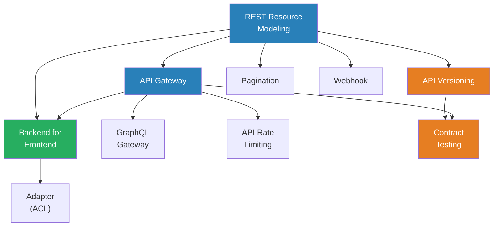

# Module 06 — API & Integration Patterns

> How services expose functionality, consume external systems, and maintain contracts.

## Why This Module Exists

Every system boundary — between your service and the web, between microservices, between you and a third-party API — is an API. The patterns here determine whether that boundary is a smooth integration point or a brittle coupling that breaks with every deployment.

## Prerequisites

- Module 01 (Communication & Messaging) — message exchange patterns
- Module 02 (Architectural Patterns) — system structure
- Module 05 (Reliability & Resilience) — timeout, retry, circuit breaker

## Patterns in This Module

| # | Pattern | Problem It Solves |
|---|---|---|
| 1 | [REST Resource Modeling](rest-resource-modeling.md) | Inconsistent, RPC-style APIs that are hard to discover and cache |
| 2 | [API Gateway](api-gateway.md) | Clients coupling to multiple backend services |
| 3 | [Backend for Frontend (BFF)](backend-for-frontend.md) | One API serving mobile, web, and third-party with mismatched needs |
| 4 | [API Versioning](api-versioning.md) | Breaking changes that destroy existing clients |
| 5 | [Pagination](pagination.md) | Unbounded result sets that crash clients and exhaust servers |
| 6 | [GraphQL Gateway](graphql-gateway.md) | Over-fetching and under-fetching with rigid REST endpoints |
| 7 | [Adapter (Anti-Corruption Layer)](adapter-acl.md) | Third-party API concepts leaking into your domain model |
| 8 | [Webhook](webhook.md) | Clients polling for changes that happen infrequently |
| 9 | [API Rate Limiting & Throttling](api-rate-limiting.md) | Protecting APIs from abuse without degrading good clients |
| 10 | [Contract Testing](contract-testing.md) | API changes that work in tests but break real consumers |

## Dependency Graph

## Suggested Reading Order

1. **REST Resource Modeling** — foundation: resources, verbs, status codes
2. **Pagination** — handling large collections correctly
3. **API Versioning** — evolving APIs without breaking clients
4. **API Gateway** — single entry point, cross-cutting concerns
5. **Backend for Frontend** — client-specific API layers
6. **GraphQL Gateway** — flexible querying alternative
7. **Adapter (ACL)** — isolating third-party integrations
8. **Webhook** — push-based integration
9. **API Rate Limiting** — protecting your API surface
10. **Contract Testing** — ensuring API contracts are honored
