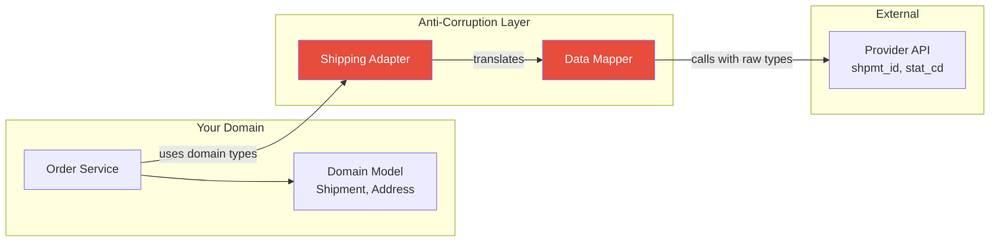

# Adapter / Anti-Corruption Layer (ACL)

## 1. The Problem

Your order management system integrates with a third-party shipping provider. Their API returns:

```json
{
  "shpmt_id": "SHP-8827193",
  "dest": {
    "rcvr_nm": "John Smith",
    "addr_ln1": "123 Main St",
    "addr_ln2": "",
    "cty": "Portland",
    "st_cd": "OR",
    "zip_cd": "97201"
  },
  "wgt_oz": 32,
  "svc_typ": "GRND",
  "stat_cd": "INTRANS",
  "est_dlvr_dt": "20240315"
}
```

Your domain model looks nothing like this:

```typescript
interface Shipment {
  id: string;
  recipient: { name: string; address: Address };
  weight: { value: number; unit: "kg" | "lb" };
  service: "ground" | "express" | "overnight";
  status: "pending" | "in_transit" | "delivered" | "failed";
  estimatedDelivery: Date;
}
```

The deadline is tight. A developer maps the shipping response directly into your database:

```typescript
order.shipment_status = shippingResponse.stat_cd; // "INTRANS" stored raw
order.weight = shippingResponse.wgt_oz;           // Ounces? Or grams?
```

Three months later, you switch shipping providers. The new provider uses `"IN_TRANSIT"` instead of `"INTRANS"`, weight in grams instead of ounces, and dates in ISO 8601 instead of `YYYYMMDD`. **Every query, every report, every UI component that touches shipping data breaks.** The provider's concepts have leaked into every layer of your system.

---

## 2. Naïve Solutions (and Why They Fail)

### Attempt 1: Map at Every Usage Point

```typescript
function displayStatus(rawStatus: string): string {
  if (rawStatus === "INTRANS") return "In Transit";
  if (rawStatus === "DLVRD") return "Delivered";
  // ... repeated in 12 different files
}
```

**Why it scatters coupling everywhere:**
- The same mapping logic is duplicated in controllers, services, reports, and templates. You have 12 places where `"INTRANS"` appears.
- When the provider changes codes, you hunt through the entire codebase. Miss one and you get a silent bug.
- Different developers map inconsistently — one uses `"In Transit"`, another uses `"in_transit"`.

### Attempt 2: Store Provider Data in a Generic JSON Column

```sql
ALTER TABLE shipments ADD COLUMN provider_data JSONB;
```

```typescript
order.providerData = shippingApiResponse; // Store everything raw
```

**Why it defers the problem:**
- Eventually something reads `providerData`. Now your report queries contain `provider_data->'stat_cd'` — the coupling still exists, just one level deeper.
- Schema validation disappears. Is `wgt_oz` always present? Is it a number or a string? You won't know until production breaks.
- When the provider changes their JSON structure in a "minor" update, your stored data no longer matches expectations.

### Attempt 3: Make Your Domain Match the Provider

Rename your fields to match: `stat_cd`, `wgt_oz`, `svc_typ`.

**Why you lose your own identity:**
- Your domain model is now designed by a third party. Your code reads like the provider's documentation, not your business language.
- If you integrate a second provider, whose vocabulary wins? You can't serve two masters.

---

## 3. The Insight

**External systems speak their language. Your system speaks yours. The boundary between them needs a translator that converts foreign concepts into native ones — and that translator is the ONLY place where external vocabulary exists. If provider code leaks past the adapter, it's a boundary violation.**

---

## 4. The Pattern

### Adapter / Anti-Corruption Layer

**Definition:** A boundary component that translates between an external system's interface, data formats, and concepts and your domain's own models and language. The adapter isolates your system so that changes in external APIs, data structures, or semantics don't propagate into your core business logic.

The term "Anti-Corruption Layer" (from Domain-Driven Design) emphasizes the purpose: preventing external concepts from corrupting your domain model.

**Guarantees:**
- Your domain code never references external field names, status codes, or data formats.
- Switching providers requires changing only the adapter — the rest of the system is unaffected.
- Data validation and transformation happen at the boundary, not scattered throughout the codebase.

**Non-guarantees:**
- Does NOT eliminate integration complexity — it concentrates it in one place.
- Does NOT handle all provider quirks automatically — someone must write and maintain the translation.
- Adding a single adapter layer does NOT automatically handle provider outages (use Circuit Breaker for that).

---

## 5. Mental Model

**A power plug adapter when traveling.** Your laptop has a US plug. The UK outlet has a different shape. You don't rewire your laptop to fit UK outlets — you use an adapter. The adapter translates between the two incompatible interfaces while keeping both sides unchanged. If you travel to Japan, you swap the adapter, not the laptop.

---

## 6. Structure



---

## 7. Code Example

### TypeScript

```typescript
// ========== YOUR DOMAIN TYPES (never change for a provider) ==========

interface Address {
  line1: string;
  line2?: string;
  city: string;
  state: string;
  postalCode: string;
  country: string;
}

interface Shipment {
  id: string;
  orderId: string;
  recipient: { name: string; address: Address };
  weight: { value: number; unit: "kg" };    // Always kg internally
  service: "ground" | "express" | "overnight";
  status: "pending" | "in_transit" | "delivered" | "failed";
  estimatedDelivery: Date;
  trackingUrl: string;
}

// ========== PORT: What your domain expects from ANY provider ==========

interface ShippingProvider {
  createShipment(order: OrderDetails): Promise<Shipment>;
  getStatus(shipmentId: string): Promise<Shipment>;
  cancelShipment(shipmentId: string): Promise<void>;
}

interface OrderDetails {
  orderId: string;
  recipient: { name: string; address: Address };
  weight: { value: number; unit: "kg" };
  service: "ground" | "express" | "overnight";
}

// ========== ADAPTER: Provider A (the old one) ==========

class ProviderAAdapter implements ShippingProvider {
  constructor(private apiKey: string, private baseUrl: string) {}

  async createShipment(order: OrderDetails): Promise<Shipment> {
    // Translate domain → provider vocabulary
    const providerRequest = {
      api_key: this.apiKey,
      rcvr_nm: order.recipient.name,
      addr_ln1: order.recipient.address.line1,
      addr_ln2: order.recipient.address.line2 || "",
      cty: order.recipient.address.city,
      st_cd: order.recipient.address.state,
      zip_cd: order.recipient.address.postalCode,
      wgt_oz: order.weight.value * 35.274,    // kg → ounces
      svc_typ: this.mapServiceOut(order.service),
    };

    const response = await fetch(`${this.baseUrl}/shipments`, {
      method: "POST",
      headers: { "Content-Type": "application/json" },
      body: JSON.stringify(providerRequest),
    });
    const raw = await response.json();

    // Translate provider → domain vocabulary
    return this.toDomainShipment(raw, order.orderId);
  }

  async getStatus(shipmentId: string): Promise<Shipment> {
    const response = await fetch(
      `${this.baseUrl}/shipments/${shipmentId}`,
      { headers: { "X-Api-Key": this.apiKey } }
    );
    const raw = await response.json();
    return this.toDomainShipment(raw, "");
  }

  async cancelShipment(shipmentId: string): Promise<void> {
    await fetch(`${this.baseUrl}/shipments/${shipmentId}/cancel`, {
      method: "POST",
      headers: { "X-Api-Key": this.apiKey },
    });
  }

  // ---- PRIVATE: All provider-specific knowledge is HERE ----

  private toDomainShipment(raw: any, orderId: string): Shipment {
    return {
      id: raw.shpmt_id,
      orderId,
      recipient: {
        name: raw.dest.rcvr_nm,
        address: {
          line1: raw.dest.addr_ln1,
          line2: raw.dest.addr_ln2 || undefined,
          city: raw.dest.cty,
          state: raw.dest.st_cd,
          postalCode: raw.dest.zip_cd,
          country: "US",
        },
      },
      weight: {
        value: raw.wgt_oz / 35.274,   // ounces → kg
        unit: "kg",
      },
      service: this.mapServiceIn(raw.svc_typ),
      status: this.mapStatusIn(raw.stat_cd),
      estimatedDelivery: this.parseProviderDate(raw.est_dlvr_dt),
      trackingUrl: `https://providera.com/track/${raw.shpmt_id}`,
    };
  }

  private mapServiceIn(code: string): Shipment["service"] {
    const map: Record<string, Shipment["service"]> = {
      GRND: "ground", EXPR: "express", OVNT: "overnight",
    };
    return map[code] || "ground";
  }

  private mapServiceOut(service: Shipment["service"]): string {
    const map: Record<string, string> = {
      ground: "GRND", express: "EXPR", overnight: "OVNT",
    };
    return map[service];
  }

  private mapStatusIn(code: string): Shipment["status"] {
    const map: Record<string, Shipment["status"]> = {
      PEND: "pending", INTRANS: "in_transit",
      DLVRD: "delivered", FAIL: "failed",
    };
    return map[code] || "pending";
  }

  private parseProviderDate(dateStr: string): Date {
    // Provider A uses YYYYMMDD format
    const y = dateStr.slice(0, 4);
    const m = dateStr.slice(4, 6);
    const d = dateStr.slice(6, 8);
    return new Date(`${y}-${m}-${d}`);
  }
}

// ========== ADAPTER: Provider B (the new one) ==========

class ProviderBAdapter implements ShippingProvider {
  constructor(private token: string, private baseUrl: string) {}

  async createShipment(order: OrderDetails): Promise<Shipment> {
    // Provider B uses modern, readable JSON — but still THEIR vocabulary
    const providerRequest = {
      destination: {
        recipient_name: order.recipient.name,
        street_address: order.recipient.address.line1,
        city: order.recipient.address.city,
        state: order.recipient.address.state,
        zip: order.recipient.address.postalCode,
      },
      package_weight_grams: order.weight.value * 1000, // kg → grams
      delivery_speed: order.service,                    // happens to match
    };

    const res = await fetch(`${this.baseUrl}/v2/shipments`, {
      method: "POST",
      headers: {
        "Content-Type": "application/json",
        Authorization: `Bearer ${this.token}`,
      },
      body: JSON.stringify(providerRequest),
    });
    const raw = await res.json();
    return this.toDomainShipment(raw, order.orderId);
  }

  async getStatus(shipmentId: string): Promise<Shipment> {
    const res = await fetch(`${this.baseUrl}/v2/shipments/${shipmentId}`, {
      headers: { Authorization: `Bearer ${this.token}` },
    });
    return this.toDomainShipment(await res.json(), "");
  }

  async cancelShipment(shipmentId: string): Promise<void> {
    await fetch(`${this.baseUrl}/v2/shipments/${shipmentId}`, {
      method: "DELETE",
      headers: { Authorization: `Bearer ${this.token}` },
    });
  }

  private toDomainShipment(raw: any, orderId: string): Shipment {
    return {
      id: raw.shipment_id,
      orderId,
      recipient: {
        name: raw.destination.recipient_name,
        address: {
          line1: raw.destination.street_address,
          city: raw.destination.city,
          state: raw.destination.state,
          postalCode: raw.destination.zip,
          country: "US",
        },
      },
      weight: {
        value: raw.package_weight_grams / 1000,  // grams → kg
        unit: "kg",
      },
      service: raw.delivery_speed,
      status: this.mapStatus(raw.status),
      estimatedDelivery: new Date(raw.estimated_delivery), // ISO 8601
      trackingUrl: raw.tracking_url,
    };
  }

  private mapStatus(status: string): Shipment["status"] {
    const map: Record<string, Shipment["status"]> = {
      CREATED: "pending", IN_TRANSIT: "in_transit",
      DELIVERED: "delivered", RETURNED: "failed",
    };
    return map[status] || "pending";
  }
}

// ========== USAGE: Domain code doesn't know which provider ==========

class OrderService {
  constructor(private shipping: ShippingProvider) {} // injected

  async shipOrder(orderId: string): Promise<Shipment> {
    const order = await this.getOrderDetails(orderId);
    // Domain code uses domain types — no provider vocabulary
    return this.shipping.createShipment({
      orderId: order.id,
      recipient: order.shippingAddress,
      weight: order.totalWeight,
      service: order.shippingTier,
    });
  }

  private async getOrderDetails(id: string): Promise<any> {
    // fetch from database
    return {};
  }
}
```

### Go

```go
package main

import (
	"context"
	"encoding/json"
	"fmt"
	"net/http"
	"time"
)

// ========== DOMAIN TYPES ==========
type ShipmentStatus string

const (
	StatusPending  ShipmentStatus = "pending"
	StatusInTransit ShipmentStatus = "in_transit"
	StatusDelivered ShipmentStatus = "delivered"
	StatusFailed   ShipmentStatus = "failed"
)

type Shipment struct {
	ID                string
	OrderID           string
	RecipientName     string
	WeightKg          float64
	Status            ShipmentStatus
	EstimatedDelivery time.Time
}

// ========== PORT (interface your domain depends on) ==========
type ShippingProvider interface {
	GetStatus(ctx context.Context, shipmentID string) (Shipment, error)
}

// ========== ADAPTER: Provider A ==========
type ProviderAAdapter struct {
	baseURL string
	apiKey  string
}

func (a *ProviderAAdapter) GetStatus(ctx context.Context, shipmentID string) (Shipment, error) {
	url := fmt.Sprintf("%s/shipments/%s", a.baseURL, shipmentID)
	req, _ := http.NewRequestWithContext(ctx, "GET", url, nil)
	req.Header.Set("X-Api-Key", a.apiKey)

	resp, err := http.DefaultClient.Do(req)
	if err != nil {
		return Shipment{}, fmt.Errorf("provider A: %w", err)
	}
	defer resp.Body.Close()

	var raw struct {
		ShpmtID   string `json:"shpmt_id"`
		WgtOz     float64 `json:"wgt_oz"`
		StatCd    string `json:"stat_cd"`
		EstDlvrDt string `json:"est_dlvr_dt"`
		Dest      struct {
			RcvrNm string `json:"rcvr_nm"`
		} `json:"dest"`
	}
	json.NewDecoder(resp.Body).Decode(&raw)

	// ALL provider knowledge stays in this method
	return Shipment{
		ID:            raw.ShpmtID,
		RecipientName: raw.Dest.RcvrNm,
		WeightKg:      raw.WgtOz / 35.274,
		Status:        a.mapStatus(raw.StatCd),
		EstimatedDelivery: a.parseDate(raw.EstDlvrDt),
	}, nil
}

func (a *ProviderAAdapter) mapStatus(code string) ShipmentStatus {
	switch code {
	case "INTRANS":
		return StatusInTransit
	case "DLVRD":
		return StatusDelivered
	case "FAIL":
		return StatusFailed
	default:
		return StatusPending
	}
}

func (a *ProviderAAdapter) parseDate(s string) time.Time {
	t, _ := time.Parse("20060102", s)
	return t
}

// ========== DOMAIN SERVICE (no provider knowledge) ==========
type OrderService struct {
	shipping ShippingProvider
}

func (o *OrderService) CheckShipment(ctx context.Context, shipmentID string) (ShipmentStatus, error) {
	shipment, err := o.shipping.GetStatus(ctx, shipmentID)
	if err != nil {
		return "", err
	}
	// Domain logic: only uses domain types
	return shipment.Status, nil
}

func main() {
	// Swap providers by changing this one line
	provider := &ProviderAAdapter{
		baseURL: "https://api.providera.com",
		apiKey:  "sk-xxx",
	}

	svc := &OrderService{shipping: provider}
	status, _ := svc.CheckShipment(context.Background(), "SHP-123")
	fmt.Println("Status:", status)
}
```

---

## 8. Gotchas & Beginner Mistakes

| Mistake | Why It Hurts |
|---|---|
| **Adapter that just renames fields** | If your adapter only renames `stat_cd` to `statusCode` but keeps the same values (`"INTRANS"`), domain code still depends on provider vocabulary. Map to YOUR domain values. |
| **Leaking provider exceptions** | Your adapter throws `ProviderATimeoutError`. Domain code catches it by name. Now switching providers requires changing all catch blocks. Translate to domain exceptions: `ShippingUnavailableError`. |
| **One adapter doing too much** | The adapter handles translation, retry logic, caching, circuit breaking, and logging. Keep the adapter focused on translation. Use Decorator/middleware for cross-cutting concerns. |
| **Not testing the adapter** | The adapter contains parsing logic, unit conversions, and status mapping. If `"INTRANS"` gets mistyped as `"IN_TRANS"`, your entire status display breaks. Unit test every mapping function. |
| **Skipping the port interface** | Directly using `ProviderAAdapter` instead of `ShippingProvider` interface. Without the interface, you can't swap providers or write mock tests. |

---

## 9. Related & Confusable Patterns

| Pattern | How It Differs |
|---|---|
| **Facade** | Simplifies a complex internal subsystem. Adapter translates an external system. Facade is about reducing complexity; Adapter is about boundary translation. |
| **API Gateway** | Routes and aggregates external requests INTO your system. ACL translates when your system calls OUT to external systems. Opposite directions. |
| **Hexagonal Architecture** | The architecture that formalizes ports and adapters. ACL is one specific adapter in a hexagonal system — the one at the external integration boundary. |
| **Bridge** | Separates abstraction from implementation. Similar mechanism, but Bridge is designed upfront for multiple implementations; Adapter is applied to make incompatible interfaces work together. |
| **Strategy** | Swappable algorithms. `ShippingProvider` interface with multiple adapters IS the Strategy pattern applied to integration boundaries. |

---

## 10. When This Pattern Is the WRONG Choice

- **Internal service-to-service calls** — If both services are yours and use the same domain language, an adapter adds unnecessary translation. Shared types or a common library works better.
- **Throwaway integrations** — A one-time data migration script that runs once and is deleted. The adapter investment won't pay off.
- **The external API matches your domain naturally** — If the provider's API uses `status: "in_transit"` and your domain uses `status: "in_transit"`, don't add a translation layer that maps identical values. But still use an interface for testability.

**Symptoms you should reconsider:**
- Your adapter's mapping functions are identity functions — `return input` — with no real translation. The boundary isn't actually corrupt; remove the adapter.
- You have multiple adapters but they all call the same provider. One adapter per provider is the right granularity. Multiple adapters for one provider means overengineering.
- The adapter is 500 lines and growing. It's accumulating business logic that belongs in domain services. Keep adapters thin — translate and delegate.

**How to back out:** Inline the adapter's translation logic into the calling code. Replace the `ShippingProvider` interface with direct calls. Accept the coupling — if the provider won't change, the adapter's flexibility is unused.
